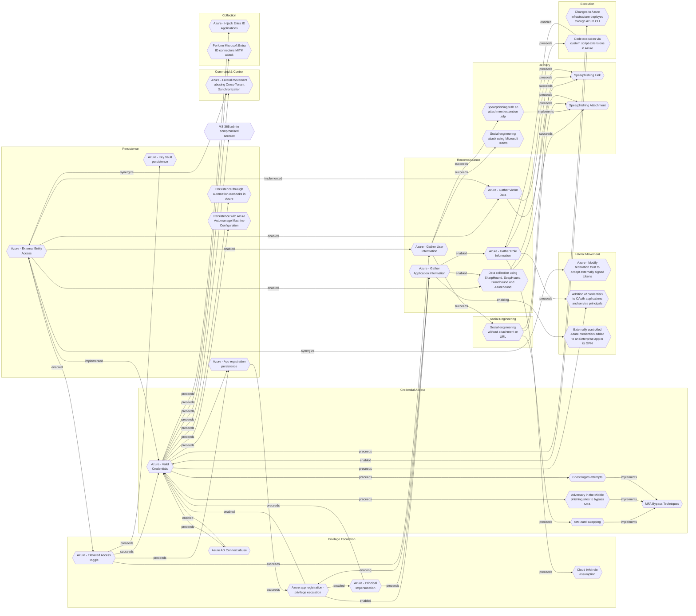

# Azure - External Entity Access

## Metadata
| Field | Value |
| --- | --- |
| UUID | `31e7f292-8370-4255-861d-edd68ed8b7b0` |
| Schema | `threat::1.0` |
| Version | `1` |
| Created | `2025-09-22` |
| Modified | `2025-09-22` |
| TLP | clear (`TLP:CLEAR`) |
| Organisation | EC DIGIT CSOC (`56b0a0f0-b0bc-47d9-bb46-02f80ae2065a`) |

## References
### Public
- **1**: [https://microsoft.github.io/Azure-Threat-Research-Matrix/Persistence/AZT507/AZT507/](https://microsoft.github.io/Azure-Threat-Research-Matrix/Persistence/AZT507/AZT507/)
- **2**: [https://docs.azure.cn/en-us/entra/architecture/1-secure-access-posture](https://docs.azure.cn/en-us/entra/architecture/1-secure-access-posture)

## Description
The following threat vector refers to a set of persistence techniques where an adversary 
configures a target Azure tenant to be managed or accessed by external entities, 
such as another tenant, external users, or identity providers. This section provides 
in-depth coverage of this threat vector according to the Azure Threat Research Matrix, 
addressing scenario, goals, impact, and methodology.

### Example Attack Scenario

An attacker gains Global Administrator privileges in a compromised tenant and uses Azure 
Lighthouse to register an external, attacker-controlled tenant as a delegated administrator. 
This allows the attacker to manage resources and maintain persistence even if their 
initial account is detected and removed. Alternatively, the attacker might use Microsoft 
Partner Delegated Administrative Privileges, transfer a subscription (“subscription hijack”), 
or add a new federated domain or identity provider, creating hidden backdoors for 
future access.

- For example, after compromising credentials, an attacker uses Microsoft Graph 
API to modify tenant settings and register their own tenant as a manager via Azure Lighthouse.
- The administrator in the compromised tenant is unaware as delegated permissions 
silently persist, giving the attacker full control over resources and users.
- Even after password resets or removal of individual malicious accounts, the external 
entity persists via configuration and cannot be easily detected without deep audit 
review of resource assignments and domain trusts.

### Attack Goals and Impact

The main goal is to establish persistence inside the target Azure environment through 
external entity control.

- Maintain long-term, resilient access to cloud resources, regardless of changes 
in local credentials or account clean-ups.
- Allow management of resources remotely from attacker-controlled tenants.
- Facilitate lateral movement, data exfiltration, or further privilege escalation 
by leveraging cross-tenant capabilities and hidden delegated privileges.

The impact may include:

- Full compromise of cloud assets and data.
- Unnoticed attacker presence persisting through routine security hygiene (such as credential revocation).
- Increased difficulty for defenders to detect or remove persistent access mechanisms.

### Attack Flow and Methodology

The typical attack flow involves several steps:

1. Privilege abuse: The attacker uses available tools (including Microsoft Graph 
API, PowerShell modules, or Azure Portal) to grant management rights or delegated 
access to an external entity (such as Azure Lighthouse, Microsoft Partner delegation, 
or domain trust modification).
2. Configuration: The attacker registers their external tenant, sets up delegated 
access, or modifies domain trust/federation settings to establish a persistent link.
3. Stealthy persistence: Even if initial access accounts/credentials are remediated, 
the external entity retains management capabilities—allowing the attacker to create 
new accounts, manage resources, or harvest sensitive data.
4. Maintenance: The attacker periodically refreshes delegated permissions, adds 
new external users/entities, or modifies trust relationships as needed to maintain 
access and evade detection.

## Criticality
**High** - A High priority incident is likely to result in a demonstrable impact to public health or safety, national security, economic security, foreign relations, civil liberties, or public confidence.

## Terrain
Adversaries gains administrative access (e.g., via phishing, credential theft,
or exploiting vulnerabilities).

## Surface
> **Azure**
> Microsoft Azure cloud platform

> **Azure::Security::Entra ID**
> Microsoft Entra ID in Azure (cloud identity)

> **Windows**
> Microsoft Windows operating systems (all versions)

> **AWS::Storage**
> AWS storage services

> **Entra ID**
> Microsoft Entra ID (formerly Azure Active Directory)

> **Azure::Compute::Virtual Machines**
> Azure Virtual Machines

> **Application Layer::HTTP**
> Hypertext Transfer Protocol

## Threat Assessment
| Dimension | Assessment | Description |
| --- | --- | --- |
| Severity | Significant incident | A cyber attack which has a serious impact on a large organisation or on wider / local government, or which poses a considerable risk to central government or (inter)national essential services. |
| Impact | Data Breach IP Loss Reputational Damages Identity Theft Monetary Loss | Non-public information has been accessed from the outside, and successfully extracted. Particular, key data, information and blueprint conducive to the organization capability to gain and retain a commercial or geopolitical advantage has been accessed, and their content potentially used by competitors or other adversaries. Damages to the organization public view may be achieved by using directly the access gained, or indirectly with data gathered. Acquisition of sufficient information and privileges to profess as a given individual, for the purpose of abusing and deceiving human trust relationships. The vector will directly conduct to loss of value directly impacting the bottom line. |
| Leverage | Elevation of privilege Infrastructure Compromise Information Disclosure Modify configuration | Capacity to augment leverage over the target system by upgrading the compromised access rights The compromised target is likely to be used to further expand the sphere of influence of the attacker and allow more potent vectors to be executed. Threat action intending to read a file that one was not granted access to, or to read data in transit. Modify configuration or services |
| Viability | Likely | Probable (probably) - 55-80% |
| Kill Chain | Persistence | Any access, action or change to a system that gives an attacker persistent presence on the system. |

## Actors
| Actor | ID | Source | Description |
| --- | --- | --- | --- |
| Scattered Spider | `misp::3b238f3a-c67a-4a9e-b474-dc3897e00129` | ('misp',) | Scattered Spider, a highly active hacking group, has made headlines by targeting more than 130 organizations, with the number of victims steadily increasing. |
| APT29 | `misp::b2056ff0-00b9-482e-b11c-c771daa5f28a` | ('misp',) | A 2015 report by F-Secure describe APT29 as: 'The Dukes are a well-resourced, highly dedicated and organized cyberespionage group that we believe has been working for the Russian Federation since at least 2008 to collect intelligence in support of foreign and security policy decision-making. The Dukes show unusual confidence in their ability to continue successfully compromising their targets, as well as in their ability to operate with impunity. The Dukes primarily target Western governments and related organizations, such as government ministries and agencies, political think tanks, and governmental subcontractors. Their targets have also included the governments of members of the Commonwealth of Independent States;Asian, African, and Middle Eastern governments;organizations associated with Chechen extremism;and Russian speakers engaged in the illicit trade of controlled substances and drugs. The Dukes are known to employ a vast arsenal of malware toolsets, which we identify as MiniDuke, CosmicDuke, OnionDuke, CozyDuke, CloudDuke, SeaDuke, HammerDuke, PinchDuke, and GeminiDuke. In recent years, the Dukes have engaged in apparently biannual large - scale spear - phishing campaigns against hundreds or even thousands of recipients associated with governmental institutions and affiliated organizations. These campaigns utilize a smash - and - grab approach involving a fast but noisy breakin followed by the rapid collection and exfiltration of as much data as possible.If the compromised target is discovered to be of value, the Dukes will quickly switch the toolset used and move to using stealthier tactics focused on persistent compromise and long - term intelligence gathering. This threat actor targets government ministries and agencies in the West, Central Asia, East Africa, and the Middle East; Chechen extremist groups; Russian organized crime; and think tanks. It is suspected to be behind the 2015 compromise of unclassified networks at the White House, Department of State, Pentagon, and the Joint Chiefs of Staff. The threat actor includes all of the Dukes tool sets, including MiniDuke, CosmicDuke, OnionDuke, CozyDuke, SeaDuke, CloudDuke (aka MiniDionis), and HammerDuke (aka Hammertoss). ' |

## ATT&CK Techniques
| Technique | Name | Description |
| --- | --- | --- |
| `T1133` | [External Remote Services](https://attack.mitre.org/techniques/T1133) | Adversaries may leverage external-facing remote services to initially access and/or persist within a network. Remote services such as VPNs, Citrix, and other access mechanisms allow users to connect to internal enterprise network resources from external locations. There are often remote service gateways that manage connections and credential authentication for these services. Services such as [Windows Remote Management](https://attack.mitre.org/techniques/T1021/006) and [VNC](https://attack.mitre.org/techniques/T1021/005) can also be used externally.(Citation: MacOS VNC software for Remote Desktop)  Access to [Valid Accounts](https://attack.mitre.org/techniques/T1078) to use the service is often a requirement, which could be obtained through credential pharming or by obtaining the credentials from users after compromising the enterprise network.(Citation: Volexity Virtual Private Keylogging) Access to remote services may be used as a redundant or persistent access mechanism during an operation.  Access may also be gained through an exposed service that doesn’t require authentication. In containerized environments, this may include an exposed Docker API, Kubernetes API server, kubelet, or web application such as the Kubernetes dashboard.(Citation: Trend Micro Exposed Docker Server)(Citation: Unit 42 Hildegard Malware) |
| `T1484.002` | [Domain or Tenant Policy Modification: Trust Modification](https://attack.mitre.org/techniques/T1484/002) | Adversaries may add new domain trusts, modify the properties of existing domain trusts, or otherwise change the configuration of trust relationships between domains and tenants to evade defenses and/or elevate privileges.Trust details, such as whether or not user identities are federated, allow authentication and authorization properties to apply between domains or tenants for the purpose of accessing shared resources.(Citation: Microsoft - Azure AD Federation) These trust objects may include accounts, credentials, and other authentication material applied to servers, tokens, and domains.  Manipulating these trusts may allow an adversary to escalate privileges and/or evade defenses by modifying settings to add objects which they control. For example, in Microsoft Active Directory (AD) environments, this may be used to forge [SAML Tokens](https://attack.mitre.org/techniques/T1606/002) without the need to compromise the signing certificate to forge new credentials. Instead, an adversary can manipulate domain trusts to add their own signing certificate. An adversary may also convert an AD domain to a federated domain using Active Directory Federation Services (AD FS), which may enable malicious trust modifications such as altering the claim issuance rules to log in any valid set of credentials as a specified user.(Citation: AADInternals zure AD Federated Domain)   An adversary may also add a new federated identity provider to an identity tenant such as Okta or AWS IAM Identity Center, which may enable the adversary to authenticate as any user of the tenant.(Citation: Okta Cross-Tenant Impersonation 2023) This may enable the threat actor to gain broad access into a variety of cloud-based services that leverage the identity tenant. For example, in AWS environments, an adversary that creates a new identity provider for an AWS Organization will be able to federate into all of the AWS Organization member accounts without creating identities for each of the member accounts.(Citation: AWS RE:Inforce Threat Detection 2024) |
| `T1078.004` | [Valid Accounts: Cloud Accounts](https://attack.mitre.org/techniques/T1078/004) | Valid accounts in cloud environments may allow adversaries to perform actions to achieve Initial Access, Persistence, Privilege Escalation, or Defense Evasion. Cloud accounts are those created and configured by an organization for use by users, remote support, services, or for administration of resources within a cloud service provider or SaaS application. Cloud Accounts can exist solely in the cloud; alternatively, they may be hybrid-joined between on-premises systems and the cloud through syncing or federation with other identity sources such as Windows Active Directory.(Citation: AWS Identity Federation)(Citation: Google Federating GC)(Citation: Microsoft Deploying AD Federation)  Service or user accounts may be targeted by adversaries through [Brute Force](https://attack.mitre.org/techniques/T1110), [Phishing](https://attack.mitre.org/techniques/T1566), or various other means to gain access to the environment. Federated or synced accounts may be a pathway for the adversary to affect both on-premises systems and cloud environments - for example, by leveraging shared credentials to log onto [Remote Services](https://attack.mitre.org/techniques/T1021). High privileged cloud accounts, whether federated, synced, or cloud-only, may also allow pivoting to on-premises environments by leveraging SaaS-based [Software Deployment Tools](https://attack.mitre.org/techniques/T1072) to run commands on hybrid-joined devices.  An adversary may create long lasting [Additional Cloud Credentials](https://attack.mitre.org/techniques/T1098/001) on a compromised cloud account to maintain persistence in the environment. Such credentials may also be used to bypass security controls such as multi-factor authentication.   Cloud accounts may also be able to assume [Temporary Elevated Cloud Access](https://attack.mitre.org/techniques/T1548/005) or other privileges through various means within the environment. Misconfigurations in role assignments or role assumption policies may allow an adversary to use these mechanisms to leverage permissions outside the intended scope of the account. Such over privileged accounts may be used to harvest sensitive data from online storage accounts and databases through [Cloud API](https://attack.mitre.org/techniques/T1059/009) or other methods. For example, in Azure environments, adversaries may target Azure Managed Identities, which allow associated Azure resources to request access tokens. By compromising a resource with an attached Managed Identity, such as an Azure VM, adversaries may be able to [Steal Application Access Token](https://attack.mitre.org/techniques/T1528)s to move laterally across the cloud environment.(Citation: SpecterOps Managed Identity 2022) |

## Chaining

### Chaining details
#### enabled -> [Data collection using SharpHound, SoapHound, Bloodhound and Azurehound](data-collection-using-sharphound-soaphound-bloodhound-and-azurehound.md) (`53063205-4404-4e6d-a2f5-d566c6085d96`) (`support::enabled`)
Attackers need to establish an initial presence within the target environment, in 
order to gather sufficient permissions to execute the data collection tools.

- **Target UUID**: `53063205-4404-4e6d-a2f5-d566c6085d96`
#### enabled -> [Azure - Elevated Access Toggle](azure-elevated-access-toggle.md) (`10a89280-d42e-446d-9f8d-840b1218f532`) (`support::enabled`)
Adversaries successfully compromise a Global Administrator account in
 Entra ID (Azure AD), either via phishing, credential theft, or session hijacking.

- **Target UUID**: `10a89280-d42e-446d-9f8d-840b1218f532`
#### enabled -> [Azure - Gather Victim Data](azure-gather-victim-data.md) (`4e7eae8e-6615-41f2-bfe1-21a04f7a6088`) (`support::enabled`)
An adversary successfully compromises a user's Azure Active Directory account credentials 
or session token through phishing, credential theft, or token theft.

- **Target UUID**: `4e7eae8e-6615-41f2-bfe1-21a04f7a6088`
#### implemented -> [Azure - Valid Credentials](azure-valid-credentials.md) (`2743bf18-3b86-4721-bf3e-153dcda0b149`) (`atomicity::implemented`)
Adversaries obtain the username and password of an AzureAD user either through phishing, 
password spraying, brute-force attacks, or credentials leaked online.

- **Target UUID**: `2743bf18-3b86-4721-bf3e-153dcda0b149`
#### enabled -> [Azure - Gather User Information](azure-gather-user-information.md) (`2900d389-3098-49d3-8166-5b2612d03576`) (`support::enabled`)
Adversaries use publicly accessible endpoints, misconfigured applications, or phishing 
emails to harvest user names, email addresses, job titles, and group memberships.

- **Target UUID**: `2900d389-3098-49d3-8166-5b2612d03576`
#### implemented -> [Azure - Gather Victim Data](azure-gather-victim-data.md) (`4e7eae8e-6615-41f2-bfe1-21a04f7a6088`) (`atomicity::implemented`)
An adversary may access a user's personal data if their account is compromised.
This includes data such as email, OneDrive, Teams, etc.

- **Target UUID**: `4e7eae8e-6615-41f2-bfe1-21a04f7a6088`
#### synergize -> [Azure - Lateral movement abusing Cross-Tenant Synchronization](azure-lateral-movement-abusing-cross-tenant-synchronization.md) (`2fd1cddb-c66d-4a99-9779-31e32b67495e`) (`support::synergize`)
Attackers must have compromised a tenant and gained elevated privileges.

- **Target UUID**: `2fd1cddb-c66d-4a99-9779-31e32b67495e`
#### synergize -> [Azure - Modify federation trust to accept externally signed tokens](azure-modify-federation-trust-to-accept-externally-signed-tokens.md) (`9bb31c65-8abd-48fc-afe3-8aca76109737`) (`support::synergize`)
Attackers need to have gained administrative Azure Active Directory
(Azure AD) privileges using compromised credentials.

- **Target UUID**: `9bb31c65-8abd-48fc-afe3-8aca76109737`
