# Azure - File Share Mounting

## Metadata

- **UUID**: `d24fcc84-0e1e-41e1-8d0e-6ee9f8c6a068`
- **Schema**: `threat::1.0`
- **TLP**: clear

## Description
In the following threat vector, adversaries leverage Azure Storage Account File 
Shares via NFS or SMB mounts to facilitate or escalate attacks.

## Example Attack Scenario

A typical scenario begins with an attacker stealing or hijacking privileged credentials, 
for example through a “Pass the Cookie” attack on a global administrator account. 
After obtaining administrative access, the adversary extends permissions to external 
users and assigns them high-level roles within the Azure tenant. Leveraging this 
privileged access, the adversary mounts Azure file shares to their own infrastructure, 
laying the groundwork for:
- Massive data exfiltration through direct access to sensitive storage.
- Encrypting and holding file shares hostage for ransom (ransomware).
- Stealthily manipulating or deleting critical business data, including Azure backup sets.

## Attack Goals and Impact

The adversary’s core objectives when mounting file shares are:
- **Data Exfiltration:** Copying sensitive or proprietary data undetected from the 
cloud environment via NFS or SMB mount.
- **Ransomware Operations:** Encrypting contents of file shares directly, disrupting 
business continuity and demanding ransom payments for decryption.
- **Persistence and Shadow IT:** Creating redundant access paths or mirroring content 
to maintain long-term presence within the victim's environment.
- **Operational Disruption:** Deleting or corrupting critical files and backups 
to elevate operational risks and pressure response teams.

## Attack Flow and Methodology

The typical methodology for File Share Mounting attacks involves these steps:
- **Credential or Key Theft:** Adversaries obtain necessary Secrets, Shared Access 
Signatures (SAS), or access keys for a Storage Account, or elevate privileges to 
write and mount shares.
- **Generate/Enumerate Connection Strings:** Using their access, attackers create 
connection strings to Azure Storage File Shares, selecting NFS or SMB protocols 
as supported.
- **Mount File Shares:** The adversary mounts the target file shares to attacker-controlled 
machines or servers, treating Azure storage as a local/network drive.
- **Execute Objectives:** With direct file system access:
  - Download or exfiltrate data covertly.
  - Upload and execute ransomware, encrypt data, or sabotage backups.
  - Copy, modify, or delete content to facilitate further lateral movement or persistent threats.
- **Evasion:** These actions often evade Azure default audit logging, as connections 
to the mounted file shares are typically not logged within Azure's native monitoring 
tools by default, reducing detection opportunities.

## How the Adversary Generates the Connection String
The connection string typically contains the Storage Account name, File Share name,
and authentication tokens or keys (e.g., SAS tokens or storage account keys).

The attacker must have access to these authentication credentials, which can be 
obtained through compromise or misconfiguration.
With these credentials, the attacker constructs a connection string formatted like:

For SMB:
`\\<storage_account_name>.file.core.windows.net\<file_share_name>`
along with the storage account key or SAS token used for authentication.

For NFS:
A mount command such as
`mount -t nfs <storage_account_name>.file.core.windows.net:/<file_share_name> <local_mount_point>`.

Once mounted, the adversary can read, write, delete, or exfiltrate files directly from the 
file share as though it were a local drive.

## Techniques
- T1039
- T1530
- T1021.007

## Chaining

```mermaid
flowchart LR
d24fcc84_0e1e_41e1_8d0e_6ee9f8c6a068["Azure - File Share Mounting"]
53f4e2f0_7d11_4629_bb26_905993a589db["Azure - Storage account reconnaissance"]
942ed69c_700a_469a_9591_07b87815a909["Azure - Storage Account Replication"]
b1593e0b_1b3b_462d_9ab6_21d1c136469d["Azure - Gather Resource Data"]
85c8e0dd_b012_402d_bb09_5d354c16ebb9["Azure - Local Resource Hijack"]
2743bf18_3b86_4721_bf3e_153dcda0b149["Azure - Valid Credentials"]
518ff777_f10d_4201_9e54_2779c31c512e["Consent phishing attack"]
d24fcc84_0e1e_41e1_8d0e_6ee9f8c6a068 --> 53f4e2f0_7d11_4629_bb26_905993a589db
53f4e2f0_7d11_4629_bb26_905993a589db --> 942ed69c_700a_469a_9591_07b87815a909
942ed69c_700a_469a_9591_07b87815a909 --> b1593e0b_1b3b_462d_9ab6_21d1c136469d
b1593e0b_1b3b_462d_9ab6_21d1c136469d --> 85c8e0dd_b012_402d_bb09_5d354c16ebb9
85c8e0dd_b012_402d_bb09_5d354c16ebb9 --> 2743bf18_3b86_4721_bf3e_153dcda0b149
2743bf18_3b86_4721_bf3e_153dcda0b149 --> 518ff777_f10d_4201_9e54_2779c31c512e
```

