# Azure - File Share Mounting

## Metadata
| Field | Value |
| --- | --- |
| UUID | `d24fcc84-0e1e-41e1-8d0e-6ee9f8c6a068` |
| Schema | `threat::1.0` |
| Version | `1` |
| Created | `2025-09-09` |
| Modified | `2025-09-10` |
| TLP | clear (`TLP:CLEAR`) |
| Organisation | EC DIGIT CSOC (`56b0a0f0-b0bc-47d9-bb46-02f80ae2065a`) |

## References
### Public
- **1**: [https://microsoft.github.io/Azure-Threat-Research-Matrix/Impact/AZT702/AZT702-1/](https://microsoft.github.io/Azure-Threat-Research-Matrix/Impact/AZT702/AZT702-1/)
- **2**: [https://techcommunity.microsoft.com/blog/microsoftsecurityexperts/hunting-in-azure-subscriptions/4125875](https://techcommunity.microsoft.com/blog/microsoftsecurityexperts/hunting-in-azure-subscriptions/4125875)
- **3**: [https://www.microsoft.com/en-us/security/blog/2021/04/08/threat-matrix-for-storage/](https://www.microsoft.com/en-us/security/blog/2021/04/08/threat-matrix-for-storage/)
- **4**: [https://learn.microsoft.com/en-us/azure/defender-for-cloud/alerts-azure-storage](https://learn.microsoft.com/en-us/azure/defender-for-cloud/alerts-azure-storage)

## Description
In the following threat vector, adversaries leverage Azure Storage Account File 
Shares via NFS or SMB mounts to facilitate or escalate attacks.

## Example Attack Scenario

A typical scenario begins with an attacker stealing or hijacking privileged credentials, 
for example through a “Pass the Cookie” attack on a global administrator account. 
After obtaining administrative access, the adversary extends permissions to external 
users and assigns them high-level roles within the Azure tenant. Leveraging this 
privileged access, the adversary mounts Azure file shares to their own infrastructure, 
laying the groundwork for:
- Massive data exfiltration through direct access to sensitive storage.
- Encrypting and holding file shares hostage for ransom (ransomware).
- Stealthily manipulating or deleting critical business data, including Azure backup sets.

## Attack Goals and Impact

The adversary’s core objectives when mounting file shares are:
- **Data Exfiltration:** Copying sensitive or proprietary data undetected from the 
cloud environment via NFS or SMB mount.
- **Ransomware Operations:** Encrypting contents of file shares directly, disrupting 
business continuity and demanding ransom payments for decryption.
- **Persistence and Shadow IT:** Creating redundant access paths or mirroring content 
to maintain long-term presence within the victim's environment.
- **Operational Disruption:** Deleting or corrupting critical files and backups 
to elevate operational risks and pressure response teams.

## Attack Flow and Methodology

The typical methodology for File Share Mounting attacks involves these steps:
- **Credential or Key Theft:** Adversaries obtain necessary Secrets, Shared Access 
Signatures (SAS), or access keys for a Storage Account, or elevate privileges to 
write and mount shares.
- **Generate/Enumerate Connection Strings:** Using their access, attackers create 
connection strings to Azure Storage File Shares, selecting NFS or SMB protocols 
as supported.
- **Mount File Shares:** The adversary mounts the target file shares to attacker-controlled 
machines or servers, treating Azure storage as a local/network drive.
- **Execute Objectives:** With direct file system access:
  - Download or exfiltrate data covertly.
  - Upload and execute ransomware, encrypt data, or sabotage backups.
  - Copy, modify, or delete content to facilitate further lateral movement or persistent threats.
- **Evasion:** These actions often evade Azure default audit logging, as connections 
to the mounted file shares are typically not logged within Azure's native monitoring 
tools by default, reducing detection opportunities.

## How the Adversary Generates the Connection String
The connection string typically contains the Storage Account name, File Share name,
and authentication tokens or keys (e.g., SAS tokens or storage account keys).

The attacker must have access to these authentication credentials, which can be 
obtained through compromise or misconfiguration.
With these credentials, the attacker constructs a connection string formatted like:

For SMB:
`\\<storage_account_name>.file.core.windows.net\<file_share_name>`
along with the storage account key or SAS token used for authentication.

For NFS:
A mount command such as
`mount -t nfs <storage_account_name>.file.core.windows.net:/<file_share_name> <local_mount_point>`.

Once mounted, the adversary can read, write, delete, or exfiltrate files directly from the 
file share as though it were a local drive.

## Criticality
**High** - A High priority incident is likely to result in a demonstrable impact to public health or safety, national security, economic security, foreign relations, civil liberties, or public confidence.

## Terrain
Adversaries must steal Azure Storage Account keys, Shared Access Signatures (SAS), 
or Azure AD credentials that have permissions to access file shares. This could 
be through phishing, credential dumping, or leveraging misconfigurations

## Surface
> **Azure**
> Microsoft Azure cloud platform

> **Azure::Security::Entra ID**
> Microsoft Entra ID in Azure (cloud identity)

> **Windows**
> Microsoft Windows operating systems (all versions)

> **Linux**
> Linux-based operating systems (all distributions)

> **macOS**
> Apple macOS operating systems (all versions)

> **AWS::Storage**
> AWS storage services

> **Azure::Compute::Virtual Machines**
> Azure Virtual Machines

> **Serverless**
> Cloud-agnostic serverless compute (when not provider-specific)

> **Application Layer::HTTP**
> Hypertext Transfer Protocol

## Threat Assessment
| Dimension | Assessment | Description |
| --- | --- | --- |
| Severity | Significant incident | A cyber attack which has a serious impact on a large organisation or on wider / local government, or which poses a considerable risk to central government or (inter)national essential services. |
| Impact | Data Breach IP Loss Reputational Damages Identity Theft Lose Capabilities | Non-public information has been accessed from the outside, and successfully extracted. Particular, key data, information and blueprint conducive to the organization capability to gain and retain a commercial or geopolitical advantage has been accessed, and their content potentially used by competitors or other adversaries. Damages to the organization public view may be achieved by using directly the access gained, or indirectly with data gathered. Acquisition of sufficient information and privileges to profess as a given individual, for the purpose of abusing and deceiving human trust relationships. Vector execution will remove key functions to the organization, which will not be easily circumvented. Most day-to-day is heavily impaired, but processes can reorganize at a loss. |
| Leverage | Spoofing Tampering Information Disclosure Elevation of privilege Modify configuration | Threat action aimed at accessing and use of another user’s credentials, such as username and password. Threat action intending to maliciously change or modify persistent data, such as records in a database, and the alteration of data in transit between two computers over an open network, such as the Internet. Threat action intending to read a file that one was not granted access to, or to read data in transit. Capacity to augment leverage over the target system by upgrading the compromised access rights Modify configuration or services |
| Viability | Likely | Probable (probably) - 55-80% |
| Kill Chain | Impact | Techniques aimed at manipulating, interrupting or destroying the target system or data. |

## ATT&CK Techniques
| Technique | Name | Description |
| --- | --- | --- |
| `T1039` | [Data from Network Shared Drive](https://attack.mitre.org/techniques/T1039) | Adversaries may search network shares on computers they have compromised to find files of interest. Sensitive data can be collected from remote systems via shared network drives (host shared directory, network file server, etc.) that are accessible from the current system prior to Exfiltration. Interactive command shells may be in use, and common functionality within [cmd](https://attack.mitre.org/software/S0106) may be used to gather information. |
| `T1530` | [Data from Cloud Storage](https://attack.mitre.org/techniques/T1530) | Adversaries may access data from cloud storage.  Many IaaS providers offer solutions for online data object storage such as Amazon S3, Azure Storage, and Google Cloud Storage. Similarly, SaaS enterprise platforms such as Office 365 and Google Workspace provide cloud-based document storage to users through services such as OneDrive and Google Drive, while SaaS application providers such as Slack, Confluence, Salesforce, and Dropbox may provide cloud storage solutions as a peripheral or primary use case of their platform.   In some cases, as with IaaS-based cloud storage, there exists no overarching application (such as SQL or Elasticsearch) with which to interact with the stored objects: instead, data from these solutions is retrieved directly though the [Cloud API](https://attack.mitre.org/techniques/T1059/009). In SaaS applications, adversaries may be able to collect this data directly from APIs or backend cloud storage objects, rather than through their front-end application or interface (i.e., [Data from Information Repositories](https://attack.mitre.org/techniques/T1213)).   Adversaries may collect sensitive data from these cloud storage solutions. Providers typically offer security guides to help end users configure systems, though misconfigurations are a common problem.(Citation: Amazon S3 Security, 2019)(Citation: Microsoft Azure Storage Security, 2019)(Citation: Google Cloud Storage Best Practices, 2019) There have been numerous incidents where cloud storage has been improperly secured, typically by unintentionally allowing public access to unauthenticated users, overly-broad access by all users, or even access for any anonymous person outside the control of the Identity Access Management system without even needing basic user permissions.  This open access may expose various types of sensitive data, such as credit cards, personally identifiable information, or medical records.(Citation: Trend Micro S3 Exposed PII, 2017)(Citation: Wired Magecart S3 Buckets, 2019)(Citation: HIPAA Journal S3 Breach, 2017)(Citation: Rclone-mega-extortion_05_2021)  Adversaries may also obtain then abuse leaked credentials from source repositories, logs, or other means as a way to gain access to cloud storage objects. |
| `T1021.007` | [Remote Services: Cloud Services](https://attack.mitre.org/techniques/T1021/007) | Adversaries may log into accessible cloud services within a compromised environment using [Valid Accounts](https://attack.mitre.org/techniques/T1078) that are synchronized with or federated to on-premises user identities. The adversary may then perform management actions or access cloud-hosted resources as the logged-on user.   Many enterprises federate centrally managed user identities to cloud services, allowing users to login with their domain credentials in order to access the cloud control plane. Similarly, adversaries may connect to available cloud services through the web console or through the cloud command line interface (CLI) (e.g., [Cloud API](https://attack.mitre.org/techniques/T1059/009)), using commands such as <code>Connect-AZAccount</code> for Azure PowerShell, <code>Connect-MgGraph</code> for Microsoft Graph PowerShell, and <code>gcloud auth login</code> for the Google Cloud CLI.  In some cases, adversaries may be able to authenticate to these services via [Application Access Token](https://attack.mitre.org/techniques/T1550/001) instead of a username and password. |

## Chaining

```mermaid
flowchart LR
subgraph "Impact"
d24fcc84_0e1e_41e1_8d0e_6ee9f8c6a068{{"Azure - File Share<br>Mounting"}}
942ed69c_700a_469a_9591_07b87815a909{{"Azure - Storage Account<br>Replication"}}
end
subgraph "Reconnaissance"
b1593e0b_1b3b_462d_9ab6_21d1c136469d{{"Azure - Gather Resource<br>Data"}}
41f57a57_1ed6_407e_bb70_a0f6ab52af10{{"Azure - Storage Blobs<br>Reconnaissance"}}
53063205_4404_4e6d_a2f5_d566c6085d96{{"Data collection using<br>SharpHound, SoapHound,<br>Bloodhound and<br>Azurehound"}}
fe6827f2_efb4_43b3_9ca3_b7d417111b32{{"Azure - Gather<br>Application Information"}}
140907eb_c9fb_4330_9d71_656422388b2b{{"Azure - Gather Role<br>Information"}}
2d7ed070_e5c5_4796_b150_ea1d02ed1785{{"Azure - Storage<br>container reconnaissance"}}
end
subgraph "Credential Access"
2743bf18_3b86_4721_bf3e_153dcda0b149{{"Azure - Valid<br>Credentials"}}
518ff777_f10d_4201_9e54_2779c31c512e{{"Consent phishing attack"}}
66aafb61_9a46_4287_8b40_4785b42b77a3{{"Adversary in the Middle<br>phishing sites to bypass<br>MFA"}}
6e988fa7_69c9_4aef_897c_a34fa5066dac{{"Ghost logins attempts"}}
4a807ac4_f764_41b1_ae6f_94239041d349{{"MFA Bypass Techniques"}}
b0d6bf74_b204_4a48_9509_4499ed795771{{"Pass-the-cookie Attack"}}
end
subgraph "Privilege Escalation"
85c8e0dd_b012_402d_bb09_5d354c16ebb9{{"Azure - Local Resource<br>Hijack"}}
c698fc79_3ed6_44a7_a9d7_bc447600e4c3{{"Azure AD Connect abuse"}}
c7e260d8_d391_41eb_be1a_7f276c99b383{{"Azure app registration -<br>privilege escalation"}}
bb2501d5_99c7_44a6_ac5a_9510102d6611{{"Azure - Principal<br>Impersonation"}}
f1dc4341_eb45_4d07_8075_b1a6b227cc76{{"Cloud IAM role<br>assumption"}}
end
subgraph "Lateral Movement"
a8c7b250_a2d4_4a0d_82f8_23dc99c77d7b{{"Addition of credentials<br>to OAuth applications<br>and service principals"}}
ca2751c7_8641_4fb0_a90b_30c5987015dc{{"Externally controlled<br>Azure credentials added<br>to an Enterprise app or<br>its SPN"}}
9bb31c65_8abd_48fc_afe3_8aca76109737{{"Azure - Modify<br>federation trust to<br>accept externally signed<br>tokens"}}
end
subgraph "Persistence"
5d43ef75_4637_4a75_b1ed_6716052cff0e{{"Azure - App registration<br>persistence"}}
50c7e353_ac1c_48a7_8c98_2515b45f31f4{{"Persistence through<br>automation runbooks in<br>Azure"}}
23f6a192_a25d_48b8_a235_7bb55e483682{{"Persistence with Azure<br>Automanage Machine<br>Configuration"}}
end
subgraph "Execution"
60c5b065_7d06_4697_850f_c2f80765f10b{{"Changes to Azure<br>infrastructure deployed<br>through Azure CLI"}}
61ddc240_e5a6_4ca8_ae77_6b471b498913{{"Code execution via<br>custom script extensions<br>in Azure"}}
end
subgraph "Collection"
78d5e363_14db_40c0_a1c4_4ba02a3e60d4{{"Azure - Hijack Entra ID<br>Applications"}}
f18be76e_f2b3_410a_80c5_d67e7b8e7b03{{"Perform Microsoft Entra<br>ID connectors MITM<br>attack"}}
end
subgraph "Command & Control"
2fd1cddb_c66d_4a99_9779_31e32b67495e{{"Azure - Lateral movement<br>abusing Cross-Tenant<br>Synchronization"}}
end
subgraph "Delivery"
1a68b5eb_0112_424d_a21f_88dda0b6b8df{{"Spearphishing Link"}}
dd5d942c_bac4_4000_b9a6_ca4fef6cfb84{{"Spearphishing Attachment"}}
end
53f4e2f0_7d11_4629_bb26_905993a589db{{"Azure - Storage account<br>reconnaissance"}}
20bd3620_b13b_4895_b291_b1a26bd9aef3{{"MS 365 admin compromised<br>account"}}
d24fcc84_0e1e_41e1_8d0e_6ee9f8c6a068 -->|enabled| 53f4e2f0_7d11_4629_bb26_905993a589db
d24fcc84_0e1e_41e1_8d0e_6ee9f8c6a068 -->|enabled| b1593e0b_1b3b_462d_9ab6_21d1c136469d
d24fcc84_0e1e_41e1_8d0e_6ee9f8c6a068 -->|enabled| 2743bf18_3b86_4721_bf3e_153dcda0b149
d24fcc84_0e1e_41e1_8d0e_6ee9f8c6a068 <-->|synergize| 942ed69c_700a_469a_9591_07b87815a909
d24fcc84_0e1e_41e1_8d0e_6ee9f8c6a068 <-->|synergize| 85c8e0dd_b012_402d_bb09_5d354c16ebb9
d24fcc84_0e1e_41e1_8d0e_6ee9f8c6a068 -->|preceeds| 518ff777_f10d_4201_9e54_2779c31c512e
53f4e2f0_7d11_4629_bb26_905993a589db -->|enabled| 41f57a57_1ed6_407e_bb70_a0f6ab52af10
53f4e2f0_7d11_4629_bb26_905993a589db -->|enabled| 2743bf18_3b86_4721_bf3e_153dcda0b149
53f4e2f0_7d11_4629_bb26_905993a589db -->|enabled| b1593e0b_1b3b_462d_9ab6_21d1c136469d
53f4e2f0_7d11_4629_bb26_905993a589db -->|enabled| 53063205_4404_4e6d_a2f5_d566c6085d96
41f57a57_1ed6_407e_bb70_a0f6ab52af10 -->|enabled| 53f4e2f0_7d11_4629_bb26_905993a589db
41f57a57_1ed6_407e_bb70_a0f6ab52af10 -->|enabled| 2743bf18_3b86_4721_bf3e_153dcda0b149
41f57a57_1ed6_407e_bb70_a0f6ab52af10 -->|enabled| b1593e0b_1b3b_462d_9ab6_21d1c136469d
41f57a57_1ed6_407e_bb70_a0f6ab52af10 -->|enabled| 53063205_4404_4e6d_a2f5_d566c6085d96
2743bf18_3b86_4721_bf3e_153dcda0b149 -->|preceeds| a8c7b250_a2d4_4a0d_82f8_23dc99c77d7b
2743bf18_3b86_4721_bf3e_153dcda0b149 -->|preceeds| 66aafb61_9a46_4287_8b40_4785b42b77a3
2743bf18_3b86_4721_bf3e_153dcda0b149 -->|preceeds| c698fc79_3ed6_44a7_a9d7_bc447600e4c3
2743bf18_3b86_4721_bf3e_153dcda0b149 -->|preceeds| 5d43ef75_4637_4a75_b1ed_6716052cff0e
2743bf18_3b86_4721_bf3e_153dcda0b149 -->|preceeds| 60c5b065_7d06_4697_850f_c2f80765f10b
2743bf18_3b86_4721_bf3e_153dcda0b149 -->|preceeds| 6e988fa7_69c9_4aef_897c_a34fa5066dac
2743bf18_3b86_4721_bf3e_153dcda0b149 -->|preceeds| 78d5e363_14db_40c0_a1c4_4ba02a3e60d4
2743bf18_3b86_4721_bf3e_153dcda0b149 -->|preceeds| 2fd1cddb_c66d_4a99_9779_31e32b67495e
2743bf18_3b86_4721_bf3e_153dcda0b149 -->|preceeds| 20bd3620_b13b_4895_b291_b1a26bd9aef3
2743bf18_3b86_4721_bf3e_153dcda0b149 -->|preceeds| f18be76e_f2b3_410a_80c5_d67e7b8e7b03
2743bf18_3b86_4721_bf3e_153dcda0b149 -->|preceeds| 50c7e353_ac1c_48a7_8c98_2515b45f31f4
2743bf18_3b86_4721_bf3e_153dcda0b149 -->|preceeds| 23f6a192_a25d_48b8_a235_7bb55e483682
66aafb61_9a46_4287_8b40_4785b42b77a3 -->|implements| 4a807ac4_f764_41b1_ae6f_94239041d349
c698fc79_3ed6_44a7_a9d7_bc447600e4c3 -->|enabled| 2743bf18_3b86_4721_bf3e_153dcda0b149
5d43ef75_4637_4a75_b1ed_6716052cff0e -->|succeeds| c7e260d8_d391_41eb_be1a_7f276c99b383
c7e260d8_d391_41eb_be1a_7f276c99b383 -->|enabled| bb2501d5_99c7_44a6_ac5a_9510102d6611
c7e260d8_d391_41eb_be1a_7f276c99b383 -->|enabled| 2743bf18_3b86_4721_bf3e_153dcda0b149
c7e260d8_d391_41eb_be1a_7f276c99b383 -->|enabled| fe6827f2_efb4_43b3_9ca3_b7d417111b32
bb2501d5_99c7_44a6_ac5a_9510102d6611 -->|preceeds| 2743bf18_3b86_4721_bf3e_153dcda0b149
bb2501d5_99c7_44a6_ac5a_9510102d6611 -->|preceeds| fe6827f2_efb4_43b3_9ca3_b7d417111b32
6e988fa7_69c9_4aef_897c_a34fa5066dac -->|implements| 4a807ac4_f764_41b1_ae6f_94239041d349
fe6827f2_efb4_43b3_9ca3_b7d417111b32 -->|enabled| 140907eb_c9fb_4330_9d71_656422388b2b
fe6827f2_efb4_43b3_9ca3_b7d417111b32 -->|enabled| 53063205_4404_4e6d_a2f5_d566c6085d96
fe6827f2_efb4_43b3_9ca3_b7d417111b32 -->|enabling| ca2751c7_8641_4fb0_a90b_30c5987015dc
fe6827f2_efb4_43b3_9ca3_b7d417111b32 -->|enabling| c7e260d8_d391_41eb_be1a_7f276c99b383
140907eb_c9fb_4330_9d71_656422388b2b -->|preceeds| a8c7b250_a2d4_4a0d_82f8_23dc99c77d7b
140907eb_c9fb_4330_9d71_656422388b2b -->|preceeds| 61ddc240_e5a6_4ca8_ae77_6b471b498913
140907eb_c9fb_4330_9d71_656422388b2b -->|preceeds| f1dc4341_eb45_4d07_8075_b1a6b227cc76
61ddc240_e5a6_4ca8_ae77_6b471b498913 -->|enabled| 140907eb_c9fb_4330_9d71_656422388b2b
61ddc240_e5a6_4ca8_ae77_6b471b498913 -->|enabled| 2743bf18_3b86_4721_bf3e_153dcda0b149
53063205_4404_4e6d_a2f5_d566c6085d96 -->|succeeds| 1a68b5eb_0112_424d_a21f_88dda0b6b8df
53063205_4404_4e6d_a2f5_d566c6085d96 -->|succeeds| dd5d942c_bac4_4000_b9a6_ca4fef6cfb84
b1593e0b_1b3b_462d_9ab6_21d1c136469d -->|succeeds| 66aafb61_9a46_4287_8b40_4785b42b77a3
b1593e0b_1b3b_462d_9ab6_21d1c136469d -->|succeeds| 9bb31c65_8abd_48fc_afe3_8aca76109737
942ed69c_700a_469a_9591_07b87815a909 -->|enabled| 53f4e2f0_7d11_4629_bb26_905993a589db
942ed69c_700a_469a_9591_07b87815a909 -->|enabled| 41f57a57_1ed6_407e_bb70_a0f6ab52af10
942ed69c_700a_469a_9591_07b87815a909 -->|enabled| 2d7ed070_e5c5_4796_b150_ea1d02ed1785
942ed69c_700a_469a_9591_07b87815a909 -->|preceeds| 2743bf18_3b86_4721_bf3e_153dcda0b149
2d7ed070_e5c5_4796_b150_ea1d02ed1785 -->|enabled| 53f4e2f0_7d11_4629_bb26_905993a589db
2d7ed070_e5c5_4796_b150_ea1d02ed1785 -->|enabled| 2743bf18_3b86_4721_bf3e_153dcda0b149
2d7ed070_e5c5_4796_b150_ea1d02ed1785 -->|enabled| b1593e0b_1b3b_462d_9ab6_21d1c136469d
2d7ed070_e5c5_4796_b150_ea1d02ed1785 -->|enabled| 53063205_4404_4e6d_a2f5_d566c6085d96
85c8e0dd_b012_402d_bb09_5d354c16ebb9 -->|preceeds| b1593e0b_1b3b_462d_9ab6_21d1c136469d
518ff777_f10d_4201_9e54_2779c31c512e -->|succeeds| 1a68b5eb_0112_424d_a21f_88dda0b6b8df
518ff777_f10d_4201_9e54_2779c31c512e -->|implements| b0d6bf74_b204_4a48_9509_4499ed795771
b0d6bf74_b204_4a48_9509_4499ed795771 -->|succeeds| 66aafb61_9a46_4287_8b40_4785b42b77a3
b0d6bf74_b204_4a48_9509_4499ed795771 -->|implements| 4a807ac4_f764_41b1_ae6f_94239041d349
```

### Chaining details
#### enabled -> [Azure - Storage account reconnaissance](azure-storage-account-reconnaissance.md) (`53f4e2f0-7d11-4629-bb26-905993a589db`) (`support::enabled`)
Attackers need to establish an initial presence within the target environment, in 
order to gather sufficient permissions to execute the data collection tools.

- **Target UUID**: `53f4e2f0-7d11-4629-bb26-905993a589db`
#### synergize -> [Azure - Storage Account Replication](azure-storage-account-replication.md) (`942ed69c-700a-469a-9591-07b87815a909`) (`support::synergize`)
Adversaries obtains credentials or elevated permissions (via access keys, Service 
Principal abuse, RBAC misconfigurations, or privilege escalation) to the victim’s 
storage account.

- **Target UUID**: `942ed69c-700a-469a-9591-07b87815a909`
#### enabled -> [Azure - Gather Resource Data](azure-gather-resource-data.md) (`b1593e0b-1b3b-462d-9ab6-21d1c136469d`) (`support::enabled`)
The attacker obtains credentials (via phishing, password spray, leaked keys) granting 
at least Reader access to the target Azure tenant.

- **Target UUID**: `b1593e0b-1b3b-462d-9ab6-21d1c136469d`
#### synergize -> [Azure - Local Resource Hijack](azure-local-resource-hijack.md) (`85c8e0dd-b012-402d-bb09-5d354c16ebb9`) (`support::synergize`)
The attacker obtains credentials (via phishing, password spray, leaked keys)
granting at least Reader access to the target Azure tenant.

- **Target UUID**: `85c8e0dd-b012-402d-bb09-5d354c16ebb9`
#### enabled -> [Azure - Valid Credentials](azure-valid-credentials.md) (`2743bf18-3b86-4721-bf3e-153dcda0b149`) (`support::enabled`)
Adversaries obtain the username and password of an AzureAD user either through phishing, 
password spraying, brute-force attacks, or credentials leaked online.

- **Target UUID**: `2743bf18-3b86-4721-bf3e-153dcda0b149`
#### preceeds -> [Consent phishing attack](consent-phishing-attack.md) (`518ff777-f10d-4201-9e54-2779c31c512e`) (`sequence::preceeds`)
User must click on a malicious link sent via email by attackers

- **Target UUID**: `518ff777-f10d-4201-9e54-2779c31c512e`
