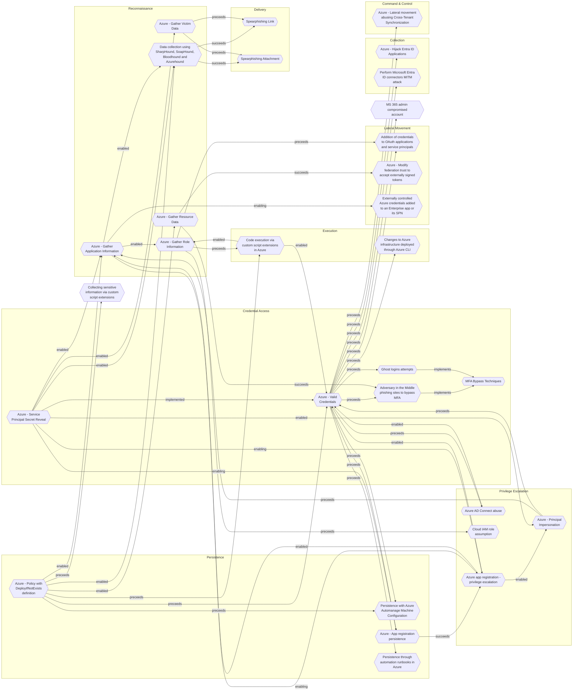

# Azure - Gather Application Information

## Metadata
| Field | Value |
| --- | --- |
| UUID | `fe6827f2-efb4-43b3-9ca3-b7d417111b32` |
| Schema | `threat::1.0` |
| Version | `2` |
| Created | `2025-08-18` |
| Modified | `2025-09-08` |
| TLP | clear (`TLP:CLEAR`) |
| Organisation | EC DIGIT CSOC (`56b0a0f0-b0bc-47d9-bb46-02f80ae2065a`) |

## References
### Public
- **1**: [https://microsoft.github.io/Azure-Threat-Research-Matrix/Reconnaissance/AZT105/AZT105/](https://microsoft.github.io/Azure-Threat-Research-Matrix/Reconnaissance/AZT105/AZT105/)
- **2**: [https://docs.microsoft.com/en-us/graph/migrate-azure-ad-graph-configure-permissions](https://docs.microsoft.com/en-us/graph/migrate-azure-ad-graph-configure-permissions)

## Description
This technique involves adversaries collecting data about applications running within Azure, 
especially those registered in Azure Active Directory (Azure AD). The goal is to 
gain insight into application properties, configurations, exposed endpoints, permission 
scopes, and connections, in order to identify potential attack paths or vulnerabilities.

### Example Attack Scenario

An adversary, during an initial reconnaissance campaign, uses publicly accessible 
APIs and Azure Active Directory (AAD) enumeration techniques to gather information 
about applications registered within the target's Azure tenant. By leveraging permissions 
such as `microsoft.directory/applications/*/read`, the attacker can identify applications, 
service principals, their permissions, owners, secrets, and roles. For instance, 
an attacker using a compromised regular user account attempts to list all AAD applications 
and their configurations. They extract details on app registration, API permissions, 
and whether any apps have high privilege assignments, such as access to sensitive 
data or elevated directory permissions. This information is used to map potential 
targets for privilege escalation or lateral movement.

### Attack Goals and Impact

- **Goals:**
  - Identify high-value applications and their associated service principals.
  - Determine application permissions and trust relationships within AAD.
  - Uncover misconfigurations, excessive privileges, or applications with weak security 
  controls.
  - Establish a list of applications for further exploitation, such as app impersonation, 
  secret harvesting, or abuse of delegated permissions.

- **Impact:**
  - Facilitates subsequent privilege escalation or lateral attacks if vulnerable 
  apps/service principals are identified.
  - May allow attackers to target apps for unauthorized access to sensitive information 
  or execution of high-impact operations.
  - Lays the groundwork for consent phishing attacks or abuse of poorly secured 
  app registrations.
  - Increases the risk of data exposure, unauthorized resource manipulation, and 
  tenant-wide compromises if attackers pivot successfully.

### Attack Flow and Methodology

1. **Data Gathering:**
  - Executes read operations using permissions like `microsoft.directory/applications/*/read` 
  to pull application names, identifiers, associated owners, API permissions, and 
  role assignments.
  - Enumerates app secrets/certificates and checks for possible excessive API scopes, 
  such as Application.ReadWrite.All or RoleManagement.ReadWrite.Directory.

2. **Analysis of Privilege Assignments:**
  - Evaluates permissions and assignments to locate applications with elevated 
  rights or direct access to critical resources.
  - Identifies owners who may be targeted for account compromise or further social 
  engineering.

3. **Planning Further Attacks:**
  - Maps application interrelationships and privilege chains to design next-phase 
  attacks, such as credential theft, application takeover, or phishing consent requests.
  - Assesses whether any applications are misconfigured, exposing endpoints or 
  secrets unintentionally.

4. **Use of Discovered Data:**
  - Uses harvested application data to target privilege escalation (e.g., adding 
  new credentials to an app as seen in advanced API permission abuse scenarios).
  - May initiate attacks such as impersonation using app secrets or deploying malicious 
  applications with elevated permissions.

## Criticality
**High** - A High priority incident is likely to result in a demonstrable impact to public health or safety, national security, economic security, foreign relations, civil liberties, or public confidence.

## Terrain
Adversaries obtain minimal access (often as a standard user or via an external account) 
in the target Azure AD tenant, then utilizes API endpoints and tools, such as Azure CLI, 
PowerShell modules (e.g., MSOnline, Microsoft.Graph), or custom scripts, to list 
all registered applications.

## Surface
> **Azure**
> Microsoft Azure cloud platform

> **Azure::Security::Entra ID**
> Microsoft Entra ID in Azure (cloud identity)

> **Microsoft::Microsoft 365**
> Microsoft 365 cloud-based productivity suite (formerly Office 365)

> **AWS::Storage**
> AWS storage services

> **Entra ID**
> Microsoft Entra ID (formerly Azure Active Directory)

> **Application Layer::HTTP**
> Hypertext Transfer Protocol

## Threat Assessment
| Dimension | Assessment | Description |
| --- | --- | --- |
| Severity | Significant incident | A cyber attack which has a serious impact on a large organisation or on wider / local government, or which poses a considerable risk to central government or (inter)national essential services. |
| Impact | Data Breach IP Loss | Non-public information has been accessed from the outside, and successfully extracted. Particular, key data, information and blueprint conducive to the organization capability to gain and retain a commercial or geopolitical advantage has been accessed, and their content potentially used by competitors or other adversaries. |
| Leverage | Information Disclosure Elevation of privilege Tampering Spoofing | Threat action intending to read a file that one was not granted access to, or to read data in transit. Capacity to augment leverage over the target system by upgrading the compromised access rights Threat action intending to maliciously change or modify persistent data, such as records in a database, and the alteration of data in transit between two computers over an open network, such as the Internet. Threat action aimed at accessing and use of another user’s credentials, such as username and password. |
| Viability | Likely | Probable (probably) - 55-80% |
| Kill Chain | Reconnaissance | Researching, identifying and selecting targets using active or passive reconnaissance. |

## Actors
| Actor | ID | Source | Description |
| --- | --- | --- | --- |
| Volt Typhoon | `misp::f02679fa-5e85-4050-8eb5-c2677d93306f` | ('misp',) | [Microsoft] Volt Typhoon, a state-sponsored actor based in China that typically focuses on espionage and information gathering. Microsoft assesses with moderate confidence that this Volt Typhoon campaign is pursuing development of capabilities that could disrupt critical communications infrastructure between the United States and Asia region during future crises.  [Secureworks] BRONZE SILHOUETTE likely operates on behalf the PRC. The targeting of U.S. government and defense organizations for intelligence gain aligns with PRC requirements, and the tradecraft observed in these engagements overlap with other state-sponsored Chinese threat groups. |
| Kimsuky | `misp::bcaaad6f-0597-4b89-b69b-84a6be2b7bc3` | ('misp',) | This threat actor targets South Korean think tanks, industry, nuclear power operators, and the Ministry of Unification for espionage purposes. |
| Sandworm | `misp::f512de42-f76b-40d2-9923-59e7dbdfec35` | ('misp',) | This threat actor targets industrial control systems, using a tool called Black Energy, associated with electricity and power generation for espionage, denial of service, and data destruction purposes. Some believe that the threat actor is linked to the 2015 compromise of the Ukrainian electrical grid and a distributed denial of service prior to the Russian invasion of Georgia. Believed to be responsible for the 2008 DDoS attacks in Georgia and the 2015 Ukraine power grid outage |
| [[Enterprise] Star Blizzard](https://attack.mitre.org/groups/G1033) | `att&ck::G1033` | ('att&ck',) | [Star Blizzard](https://attack.mitre.org/groups/G1033) is a cyber espionage and influence group originating in Russia that has been active since at least 2019. [Star Blizzard](https://attack.mitre.org/groups/G1033) campaigns align closely with Russian state interests and have included persistent phishing and credential theft against academic, defense, government, NGO, and think tank organizations in NATO countries, particularly the US and the UK.(Citation: Microsoft Star Blizzard August 2022)(Citation: CISA Star Blizzard Advisory December 2023)(Citation: StarBlizzard)(Citation: Google TAG COLDRIVER January 2024) |

## ATT&CK Techniques
| Technique | Name | Description |
| --- | --- | --- |
| `T1078.004` | [Valid Accounts: Cloud Accounts](https://attack.mitre.org/techniques/T1078/004) | Valid accounts in cloud environments may allow adversaries to perform actions to achieve Initial Access, Persistence, Privilege Escalation, or Defense Evasion. Cloud accounts are those created and configured by an organization for use by users, remote support, services, or for administration of resources within a cloud service provider or SaaS application. Cloud Accounts can exist solely in the cloud; alternatively, they may be hybrid-joined between on-premises systems and the cloud through syncing or federation with other identity sources such as Windows Active Directory.(Citation: AWS Identity Federation)(Citation: Google Federating GC)(Citation: Microsoft Deploying AD Federation)  Service or user accounts may be targeted by adversaries through [Brute Force](https://attack.mitre.org/techniques/T1110), [Phishing](https://attack.mitre.org/techniques/T1566), or various other means to gain access to the environment. Federated or synced accounts may be a pathway for the adversary to affect both on-premises systems and cloud environments - for example, by leveraging shared credentials to log onto [Remote Services](https://attack.mitre.org/techniques/T1021). High privileged cloud accounts, whether federated, synced, or cloud-only, may also allow pivoting to on-premises environments by leveraging SaaS-based [Software Deployment Tools](https://attack.mitre.org/techniques/T1072) to run commands on hybrid-joined devices.  An adversary may create long lasting [Additional Cloud Credentials](https://attack.mitre.org/techniques/T1098/001) on a compromised cloud account to maintain persistence in the environment. Such credentials may also be used to bypass security controls such as multi-factor authentication.   Cloud accounts may also be able to assume [Temporary Elevated Cloud Access](https://attack.mitre.org/techniques/T1548/005) or other privileges through various means within the environment. Misconfigurations in role assignments or role assumption policies may allow an adversary to use these mechanisms to leverage permissions outside the intended scope of the account. Such over privileged accounts may be used to harvest sensitive data from online storage accounts and databases through [Cloud API](https://attack.mitre.org/techniques/T1059/009) or other methods. For example, in Azure environments, adversaries may target Azure Managed Identities, which allow associated Azure resources to request access tokens. By compromising a resource with an attached Managed Identity, such as an Azure VM, adversaries may be able to [Steal Application Access Token](https://attack.mitre.org/techniques/T1528)s to move laterally across the cloud environment.(Citation: SpecterOps Managed Identity 2022) |
| `T1110` | [Brute Force](https://attack.mitre.org/techniques/T1110) | Adversaries may use brute force techniques to gain access to accounts when passwords are unknown or when password hashes are obtained.(Citation: TrendMicro Pawn Storm Dec 2020) Without knowledge of the password for an account or set of accounts, an adversary may systematically guess the password using a repetitive or iterative mechanism.(Citation: Dragos Crashoverride 2018) Brute forcing passwords can take place via interaction with a service that will check the validity of those credentials or offline against previously acquired credential data, such as password hashes.  Brute forcing credentials may take place at various points during a breach. For example, adversaries may attempt to brute force access to [Valid Accounts](https://attack.mitre.org/techniques/T1078) within a victim environment leveraging knowledge gathered from other post-compromise behaviors such as [OS Credential Dumping](https://attack.mitre.org/techniques/T1003), [Account Discovery](https://attack.mitre.org/techniques/T1087), or [Password Policy Discovery](https://attack.mitre.org/techniques/T1201). Adversaries may also combine brute forcing activity with behaviors such as [External Remote Services](https://attack.mitre.org/techniques/T1133) as part of Initial Access. |
| `T1555` | [Credentials from Password Stores](https://attack.mitre.org/techniques/T1555) | Adversaries may search for common password storage locations to obtain user credentials.(Citation: F-Secure The Dukes) Passwords are stored in several places on a system, depending on the operating system or application holding the credentials. There are also specific applications and services that store passwords to make them easier for users to manage and maintain, such as password managers and cloud secrets vaults. Once credentials are obtained, they can be used to perform lateral movement and access restricted information. |

## Chaining

### Chaining details
#### enabled -> [Azure - Gather Role Information](azure-gather-role-information.md) (`140907eb-c9fb-4330-9d71-656422388b2b`) (`support::enabled`)
Adversaries need to identify privileged accounts and misconfigured role assignments 
that can be exploited for privilege escalation.

- **Target UUID**: `140907eb-c9fb-4330-9d71-656422388b2b`
#### enabled -> [Data collection using SharpHound, SoapHound, Bloodhound and Azurehound](data-collection-using-sharphound-soaphound-bloodhound-and-azurehound.md) (`53063205-4404-4e6d-a2f5-d566c6085d96`) (`support::enabled`)
Attackers need to establish an initial presence within the target environment, in 
order to gather sufficient permissions to execute the data collection tools.

- **Target UUID**: `53063205-4404-4e6d-a2f5-d566c6085d96`
#### enabling -> [Externally controlled Azure credentials added to an Enterprise app or its SPN](externally-controlled-azure-credentials-added-to-an-enterprise-app-or-its-spn.md) (`ca2751c7-8641-4fb0-a90b-30c5987015dc`) (`support::enabling`)
A threat actor needs to control highly privileged Azure credentials in order to be able
to assign Azure credentials to an Azure Enterprise app or it's service principal.

- **Target UUID**: `ca2751c7-8641-4fb0-a90b-30c5987015dc`
#### enabling -> [Azure app registration - privilege escalation](azure-app-registration-privilege-escalation.md) (`c7e260d8-d391-41eb-be1a-7f276c99b383`) (`support::enabling`)
Adversaries need access to an identity (user account or service principal) with sufficient 
permissions to create, modify, or assign roles to app registrations or service principals.

- **Target UUID**: `c7e260d8-d391-41eb-be1a-7f276c99b383`
