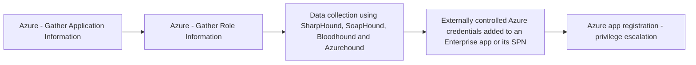

# Azure - Gather Application Information

## Metadata

- **UUID**: `fe6827f2-efb4-43b3-9ca3-b7d417111b32`
- **Schema**: `threat::1.0`
- **TLP**: clear

## Description
This technique involves adversaries collecting data about applications running within Azure, 
especially those registered in Azure Active Directory (Azure AD). The goal is to 
gain insight into application properties, configurations, exposed endpoints, permission 
scopes, and connections, in order to identify potential attack paths or vulnerabilities.

### Example Attack Scenario

An adversary, during an initial reconnaissance campaign, uses publicly accessible 
APIs and Azure Active Directory (AAD) enumeration techniques to gather information 
about applications registered within the target's Azure tenant. By leveraging permissions 
such as `microsoft.directory/applications/*/read`, the attacker can identify applications, 
service principals, their permissions, owners, secrets, and roles. For instance, 
an attacker using a compromised regular user account attempts to list all AAD applications 
and their configurations. They extract details on app registration, API permissions, 
and whether any apps have high privilege assignments, such as access to sensitive 
data or elevated directory permissions. This information is used to map potential 
targets for privilege escalation or lateral movement.

### Attack Goals and Impact

- **Goals:**
  - Identify high-value applications and their associated service principals.
  - Determine application permissions and trust relationships within AAD.
  - Uncover misconfigurations, excessive privileges, or applications with weak security 
  controls.
  - Establish a list of applications for further exploitation, such as app impersonation, 
  secret harvesting, or abuse of delegated permissions.

- **Impact:**
  - Facilitates subsequent privilege escalation or lateral attacks if vulnerable 
  apps/service principals are identified.
  - May allow attackers to target apps for unauthorized access to sensitive information 
  or execution of high-impact operations.
  - Lays the groundwork for consent phishing attacks or abuse of poorly secured 
  app registrations.
  - Increases the risk of data exposure, unauthorized resource manipulation, and 
  tenant-wide compromises if attackers pivot successfully.

### Attack Flow and Methodology

1. **Data Gathering:**
  - Executes read operations using permissions like `microsoft.directory/applications/*/read` 
  to pull application names, identifiers, associated owners, API permissions, and 
  role assignments.
  - Enumerates app secrets/certificates and checks for possible excessive API scopes, 
  such as Application.ReadWrite.All or RoleManagement.ReadWrite.Directory.

2. **Analysis of Privilege Assignments:**
  - Evaluates permissions and assignments to locate applications with elevated 
  rights or direct access to critical resources.
  - Identifies owners who may be targeted for account compromise or further social 
  engineering.

3. **Planning Further Attacks:**
  - Maps application interrelationships and privilege chains to design next-phase 
  attacks, such as credential theft, application takeover, or phishing consent requests.
  - Assesses whether any applications are misconfigured, exposing endpoints or 
  secrets unintentionally.

4. **Use of Discovered Data:**
  - Uses harvested application data to target privilege escalation (e.g., adding 
  new credentials to an app as seen in advanced API permission abuse scenarios).
  - May initiate attacks such as impersonation using app secrets or deploying malicious 
  applications with elevated permissions.

## Techniques
- T1078.004
- T1110
- T1555

## Chaining

