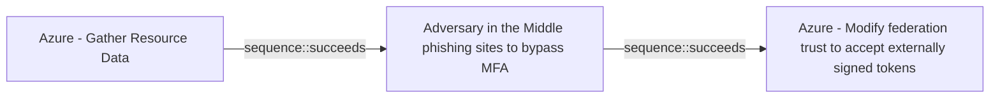

# Azure - Gather Resource Data

## Metadata

- **UUID**: `b1593e0b-1b3b-462d-9ab6-21d1c136469d`
- **Schema**: `threat::1.0`
- **Version**: `2`
- **Created**: `2025-08-07`
- **Modified**: `2025-09-04`
- **TLP**: clear (`TLP:CLEAR`)
- **Organisation**: EC DIGIT CSOC (`56b0a0f0-b0bc-47d9-bb46-02f80ae2065a`)

## References
### Public
- **1**: [https://microsoft.github.io/Azure-Threat-Research-Matrix/Reconnaissance/AZT107/AZT107/](https://microsoft.github.io/Azure-Threat-Research-Matrix/Reconnaissance/AZT107/AZT107/)
- **2**: [https://techcommunity.microsoft.com/blog/microsoftsecurityexperts/cloud-forensics-why-enabling-microsoft-azure-key-vault-logs-matters/4432149](https://techcommunity.microsoft.com/blog/microsoftsecurityexperts/cloud-forensics-why-enabling-microsoft-azure-key-vault-logs-matters/4432149)
- **3**: [https://www.bdosecurity.de/en-gb/insights/security-column/cloud-hacking-the-azure-cyber-kill-chain-part-1](https://www.bdosecurity.de/en-gb/insights/security-column/cloud-hacking-the-azure-cyber-kill-chain-part-1)

## Description
The “Gather Resource Data” technique is a key part of the reconnaissance phase in 
attacks against Azure environments. This activity focuses on enumerating information 
about resources within a target Azure tenant or subscription to support subsequent 
attack phases.

#### Example Attack Scenario

A threat actor gains access to a compromised identity in an Azure environment, such 
as via phishing or a leaked credential. Using this access, the attacker enumerates 
accessible resources (e.g., virtual machines, storage accounts, databases, and identity 
configurations) by executing read operations like `{resource}/*/read`. For example, 
if the account has Reader or even limited permissions, the attacker can list resource 
groups, virtual machines, Key Vaults, storage accounts, and see details such as 
configurations, names, and metadata. They might also list the names of secrets or 
certificates in a Key Vault—while unable to access the contents without elevated 
permissions, this reconnaissance helps prioritize attack targets.

#### Attack Goals and Impact

- **Goals:**
  - Develop a comprehensive map of the organization’s Azure environment.
  - Identify high-value resources (e.g., storage accounts with sensitive data, Key 
  Vaults, privileged identities).
  - Find weakly configured, over-permitted, or exposed resources (public endpoints, 
  misconfigured access policies).
  - Inform next stages of the attack (privilege escalation, lateral movement, data theft).

- **Potential Impact:**
  - **Accelerated compromise:** With detailed resource and configuration information, 
  attackers can quickly focus on the most lucrative or vulnerable targets.
  - **Increased stealth:** Attackers can tailor subsequent steps to avoid detection—targeting 
  overlooked or poorly monitored resources.
  - **Data exposure:** Identification of exposed storage or secrets can result in 
  immediate or subsequent sensitive data breaches.

#### Attack Flow and Methodology

1. **Automated Enumeration:** Utilizing Azure CLI, PowerShell (e.g., `Get-AzResource`, `az resource list`), 
REST APIs, or scripts, the attacker lists:
  - Resource groups and their contents
  - Virtual machines, storage accounts, databases, and Key Vaults
  - Permissions and access policies associated with resources
2. **Asset Profiling:** The attacker collects details on configurations, public IPs, 
RBAC permissions, and metadata for each resource.
3. **Vulnerability Identification:** Analysis focuses on resources where permissions, 
network exposure, or configurations suggest potential for privilege escalation or data access.
4. **Preparation for Next Stages:** The attacker plans lateral movement, privilege 
escalation, or direct attacks on data, using the knowledge obtained to target weak points.

## Criticality
**High** - A High priority incident is likely to result in a demonstrable impact to public health or safety, national security, economic security, foreign relations, civil liberties, or public confidence.

## Terrain
> **The attacker obtains credentials (via phishing, password spray, leaked keys) granting 
at least Reader access to the target Azure tenant.

Domains: Public Cloud, Private Cloud
Targets: Cloud Storage Accounts, Key Store, Virtual Machines, Identity Services, Compute Cluster, Public-Facing Servers, Network Equipment, Serverless, API Endpoints, Cloud Portal, Relational Database, NoSQL Database, Microservices, SAML-Joined Applications
Platforms: Azure, Azure AD, Windows, Linux, PowerShell**

## Threat Assessment
| Dimension | Assessment | Description |
| --- | --- | --- |
| Severity | Significant incident | A cyber attack which has a serious impact on a large organisation or on wider / local government, or which poses a considerable risk to central government or (inter)national essential services. |
| Impact | Data Breach; IP Loss; Reputational Damages; Identity Theft; Monetary Loss; Business disruption; Operating costs | - |
| Leverage | Information Disclosure; Infrastructure Compromise; Elevation of privilege; Modify configuration; Modify privileges; Modify data | - |
| Viability | Likely | Probable (probably) - 55-80% |
| Kill Chain | Reconnaissance | Researching, identifying and selecting targets using active or passive reconnaissance. |

## Actors
| Actor | ID | Source | Description |
| --- | --- | --- | --- |
| Volt Typhoon | `misp::f02679fa-5e85-4050-8eb5-c2677d93306f` | ('misp',) | [Microsoft] Volt Typhoon, a state-sponsored actor based in China that typically focuses on espionage and information gathering. Microsoft assesses with moderate confidence that this Volt Typhoon campaign is pursuing development of capabilities that could disrupt critical communications infrastructure between the United States and Asia region during future crises.  [Secureworks] BRONZE SILHOUETTE likely operates on behalf the PRC. The targeting of U.S. government and defense organizations for intelligence gain aligns with PRC requirements, and the tradecraft observed in these engagements overlap with other state-sponsored Chinese threat groups. |
| HAFNIUM | `misp::4f05d6c1-3fc1-4567-91cd-dd4637cc38b5` | ('misp',) | HAFNIUM primarily targets entities in the United States across a number of industry sectors, including infectious disease researchers, law firms, higher education institutions, defense contractors, policy think tanks, and NGOs. Microsoft Threat Intelligence Center (MSTIC) attributes this campaign with high confidence to HAFNIUM, a group assessed to be state-sponsored and operating out of China, based on observed victimology, tactics and procedures. HAFNIUM has previously compromised victims by exploiting vulnerabilities in internet-facing servers, and has used legitimate open-source frameworks, like Covenant, for command and control. Once they’ve gained access to a victim network, HAFNIUM typically exfiltrates data to file sharing sites like MEGA.In campaigns unrelated to these vulnerabilities, Microsoft has observed HAFNIUM interacting with victim Office 365 tenants. While they are often unsuccessful in compromising customer accounts, this reconnaissance activity helps the adversary identify more details about their targets’ environments. HAFNIUM operates primarily from leased virtual private servers (VPS) in the United States. |
| FIN13 | `misp::60fa684d-c738-4b77-98fb-3f6605e2bb82` | ('misp',) | Since 2017, Mandiant has been tracking FIN13, an industrious and versatile financially motivated threat actor conducting long-term intrusions in Mexico with an activity timeframe stretching back as early as 2016. Although their operations continue through the present day, in many ways FIN13's intrusions are like a time capsule of traditional financial cybercrime from days past. Instead of today's prevalent smash-and-grab ransomware groups, FIN13 takes their time to gather information to perform fraudulent money transfers. Rather than relying heavily on attack frameworks such as Cobalt Strike, the majority of FIN13 intrusions involve heavy use of custom passive backdoors and tools to lurk in environments for the long haul. |
| [[Enterprise] Salt Typhoon](https://attack.mitre.org/groups/G1045) | `att&ck::G1045` | ('att&ck',) | [Salt Typhoon](https://attack.mitre.org/groups/G1045) is a People's Republic of China (PRC) state-backed actor that has been active since at least 2019 and responsible for numerous compromises of network infrastructure at major U.S. telecommunication and internet service providers (ISP).(Citation: US Dept. of Treasury Salt Typhoon JAN 2025)(Citation: Cisco Salt Typhoon FEB 2025) |

## ATT&CK Techniques
| Technique | Name | Description |
| --- | --- | --- |
| `T1526` | [Cloud Service Discovery](https://attack.mitre.org/techniques/T1526) | An adversary may attempt to enumerate the cloud services running on a system after gaining access. These methods can differ from platform-as-a-service (PaaS), to infrastructure-as-a-service (IaaS), or software-as-a-service (SaaS). Many services exist throughout the various cloud providers and can include Continuous Integration and Continuous Delivery (CI/CD), Lambda Functions, Entra ID, etc. They may also include security services, such as AWS GuardDuty and Microsoft Defender for Cloud, and logging services, such as AWS CloudTrail and Google Cloud Audit Logs.  Adversaries may attempt to discover information about the services enabled throughout the environment. Azure tools and APIs, such as the Microsoft Graph API and Azure Resource Manager API, can enumerate resources and services, including applications, management groups, resources and policy definitions, and their relationships that are accessible by an identity.(Citation: Azure - Resource Manager API)(Citation: Azure AD Graph API)  For example, Stormspotter is an open source tool for enumerating and constructing a graph for Azure resources and services, and Pacu is an open source AWS exploitation framework that supports several methods for discovering cloud services.(Citation: Azure - Stormspotter)(Citation: GitHub Pacu)  Adversaries may use the information gained to shape follow-on behaviors, such as targeting data or credentials from enumerated services or evading identified defenses through [Disable or Modify Tools](https://attack.mitre.org/techniques/T1562/001) or [Disable or Modify Cloud Logs](https://attack.mitre.org/techniques/T1562/008). |
| `T1087` | [Account Discovery](https://attack.mitre.org/techniques/T1087) | Adversaries may attempt to get a listing of valid accounts, usernames, or email addresses on a system or within a compromised environment. This information can help adversaries determine which accounts exist, which can aid in follow-on behavior such as brute-forcing, spear-phishing attacks, or account takeovers (e.g., [Valid Accounts](https://attack.mitre.org/techniques/T1078)).  Adversaries may use several methods to enumerate accounts, including abuse of existing tools, built-in commands, and potential misconfigurations that leak account names and roles or permissions in the targeted environment.  For examples, cloud environments typically provide easily accessible interfaces to obtain user lists.(Citation: AWS List Users)(Citation: Google Cloud - IAM Servie Accounts List API) On hosts, adversaries can use default [PowerShell](https://attack.mitre.org/techniques/T1059/001) and other command line functionality to identify accounts. Information about email addresses and accounts may also be extracted by searching an infected system’s files. |
| `T1552.001` | [Unsecured Credentials: Credentials In Files](https://attack.mitre.org/techniques/T1552/001) | Adversaries may search local file systems and remote file shares for files containing insecurely stored credentials. These can be files created by users to store their own credentials, shared credential stores for a group of individuals, configuration files containing passwords for a system or service, or source code/binary files containing embedded passwords.  It is possible to extract passwords from backups or saved virtual machines through [OS Credential Dumping](https://attack.mitre.org/techniques/T1003).(Citation: CG 2014) Passwords may also be obtained from Group Policy Preferences stored on the Windows Domain Controller.(Citation: SRD GPP)  In cloud and/or containerized environments, authenticated user and service account credentials are often stored in local configuration and credential files.(Citation: Unit 42 Hildegard Malware) They may also be found as parameters to deployment commands in container logs.(Citation: Unit 42 Unsecured Docker Daemons) In some cases, these files can be copied and reused on another machine or the contents can be read and then used to authenticate without needing to copy any files.(Citation: Specter Ops - Cloud Credential Storage) |
| `T1530` | [Data from Cloud Storage](https://attack.mitre.org/techniques/T1530) | Adversaries may access data from cloud storage.  Many IaaS providers offer solutions for online data object storage such as Amazon S3, Azure Storage, and Google Cloud Storage. Similarly, SaaS enterprise platforms such as Office 365 and Google Workspace provide cloud-based document storage to users through services such as OneDrive and Google Drive, while SaaS application providers such as Slack, Confluence, Salesforce, and Dropbox may provide cloud storage solutions as a peripheral or primary use case of their platform.   In some cases, as with IaaS-based cloud storage, there exists no overarching application (such as SQL or Elasticsearch) with which to interact with the stored objects: instead, data from these solutions is retrieved directly though the [Cloud API](https://attack.mitre.org/techniques/T1059/009). In SaaS applications, adversaries may be able to collect this data directly from APIs or backend cloud storage objects, rather than through their front-end application or interface (i.e., [Data from Information Repositories](https://attack.mitre.org/techniques/T1213)).   Adversaries may collect sensitive data from these cloud storage solutions. Providers typically offer security guides to help end users configure systems, though misconfigurations are a common problem.(Citation: Amazon S3 Security, 2019)(Citation: Microsoft Azure Storage Security, 2019)(Citation: Google Cloud Storage Best Practices, 2019) There have been numerous incidents where cloud storage has been improperly secured, typically by unintentionally allowing public access to unauthenticated users, overly-broad access by all users, or even access for any anonymous person outside the control of the Identity Access Management system without even needing basic user permissions.  This open access may expose various types of sensitive data, such as credit cards, personally identifiable information, or medical records.(Citation: Trend Micro S3 Exposed PII, 2017)(Citation: Wired Magecart S3 Buckets, 2019)(Citation: HIPAA Journal S3 Breach, 2017)(Citation: Rclone-mega-extortion_05_2021)  Adversaries may also obtain then abuse leaked credentials from source repositories, logs, or other means as a way to gain access to cloud storage objects. |

## Chaining

### Chaining details
#### succeeds -> Adversary in the Middle phishing sites to bypass MFA (`sequence::succeeds`)
An adversary may obtain information and data within a resource.

- **Target UUID**: `66aafb61-9a46-4287-8b40-4785b42b77a3`
#### succeeds -> Azure - Modify federation trust to accept externally signed tokens (`sequence::succeeds`)
An adversary may obtain information and data within a resource.

- **Target UUID**: `9bb31c65-8abd-48fc-afe3-8aca76109737`
