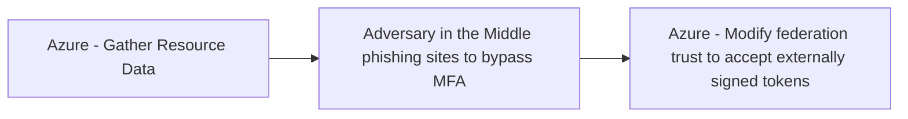

# Azure - Gather Resource Data

## Metadata

- **UUID**: `b1593e0b-1b3b-462d-9ab6-21d1c136469d`
- **Schema**: `threat::1.0`
- **TLP**: clear

## Description
The “Gather Resource Data” technique is a key part of the reconnaissance phase in 
attacks against Azure environments. This activity focuses on enumerating information 
about resources within a target Azure tenant or subscription to support subsequent 
attack phases.

#### Example Attack Scenario

A threat actor gains access to a compromised identity in an Azure environment, such 
as via phishing or a leaked credential. Using this access, the attacker enumerates 
accessible resources (e.g., virtual machines, storage accounts, databases, and identity 
configurations) by executing read operations like `{resource}/*/read`. For example, 
if the account has Reader or even limited permissions, the attacker can list resource 
groups, virtual machines, Key Vaults, storage accounts, and see details such as 
configurations, names, and metadata. They might also list the names of secrets or 
certificates in a Key Vault—while unable to access the contents without elevated 
permissions, this reconnaissance helps prioritize attack targets.

#### Attack Goals and Impact

- **Goals:**
  - Develop a comprehensive map of the organization’s Azure environment.
  - Identify high-value resources (e.g., storage accounts with sensitive data, Key 
  Vaults, privileged identities).
  - Find weakly configured, over-permitted, or exposed resources (public endpoints, 
  misconfigured access policies).
  - Inform next stages of the attack (privilege escalation, lateral movement, data theft).

- **Potential Impact:**
  - **Accelerated compromise:** With detailed resource and configuration information, 
  attackers can quickly focus on the most lucrative or vulnerable targets.
  - **Increased stealth:** Attackers can tailor subsequent steps to avoid detection—targeting 
  overlooked or poorly monitored resources.
  - **Data exposure:** Identification of exposed storage or secrets can result in 
  immediate or subsequent sensitive data breaches.

#### Attack Flow and Methodology

1. **Automated Enumeration:** Utilizing Azure CLI, PowerShell (e.g., `Get-AzResource`, `az resource list`), 
REST APIs, or scripts, the attacker lists:
  - Resource groups and their contents
  - Virtual machines, storage accounts, databases, and Key Vaults
  - Permissions and access policies associated with resources
2. **Asset Profiling:** The attacker collects details on configurations, public IPs, 
RBAC permissions, and metadata for each resource.
3. **Vulnerability Identification:** Analysis focuses on resources where permissions, 
network exposure, or configurations suggest potential for privilege escalation or data access.
4. **Preparation for Next Stages:** The attacker plans lateral movement, privilege 
escalation, or direct attacks on data, using the knowledge obtained to target weak points.

## Techniques
- T1526
- T1087
- T1552.001
- T1530

## Chaining

