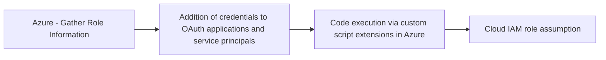

# Azure - Gather Role Information

## Metadata

- **UUID**: `140907eb-c9fb-4330-9d71-656422388b2b`
- **Schema**: `threat::1.0`
- **TLP**: clear

## Description
The "Gather Role Information" refers to an adversary's effort to enumerate and obtain 
details about roles, role assignments, and the privileges associated with specific 
accounts or applications within Azure Active Directory (AAD) and Azure Resource 
Manager environments. This reconnaissance phase is foundational, setting up future 
attacks by mapping out who can do what within the Azure estate.

#### Example Attack Scenario

An attacker gains access to a compromised low-privilege user account in an Azure tenant. 
Leveraging their access, the adversary initiates API and portal queries to enumerate 
all directory roles, their descriptions, nested role assignments, and identify which 
users or service principals hold elevated privileges (like Global Administrator, 
Application Admin, or Contributor). 

For example, the attacker uses available Microsoft Graph API permissions like `microsoft.directory/roleAssignments/standard/read` 
or `microsoft.directory/directoryRoles/members/read` to extract:
- A listing of all roles within the tenant.
- The users/groups assigned to these roles.
- The service principals and applications with privileged roles.

With this intelligence, the attacker pinpoints accounts with standing access to 
sensitive resources, cloud infrastructure, or the ability to modify security controls. 
This information enables them to focus follow-on attacks (such as phishing, lateral movement, 
privilege escalation, or controlling cloud resources) on the most impactful targets.

#### Attack Goals and Impact

**Attack Goals:**
- **Enumerate privileged accounts:** Learn which identities have administrator or 
other elevated roles.
- **Understand role-based access controls:** Discover which roles are assigned to 
cloud workloads, services, and third-party integrations.
- **Map the privilege model:** Identify paths to escalate privileges or move laterally 
within the tenant.
- **Target specific high-value accounts:** Single out accounts or service principals 
most beneficial for further attack phases.

**Impact:**
- **Precision in follow-on attacks:** Enables highly targeted privilege escalation, 
persistence, or data exfiltration.
- **Facilitates credential theft or misuse:** Attackers concentrate phishing, token theft, 
or abuse on users who can cause maximum damage.
- **Exposure of sensitive information:** Mapping out service principals, applications, 
and their privileges may reveal misconfigurations or vulnerabilities exploitable 
for direct access to business-critical resources.
- **Reduces attacker effort:** By understanding the privilege hierarchy, attackers 
avoid unnecessary noise and maximize their effectiveness.

#### Attack Flow and Methodology

1. **Access Acquisition:**
  - Attacker obtains valid credentials or API access (even with limited privileges) within the Azure tenant.

2. **Role Enumeration:**
  - Uses Microsoft Graph, AzureAD, or Azure Resource Management APIs/portals to 
  list all directory roles (`directoryRoles/standard/read`), their descriptions, 
  and their associated members.
  - Specifically requests assignments (`roleAssignments/standard/read`) and membership 
  lists to correlate identities with roles.

3. **Correlation and Mapping:**
  - Maps users, groups, applications, and service principals to their assigned roles.
  - Correlates admin accounts, app owners, and standing access roles across different 
  Azure resources or subscriptions.

4. **Analysis:**
  - Analyzes output to spot high-privilege accounts (e.g., Global Admin, Owner, Contributor), 
  and applications with dangerous permissions.
  - May additionally search for legacy, orphaned, or misconfigured roles to exploit 
  gaps in security controls.

5. **Preparation for Exploitation:**
  - Prepares to exploit the gathered intelligence, such as launching spear-phishing 
  campaigns specifically targeting privileged users, leveraging known vulnerabilities 
  in third-party applications, or planning lateral movement towards sensitive workloads.

## Techniques
- T1591.004
- T1087.002
- T1589.001
- T1482

## Chaining

