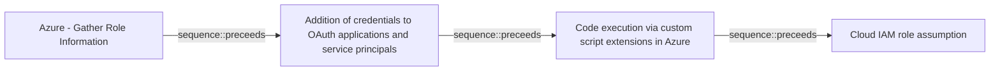

# Azure - Gather Role Information

## Metadata

- **UUID**: `140907eb-c9fb-4330-9d71-656422388b2b`
- **Schema**: `threat::1.0`
- **Version**: `2`
- **Created**: `2025-08-05`
- **Modified**: `2025-09-04`
- **TLP**: clear (`TLP:CLEAR`)
- **Organisation**: EC DIGIT CSOC (`56b0a0f0-b0bc-47d9-bb46-02f80ae2065a`)

## References
### Public
- **1**: [https://microsoft.github.io/Azure-Threat-Research-Matrix/Reconnaissance/AZT106/AZT106/](https://microsoft.github.io/Azure-Threat-Research-Matrix/Reconnaissance/AZT106/AZT106/)
- **2**: [https://posts.specterops.io/attacking-azure-azure-ad-and-introducing-powerzure-ca70b330511a](https://posts.specterops.io/attacking-azure-azure-ad-and-introducing-powerzure-ca70b330511a)

## Description
The "Gather Role Information" refers to an adversary's effort to enumerate and obtain 
details about roles, role assignments, and the privileges associated with specific 
accounts or applications within Azure Active Directory (AAD) and Azure Resource 
Manager environments. This reconnaissance phase is foundational, setting up future 
attacks by mapping out who can do what within the Azure estate.

#### Example Attack Scenario

An attacker gains access to a compromised low-privilege user account in an Azure tenant. 
Leveraging their access, the adversary initiates API and portal queries to enumerate 
all directory roles, their descriptions, nested role assignments, and identify which 
users or service principals hold elevated privileges (like Global Administrator, 
Application Admin, or Contributor). 

For example, the attacker uses available Microsoft Graph API permissions like `microsoft.directory/roleAssignments/standard/read` 
or `microsoft.directory/directoryRoles/members/read` to extract:
- A listing of all roles within the tenant.
- The users/groups assigned to these roles.
- The service principals and applications with privileged roles.

With this intelligence, the attacker pinpoints accounts with standing access to 
sensitive resources, cloud infrastructure, or the ability to modify security controls. 
This information enables them to focus follow-on attacks (such as phishing, lateral movement, 
privilege escalation, or controlling cloud resources) on the most impactful targets.

#### Attack Goals and Impact

**Attack Goals:**
- **Enumerate privileged accounts:** Learn which identities have administrator or 
other elevated roles.
- **Understand role-based access controls:** Discover which roles are assigned to 
cloud workloads, services, and third-party integrations.
- **Map the privilege model:** Identify paths to escalate privileges or move laterally 
within the tenant.
- **Target specific high-value accounts:** Single out accounts or service principals 
most beneficial for further attack phases.

**Impact:**
- **Precision in follow-on attacks:** Enables highly targeted privilege escalation, 
persistence, or data exfiltration.
- **Facilitates credential theft or misuse:** Attackers concentrate phishing, token theft, 
or abuse on users who can cause maximum damage.
- **Exposure of sensitive information:** Mapping out service principals, applications, 
and their privileges may reveal misconfigurations or vulnerabilities exploitable 
for direct access to business-critical resources.
- **Reduces attacker effort:** By understanding the privilege hierarchy, attackers 
avoid unnecessary noise and maximize their effectiveness.

#### Attack Flow and Methodology

1. **Access Acquisition:**
  - Attacker obtains valid credentials or API access (even with limited privileges) within the Azure tenant.

2. **Role Enumeration:**
  - Uses Microsoft Graph, AzureAD, or Azure Resource Management APIs/portals to 
  list all directory roles (`directoryRoles/standard/read`), their descriptions, 
  and their associated members.
  - Specifically requests assignments (`roleAssignments/standard/read`) and membership 
  lists to correlate identities with roles.

3. **Correlation and Mapping:**
  - Maps users, groups, applications, and service principals to their assigned roles.
  - Correlates admin accounts, app owners, and standing access roles across different 
  Azure resources or subscriptions.

4. **Analysis:**
  - Analyzes output to spot high-privilege accounts (e.g., Global Admin, Owner, Contributor), 
  and applications with dangerous permissions.
  - May additionally search for legacy, orphaned, or misconfigured roles to exploit 
  gaps in security controls.

5. **Preparation for Exploitation:**
  - Prepares to exploit the gathered intelligence, such as launching spear-phishing 
  campaigns specifically targeting privileged users, leveraging known vulnerabilities 
  in third-party applications, or planning lateral movement towards sensitive workloads.

## Criticality
**High** - A High priority incident is likely to result in a demonstrable impact to public health or safety, national security, economic security, foreign relations, civil liberties, or public confidence.

## Terrain
> **Adversaries need to identify privileged accounts and misconfigured role assignments 
that can be exploited for privilege escalation.

Domains: Public Cloud, Private Cloud
Targets: Identity Services, Cloud Storage Accounts, Compute Cluster, Public-Facing Servers, Virtual Machines, Serverless, API Endpoints, Cloud Portal, Server Authentication, Directory
Platforms: Azure, Azure AD**

## Threat Assessment
| Dimension | Assessment | Description |
| --- | --- | --- |
| Severity | Significant incident | A cyber attack which has a serious impact on a large organisation or on wider / local government, or which poses a considerable risk to central government or (inter)national essential services. |
| Impact | Data Breach; IP Loss; Reputational Damages; Identity Theft; Monetary Loss; Business disruption | - |
| Leverage | Information Disclosure; Elevation of privilege; Tampering; Spoofing | - |
| Viability | Likely | Probable (probably) - 55-80% |
| Kill Chain | Reconnaissance | Researching, identifying and selecting targets using active or passive reconnaissance. |

## Actors
| Actor | ID | Source | Description |
| --- | --- | --- | --- |
| [[Enterprise] HEXANE](https://attack.mitre.org/groups/G1001) | `att&ck::G1001` | ('att&ck',) | [HEXANE](https://attack.mitre.org/groups/G1001) is a cyber espionage threat group that has targeted oil & gas, telecommunications, aviation, and internet service provider organizations since at least 2017. Targeted companies have been located in the Middle East and Africa, including Israel, Saudi Arabia, Kuwait, Morocco, and Tunisia. [HEXANE](https://attack.mitre.org/groups/G1001)'s TTPs appear similar to [APT33](https://attack.mitre.org/groups/G0064) and [OilRig](https://attack.mitre.org/groups/G0049) but due to differences in victims and tools it is tracked as a separate entity.(Citation: Dragos Hexane)(Citation: Kaspersky Lyceum October 2021)(Citation: ClearSky Siamesekitten August 2021)(Citation: Accenture Lyceum Targets November 2021) |
| LAPSUS | `misp::d9e5be22-1a04-4956-af6c-37af02330980` | ('misp',) | An actor group conducting large-scale social engineering and extortion campaign against multiple organizations with some seeing evidence of destructive elements. |
| Volt Typhoon | `misp::f02679fa-5e85-4050-8eb5-c2677d93306f` | ('misp',) | [Microsoft] Volt Typhoon, a state-sponsored actor based in China that typically focuses on espionage and information gathering. Microsoft assesses with moderate confidence that this Volt Typhoon campaign is pursuing development of capabilities that could disrupt critical communications infrastructure between the United States and Asia region during future crises.  [Secureworks] BRONZE SILHOUETTE likely operates on behalf the PRC. The targeting of U.S. government and defense organizations for intelligence gain aligns with PRC requirements, and the tradecraft observed in these engagements overlap with other state-sponsored Chinese threat groups. |

## ATT&CK Techniques
| Technique | Name | Description |
| --- | --- | --- |
| `T1591.004` | [Gather Victim Org Information: Identify Roles](https://attack.mitre.org/techniques/T1591/004) | Adversaries may gather information about identities and roles within the victim organization that can be used during targeting. Information about business roles may reveal a variety of targetable details, including identifiable information for key personnel as well as what data/resources they have access to.  Adversaries may gather this information in various ways, such as direct elicitation via [Phishing for Information](https://attack.mitre.org/techniques/T1598). Information about business roles may also be exposed to adversaries via online or other accessible data sets (ex: [Social Media](https://attack.mitre.org/techniques/T1593/001) or [Search Victim-Owned Websites](https://attack.mitre.org/techniques/T1594)).(Citation: ThreatPost Broadvoice Leak) Gathering this information may reveal opportunities for other forms of reconnaissance (ex: [Phishing for Information](https://attack.mitre.org/techniques/T1598) or [Search Open Websites/Domains](https://attack.mitre.org/techniques/T1593)), establishing operational resources (ex: [Establish Accounts](https://attack.mitre.org/techniques/T1585) or [Compromise Accounts](https://attack.mitre.org/techniques/T1586)), and/or initial access (ex: [Phishing](https://attack.mitre.org/techniques/T1566)). |
| `T1087.002` | [Account Discovery: Domain Account](https://attack.mitre.org/techniques/T1087/002) | Adversaries may attempt to get a listing of domain accounts. This information can help adversaries determine which domain accounts exist to aid in follow-on behavior such as targeting specific accounts which possess particular privileges.  Commands such as <code>net user /domain</code> and <code>net group /domain</code> of the [Net](https://attack.mitre.org/software/S0039) utility, <code>dscacheutil -q group</code> on macOS, and <code>ldapsearch</code> on Linux can list domain users and groups. [PowerShell](https://attack.mitre.org/techniques/T1059/001) cmdlets including <code>Get-ADUser</code> and <code>Get-ADGroupMember</code> may enumerate members of Active Directory groups.(Citation: CrowdStrike StellarParticle January 2022) |
| `T1589.001` | [Gather Victim Identity Information: Credentials](https://attack.mitre.org/techniques/T1589/001) | Adversaries may gather credentials that can be used during targeting. Account credentials gathered by adversaries may be those directly associated with the target victim organization or attempt to take advantage of the tendency for users to use the same passwords across personal and business accounts.  Adversaries may gather credentials from potential victims in various ways, such as direct elicitation via [Phishing for Information](https://attack.mitre.org/techniques/T1598). Adversaries may also compromise sites then add malicious content designed to collect website authentication cookies from visitors.(Citation: ATT ScanBox) (Citation: Register Deloitte)(Citation: Register Uber)(Citation: Detectify Slack Tokens)(Citation: Forbes GitHub Creds)(Citation: GitHub truffleHog)(Citation: GitHub Gitrob)(Citation: CNET Leaks) Where multi-factor authentication (MFA) based on out-of-band communications is in use, adversaries may compromise a service provider to gain access to MFA codes and one-time passwords (OTP).(Citation: Okta Scatter Swine 2022)  Credential information may also be exposed to adversaries via leaks to online or other accessible data sets (ex: [Search Engines](https://attack.mitre.org/techniques/T1593/002), breach dumps, code repositories, etc.). Adversaries may purchase credentials from dark web markets, such as Russian Market and 2easy, or through access to Telegram channels that distribute logs from infostealer malware.(Citation: Bleeping Computer 2easy 2021)(Citation: SecureWorks Infostealers 2023)(Citation: Bleeping Computer Stealer Logs 2023)  Gathering this information may reveal opportunities for other forms of reconnaissance (ex: [Search Open Websites/Domains](https://attack.mitre.org/techniques/T1593) or [Phishing for Information](https://attack.mitre.org/techniques/T1598)), establishing operational resources (ex: [Compromise Accounts](https://attack.mitre.org/techniques/T1586)), and/or initial access (ex: [External Remote Services](https://attack.mitre.org/techniques/T1133) or [Valid Accounts](https://attack.mitre.org/techniques/T1078)). |
| `T1482` | [Domain Trust Discovery](https://attack.mitre.org/techniques/T1482) | Adversaries may attempt to gather information on domain trust relationships that may be used to identify lateral movement opportunities in Windows multi-domain/forest environments. Domain trusts provide a mechanism for a domain to allow access to resources based on the authentication procedures of another domain.(Citation: Microsoft Trusts) Domain trusts allow the users of the trusted domain to access resources in the trusting domain. The information discovered may help the adversary conduct [SID-History Injection](https://attack.mitre.org/techniques/T1134/005), [Pass the Ticket](https://attack.mitre.org/techniques/T1550/003), and [Kerberoasting](https://attack.mitre.org/techniques/T1558/003).(Citation: AdSecurity Forging Trust Tickets)(Citation: Harmj0y Domain Trusts) Domain trusts can be enumerated using the `DSEnumerateDomainTrusts()` Win32 API call, .NET methods, and LDAP.(Citation: Harmj0y Domain Trusts) The Windows utility [Nltest](https://attack.mitre.org/software/S0359) is known to be used by adversaries to enumerate domain trusts.(Citation: Microsoft Operation Wilysupply) |

## Chaining

### Chaining details
#### preceeds -> Addition of credentials to OAuth applications and service principals (`sequence::preceeds`)
An adversary may obtain information about a role within Azure AD or within Azure Resource Manager.

- **Target UUID**: `a8c7b250-a2d4-4a0d-82f8-23dc99c77d7b`
#### preceeds -> Code execution via custom script extensions in Azure (`sequence::preceeds`)
An adversary may obtain information about a role within Azure AD or within Azure Resource Manager.

- **Target UUID**: `61ddc240-e5a6-4ca8-ae77-6b471b498913`
#### preceeds -> Cloud IAM role assumption (`sequence::preceeds`)
An adversary may obtain information about a role within Azure AD or within Azure Resource Manager.

- **Target UUID**: `f1dc4341-eb45-4d07-8075-b1a6b227cc76`
