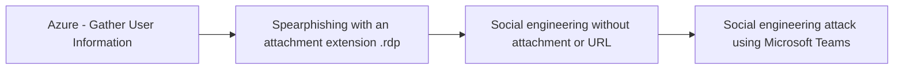

# Azure - Gather User Information

## Metadata

- **UUID**: `2900d389-3098-49d3-8166-5b2612d03576`
- **Schema**: `threat::1.0`
- **TLP**: clear

## Description
This technique describes how adversaries obtain information about user accounts 
in Azure Active Directory (AAD), which can be leveraged for further attack planning 
and targeting within a cloud environment.

### Example Attack Scenario

An attacker with limited or no access to an Azure environment targets an organization 
using Azure Active Directory. After they obtain information, attackers then cross-references 
this information with social media profiles and other public data, building a list 
of high-value users and their roles. Armed with these details, the attacker crafts 
targeted phishing campaigns or searches for weak credentials and misconfigurations 
with those accounts. For example, the attacker might use an Azure API such as `Get-AzureADUser` 
to enumerate users if they have a valid credential, or scrape corporate websites 
for employee contact details, inferring Azure AD presence.

### Attack Goals and Impact

- **Primary Goal:** To obtain as much information about users as possible—especially 
privileged or high-value accounts—without alerting defenders.
- **Impact:**
  - Enables targeted social engineering, phishing attacks, and credential stuffing.
  - Helps attackers identify privilege relationships, which aids in lateral movement 
  planning and privilege escalation.
  - Reveals organizational structure, making subsequent attacks more precise and effective.
  - May lead to sensitive data exposure (including personal information if the account 
  is later compromised).

### Attack Flow and Methodology

1. **Discovery & Enumeration:**
  - Attacker passively searches public sources (corporate sites, LinkedIn) for names, 
  roles, group memberships.
  - If attacker obtains a valid account/credential (through phishing or prior compromise), 
  they may use Azure AD enumeration APIs (`Get-AzureADUser`, etc.) to list all 
  users, roles, and privileges.

2. **Data Aggregation:**
  - Combine enumerated internal data (user lists, group memberships) with external 
  information (social media, breached databases).
  - Map relationships and find which users have critical access, such as global 
  administrators, application owners, or service principal managers.

3. **Analysis & Targeting:**
  - Identify users who are most likely susceptible to social engineering (frequently contacted staff, IT helpdesk).
  - Prioritize accounts for further compromise attempts based on access level.

4. **Preparation for Further Attack Phases:**
  - Use gathered user information to launch credential stuffing, spear phishing, 
  consent phishing, or authentication token theft attacks.
  - Attempt further reconnaissance focused on those high-value targets, such as 
  checking group assignment, roles, and recent activity.

## Techniques
- T1589
- T1087
- T1078.004

## Chaining

