# Azure - Gather User Information

## Metadata

- **UUID**: `2900d389-3098-49d3-8166-5b2612d03576`
- **Schema**: `threat::1.0`
- **Version**: `2`
- **Created**: `2025-08-12`
- **Modified**: `2025-09-04`
- **TLP**: clear (`TLP:CLEAR`)
- **Organisation**: EC DIGIT CSOC (`56b0a0f0-b0bc-47d9-bb46-02f80ae2065a`)

## References
### Public
- **1**: [https://microsoft.github.io/Azure-Threat-Research-Matrix/Reconnaissance/Reconnaissance/](https://microsoft.github.io/Azure-Threat-Research-Matrix/Reconnaissance/Reconnaissance/)

## Description
This technique describes how adversaries obtain information about user accounts 
in Azure Active Directory (AAD), which can be leveraged for further attack planning 
and targeting within a cloud environment.

### Example Attack Scenario

An attacker with limited or no access to an Azure environment targets an organization 
using Azure Active Directory. After they obtain information, attackers then cross-references 
this information with social media profiles and other public data, building a list 
of high-value users and their roles. Armed with these details, the attacker crafts 
targeted phishing campaigns or searches for weak credentials and misconfigurations 
with those accounts. For example, the attacker might use an Azure API such as `Get-AzureADUser` 
to enumerate users if they have a valid credential, or scrape corporate websites 
for employee contact details, inferring Azure AD presence.

### Attack Goals and Impact

- **Primary Goal:** To obtain as much information about users as possible—especially 
privileged or high-value accounts—without alerting defenders.
- **Impact:**
  - Enables targeted social engineering, phishing attacks, and credential stuffing.
  - Helps attackers identify privilege relationships, which aids in lateral movement 
  planning and privilege escalation.
  - Reveals organizational structure, making subsequent attacks more precise and effective.
  - May lead to sensitive data exposure (including personal information if the account 
  is later compromised).

### Attack Flow and Methodology

1. **Discovery & Enumeration:**
  - Attacker passively searches public sources (corporate sites, LinkedIn) for names, 
  roles, group memberships.
  - If attacker obtains a valid account/credential (through phishing or prior compromise), 
  they may use Azure AD enumeration APIs (`Get-AzureADUser`, etc.) to list all 
  users, roles, and privileges.

2. **Data Aggregation:**
  - Combine enumerated internal data (user lists, group memberships) with external 
  information (social media, breached databases).
  - Map relationships and find which users have critical access, such as global 
  administrators, application owners, or service principal managers.

3. **Analysis & Targeting:**
  - Identify users who are most likely susceptible to social engineering (frequently contacted staff, IT helpdesk).
  - Prioritize accounts for further compromise attempts based on access level.

4. **Preparation for Further Attack Phases:**
  - Use gathered user information to launch credential stuffing, spear phishing, 
  consent phishing, or authentication token theft attacks.
  - Attempt further reconnaissance focused on those high-value targets, such as 
  checking group assignment, roles, and recent activity.

## Criticality
**High** - A High priority incident is likely to result in a demonstrable impact to public health or safety, national security, economic security, foreign relations, civil liberties, or public confidence.

## Terrain
> **Adversaries use publicly accessible endpoints, misconfigured applications, or phishing 
emails to harvest user names, email addresses, job titles, and group memberships.

Domains: Public Cloud, Private Cloud, Enterprise, SaaS
Targets: Identity Services, Cloud Storage Accounts, Key Store, Workstations, Public-Facing Servers, Virtual Machines, Serverless, Email Platform, API Endpoints, Cloud Portal, SAML-Joined Applications, Software Development Tools, Code Repositories, CI/CD Pipelines, Server Authentication
Platforms: Azure, Azure AD, Office 365**

## Threat Assessment
| Dimension | Assessment | Description |
| --- | --- | --- |
| Severity | Significant incident | A cyber attack which has a serious impact on a large organisation or on wider / local government, or which poses a considerable risk to central government or (inter)national essential services. |
| Impact | Data Breach; IP Loss; Reputational Damages; Identity Theft; Monetary Loss; Business disruption | - |
| Leverage | Information Disclosure; Spoofing; Tampering; Elevation of privilege; Modify configuration; Modify privileges | - |
| Viability | Likely | Probable (probably) - 55-80% |
| Kill Chain | Reconnaissance | Researching, identifying and selecting targets using active or passive reconnaissance. |

## Actors
| Actor | ID | Source | Description |
| --- | --- | --- | --- |
| APT28 | `misp::5b4ee3ea-eee3-4c8e-8323-85ae32658754` | ('misp',) | The Sofacy Group (also known as APT28, Pawn Storm, Fancy Bear and Sednit) is a cyber espionage group believed to have ties to the Russian government. Likely operating since 2007, the group is known to target government, military, and security organizations. It has been characterized as an advanced persistent threat. |
| Kimsuky | `misp::bcaaad6f-0597-4b89-b69b-84a6be2b7bc3` | ('misp',) | This threat actor targets South Korean think tanks, industry, nuclear power operators, and the Ministry of Unification for espionage purposes. |
| Lazarus Group | `misp::68391641-859f-4a9a-9a1e-3e5cf71ec376` | ('misp',) | Since 2009, HIDDEN COBRA actors have leveraged their capabilities to target and compromise a range of victims; some intrusions have resulted in the exfiltration of data while others have been disruptive in nature. Commercial reporting has referred to this activity as Lazarus Group and Guardians of Peace. Tools and capabilities used by HIDDEN COBRA actors include DDoS botnets, keyloggers, remote access tools (RATs), and wiper malware. Variants of malware and tools used by HIDDEN COBRA actors include Destover, Duuzer, and Hangman. |
| [[Enterprise] Moonstone Sleet](https://attack.mitre.org/groups/G1036) | `att&ck::G1036` | ('att&ck',) | [Moonstone Sleet](https://attack.mitre.org/groups/G1036) is a North Korean-linked threat actor executing both financially motivated attacks and espionage operations. The group previously overlapped significantly with another North Korean-linked entity, [Lazarus Group](https://attack.mitre.org/groups/G0032), but has differentiated its tradecraft since 2023. [Moonstone Sleet](https://attack.mitre.org/groups/G1036) is notable for creating fake companies and personas to interact with victim entities, as well as developing unique malware such as a variant delivered via a fully functioning game.(Citation: Microsoft Moonstone Sleet 2024) |
| [[Enterprise] Volt Typhoon](https://attack.mitre.org/groups/G1017) | `att&ck::G1017` | ('att&ck',) | [Volt Typhoon](https://attack.mitre.org/groups/G1017) is a People's Republic of China (PRC) state-sponsored actor that has been active since at least 2021 primarily targeting critical infrastructure organizations in the US and its territories including Guam. [Volt Typhoon](https://attack.mitre.org/groups/G1017)'s targeting and pattern of behavior have been assessed as pre-positioning to enable lateral movement to operational technology (OT) assets for potential destructive or disruptive attacks. [Volt Typhoon](https://attack.mitre.org/groups/G1017) has emphasized stealth in operations using web shells, living-off-the-land (LOTL) binaries, hands on keyboard activities, and stolen credentials.(Citation: CISA AA24-038A PRC Critical Infrastructure February 2024)(Citation: Microsoft Volt Typhoon May 2023)(Citation: Joint Cybersecurity Advisory Volt Typhoon June 2023)(Citation: Secureworks BRONZE SILHOUETTE May 2023) |

## ATT&CK Techniques
| Technique | Name | Description |
| --- | --- | --- |
| `T1589` | [Gather Victim Identity Information](https://attack.mitre.org/techniques/T1589) | Adversaries may gather information about the victim's identity that can be used during targeting. Information about identities may include a variety of details, including personal data (ex: employee names, email addresses, security question responses, etc.) as well as sensitive details such as credentials or multi-factor authentication (MFA) configurations.  Adversaries may gather this information in various ways, such as direct elicitation via [Phishing for Information](https://attack.mitre.org/techniques/T1598). Information about users could also be enumerated via other active means (i.e. [Active Scanning](https://attack.mitre.org/techniques/T1595)) such as probing and analyzing responses from authentication services that may reveal valid usernames in a system or permitted MFA /methods associated with those usernames.(Citation: GrimBlog UsernameEnum)(Citation: Obsidian SSPR Abuse 2023) Information about victims may also be exposed to adversaries via online or other accessible data sets (ex: [Social Media](https://attack.mitre.org/techniques/T1593/001) or [Search Victim-Owned Websites](https://attack.mitre.org/techniques/T1594)).(Citation: OPM Leak)(Citation: Register Deloitte)(Citation: Register Uber)(Citation: Detectify Slack Tokens)(Citation: Forbes GitHub Creds)(Citation: GitHub truffleHog)(Citation: GitHub Gitrob)(Citation: CNET Leaks)  Gathering this information may reveal opportunities for other forms of reconnaissance (ex: [Search Open Websites/Domains](https://attack.mitre.org/techniques/T1593) or [Phishing for Information](https://attack.mitre.org/techniques/T1598)), establishing operational resources (ex: [Compromise Accounts](https://attack.mitre.org/techniques/T1586)), and/or initial access (ex: [Phishing](https://attack.mitre.org/techniques/T1566) or [Valid Accounts](https://attack.mitre.org/techniques/T1078)). |
| `T1087` | [Account Discovery](https://attack.mitre.org/techniques/T1087) | Adversaries may attempt to get a listing of valid accounts, usernames, or email addresses on a system or within a compromised environment. This information can help adversaries determine which accounts exist, which can aid in follow-on behavior such as brute-forcing, spear-phishing attacks, or account takeovers (e.g., [Valid Accounts](https://attack.mitre.org/techniques/T1078)).  Adversaries may use several methods to enumerate accounts, including abuse of existing tools, built-in commands, and potential misconfigurations that leak account names and roles or permissions in the targeted environment.  For examples, cloud environments typically provide easily accessible interfaces to obtain user lists.(Citation: AWS List Users)(Citation: Google Cloud - IAM Servie Accounts List API) On hosts, adversaries can use default [PowerShell](https://attack.mitre.org/techniques/T1059/001) and other command line functionality to identify accounts. Information about email addresses and accounts may also be extracted by searching an infected system’s files. |
| `T1078.004` | [Valid Accounts: Cloud Accounts](https://attack.mitre.org/techniques/T1078/004) | Valid accounts in cloud environments may allow adversaries to perform actions to achieve Initial Access, Persistence, Privilege Escalation, or Defense Evasion. Cloud accounts are those created and configured by an organization for use by users, remote support, services, or for administration of resources within a cloud service provider or SaaS application. Cloud Accounts can exist solely in the cloud; alternatively, they may be hybrid-joined between on-premises systems and the cloud through syncing or federation with other identity sources such as Windows Active Directory.(Citation: AWS Identity Federation)(Citation: Google Federating GC)(Citation: Microsoft Deploying AD Federation)  Service or user accounts may be targeted by adversaries through [Brute Force](https://attack.mitre.org/techniques/T1110), [Phishing](https://attack.mitre.org/techniques/T1566), or various other means to gain access to the environment. Federated or synced accounts may be a pathway for the adversary to affect both on-premises systems and cloud environments - for example, by leveraging shared credentials to log onto [Remote Services](https://attack.mitre.org/techniques/T1021). High privileged cloud accounts, whether federated, synced, or cloud-only, may also allow pivoting to on-premises environments by leveraging SaaS-based [Software Deployment Tools](https://attack.mitre.org/techniques/T1072) to run commands on hybrid-joined devices.  An adversary may create long lasting [Additional Cloud Credentials](https://attack.mitre.org/techniques/T1098/001) on a compromised cloud account to maintain persistence in the environment. Such credentials may also be used to bypass security controls such as multi-factor authentication.   Cloud accounts may also be able to assume [Temporary Elevated Cloud Access](https://attack.mitre.org/techniques/T1548/005) or other privileges through various means within the environment. Misconfigurations in role assignments or role assumption policies may allow an adversary to use these mechanisms to leverage permissions outside the intended scope of the account. Such over privileged accounts may be used to harvest sensitive data from online storage accounts and databases through [Cloud API](https://attack.mitre.org/techniques/T1059/009) or other methods. For example, in Azure environments, adversaries may target Azure Managed Identities, which allow associated Azure resources to request access tokens. By compromising a resource with an attached Managed Identity, such as an Azure VM, adversaries may be able to [Steal Application Access Token](https://attack.mitre.org/techniques/T1528)s to move laterally across the cloud environment.(Citation: SpecterOps Managed Identity 2022) |

## Chaining

```mermaid
flowchart LR
2900d389_3098_49d3_8166_5b2612d03576["Azure - Gather User Information"]
58b98d75_fc63_4662_8908_a2a7f4200902["Spearphishing with an attachment extension .rdp"]
0cdaee96_8595_4f3f_ba07_758b8be9d359["Social engineering without attachment or URL"]
06c60af1_5fa8_493c_bf9b_6b2e215819f1["Social engineering attack using Microsoft Teams"]
2900d389_3098_49d3_8166_5b2612d03576 -->|sequence::succeeds| 58b98d75_fc63_4662_8908_a2a7f4200902
58b98d75_fc63_4662_8908_a2a7f4200902 -->|sequence::succeeds| 0cdaee96_8595_4f3f_ba07_758b8be9d359
0cdaee96_8595_4f3f_ba07_758b8be9d359 -->|sequence::succeeds| 06c60af1_5fa8_493c_bf9b_6b2e215819f1
```

### Chaining details
#### succeeds -> Spearphishing with an attachment extension .rdp (`sequence::succeeds`)
An adversary may obtain information about a User within Azure AD.
Details may include email addresses, first/last names, job information, addresses, and assigned roles.

- **Target UUID**: `58b98d75-fc63-4662-8908-a2a7f4200902`
#### succeeds -> Social engineering without attachment or URL (`sequence::succeeds`)
An adversary may obtain information about a User within Azure AD.
Details may include email addresses, first/last names, job information, addresses, and assigned roles.

- **Target UUID**: `0cdaee96-8595-4f3f-ba07-758b8be9d359`
#### succeeds -> Social engineering attack using Microsoft Teams (`sequence::succeeds`)
An adversary may obtain information about a User within Azure AD.
Details may include email addresses, first/last names, job information, addresses, and assigned roles.

- **Target UUID**: `06c60af1-5fa8-493c-bf9b-6b2e215819f1`
