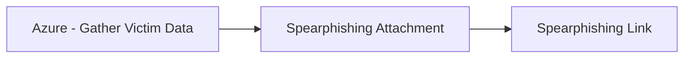

# Azure - Gather Victim Data

## Metadata

- **UUID**: `4e7eae8e-6615-41f2-bfe1-21a04f7a6088`
- **Schema**: `threat::1.0`
- **TLP**: clear

## Description
The "Gather Victim Data" is a reconnaissance threat vector within the 
Azure Threat Research Matrix (ATRM). It involves an adversary accessing a user's 
personal data after compromising their account. This data may include sensitive 
information stored in Microsoft cloud services such as email, OneDrive, Teams, and 
other personal content linked to the user's Azure Active Directory account.

#### Example Attack Scenario  

- An attacker creates a malicious Azure application that requests access permissions 
to victim data like emails, OneDrive files, or Teams messages. 
- The attacker then sends a phishing email to a target user within an organization, 
tricking them to grant consent to this malicious app.
- Once the user grants access, the app obtains delegated permissions to access the 
victim's data across Microsoft 365 services.
- The attacker uses the obtained tokens or permissions to programmatically extract 
emails, files, conversations, and other personal or organizational data.
- The attacker may use this data for further phishing, reconnaissance, or lateral 
movement attacks within the Azure tenant.

#### Attack Goals and Impact  

- **Goals**: Steal sensitive business or personal information, emails, files, and 
communications to gain insights into victims, plan secondary attacks, or conduct espionage.
- Gain privileged information for later stages of attacks (e.g., lateral movement, 
credential theft, privilege escalation).
- Use stolen data for spear phishing campaigns or to impersonate trusted users internally 
or externally.
- Maintain persistence by harvesting tokens and credentials for prolonged access.
- Impact includes data breaches, intellectual property theft, regulatory compliance 
violations, reputational damage, and financial loss.

#### Attack Flow and Methodology

1. **Token Theft**: Using OAuth tokens or API calls, attacker programmatically accesses 
victim data such as emails, OneDrive files, Teams conversations.
2. **Data Collection and Exfiltration**: Captured data is collected, filtered, and 
exfiltrated for further use. This can be automated via scripts or tools like 365-Stealer.
3. **Lateral Movement / Escalation**: Using gathered intelligence, the attacker 
identifies high-value targets, escalates privileges, or moves laterally across the enterprise.
4. **Persistence and Cover-Up**: The adversary maintains presence, possibly by registering 
additional apps or accounts and attempts to remain undetected by throttling activity 
or delaying requests.

## Techniques
- T1589
- T1590
- T1078.004

## Chaining

