# Azure - Gather Victim Data

## Metadata
| Field | Value |
| --- | --- |
| UUID | `4e7eae8e-6615-41f2-bfe1-21a04f7a6088` |
| Schema | `threat::1.0` |
| Version | `2` |
| Created | `2025-08-04` |
| Modified | `2025-09-04` |
| TLP | clear (`TLP:CLEAR`) |
| Organisation | EC DIGIT CSOC (`56b0a0f0-b0bc-47d9-bb46-02f80ae2065a`) |

## References
### Public
- **1**: [https://microsoft.github.io/Azure-Threat-Research-Matrix/Reconnaissance/Reconnaissance/](https://microsoft.github.io/Azure-Threat-Research-Matrix/Reconnaissance/Reconnaissance/)
- **2**: [https://www.alteredsecurity.com/post/initial-access-attack-in-azure-understanding-and-executing-the-illicit-consent-grant-attack-in-202](https://www.alteredsecurity.com/post/initial-access-attack-in-azure-understanding-and-executing-the-illicit-consent-grant-attack-in-202)

## Description
The "Gather Victim Data" is a reconnaissance threat vector within the 
Azure Threat Research Matrix (ATRM). It involves an adversary accessing a user's 
personal data after compromising their account. This data may include sensitive 
information stored in Microsoft cloud services such as email, OneDrive, Teams, and 
other personal content linked to the user's Azure Active Directory account.

#### Example Attack Scenario  

- An attacker creates a malicious Azure application that requests access permissions 
to victim data like emails, OneDrive files, or Teams messages. 
- The attacker then sends a phishing email to a target user within an organization, 
tricking them to grant consent to this malicious app.
- Once the user grants access, the app obtains delegated permissions to access the 
victim's data across Microsoft 365 services.
- The attacker uses the obtained tokens or permissions to programmatically extract 
emails, files, conversations, and other personal or organizational data.
- The attacker may use this data for further phishing, reconnaissance, or lateral 
movement attacks within the Azure tenant.

#### Attack Goals and Impact  

- **Goals**: Steal sensitive business or personal information, emails, files, and 
communications to gain insights into victims, plan secondary attacks, or conduct espionage.
- Gain privileged information for later stages of attacks (e.g., lateral movement, 
credential theft, privilege escalation).
- Use stolen data for spear phishing campaigns or to impersonate trusted users internally 
or externally.
- Maintain persistence by harvesting tokens and credentials for prolonged access.
- Impact includes data breaches, intellectual property theft, regulatory compliance 
violations, reputational damage, and financial loss.

#### Attack Flow and Methodology

1. **Token Theft**: Using OAuth tokens or API calls, attacker programmatically accesses 
victim data such as emails, OneDrive files, Teams conversations.
2. **Data Collection and Exfiltration**: Captured data is collected, filtered, and 
exfiltrated for further use. This can be automated via scripts or tools like 365-Stealer.
3. **Lateral Movement / Escalation**: Using gathered intelligence, the attacker 
identifies high-value targets, escalates privileges, or moves laterally across the enterprise.
4. **Persistence and Cover-Up**: The adversary maintains presence, possibly by registering 
additional apps or accounts and attempts to remain undetected by throttling activity 
or delaying requests.

## Criticality
**High** - A High priority incident is likely to result in a demonstrable impact to public health or safety, national security, economic security, foreign relations, civil liberties, or public confidence.

## Terrain
An adversary successfully compromises a user's Azure Active Directory account credentials 
or session token through phishing, credential theft, or token theft.

## Surface
> **Azure**
> Microsoft Azure cloud platform

> **Azure::Security::Entra ID**
> Microsoft Entra ID in Azure (cloud identity)

> **Microsoft::Microsoft 365**
> Microsoft 365 cloud-based productivity suite (formerly Office 365)

> **AWS::Storage**
> AWS storage services

> **Email**
> Email infrastructure and services

> **Web Servers**
> HTTP servers and reverse proxies

> **Application Layer::HTTP**
> Hypertext Transfer Protocol

> **Entra ID**
> Microsoft Entra ID (formerly Azure Active Directory)

## Threat Assessment
| Dimension | Assessment | Description |
| --- | --- | --- |
| Severity | Significant incident | A cyber attack which has a serious impact on a large organisation or on wider / local government, or which poses a considerable risk to central government or (inter)national essential services. |
| Impact | Data Breach IP Loss Reputational Damages Identity Theft Monetary Loss | Non-public information has been accessed from the outside, and successfully extracted. Particular, key data, information and blueprint conducive to the organization capability to gain and retain a commercial or geopolitical advantage has been accessed, and their content potentially used by competitors or other adversaries. Damages to the organization public view may be achieved by using directly the access gained, or indirectly with data gathered. Acquisition of sufficient information and privileges to profess as a given individual, for the purpose of abusing and deceiving human trust relationships. The vector will directly conduct to loss of value directly impacting the bottom line. |
| Leverage | Spoofing Tampering Information Disclosure Elevation of privilege | Threat action aimed at accessing and use of another user’s credentials, such as username and password. Threat action intending to maliciously change or modify persistent data, such as records in a database, and the alteration of data in transit between two computers over an open network, such as the Internet. Threat action intending to read a file that one was not granted access to, or to read data in transit. Capacity to augment leverage over the target system by upgrading the compromised access rights |
| Viability | Likely | Probable (probably) - 55-80% |
| Kill Chain | Reconnaissance | Researching, identifying and selecting targets using active or passive reconnaissance. |

## Actors
| Actor | ID | Source | Description |
| --- | --- | --- | --- |
| APT32 | `misp::aa29ae56-e54b-47a2-ad16-d3ab0242d5d7` | ('misp',) | Cyber espionage actors, now designated by FireEye as APT32 (OceanLotus Group), are carrying out intrusions into private sector companies across multiple industries and have also targeted foreign governments, dissidents, and journalists. FireEye assesses that APT32 leverages a unique suite of fully-featured malware, in conjunction with commercially-available tools, to conduct targeted operations that are aligned with Vietnamese state interests. |
| FIN13 | `misp::60fa684d-c738-4b77-98fb-3f6605e2bb82` | ('misp',) | Since 2017, Mandiant has been tracking FIN13, an industrious and versatile financially motivated threat actor conducting long-term intrusions in Mexico with an activity timeframe stretching back as early as 2016. Although their operations continue through the present day, in many ways FIN13's intrusions are like a time capsule of traditional financial cybercrime from days past. Instead of today's prevalent smash-and-grab ransomware groups, FIN13 takes their time to gather information to perform fraudulent money transfers. Rather than relying heavily on attack frameworks such as Cobalt Strike, the majority of FIN13 intrusions involve heavy use of custom passive backdoors and tools to lurk in environments for the long haul. |
| [[Enterprise] HEXANE](https://attack.mitre.org/groups/G1001) | `att&ck::G1001` | ('att&ck',) | [HEXANE](https://attack.mitre.org/groups/G1001) is a cyber espionage threat group that has targeted oil & gas, telecommunications, aviation, and internet service provider organizations since at least 2017. Targeted companies have been located in the Middle East and Africa, including Israel, Saudi Arabia, Kuwait, Morocco, and Tunisia. [HEXANE](https://attack.mitre.org/groups/G1001)'s TTPs appear similar to [APT33](https://attack.mitre.org/groups/G0064) and [OilRig](https://attack.mitre.org/groups/G0049) but due to differences in victims and tools it is tracked as a separate entity.(Citation: Dragos Hexane)(Citation: Kaspersky Lyceum October 2021)(Citation: ClearSky Siamesekitten August 2021)(Citation: Accenture Lyceum Targets November 2021) |
| LAPSUS | `misp::d9e5be22-1a04-4956-af6c-37af02330980` | ('misp',) | An actor group conducting large-scale social engineering and extortion campaign against multiple organizations with some seeing evidence of destructive elements. |
| [[Enterprise] Magic Hound](https://attack.mitre.org/groups/G0059) | `att&ck::G0059` | ('att&ck',) | [Magic Hound](https://attack.mitre.org/groups/G0059) is an Iranian-sponsored threat group that conducts long term, resource-intensive cyber espionage operations, likely on behalf of the Islamic Revolutionary Guard Corps. They have targeted European, U.S., and Middle Eastern government and military personnel, academics, journalists, and organizations such as the World Health Organization (WHO), via complex social engineering campaigns since at least 2014.(Citation: FireEye APT35 2018)(Citation: ClearSky Kittens Back 3 August 2020)(Citation: Certfa Charming Kitten January 2021)(Citation: Secureworks COBALT ILLUSION Threat Profile)(Citation: Proofpoint TA453 July2021) |
| Operation Wocao | `misp::c432d032-ce2b-4eb8-ba87-312b2a43fb7a` | ('misp',) | Operation Wocao (我操, “Wǒ cāo”, used as “shit” or “damn”) is the name that Fox-IT uses to describe the hacking activities of a Chinese based hacking group. This report details the profile of a publicly underreported threat actor that Fox-IT has dealt with over the past two years. Fox-IT assesses with high confidence that the actor is a Chinese group and that they are likely working to support the interests of the Chinese government and are tasked with obtaining information for espionage purposes. With medium confidence, Fox-IT assesses that the tools, techniques and procedures are those of the actor referred to as APT20 by industry partners. We have identified victims of this actor in more than 10 countries, in government entities, managed service providers and across a wide variety of industries, including Energy, Health Care and High-Tech. |
| [[Enterprise] Star Blizzard](https://attack.mitre.org/groups/G1033) | `att&ck::G1033` | ('att&ck',) | [Star Blizzard](https://attack.mitre.org/groups/G1033) is a cyber espionage and influence group originating in Russia that has been active since at least 2019. [Star Blizzard](https://attack.mitre.org/groups/G1033) campaigns align closely with Russian state interests and have included persistent phishing and credential theft against academic, defense, government, NGO, and think tank organizations in NATO countries, particularly the US and the UK.(Citation: Microsoft Star Blizzard August 2022)(Citation: CISA Star Blizzard Advisory December 2023)(Citation: StarBlizzard)(Citation: Google TAG COLDRIVER January 2024) |
| Volt Typhoon | `misp::f02679fa-5e85-4050-8eb5-c2677d93306f` | ('misp',) | [Microsoft] Volt Typhoon, a state-sponsored actor based in China that typically focuses on espionage and information gathering. Microsoft assesses with moderate confidence that this Volt Typhoon campaign is pursuing development of capabilities that could disrupt critical communications infrastructure between the United States and Asia region during future crises.  [Secureworks] BRONZE SILHOUETTE likely operates on behalf the PRC. The targeting of U.S. government and defense organizations for intelligence gain aligns with PRC requirements, and the tradecraft observed in these engagements overlap with other state-sponsored Chinese threat groups. |

## ATT&CK Techniques
| Technique | Name | Description |
| --- | --- | --- |
| `T1589` | [Gather Victim Identity Information](https://attack.mitre.org/techniques/T1589) | Adversaries may gather information about the victim's identity that can be used during targeting. Information about identities may include a variety of details, including personal data (ex: employee names, email addresses, security question responses, etc.) as well as sensitive details such as credentials or multi-factor authentication (MFA) configurations.  Adversaries may gather this information in various ways, such as direct elicitation via [Phishing for Information](https://attack.mitre.org/techniques/T1598). Information about users could also be enumerated via other active means (i.e. [Active Scanning](https://attack.mitre.org/techniques/T1595)) such as probing and analyzing responses from authentication services that may reveal valid usernames in a system or permitted MFA /methods associated with those usernames.(Citation: GrimBlog UsernameEnum)(Citation: Obsidian SSPR Abuse 2023) Information about victims may also be exposed to adversaries via online or other accessible data sets (ex: [Social Media](https://attack.mitre.org/techniques/T1593/001) or [Search Victim-Owned Websites](https://attack.mitre.org/techniques/T1594)).(Citation: OPM Leak)(Citation: Register Deloitte)(Citation: Register Uber)(Citation: Detectify Slack Tokens)(Citation: Forbes GitHub Creds)(Citation: GitHub truffleHog)(Citation: GitHub Gitrob)(Citation: CNET Leaks)  Gathering this information may reveal opportunities for other forms of reconnaissance (ex: [Search Open Websites/Domains](https://attack.mitre.org/techniques/T1593) or [Phishing for Information](https://attack.mitre.org/techniques/T1598)), establishing operational resources (ex: [Compromise Accounts](https://attack.mitre.org/techniques/T1586)), and/or initial access (ex: [Phishing](https://attack.mitre.org/techniques/T1566) or [Valid Accounts](https://attack.mitre.org/techniques/T1078)). |
| `T1590` | [Gather Victim Network Information](https://attack.mitre.org/techniques/T1590) | Adversaries may gather information about the victim's networks that can be used during targeting. Information about networks may include a variety of details, including administrative data (ex: IP ranges, domain names, etc.) as well as specifics regarding its topology and operations.  Adversaries may gather this information in various ways, such as direct collection actions via [Active Scanning](https://attack.mitre.org/techniques/T1595) or [Phishing for Information](https://attack.mitre.org/techniques/T1598). Information about networks may also be exposed to adversaries via online or other accessible data sets (ex: [Search Open Technical Databases](https://attack.mitre.org/techniques/T1596)).(Citation: WHOIS)(Citation: DNS Dumpster)(Citation: Circl Passive DNS) Gathering this information may reveal opportunities for other forms of reconnaissance (ex: [Active Scanning](https://attack.mitre.org/techniques/T1595) or [Search Open Websites/Domains](https://attack.mitre.org/techniques/T1593)), establishing operational resources (ex: [Acquire Infrastructure](https://attack.mitre.org/techniques/T1583) or [Compromise Infrastructure](https://attack.mitre.org/techniques/T1584)), and/or initial access (ex: [Trusted Relationship](https://attack.mitre.org/techniques/T1199)). |
| `T1078.004` | [Valid Accounts: Cloud Accounts](https://attack.mitre.org/techniques/T1078/004) | Valid accounts in cloud environments may allow adversaries to perform actions to achieve Initial Access, Persistence, Privilege Escalation, or Defense Evasion. Cloud accounts are those created and configured by an organization for use by users, remote support, services, or for administration of resources within a cloud service provider or SaaS application. Cloud Accounts can exist solely in the cloud; alternatively, they may be hybrid-joined between on-premises systems and the cloud through syncing or federation with other identity sources such as Windows Active Directory.(Citation: AWS Identity Federation)(Citation: Google Federating GC)(Citation: Microsoft Deploying AD Federation)  Service or user accounts may be targeted by adversaries through [Brute Force](https://attack.mitre.org/techniques/T1110), [Phishing](https://attack.mitre.org/techniques/T1566), or various other means to gain access to the environment. Federated or synced accounts may be a pathway for the adversary to affect both on-premises systems and cloud environments - for example, by leveraging shared credentials to log onto [Remote Services](https://attack.mitre.org/techniques/T1021). High privileged cloud accounts, whether federated, synced, or cloud-only, may also allow pivoting to on-premises environments by leveraging SaaS-based [Software Deployment Tools](https://attack.mitre.org/techniques/T1072) to run commands on hybrid-joined devices.  An adversary may create long lasting [Additional Cloud Credentials](https://attack.mitre.org/techniques/T1098/001) on a compromised cloud account to maintain persistence in the environment. Such credentials may also be used to bypass security controls such as multi-factor authentication.   Cloud accounts may also be able to assume [Temporary Elevated Cloud Access](https://attack.mitre.org/techniques/T1548/005) or other privileges through various means within the environment. Misconfigurations in role assignments or role assumption policies may allow an adversary to use these mechanisms to leverage permissions outside the intended scope of the account. Such over privileged accounts may be used to harvest sensitive data from online storage accounts and databases through [Cloud API](https://attack.mitre.org/techniques/T1059/009) or other methods. For example, in Azure environments, adversaries may target Azure Managed Identities, which allow associated Azure resources to request access tokens. By compromising a resource with an attached Managed Identity, such as an Azure VM, adversaries may be able to [Steal Application Access Token](https://attack.mitre.org/techniques/T1528)s to move laterally across the cloud environment.(Citation: SpecterOps Managed Identity 2022) |

## Chaining

```mermaid
flowchart LR
subgraph "Reconnaissance"
4e7eae8e_6615_41f2_bfe1_21a04f7a6088{{"Azure - Gather Victim<br>Data"}}
53063205_4404_4e6d_a2f5_d566c6085d96{{"Data collection using<br>SharpHound, SoapHound,<br>Bloodhound and<br>Azurehound"}}
2900d389_3098_49d3_8166_5b2612d03576{{"Azure - Gather User<br>Information"}}
394dde97_4a8c_4b6a_8f8b_c6bf18a7a87f{{"Azure - Port Mapping"}}
b1593e0b_1b3b_462d_9ab6_21d1c136469d{{"Azure - Gather Resource<br>Data"}}
fe6827f2_efb4_43b3_9ca3_b7d417111b32{{"Azure - Gather<br>Application Information"}}
81338b90_f80c_40cc_8a57_ba97cdf86948{{"Azure - Key Vault<br>reconnaissance"}}
41f57a57_1ed6_407e_bb70_a0f6ab52af10{{"Azure - Storage Blobs<br>Reconnaissance"}}
2d7ed070_e5c5_4796_b150_ea1d02ed1785{{"Azure - Storage<br>container reconnaissance"}}
140907eb_c9fb_4330_9d71_656422388b2b{{"Azure - Gather Role<br>Information"}}
end
subgraph "Persistence"
31e7f292_8370_4255_861d_edd68ed8b7b0{{"Azure - External Entity<br>Access"}}
5d43ef75_4637_4a75_b1ed_6716052cff0e{{"Azure - App registration<br>persistence"}}
bcf3bb96_ed97_4853_98ab_937c2d214f4e{{"Azure - Key Vault<br>persistence"}}
50c7e353_ac1c_48a7_8c98_2515b45f31f4{{"Persistence through<br>automation runbooks in<br>Azure"}}
23f6a192_a25d_48b8_a235_7bb55e483682{{"Persistence with Azure<br>Automanage Machine<br>Configuration"}}
end
subgraph "Privilege Escalation"
10a89280_d42e_446d_9f8d_840b1218f532{{"Azure - Elevated Access<br>Toggle"}}
bb2501d5_99c7_44a6_ac5a_9510102d6611{{"Azure - Principal<br>Impersonation"}}
c7e260d8_d391_41eb_be1a_7f276c99b383{{"Azure app registration -<br>privilege escalation"}}
c698fc79_3ed6_44a7_a9d7_bc447600e4c3{{"Azure AD Connect abuse"}}
f1dc4341_eb45_4d07_8075_b1a6b227cc76{{"Cloud IAM role<br>assumption"}}
end
subgraph "Credential Access"
2743bf18_3b86_4721_bf3e_153dcda0b149{{"Azure - Valid<br>Credentials"}}
c4edae81_5790_4b9c_88b7_d11d6985b1a4{{"Azure - Service<br>Principal Secret Reveal"}}
37381f28_ad9f_40c3_80f8_d8a82d6ce9a3{{"Resource Secret Reveal<br>in Azure"}}
6a7a493a_511a_4c9d_aa9c_4427c832a322{{"SIM-card swapping"}}
4a807ac4_f764_41b1_ae6f_94239041d349{{"MFA Bypass Techniques"}}
66aafb61_9a46_4287_8b40_4785b42b77a3{{"Adversary in the Middle<br>phishing sites to bypass<br>MFA"}}
6e988fa7_69c9_4aef_897c_a34fa5066dac{{"Ghost logins attempts"}}
end
subgraph "Command & Control"
2fd1cddb_c66d_4a99_9779_31e32b67495e{{"Azure - Lateral movement<br>abusing Cross-Tenant<br>Synchronization"}}
end
subgraph "Lateral Movement"
9bb31c65_8abd_48fc_afe3_8aca76109737{{"Azure - Modify<br>federation trust to<br>accept externally signed<br>tokens"}}
a8c7b250_a2d4_4a0d_82f8_23dc99c77d7b{{"Addition of credentials<br>to OAuth applications<br>and service principals"}}
ca2751c7_8641_4fb0_a90b_30c5987015dc{{"Externally controlled<br>Azure credentials added<br>to an Enterprise app or<br>its SPN"}}
end
subgraph "Impact"
4805a7a1_807c_4869_aefe_3047823f64b5{{"Azure - Soft-Delete<br>Recovery"}}
2c6058fb_21db_47fe_99bc_a07cb70c53e4{{"Azure - Backup Delete"}}
end
subgraph "Delivery"
1a68b5eb_0112_424d_a21f_88dda0b6b8df{{"Spearphishing Link"}}
dd5d942c_bac4_4000_b9a6_ca4fef6cfb84{{"Spearphishing Attachment"}}
58b98d75_fc63_4662_8908_a2a7f4200902{{"Spearphishing with an<br>attachment extension<br>.rdp"}}
06c60af1_5fa8_493c_bf9b_6b2e215819f1{{"Social engineering<br>attack using Microsoft<br>Teams"}}
end
subgraph "Social Engineering"
0cdaee96_8595_4f3f_ba07_758b8be9d359{{"Social engineering<br>without attachment or<br>URL"}}
end
subgraph "Execution"
60c5b065_7d06_4697_850f_c2f80765f10b{{"Changes to Azure<br>infrastructure deployed<br>through Azure CLI"}}
61ddc240_e5a6_4ca8_ae77_6b471b498913{{"Code execution via<br>custom script extensions<br>in Azure"}}
end
subgraph "Collection"
78d5e363_14db_40c0_a1c4_4ba02a3e60d4{{"Azure - Hijack Entra ID<br>Applications"}}
f18be76e_f2b3_410a_80c5_d67e7b8e7b03{{"Perform Microsoft Entra<br>ID connectors MITM<br>attack"}}
end
20bd3620_b13b_4895_b291_b1a26bd9aef3{{"MS 365 admin compromised<br>account"}}
53f4e2f0_7d11_4629_bb26_905993a589db{{"Azure - Storage account<br>reconnaissance"}}
31e7f292_8370_4255_861d_edd68ed8b7b0 -->|enabled| 4e7eae8e_6615_41f2_bfe1_21a04f7a6088
31e7f292_8370_4255_861d_edd68ed8b7b0 -->|enabled| 53063205_4404_4e6d_a2f5_d566c6085d96
31e7f292_8370_4255_861d_edd68ed8b7b0 -->|enabled| 10a89280_d42e_446d_9f8d_840b1218f532
31e7f292_8370_4255_861d_edd68ed8b7b0 -->|enabled| 2900d389_3098_49d3_8166_5b2612d03576
31e7f292_8370_4255_861d_edd68ed8b7b0 -->|implemented| 4e7eae8e_6615_41f2_bfe1_21a04f7a6088
31e7f292_8370_4255_861d_edd68ed8b7b0 -->|implemented| 2743bf18_3b86_4721_bf3e_153dcda0b149
31e7f292_8370_4255_861d_edd68ed8b7b0 <-->|synergize| 2fd1cddb_c66d_4a99_9779_31e32b67495e
31e7f292_8370_4255_861d_edd68ed8b7b0 <-->|synergize| 9bb31c65_8abd_48fc_afe3_8aca76109737
394dde97_4a8c_4b6a_8f8b_c6bf18a7a87f -->|enabled| 4e7eae8e_6615_41f2_bfe1_21a04f7a6088
394dde97_4a8c_4b6a_8f8b_c6bf18a7a87f -->|enabled| b1593e0b_1b3b_462d_9ab6_21d1c136469d
394dde97_4a8c_4b6a_8f8b_c6bf18a7a87f -->|enabled| 53063205_4404_4e6d_a2f5_d566c6085d96
c4edae81_5790_4b9c_88b7_d11d6985b1a4 -->|enabled| 4e7eae8e_6615_41f2_bfe1_21a04f7a6088
c4edae81_5790_4b9c_88b7_d11d6985b1a4 -->|enabled| 53063205_4404_4e6d_a2f5_d566c6085d96
c4edae81_5790_4b9c_88b7_d11d6985b1a4 -->|enabled| fe6827f2_efb4_43b3_9ca3_b7d417111b32
c4edae81_5790_4b9c_88b7_d11d6985b1a4 -->|enabled| bb2501d5_99c7_44a6_ac5a_9510102d6611
c4edae81_5790_4b9c_88b7_d11d6985b1a4 -->|enabling| 5d43ef75_4637_4a75_b1ed_6716052cff0e
c4edae81_5790_4b9c_88b7_d11d6985b1a4 -->|enabling| c7e260d8_d391_41eb_be1a_7f276c99b383
c4edae81_5790_4b9c_88b7_d11d6985b1a4 -->|implemented| 2743bf18_3b86_4721_bf3e_153dcda0b149
4805a7a1_807c_4869_aefe_3047823f64b5 -->|enabled| 4e7eae8e_6615_41f2_bfe1_21a04f7a6088
4805a7a1_807c_4869_aefe_3047823f64b5 -->|enabled| 53063205_4404_4e6d_a2f5_d566c6085d96
4805a7a1_807c_4869_aefe_3047823f64b5 -->|enabled| b1593e0b_1b3b_462d_9ab6_21d1c136469d
4805a7a1_807c_4869_aefe_3047823f64b5 -->|enabled| 81338b90_f80c_40cc_8a57_ba97cdf86948
4805a7a1_807c_4869_aefe_3047823f64b5 -->|enabled| 41f57a57_1ed6_407e_bb70_a0f6ab52af10
4805a7a1_807c_4869_aefe_3047823f64b5 -->|enabled| 2d7ed070_e5c5_4796_b150_ea1d02ed1785
4805a7a1_807c_4869_aefe_3047823f64b5 -->|implemented| 2743bf18_3b86_4721_bf3e_153dcda0b149
4805a7a1_807c_4869_aefe_3047823f64b5 <-->|synergize| 2c6058fb_21db_47fe_99bc_a07cb70c53e4
4805a7a1_807c_4869_aefe_3047823f64b5 -->|enabling| 37381f28_ad9f_40c3_80f8_d8a82d6ce9a3
53063205_4404_4e6d_a2f5_d566c6085d96 -->|succeeds| 1a68b5eb_0112_424d_a21f_88dda0b6b8df
53063205_4404_4e6d_a2f5_d566c6085d96 -->|succeeds| dd5d942c_bac4_4000_b9a6_ca4fef6cfb84
10a89280_d42e_446d_9f8d_840b1218f532 -->|succeeds| 2900d389_3098_49d3_8166_5b2612d03576
10a89280_d42e_446d_9f8d_840b1218f532 -->|succeeds| 2743bf18_3b86_4721_bf3e_153dcda0b149
10a89280_d42e_446d_9f8d_840b1218f532 -->|preceeds| 5d43ef75_4637_4a75_b1ed_6716052cff0e
10a89280_d42e_446d_9f8d_840b1218f532 -->|preceeds| bcf3bb96_ed97_4853_98ab_937c2d214f4e
2900d389_3098_49d3_8166_5b2612d03576 -->|succeeds| 58b98d75_fc63_4662_8908_a2a7f4200902
2900d389_3098_49d3_8166_5b2612d03576 -->|succeeds| 0cdaee96_8595_4f3f_ba07_758b8be9d359
2900d389_3098_49d3_8166_5b2612d03576 -->|succeeds| 06c60af1_5fa8_493c_bf9b_6b2e215819f1
58b98d75_fc63_4662_8908_a2a7f4200902 -->|implements| dd5d942c_bac4_4000_b9a6_ca4fef6cfb84
0cdaee96_8595_4f3f_ba07_758b8be9d359 -->|preceeds| 1a68b5eb_0112_424d_a21f_88dda0b6b8df
0cdaee96_8595_4f3f_ba07_758b8be9d359 -->|preceeds| dd5d942c_bac4_4000_b9a6_ca4fef6cfb84
0cdaee96_8595_4f3f_ba07_758b8be9d359 -->|preceeds| 6a7a493a_511a_4c9d_aa9c_4427c832a322
6a7a493a_511a_4c9d_aa9c_4427c832a322 -->|implements| 4a807ac4_f764_41b1_ae6f_94239041d349
2743bf18_3b86_4721_bf3e_153dcda0b149 -->|preceeds| a8c7b250_a2d4_4a0d_82f8_23dc99c77d7b
2743bf18_3b86_4721_bf3e_153dcda0b149 -->|preceeds| 66aafb61_9a46_4287_8b40_4785b42b77a3
2743bf18_3b86_4721_bf3e_153dcda0b149 -->|preceeds| c698fc79_3ed6_44a7_a9d7_bc447600e4c3
2743bf18_3b86_4721_bf3e_153dcda0b149 -->|preceeds| 5d43ef75_4637_4a75_b1ed_6716052cff0e
2743bf18_3b86_4721_bf3e_153dcda0b149 -->|preceeds| 60c5b065_7d06_4697_850f_c2f80765f10b
2743bf18_3b86_4721_bf3e_153dcda0b149 -->|preceeds| 6e988fa7_69c9_4aef_897c_a34fa5066dac
2743bf18_3b86_4721_bf3e_153dcda0b149 -->|preceeds| 78d5e363_14db_40c0_a1c4_4ba02a3e60d4
2743bf18_3b86_4721_bf3e_153dcda0b149 -->|preceeds| 2fd1cddb_c66d_4a99_9779_31e32b67495e
2743bf18_3b86_4721_bf3e_153dcda0b149 -->|preceeds| 20bd3620_b13b_4895_b291_b1a26bd9aef3
2743bf18_3b86_4721_bf3e_153dcda0b149 -->|preceeds| f18be76e_f2b3_410a_80c5_d67e7b8e7b03
2743bf18_3b86_4721_bf3e_153dcda0b149 -->|preceeds| 50c7e353_ac1c_48a7_8c98_2515b45f31f4
2743bf18_3b86_4721_bf3e_153dcda0b149 -->|preceeds| 23f6a192_a25d_48b8_a235_7bb55e483682
66aafb61_9a46_4287_8b40_4785b42b77a3 -->|implements| 4a807ac4_f764_41b1_ae6f_94239041d349
c698fc79_3ed6_44a7_a9d7_bc447600e4c3 -->|enabled| 2743bf18_3b86_4721_bf3e_153dcda0b149
5d43ef75_4637_4a75_b1ed_6716052cff0e -->|succeeds| c7e260d8_d391_41eb_be1a_7f276c99b383
c7e260d8_d391_41eb_be1a_7f276c99b383 -->|enabled| bb2501d5_99c7_44a6_ac5a_9510102d6611
c7e260d8_d391_41eb_be1a_7f276c99b383 -->|enabled| 2743bf18_3b86_4721_bf3e_153dcda0b149
c7e260d8_d391_41eb_be1a_7f276c99b383 -->|enabled| fe6827f2_efb4_43b3_9ca3_b7d417111b32
bb2501d5_99c7_44a6_ac5a_9510102d6611 -->|preceeds| 2743bf18_3b86_4721_bf3e_153dcda0b149
bb2501d5_99c7_44a6_ac5a_9510102d6611 -->|preceeds| fe6827f2_efb4_43b3_9ca3_b7d417111b32
6e988fa7_69c9_4aef_897c_a34fa5066dac -->|implements| 4a807ac4_f764_41b1_ae6f_94239041d349
fe6827f2_efb4_43b3_9ca3_b7d417111b32 -->|enabled| 140907eb_c9fb_4330_9d71_656422388b2b
fe6827f2_efb4_43b3_9ca3_b7d417111b32 -->|enabled| 53063205_4404_4e6d_a2f5_d566c6085d96
fe6827f2_efb4_43b3_9ca3_b7d417111b32 -->|enabling| ca2751c7_8641_4fb0_a90b_30c5987015dc
fe6827f2_efb4_43b3_9ca3_b7d417111b32 -->|enabling| c7e260d8_d391_41eb_be1a_7f276c99b383
140907eb_c9fb_4330_9d71_656422388b2b -->|preceeds| a8c7b250_a2d4_4a0d_82f8_23dc99c77d7b
140907eb_c9fb_4330_9d71_656422388b2b -->|preceeds| 61ddc240_e5a6_4ca8_ae77_6b471b498913
140907eb_c9fb_4330_9d71_656422388b2b -->|preceeds| f1dc4341_eb45_4d07_8075_b1a6b227cc76
61ddc240_e5a6_4ca8_ae77_6b471b498913 -->|enabled| 140907eb_c9fb_4330_9d71_656422388b2b
61ddc240_e5a6_4ca8_ae77_6b471b498913 -->|enabled| 2743bf18_3b86_4721_bf3e_153dcda0b149
b1593e0b_1b3b_462d_9ab6_21d1c136469d -->|succeeds| 66aafb61_9a46_4287_8b40_4785b42b77a3
b1593e0b_1b3b_462d_9ab6_21d1c136469d -->|succeeds| 9bb31c65_8abd_48fc_afe3_8aca76109737
81338b90_f80c_40cc_8a57_ba97cdf86948 -->|implements| bcf3bb96_ed97_4853_98ab_937c2d214f4e
81338b90_f80c_40cc_8a57_ba97cdf86948 -->|enabled| 2743bf18_3b86_4721_bf3e_153dcda0b149
81338b90_f80c_40cc_8a57_ba97cdf86948 -->|enabled| b1593e0b_1b3b_462d_9ab6_21d1c136469d
41f57a57_1ed6_407e_bb70_a0f6ab52af10 -->|enabled| 53f4e2f0_7d11_4629_bb26_905993a589db
41f57a57_1ed6_407e_bb70_a0f6ab52af10 -->|enabled| 2743bf18_3b86_4721_bf3e_153dcda0b149
41f57a57_1ed6_407e_bb70_a0f6ab52af10 -->|enabled| b1593e0b_1b3b_462d_9ab6_21d1c136469d
41f57a57_1ed6_407e_bb70_a0f6ab52af10 -->|enabled| 53063205_4404_4e6d_a2f5_d566c6085d96
53f4e2f0_7d11_4629_bb26_905993a589db -->|enabled| 41f57a57_1ed6_407e_bb70_a0f6ab52af10
53f4e2f0_7d11_4629_bb26_905993a589db -->|enabled| 2743bf18_3b86_4721_bf3e_153dcda0b149
53f4e2f0_7d11_4629_bb26_905993a589db -->|enabled| b1593e0b_1b3b_462d_9ab6_21d1c136469d
53f4e2f0_7d11_4629_bb26_905993a589db -->|enabled| 53063205_4404_4e6d_a2f5_d566c6085d96
2d7ed070_e5c5_4796_b150_ea1d02ed1785 -->|enabled| 53f4e2f0_7d11_4629_bb26_905993a589db
2d7ed070_e5c5_4796_b150_ea1d02ed1785 -->|enabled| 2743bf18_3b86_4721_bf3e_153dcda0b149
2d7ed070_e5c5_4796_b150_ea1d02ed1785 -->|enabled| b1593e0b_1b3b_462d_9ab6_21d1c136469d
2d7ed070_e5c5_4796_b150_ea1d02ed1785 -->|enabled| 53063205_4404_4e6d_a2f5_d566c6085d96
2c6058fb_21db_47fe_99bc_a07cb70c53e4 -->|enabled| b1593e0b_1b3b_462d_9ab6_21d1c136469d
2c6058fb_21db_47fe_99bc_a07cb70c53e4 -->|enabled| 140907eb_c9fb_4330_9d71_656422388b2b
2c6058fb_21db_47fe_99bc_a07cb70c53e4 -->|enabled| 2900d389_3098_49d3_8166_5b2612d03576
2c6058fb_21db_47fe_99bc_a07cb70c53e4 -->|enabled| 10a89280_d42e_446d_9f8d_840b1218f532
37381f28_ad9f_40c3_80f8_d8a82d6ce9a3 -->|implemented| b1593e0b_1b3b_462d_9ab6_21d1c136469d
37381f28_ad9f_40c3_80f8_d8a82d6ce9a3 -->|implemented| 53f4e2f0_7d11_4629_bb26_905993a589db
37381f28_ad9f_40c3_80f8_d8a82d6ce9a3 -->|implemented| 81338b90_f80c_40cc_8a57_ba97cdf86948
37381f28_ad9f_40c3_80f8_d8a82d6ce9a3 -->|enabled| 2743bf18_3b86_4721_bf3e_153dcda0b149
37381f28_ad9f_40c3_80f8_d8a82d6ce9a3 <-->|synergize| bcf3bb96_ed97_4853_98ab_937c2d214f4e
4e7eae8e_6615_41f2_bfe1_21a04f7a6088 -->|preceeds| dd5d942c_bac4_4000_b9a6_ca4fef6cfb84
4e7eae8e_6615_41f2_bfe1_21a04f7a6088 -->|preceeds| 1a68b5eb_0112_424d_a21f_88dda0b6b8df
```

### Chaining details
#### preceeds -> [Spearphishing Attachment](spearphishing-attachment.md) (`dd5d942c-bac4-4000-b9a6-ca4fef6cfb84`) (`sequence::preceeds`)
An adversary may access a user's personal data if their account is compromised.
This includes data such as email, OneDrive, Teams, etc.

- **Target UUID**: `dd5d942c-bac4-4000-b9a6-ca4fef6cfb84`
#### preceeds -> [Spearphishing Link](spearphishing-link.md) (`1a68b5eb-0112-424d-a21f-88dda0b6b8df`) (`sequence::preceeds`)
An adversary may access a user's personal data if their account is compromised.
This includes data such as email, OneDrive, Teams, etc.

- **Target UUID**: `1a68b5eb-0112-424d-a21f-88dda0b6b8df`
