# Azure - Key Vault persistence

## Metadata
| Field | Value |
| --- | --- |
| UUID | `bcf3bb96-ed97-4853-98ab-937c2d214f4e` |
| Schema | `threat::1.0` |
| Version | `2` |
| Created | `2025-06-12` |
| Modified | `2025-09-04` |
| TLP | clear (`TLP:CLEAR`) |
| Organisation | EC DIGIT CSOC (`56b0a0f0-b0bc-47d9-bb46-02f80ae2065a`) |

## References
### Public
- **1**: [https://securitylabs.datadoghq.com/articles/escalating-privileges-to-read-secrets-with-azure-key-vault-access-policies/](https://securitylabs.datadoghq.com/articles/escalating-privileges-to-read-secrets-with-azure-key-vault-access-policies/)
- **2**: [https://nhimg.org/secrets-exposure-via-azure-key-vault-role](https://nhimg.org/secrets-exposure-via-azure-key-vault-role)
- **3**: [https://learn.microsoft.com/en-us/azure/key-vault/general/overview](https://learn.microsoft.com/en-us/azure/key-vault/general/overview)

## Description
Key Vault persistence refers to techniques attackers use to maintain ongoing, unauthorized 
access to Azure Key Vault and its contents—such as secrets, keys, and certificates—after 
initial compromise or detection. This persistence is typically achieved by modifying 
Key Vault access policies to grant permissions to additional malicious accounts 
or identities.

## How persistence is achieved

- **Access policy modification:**  
  - Attackers with sufficient permissions (such as `Microsoft.KeyVault/vaults/write` 
  or `Microsoft.KeyVault/vaults/accessPolicies/write`) can add their own user account 
  or a service principal to the Key Vault's access policy.
  - This allows the attacker to maintain access even if their original account is 
  disabled or monitored.
- **Privilege escalation:**  
  - Misconfigured roles, such as the "Key Vault Contributor" role, can be exploited 
  to grant data access rights, despite the role's intended purpose being limited 
  to management of the Key Vault resource itself.
  - This is possible because the role includes permissions to modify access policies, 
  enabling self-granting of data plane access.

## Attack scenarios

- **Initial access:**  
  - An attacker gains access to an account with Key Vault management permissions, 
  often via phishing or credential theft.
- **Privilege Escalation:**  
  - The attacker uses their permissions to modify Key Vault access policies, granting 
  themselves (or a controlled account) permissions to read, list, or decrypt secrets, 
  keys, and certificates.
- **Persistence:**  
  - The attacker adds additional malicious accounts or service principals to the 
  access policy, ensuring continued access even if their original account is blocked.
- **Data exfiltration and abuse:**  
  - With persistent access, the attacker can periodically extract secrets, keys, 
  or certificates, and use these to compromise other cloud workloads, disrupt operations, 
  or abuse services.

## Real-world risks

- **Data exposure:**  
  - Unauthorized access to secrets (e.g., API keys, connection strings, tokens) 
  can lead to broader system compromise.
- **Compromised credentials:**  
  - Stolen secrets can be used to access other Azure resources or external systems.
- **Stealthy Persistence:**  
  - Attackers can maintain long-term access, making detection and recovery difficult.
- **Service disruption and abuse:**  
  - Attackers may alter configurations, disrupt services, or deploy unauthorized 
  resources using stolen credentials.

## Criticality
**High** - A High priority incident is likely to result in a demonstrable impact to public health or safety, national security, economic security, foreign relations, civil liberties, or public confidence.

## Terrain
Adversaries must first gain access to an Azure environment, typically through compromised 
user accounts, service principals, or managed identities.

## Surface
> **Azure::Security::Entra ID**
> Microsoft Entra ID in Azure (cloud identity)

> **AWS::Storage**
> AWS storage services

> **Azure::Security::Key Vault**
> Azure Key Vault secrets and key management

> **Entra ID**
> Microsoft Entra ID (formerly Azure Active Directory)

> **Web Servers**
> HTTP servers and reverse proxies

> **Application Layer::HTTP**
> Hypertext Transfer Protocol

> **Azure**
> Microsoft Azure cloud platform

> **Serverless**
> Cloud-agnostic serverless compute (when not provider-specific)

> **Azure::Compute::Virtual Machines**
> Azure Virtual Machines

> **AWS::Compute::EC2**
> Amazon Elastic Compute Cloud (virtual servers)

## Threat Assessment
| Dimension | Assessment | Description |
| --- | --- | --- |
| Severity | Significant incident | A cyber attack which has a serious impact on a large organisation or on wider / local government, or which poses a considerable risk to central government or (inter)national essential services. |
| Impact | Data Breach IP Loss Reputational Damages Identity Theft Monetary Loss Lose Capabilities Business disruption | Non-public information has been accessed from the outside, and successfully extracted. Particular, key data, information and blueprint conducive to the organization capability to gain and retain a commercial or geopolitical advantage has been accessed, and their content potentially used by competitors or other adversaries. Damages to the organization public view may be achieved by using directly the access gained, or indirectly with data gathered. Acquisition of sufficient information and privileges to profess as a given individual, for the purpose of abusing and deceiving human trust relationships. The vector will directly conduct to loss of value directly impacting the bottom line. Vector execution will remove key functions to the organization, which will not be easily circumvented. Most day-to-day is heavily impaired, but processes can reorganize at a loss. Business disruption |
| Leverage | Spoofing Tampering Elevation of privilege Information Disclosure Modify configuration Modify privileges Modify data | Threat action aimed at accessing and use of another user’s credentials, such as username and password. Threat action intending to maliciously change or modify persistent data, such as records in a database, and the alteration of data in transit between two computers over an open network, such as the Internet. Capacity to augment leverage over the target system by upgrading the compromised access rights Threat action intending to read a file that one was not granted access to, or to read data in transit. Modify configuration or services Modify privileges or permissions Modify stored data or content |
| Viability | Likely | Probable (probably) - 55-80% |
| Kill Chain | Persistence | Any access, action or change to a system that gives an attacker persistent presence on the system. |

## ATT&CK Techniques
| Technique | Name | Description |
| --- | --- | --- |
| `T1098.001` | [Account Manipulation: Additional Cloud Credentials](https://attack.mitre.org/techniques/T1098/001) | Adversaries may add adversary-controlled credentials to a cloud account to maintain persistent access to victim accounts and instances within the environment.  For example, adversaries may add credentials for Service Principals and Applications in addition to existing legitimate credentials in Azure / Entra ID.(Citation: Microsoft SolarWinds Customer Guidance)(Citation: Blue Cloud of Death)(Citation: Blue Cloud of Death Video) These credentials include both x509 keys and passwords.(Citation: Microsoft SolarWinds Customer Guidance) With sufficient permissions, there are a variety of ways to add credentials including the Azure Portal, Azure command line interface, and Azure or Az PowerShell modules.(Citation: Demystifying Azure AD Service Principals)  In infrastructure-as-a-service (IaaS) environments, after gaining access through [Cloud Accounts](https://attack.mitre.org/techniques/T1078/004), adversaries may generate or import their own SSH keys using either the <code>CreateKeyPair</code> or <code>ImportKeyPair</code> API in AWS or the <code>gcloud compute os-login ssh-keys add</code> command in GCP.(Citation: GCP SSH Key Add) This allows persistent access to instances within the cloud environment without further usage of the compromised cloud accounts.(Citation: Expel IO Evil in AWS)(Citation: Expel Behind the Scenes)  Adversaries may also use the <code>CreateAccessKey</code> API in AWS or the <code>gcloud iam service-accounts keys create</code> command in GCP to add access keys to an account. Alternatively, they may use the <code>CreateLoginProfile</code> API in AWS to add a password that can be used to log into the AWS Management Console for [Cloud Service Dashboard](https://attack.mitre.org/techniques/T1538).(Citation: Permiso Scattered Spider 2023)(Citation: Lacework AI Resource Hijacking 2024) If the target account has different permissions from the requesting account, the adversary may also be able to escalate their privileges in the environment (i.e. [Cloud Accounts](https://attack.mitre.org/techniques/T1078/004)).(Citation: Rhino Security Labs AWS Privilege Escalation)(Citation: Sysdig ScarletEel 2.0) For example, in Entra ID environments, an adversary with the Application Administrator role can add a new set of credentials to their application's service principal. In doing so the adversary would be able to access the service principal’s roles and permissions, which may be different from those of the Application Administrator.(Citation: SpecterOps Azure Privilege Escalation)   In AWS environments, adversaries with the appropriate permissions may also use the `sts:GetFederationToken` API call to create a temporary set of credentials to [Forge Web Credentials](https://attack.mitre.org/techniques/T1606) tied to the permissions of the original user account. These temporary credentials may remain valid for the duration of their lifetime even if the original account’s API credentials are deactivated. (Citation: Crowdstrike AWS User Federation Persistence)  In Entra ID environments with the app password feature enabled, adversaries may be able to add an app password to a user account.(Citation: Mandiant APT42 Operations 2024) As app passwords are intended to be used with legacy devices that do not support multi-factor authentication (MFA), adding an app password can allow an adversary to bypass MFA requirements. Additionally, app passwords may remain valid even if the user’s primary password is reset.(Citation: Microsoft Entra ID App Passwords) |
| `T1548` | [Abuse Elevation Control Mechanism](https://attack.mitre.org/techniques/T1548) | Adversaries may circumvent mechanisms designed to control elevate privileges to gain higher-level permissions. Most modern systems contain native elevation control mechanisms that are intended to limit privileges that a user can perform on a machine. Authorization has to be granted to specific users in order to perform tasks that can be considered of higher risk.(Citation: TechNet How UAC Works)(Citation: sudo man page 2018) An adversary can perform several methods to take advantage of built-in control mechanisms in order to escalate privileges on a system.(Citation: OSX Keydnap malware)(Citation: Fortinet Fareit) |
| `T1555.006` | [Credentials from Password Stores: Cloud Secrets Management Stores](https://attack.mitre.org/techniques/T1555/006) | Adversaries may acquire credentials from cloud-native secret management solutions such as AWS Secrets Manager, GCP Secret Manager, Azure Key Vault, and Terraform Vault.    Secrets managers support the secure centralized management of passwords, API keys, and other credential material. Where secrets managers are in use, cloud services can dynamically acquire credentials via API requests rather than accessing secrets insecurely stored in plain text files or environment variables.    If an adversary is able to gain sufficient privileges in a cloud environment – for example, by obtaining the credentials of high-privileged [Cloud Accounts](https://attack.mitre.org/techniques/T1078/004) or compromising a service that has permission to retrieve secrets – they may be able to request secrets from the secrets manager. This can be accomplished via commands such as `get-secret-value` in AWS, `gcloud secrets describe` in GCP, and `az key vault secret show` in Azure.(Citation: Permiso Scattered Spider 2023)(Citation: Sysdig ScarletEel 2.0 2023)(Citation: AWS Secrets Manager)(Citation: Google Cloud Secrets)(Citation: Microsoft Azure Key Vault)  **Note:** this technique is distinct from [Cloud Instance Metadata API](https://attack.mitre.org/techniques/T1552/005) in that the credentials are being directly requested from the cloud secrets manager, rather than through the medium of the instance metadata API. |

## Chaining

```mermaid
flowchart LR
subgraph "Persistence"
bcf3bb96_ed97_4853_98ab_937c2d214f4e{{"Azure - Key Vault<br>persistence"}}
5d43ef75_4637_4a75_b1ed_6716052cff0e{{"Azure - App registration<br>persistence"}}
50c7e353_ac1c_48a7_8c98_2515b45f31f4{{"Persistence through<br>automation runbooks in<br>Azure"}}
23f6a192_a25d_48b8_a235_7bb55e483682{{"Persistence with Azure<br>Automanage Machine<br>Configuration"}}
end
subgraph "Privilege Escalation"
10a89280_d42e_446d_9f8d_840b1218f532{{"Azure - Elevated Access<br>Toggle"}}
c698fc79_3ed6_44a7_a9d7_bc447600e4c3{{"Azure AD Connect abuse"}}
c7e260d8_d391_41eb_be1a_7f276c99b383{{"Azure app registration -<br>privilege escalation"}}
bb2501d5_99c7_44a6_ac5a_9510102d6611{{"Azure - Principal<br>Impersonation"}}
f1dc4341_eb45_4d07_8075_b1a6b227cc76{{"Cloud IAM role<br>assumption"}}
end
subgraph "Reconnaissance"
2900d389_3098_49d3_8166_5b2612d03576{{"Azure - Gather User<br>Information"}}
81338b90_f80c_40cc_8a57_ba97cdf86948{{"Azure - Key Vault<br>reconnaissance"}}
b1593e0b_1b3b_462d_9ab6_21d1c136469d{{"Azure - Gather Resource<br>Data"}}
53063205_4404_4e6d_a2f5_d566c6085d96{{"Data collection using<br>SharpHound, SoapHound,<br>Bloodhound and<br>Azurehound"}}
fe6827f2_efb4_43b3_9ca3_b7d417111b32{{"Azure - Gather<br>Application Information"}}
140907eb_c9fb_4330_9d71_656422388b2b{{"Azure - Gather Role<br>Information"}}
41f57a57_1ed6_407e_bb70_a0f6ab52af10{{"Azure - Storage Blobs<br>Reconnaissance"}}
end
subgraph "Credential Access"
2743bf18_3b86_4721_bf3e_153dcda0b149{{"Azure - Valid<br>Credentials"}}
09aec351_7dfb_4cde_8570_d3c7a36e1241{{"Azure - KeyVault Dumping"}}
ce7194f8_2398_4e79_b964_162ca5ee175b{{"Secrets stored in<br>repository"}}
37381f28_ad9f_40c3_80f8_d8a82d6ce9a3{{"Resource Secret Reveal<br>in Azure"}}
6a7a493a_511a_4c9d_aa9c_4427c832a322{{"SIM-card swapping"}}
4a807ac4_f764_41b1_ae6f_94239041d349{{"MFA Bypass Techniques"}}
66aafb61_9a46_4287_8b40_4785b42b77a3{{"Adversary in the Middle<br>phishing sites to bypass<br>MFA"}}
6e988fa7_69c9_4aef_897c_a34fa5066dac{{"Ghost logins attempts"}}
end
subgraph "Delivery"
58b98d75_fc63_4662_8908_a2a7f4200902{{"Spearphishing with an<br>attachment extension<br>.rdp"}}
06c60af1_5fa8_493c_bf9b_6b2e215819f1{{"Social engineering<br>attack using Microsoft<br>Teams"}}
dd5d942c_bac4_4000_b9a6_ca4fef6cfb84{{"Spearphishing Attachment"}}
1a68b5eb_0112_424d_a21f_88dda0b6b8df{{"Spearphishing Link"}}
end
subgraph "Social Engineering"
0cdaee96_8595_4f3f_ba07_758b8be9d359{{"Social engineering<br>without attachment or<br>URL"}}
end
subgraph "Lateral Movement"
a8c7b250_a2d4_4a0d_82f8_23dc99c77d7b{{"Addition of credentials<br>to OAuth applications<br>and service principals"}}
ca2751c7_8641_4fb0_a90b_30c5987015dc{{"Externally controlled<br>Azure credentials added<br>to an Enterprise app or<br>its SPN"}}
9bb31c65_8abd_48fc_afe3_8aca76109737{{"Azure - Modify<br>federation trust to<br>accept externally signed<br>tokens"}}
end
subgraph "Execution"
60c5b065_7d06_4697_850f_c2f80765f10b{{"Changes to Azure<br>infrastructure deployed<br>through Azure CLI"}}
61ddc240_e5a6_4ca8_ae77_6b471b498913{{"Code execution via<br>custom script extensions<br>in Azure"}}
end
subgraph "Collection"
78d5e363_14db_40c0_a1c4_4ba02a3e60d4{{"Azure - Hijack Entra ID<br>Applications"}}
f18be76e_f2b3_410a_80c5_d67e7b8e7b03{{"Perform Microsoft Entra<br>ID connectors MITM<br>attack"}}
end
subgraph "Command & Control"
2fd1cddb_c66d_4a99_9779_31e32b67495e{{"Azure - Lateral movement<br>abusing Cross-Tenant<br>Synchronization"}}
end
53f4e2f0_7d11_4629_bb26_905993a589db{{"Azure - Storage account<br>reconnaissance"}}
20bd3620_b13b_4895_b291_b1a26bd9aef3{{"MS 365 admin compromised<br>account"}}
10a89280_d42e_446d_9f8d_840b1218f532 -->|preceeds| bcf3bb96_ed97_4853_98ab_937c2d214f4e
10a89280_d42e_446d_9f8d_840b1218f532 -->|preceeds| 5d43ef75_4637_4a75_b1ed_6716052cff0e
10a89280_d42e_446d_9f8d_840b1218f532 -->|succeeds| 2900d389_3098_49d3_8166_5b2612d03576
10a89280_d42e_446d_9f8d_840b1218f532 -->|succeeds| 2743bf18_3b86_4721_bf3e_153dcda0b149
81338b90_f80c_40cc_8a57_ba97cdf86948 -->|implements| bcf3bb96_ed97_4853_98ab_937c2d214f4e
81338b90_f80c_40cc_8a57_ba97cdf86948 -->|enabled| 2743bf18_3b86_4721_bf3e_153dcda0b149
81338b90_f80c_40cc_8a57_ba97cdf86948 -->|enabled| b1593e0b_1b3b_462d_9ab6_21d1c136469d
09aec351_7dfb_4cde_8570_d3c7a36e1241 <-->|synergize| bcf3bb96_ed97_4853_98ab_937c2d214f4e
09aec351_7dfb_4cde_8570_d3c7a36e1241 <-->|synergize| ce7194f8_2398_4e79_b964_162ca5ee175b
09aec351_7dfb_4cde_8570_d3c7a36e1241 <-->|synergize| 37381f28_ad9f_40c3_80f8_d8a82d6ce9a3
09aec351_7dfb_4cde_8570_d3c7a36e1241 -->|enabled| 81338b90_f80c_40cc_8a57_ba97cdf86948
09aec351_7dfb_4cde_8570_d3c7a36e1241 -->|enabled| b1593e0b_1b3b_462d_9ab6_21d1c136469d
09aec351_7dfb_4cde_8570_d3c7a36e1241 -->|enabled| 2743bf18_3b86_4721_bf3e_153dcda0b149
09aec351_7dfb_4cde_8570_d3c7a36e1241 -->|enabled| 53063205_4404_4e6d_a2f5_d566c6085d96
37381f28_ad9f_40c3_80f8_d8a82d6ce9a3 <-->|synergize| bcf3bb96_ed97_4853_98ab_937c2d214f4e
37381f28_ad9f_40c3_80f8_d8a82d6ce9a3 -->|implemented| b1593e0b_1b3b_462d_9ab6_21d1c136469d
37381f28_ad9f_40c3_80f8_d8a82d6ce9a3 -->|implemented| 53f4e2f0_7d11_4629_bb26_905993a589db
37381f28_ad9f_40c3_80f8_d8a82d6ce9a3 -->|implemented| 81338b90_f80c_40cc_8a57_ba97cdf86948
37381f28_ad9f_40c3_80f8_d8a82d6ce9a3 -->|enabled| 2743bf18_3b86_4721_bf3e_153dcda0b149
2900d389_3098_49d3_8166_5b2612d03576 -->|succeeds| 58b98d75_fc63_4662_8908_a2a7f4200902
2900d389_3098_49d3_8166_5b2612d03576 -->|succeeds| 0cdaee96_8595_4f3f_ba07_758b8be9d359
2900d389_3098_49d3_8166_5b2612d03576 -->|succeeds| 06c60af1_5fa8_493c_bf9b_6b2e215819f1
58b98d75_fc63_4662_8908_a2a7f4200902 -->|implements| dd5d942c_bac4_4000_b9a6_ca4fef6cfb84
0cdaee96_8595_4f3f_ba07_758b8be9d359 -->|preceeds| 1a68b5eb_0112_424d_a21f_88dda0b6b8df
0cdaee96_8595_4f3f_ba07_758b8be9d359 -->|preceeds| dd5d942c_bac4_4000_b9a6_ca4fef6cfb84
0cdaee96_8595_4f3f_ba07_758b8be9d359 -->|preceeds| 6a7a493a_511a_4c9d_aa9c_4427c832a322
6a7a493a_511a_4c9d_aa9c_4427c832a322 -->|implements| 4a807ac4_f764_41b1_ae6f_94239041d349
2743bf18_3b86_4721_bf3e_153dcda0b149 -->|preceeds| a8c7b250_a2d4_4a0d_82f8_23dc99c77d7b
2743bf18_3b86_4721_bf3e_153dcda0b149 -->|preceeds| 66aafb61_9a46_4287_8b40_4785b42b77a3
2743bf18_3b86_4721_bf3e_153dcda0b149 -->|preceeds| c698fc79_3ed6_44a7_a9d7_bc447600e4c3
2743bf18_3b86_4721_bf3e_153dcda0b149 -->|preceeds| 5d43ef75_4637_4a75_b1ed_6716052cff0e
2743bf18_3b86_4721_bf3e_153dcda0b149 -->|preceeds| 60c5b065_7d06_4697_850f_c2f80765f10b
2743bf18_3b86_4721_bf3e_153dcda0b149 -->|preceeds| 6e988fa7_69c9_4aef_897c_a34fa5066dac
2743bf18_3b86_4721_bf3e_153dcda0b149 -->|preceeds| 78d5e363_14db_40c0_a1c4_4ba02a3e60d4
2743bf18_3b86_4721_bf3e_153dcda0b149 -->|preceeds| 2fd1cddb_c66d_4a99_9779_31e32b67495e
2743bf18_3b86_4721_bf3e_153dcda0b149 -->|preceeds| 20bd3620_b13b_4895_b291_b1a26bd9aef3
2743bf18_3b86_4721_bf3e_153dcda0b149 -->|preceeds| f18be76e_f2b3_410a_80c5_d67e7b8e7b03
2743bf18_3b86_4721_bf3e_153dcda0b149 -->|preceeds| 50c7e353_ac1c_48a7_8c98_2515b45f31f4
2743bf18_3b86_4721_bf3e_153dcda0b149 -->|preceeds| 23f6a192_a25d_48b8_a235_7bb55e483682
66aafb61_9a46_4287_8b40_4785b42b77a3 -->|implements| 4a807ac4_f764_41b1_ae6f_94239041d349
c698fc79_3ed6_44a7_a9d7_bc447600e4c3 -->|enabled| 2743bf18_3b86_4721_bf3e_153dcda0b149
5d43ef75_4637_4a75_b1ed_6716052cff0e -->|succeeds| c7e260d8_d391_41eb_be1a_7f276c99b383
c7e260d8_d391_41eb_be1a_7f276c99b383 -->|enabled| bb2501d5_99c7_44a6_ac5a_9510102d6611
c7e260d8_d391_41eb_be1a_7f276c99b383 -->|enabled| 2743bf18_3b86_4721_bf3e_153dcda0b149
c7e260d8_d391_41eb_be1a_7f276c99b383 -->|enabled| fe6827f2_efb4_43b3_9ca3_b7d417111b32
bb2501d5_99c7_44a6_ac5a_9510102d6611 -->|preceeds| 2743bf18_3b86_4721_bf3e_153dcda0b149
bb2501d5_99c7_44a6_ac5a_9510102d6611 -->|preceeds| fe6827f2_efb4_43b3_9ca3_b7d417111b32
6e988fa7_69c9_4aef_897c_a34fa5066dac -->|implements| 4a807ac4_f764_41b1_ae6f_94239041d349
fe6827f2_efb4_43b3_9ca3_b7d417111b32 -->|enabled| 140907eb_c9fb_4330_9d71_656422388b2b
fe6827f2_efb4_43b3_9ca3_b7d417111b32 -->|enabled| 53063205_4404_4e6d_a2f5_d566c6085d96
fe6827f2_efb4_43b3_9ca3_b7d417111b32 -->|enabling| ca2751c7_8641_4fb0_a90b_30c5987015dc
fe6827f2_efb4_43b3_9ca3_b7d417111b32 -->|enabling| c7e260d8_d391_41eb_be1a_7f276c99b383
140907eb_c9fb_4330_9d71_656422388b2b -->|preceeds| a8c7b250_a2d4_4a0d_82f8_23dc99c77d7b
140907eb_c9fb_4330_9d71_656422388b2b -->|preceeds| 61ddc240_e5a6_4ca8_ae77_6b471b498913
140907eb_c9fb_4330_9d71_656422388b2b -->|preceeds| f1dc4341_eb45_4d07_8075_b1a6b227cc76
61ddc240_e5a6_4ca8_ae77_6b471b498913 -->|enabled| 140907eb_c9fb_4330_9d71_656422388b2b
61ddc240_e5a6_4ca8_ae77_6b471b498913 -->|enabled| 2743bf18_3b86_4721_bf3e_153dcda0b149
53063205_4404_4e6d_a2f5_d566c6085d96 -->|succeeds| 1a68b5eb_0112_424d_a21f_88dda0b6b8df
53063205_4404_4e6d_a2f5_d566c6085d96 -->|succeeds| dd5d942c_bac4_4000_b9a6_ca4fef6cfb84
b1593e0b_1b3b_462d_9ab6_21d1c136469d -->|succeeds| 66aafb61_9a46_4287_8b40_4785b42b77a3
b1593e0b_1b3b_462d_9ab6_21d1c136469d -->|succeeds| 9bb31c65_8abd_48fc_afe3_8aca76109737
53f4e2f0_7d11_4629_bb26_905993a589db -->|enabled| 41f57a57_1ed6_407e_bb70_a0f6ab52af10
53f4e2f0_7d11_4629_bb26_905993a589db -->|enabled| 2743bf18_3b86_4721_bf3e_153dcda0b149
53f4e2f0_7d11_4629_bb26_905993a589db -->|enabled| b1593e0b_1b3b_462d_9ab6_21d1c136469d
53f4e2f0_7d11_4629_bb26_905993a589db -->|enabled| 53063205_4404_4e6d_a2f5_d566c6085d96
41f57a57_1ed6_407e_bb70_a0f6ab52af10 -->|enabled| 53f4e2f0_7d11_4629_bb26_905993a589db
41f57a57_1ed6_407e_bb70_a0f6ab52af10 -->|enabled| 2743bf18_3b86_4721_bf3e_153dcda0b149
41f57a57_1ed6_407e_bb70_a0f6ab52af10 -->|enabled| b1593e0b_1b3b_462d_9ab6_21d1c136469d
41f57a57_1ed6_407e_bb70_a0f6ab52af10 -->|enabled| 53063205_4404_4e6d_a2f5_d566c6085d96
```

