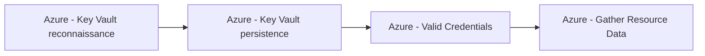

# Azure - Key Vault reconnaissance

## Metadata

- **UUID**: `81338b90-f80c-40cc-8a57-ba97cdf86948`
- **Schema**: `threat::1.0`
- **TLP**: clear

## Description
Azure Key Vault reconnaissance refers to the techniques and activities adversaries 
use to discover, enumerate, and gather information about Azure Key Vault resources 
within a target environment. The goal is to identify valuable secrets, misconfigurations, 
and potential attack paths, often as a precursor to privilege escalation, lateral movement, 
or data exfiltration.

## Why Azure Key Vaults Are Targeted

- **High Value**: Key Vaults store cryptographic keys, secrets (like API keys and passwords), 
and certificates, making them attractive to attackers.
- **Widespread Usage**: They are commonly used by organizations to manage sensitive 
information for applications and services.

## Common Reconnaissance Techniques

### Enumeration of Key Vaults

Attackers with the `Microsoft.KeyVault/vaults/read` permission can list all Key 
Vaults in a subscription, revealing vault names and resource groups. This helps 
identify which vaults to target based on naming conventions or access policies.

- **Azure CLI Example**:  
  `az keyvault list --query "[].{Name:name, ResourceGroup:resourceGroup}" -o table`

### Listing Keys, Secrets, and Certificates

Once a vault is identified, attackers may attempt to enumerate keys, secrets, and 
certificates within it, provided they have appropriate permissions. This can expose 
metadata that hints at the vault’s contents and potential value.

- **Azure CLI Example**:  
  `az keyvault secret list --vault-name  --query "[].{Name:name, Enabled:attributes.enabled}" -o table`

### Access Policy and RBAC Reconnaissance

Attackers may enumerate access policies and RBAC assignments to identify users, 
service principals, or managed identities with privileged access. Misconfigurations 
or excessive permissions can be exploited for further attacks.

- **Azure CLI Example**:  
  `az keyvault show --name  --query "properties.accessPolicies[].{ObjectId:objectId, Permissions:permissions}"`

### Control Plane vs. Data Plane Enumeration

Reconnaissance can occur via both the management/control plane (e.g., Azure Resource Manager API) 
and the data plane (direct Key Vault API). Weak separation or insufficient RBAC 
enforcement between these planes can increase risk.

### Exploiting Network and Access Misconfigurations

Attackers may probe for Key Vaults with public network access enabled or weak firewall 
rules, increasing the likelihood of successful enumeration and subsequent attacks.

## Techniques
- T1555.006
- T1082
- T1555

## Chaining

