# Azure - Key Vault reconnaissance

## Metadata

- **UUID**: `81338b90-f80c-40cc-8a57-ba97cdf86948`
- **Schema**: `threat::1.0`
- **Version**: `3`
- **Created**: `2025-06-16`
- **Modified**: `2025-09-08`
- **TLP**: clear (`TLP:CLEAR`)
- **Organisation**: EC DIGIT CSOC (`56b0a0f0-b0bc-47d9-bb46-02f80ae2065a`)

## References
### Public
- **1**: [https://www.azure-sec.com/labs/azure-key-vault-secrets-exfiltration](https://www.azure-sec.com/labs/azure-key-vault-secrets-exfiltration)
- **2**: [https://learn.microsoft.com/en-us/azure/key-vault/general/security-features](https://learn.microsoft.com/en-us/azure/key-vault/general/security-features)
- **3**: [https://cirriustech.co.uk/blog/azure-vault-recon/](https://cirriustech.co.uk/blog/azure-vault-recon/)

## Description
Azure Key Vault reconnaissance refers to the techniques and activities adversaries 
use to discover, enumerate, and gather information about Azure Key Vault resources 
within a target environment. The goal is to identify valuable secrets, misconfigurations, 
and potential attack paths, often as a precursor to privilege escalation, lateral movement, 
or data exfiltration.

## Why Azure Key Vaults Are Targeted

- **High Value**: Key Vaults store cryptographic keys, secrets (like API keys and passwords), 
and certificates, making them attractive to attackers.
- **Widespread Usage**: They are commonly used by organizations to manage sensitive 
information for applications and services.

## Common Reconnaissance Techniques

### Enumeration of Key Vaults

Attackers with the `Microsoft.KeyVault/vaults/read` permission can list all Key 
Vaults in a subscription, revealing vault names and resource groups. This helps 
identify which vaults to target based on naming conventions or access policies.

- **Azure CLI Example**:  
  `az keyvault list --query "[].{Name:name, ResourceGroup:resourceGroup}" -o table`

### Listing Keys, Secrets, and Certificates

Once a vault is identified, attackers may attempt to enumerate keys, secrets, and 
certificates within it, provided they have appropriate permissions. This can expose 
metadata that hints at the vault’s contents and potential value.

- **Azure CLI Example**:  
  `az keyvault secret list --vault-name  --query "[].{Name:name, Enabled:attributes.enabled}" -o table`

### Access Policy and RBAC Reconnaissance

Attackers may enumerate access policies and RBAC assignments to identify users, 
service principals, or managed identities with privileged access. Misconfigurations 
or excessive permissions can be exploited for further attacks.

- **Azure CLI Example**:  
  `az keyvault show --name  --query "properties.accessPolicies[].{ObjectId:objectId, Permissions:permissions}"`

### Control Plane vs. Data Plane Enumeration

Reconnaissance can occur via both the management/control plane (e.g., Azure Resource Manager API) 
and the data plane (direct Key Vault API). Weak separation or insufficient RBAC 
enforcement between these planes can increase risk.

### Exploiting Network and Access Misconfigurations

Attackers may probe for Key Vaults with public network access enabled or weak firewall 
rules, increasing the likelihood of successful enumeration and subsequent attacks.

## Criticality
**High** - A High priority incident is likely to result in a demonstrable impact to public health or safety, national security, economic security, foreign relations, civil liberties, or public confidence.

## Terrain
> **Adversaries must first compromise user accounts, service principals, or managed 
identities that already possess some level of Azure access.

Domains: Public Cloud, Private Cloud, Enterprise
Targets: Cloud Storage Accounts, Key Store, Identity Services, Serverless, API Endpoints, Cloud Portal, IaaS, Relational Database, NoSQL Database, Server Authentication
Platforms: Azure, Azure AD**

## Threat Assessment
| Dimension | Assessment | Description |
| --- | --- | --- |
| Severity | Significant incident | A cyber attack which has a serious impact on a large organisation or on wider / local government, or which poses a considerable risk to central government or (inter)national essential services. |
| Impact | Data Breach; IP Loss; Reputational Damages; Identity Theft; Monetary Loss | - |
| Leverage | Information Disclosure; Infrastructure Compromise; Elevation of privilege; Tampering | - |
| Viability | Likely | Probable (probably) - 55-80% |
| Kill Chain | Reconnaissance | Researching, identifying and selecting targets using active or passive reconnaissance. |

## ATT&CK Techniques
| Technique | Name | Description |
| --- | --- | --- |
| `T1555.006` | [Credentials from Password Stores: Cloud Secrets Management Stores](https://attack.mitre.org/techniques/T1555/006) | Adversaries may acquire credentials from cloud-native secret management solutions such as AWS Secrets Manager, GCP Secret Manager, Azure Key Vault, and Terraform Vault.    Secrets managers support the secure centralized management of passwords, API keys, and other credential material. Where secrets managers are in use, cloud services can dynamically acquire credentials via API requests rather than accessing secrets insecurely stored in plain text files or environment variables.    If an adversary is able to gain sufficient privileges in a cloud environment – for example, by obtaining the credentials of high-privileged [Cloud Accounts](https://attack.mitre.org/techniques/T1078/004) or compromising a service that has permission to retrieve secrets – they may be able to request secrets from the secrets manager. This can be accomplished via commands such as `get-secret-value` in AWS, `gcloud secrets describe` in GCP, and `az key vault secret show` in Azure.(Citation: Permiso Scattered Spider 2023)(Citation: Sysdig ScarletEel 2.0 2023)(Citation: AWS Secrets Manager)(Citation: Google Cloud Secrets)(Citation: Microsoft Azure Key Vault)  **Note:** this technique is distinct from [Cloud Instance Metadata API](https://attack.mitre.org/techniques/T1552/005) in that the credentials are being directly requested from the cloud secrets manager, rather than through the medium of the instance metadata API. |
| `T1082` | [System Information Discovery](https://attack.mitre.org/techniques/T1082) | An adversary may attempt to get detailed information about the operating system and hardware, including version, patches, hotfixes, service packs, and architecture. Adversaries may use the information from [System Information Discovery](https://attack.mitre.org/techniques/T1082) during automated discovery to shape follow-on behaviors, including whether or not the adversary fully infects the target and/or attempts specific actions.  Tools such as [Systeminfo](https://attack.mitre.org/software/S0096) can be used to gather detailed system information. If running with privileged access, a breakdown of system data can be gathered through the <code>systemsetup</code> configuration tool on macOS. As an example, adversaries with user-level access can execute the <code>df -aH</code> command to obtain currently mounted disks and associated freely available space. Adversaries may also leverage a [Network Device CLI](https://attack.mitre.org/techniques/T1059/008) on network devices to gather detailed system information (e.g. <code>show version</code>).(Citation: US-CERT-TA18-106A) On ESXi servers, threat actors may gather system information from various esxcli utilities, such as `system hostname get`, `system version get`, and `storage filesystem list` (to list storage volumes).(Citation: Crowdstrike Hypervisor Jackpotting Pt 2 2021)(Citation: Varonis)  Infrastructure as a Service (IaaS) cloud providers such as AWS, GCP, and Azure allow access to instance and virtual machine information via APIs. Successful authenticated API calls can return data such as the operating system platform and status of a particular instance or the model view of a virtual machine.(Citation: Amazon Describe Instance)(Citation: Google Instances Resource)(Citation: Microsoft Virutal Machine API)  [System Information Discovery](https://attack.mitre.org/techniques/T1082) combined with information gathered from other forms of discovery and reconnaissance can drive payload development and concealment.(Citation: OSX.FairyTale)(Citation: 20 macOS Common Tools and Techniques) |
| `T1555` | [Credentials from Password Stores](https://attack.mitre.org/techniques/T1555) | Adversaries may search for common password storage locations to obtain user credentials.(Citation: F-Secure The Dukes) Passwords are stored in several places on a system, depending on the operating system or application holding the credentials. There are also specific applications and services that store passwords to make them easier for users to manage and maintain, such as password managers and cloud secrets vaults. Once credentials are obtained, they can be used to perform lateral movement and access restricted information. |

## Chaining

```mermaid
flowchart LR
81338b90_f80c_40cc_8a57_ba97cdf86948["Azure - Key Vault reconnaissance"]
bcf3bb96_ed97_4853_98ab_937c2d214f4e["Azure - Key Vault persistence"]
2743bf18_3b86_4721_bf3e_153dcda0b149["Azure - Valid Credentials"]
b1593e0b_1b3b_462d_9ab6_21d1c136469d["Azure - Gather Resource Data"]
81338b90_f80c_40cc_8a57_ba97cdf86948 -->|atomicity::implements| bcf3bb96_ed97_4853_98ab_937c2d214f4e
bcf3bb96_ed97_4853_98ab_937c2d214f4e -->|support::enabled| 2743bf18_3b86_4721_bf3e_153dcda0b149
2743bf18_3b86_4721_bf3e_153dcda0b149 -->|support::enabled| b1593e0b_1b3b_462d_9ab6_21d1c136469d
```

### Chaining details
#### implements -> Azure - Key Vault persistence (`atomicity::implements`)
Adversaries must first gain access to an Azure environment, typically through
compromised user accounts, service principals, or managed identities.

- **Target UUID**: `bcf3bb96-ed97-4853-98ab-937c2d214f4e`
#### enabled -> Azure - Valid Credentials (`support::enabled`)
Adversaries obtain the username and password of an AzureAD user either through
phishing, password spraying, brute-force attacks, or credentials leaked online.

- **Target UUID**: `2743bf18-3b86-4721-bf3e-153dcda0b149`
#### enabled -> Azure - Gather Resource Data (`support::enabled`)
The attacker obtains credentials (via phishing, password spray, leaked keys)
granting at least Reader access to the target Azure tenant.

- **Target UUID**: `b1593e0b-1b3b-462d-9ab6-21d1c136469d`
