# Azure - KeyVault Dumping

## Metadata

- **UUID**: `09aec351-7dfb-4cde-8570-d3c7a36e1241`
- **Schema**: `threat::1.0`
- **TLP**: clear

## Description
In this threat vector an attacker extracts secrets, certificates, or keys from an 
Azure Key Vault to facilitate further attacks or lateral movement within the environment.

### Example Attack Scenario

After compromising an Azure AD account, this account has roles like Key Vault Contributor 
on a resource group but lacks direct Key Vault data read access through RBAC. However, 
the vault is configured with traditional access policies instead of RBAC, allowing 
the attacker to add their own user or service principal to the policy with all permissions. 
After updating the policy, the attacker can now dump all secrets, keys, and certificates 
stored in Key Vault, including API keys, credentials, and cryptographic material 
for critical applications.

### Attack Goals and Impact

The primary goal is to gain **unauthorized access** to highly sensitive material 
such as application secrets, encryption keys, database credentials, or signing certificates. 
This can lead to:
- Complete compromise of applications relying on Key Vault for secure secret storage
- Lateral movement by using dumped secrets to authenticate to other Azure resources
- Escalation of privileges by harvesting secrets that give broader access within the Azure environment
- Undetected persistence if logging is disabled or improperly configured on the Key Vault.

Business impact can include significant data breaches, loss of integrity for business 
processes, and regulatory repercussions due to exposure of protected credentials.

### Attack Flow and Methodology

- The attacker compromises a privileged Azure account or service principal.
- They enumerate assigned roles and discover Key Vault Contributor permission on a resource group.
- If the targeted Key Vault uses access policies instead of RBAC, the contributor 
can add themselves to the vault’s access policy with full access rights.
- With the new policy, the attacker calls Key Vault data plane APIs to list and 
retrieve all stored keys, certificates, and secrets. For example:
  - `Microsoft.KeyVault/vaults/secrets/getSecret/action`
  - `Microsoft.KeyVault/vaults/certificates/read`
  - `Microsoft.KeyVault/vaults/keys/read`
- Extracted credentials are used to access protected resources elsewhere, potentially 
chaining this access for lateral movement.
- If Key Vault logging is not enabled, this activity may go undetected unless anomalous 
pattern detection (such as sudden bulk secret access or policy changes) triggers alerts.

## Techniques
- T1555.005
- T1078.004
- T1098.001

## Chaining

```mermaid
flowchart LR
09aec351_7dfb_4cde_8570_d3c7a36e1241["Azure - KeyVault Dumping"]
81338b90_f80c_40cc_8a57_ba97cdf86948["Azure - Key Vault reconnaissance"]
bcf3bb96_ed97_4853_98ab_937c2d214f4e["Azure - Key Vault persistence"]
b1593e0b_1b3b_462d_9ab6_21d1c136469d["Azure - Gather Resource Data"]
2743bf18_3b86_4721_bf3e_153dcda0b149["Azure - Valid Credentials"]
53063205_4404_4e6d_a2f5_d566c6085d96["Data collection using SharpHound, SoapHound, Bloodhound and Azurehound"]
ce7194f8_2398_4e79_b964_162ca5ee175b["Secrets stored in repository"]
37381f28_ad9f_40c3_80f8_d8a82d6ce9a3["Resource Secret Reveal in Azure"]
09aec351_7dfb_4cde_8570_d3c7a36e1241 --> 81338b90_f80c_40cc_8a57_ba97cdf86948
81338b90_f80c_40cc_8a57_ba97cdf86948 --> bcf3bb96_ed97_4853_98ab_937c2d214f4e
bcf3bb96_ed97_4853_98ab_937c2d214f4e --> b1593e0b_1b3b_462d_9ab6_21d1c136469d
b1593e0b_1b3b_462d_9ab6_21d1c136469d --> 2743bf18_3b86_4721_bf3e_153dcda0b149
2743bf18_3b86_4721_bf3e_153dcda0b149 --> 53063205_4404_4e6d_a2f5_d566c6085d96
53063205_4404_4e6d_a2f5_d566c6085d96 --> ce7194f8_2398_4e79_b964_162ca5ee175b
ce7194f8_2398_4e79_b964_162ca5ee175b --> 37381f28_ad9f_40c3_80f8_d8a82d6ce9a3
```

