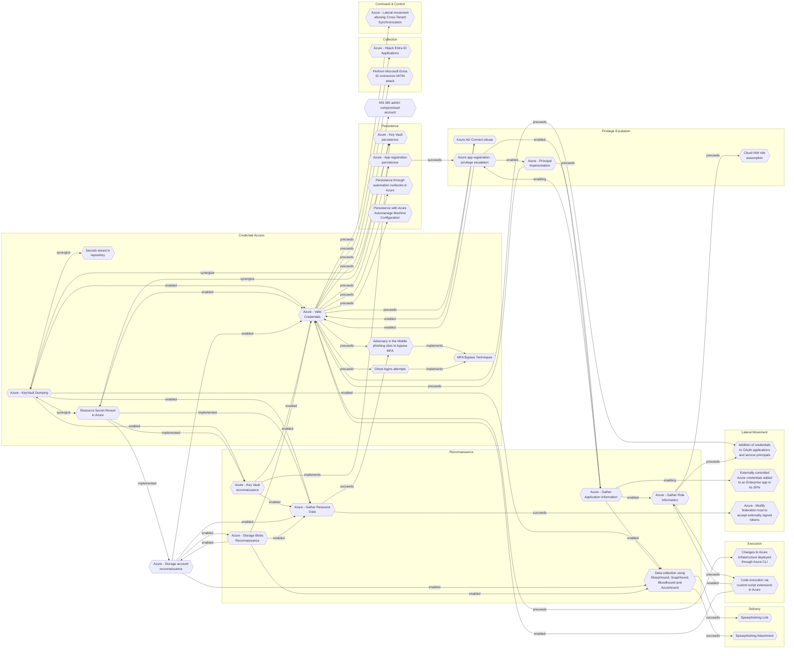

# Azure - KeyVault Dumping

## Metadata
| Field | Value |
| --- | --- |
| UUID | `09aec351-7dfb-4cde-8570-d3c7a36e1241` |
| Schema | `threat::1.0` |
| Version | `1` |
| Created | `2025-09-16` |
| Modified | `2025-09-17` |
| TLP | clear (`TLP:CLEAR`) |
| Organisation | EC DIGIT CSOC (`56b0a0f0-b0bc-47d9-bb46-02f80ae2065a`) |

## References
### Public
- **1**: [https://securitylabs.datadoghq.com/articles/escalating-privileges-to-read-secrets-with-azure-key-vault-access-policies/](https://securitylabs.datadoghq.com/articles/escalating-privileges-to-read-secrets-with-azure-key-vault-access-policies/)
- **2**: [https://microsoft.github.io/Azure-Threat-Research-Matrix/CredentialAccess/AZT604/AZT604-3/](https://microsoft.github.io/Azure-Threat-Research-Matrix/CredentialAccess/AZT604/AZT604-3/)

## Description
In this threat vector an attacker extracts secrets, certificates, or keys from an 
Azure Key Vault to facilitate further attacks or lateral movement within the environment.

### Example Attack Scenario

After compromising an Azure AD account, this account has roles like Key Vault Contributor 
on a resource group but lacks direct Key Vault data read access through RBAC. However, 
the vault is configured with traditional access policies instead of RBAC, allowing 
the attacker to add their own user or service principal to the policy with all permissions. 
After updating the policy, the attacker can now dump all secrets, keys, and certificates 
stored in Key Vault, including API keys, credentials, and cryptographic material 
for critical applications.

### Attack Goals and Impact

The primary goal is to gain **unauthorized access** to highly sensitive material 
such as application secrets, encryption keys, database credentials, or signing certificates. 
This can lead to:
- Complete compromise of applications relying on Key Vault for secure secret storage
- Lateral movement by using dumped secrets to authenticate to other Azure resources
- Escalation of privileges by harvesting secrets that give broader access within the Azure environment
- Undetected persistence if logging is disabled or improperly configured on the Key Vault.

Business impact can include significant data breaches, loss of integrity for business 
processes, and regulatory repercussions due to exposure of protected credentials.

### Attack Flow and Methodology

- The attacker compromises a privileged Azure account or service principal.
- They enumerate assigned roles and discover Key Vault Contributor permission on a resource group.
- If the targeted Key Vault uses access policies instead of RBAC, the contributor 
can add themselves to the vault’s access policy with full access rights.
- With the new policy, the attacker calls Key Vault data plane APIs to list and 
retrieve all stored keys, certificates, and secrets. For example:
  - `Microsoft.KeyVault/vaults/secrets/getSecret/action`
  - `Microsoft.KeyVault/vaults/certificates/read`
  - `Microsoft.KeyVault/vaults/keys/read`
- Extracted credentials are used to access protected resources elsewhere, potentially 
chaining this access for lateral movement.
- If Key Vault logging is not enabled, this activity may go undetected unless anomalous 
pattern detection (such as sudden bulk secret access or policy changes) triggers alerts.

## Criticality
**High** - A High priority incident is likely to result in a demonstrable impact to public health or safety, national security, economic security, foreign relations, civil liberties, or public confidence.

## Terrain
Adversaries must compromise an Azure AD account, through phishing,
token theft or different means.

## Surface
> **Azure**
> Microsoft Azure cloud platform

> **Azure::Security::Entra ID**
> Microsoft Entra ID in Azure (cloud identity)

> **AWS::Storage**
> AWS storage services

> **Azure::Security::Key Vault**
> Azure Key Vault secrets and key management

> **Entra ID**
> Microsoft Entra ID (formerly Azure Active Directory)

## Threat Assessment
| Dimension | Assessment | Description |
| --- | --- | --- |
| Severity | Significant incident | A cyber attack which has a serious impact on a large organisation or on wider / local government, or which poses a considerable risk to central government or (inter)national essential services. |
| Impact | Data Breach IP Loss Reputational Damages Identity Theft | Non-public information has been accessed from the outside, and successfully extracted. Particular, key data, information and blueprint conducive to the organization capability to gain and retain a commercial or geopolitical advantage has been accessed, and their content potentially used by competitors or other adversaries. Damages to the organization public view may be achieved by using directly the access gained, or indirectly with data gathered. Acquisition of sufficient information and privileges to profess as a given individual, for the purpose of abusing and deceiving human trust relationships. |
| Leverage | Information Disclosure Elevation of privilege Tampering | Threat action intending to read a file that one was not granted access to, or to read data in transit. Capacity to augment leverage over the target system by upgrading the compromised access rights Threat action intending to maliciously change or modify persistent data, such as records in a database, and the alteration of data in transit between two computers over an open network, such as the Internet. |
| Viability | Likely | Probable (probably) - 55-80% |
| Kill Chain | Credential Access | Techniques resulting in the access of, or control over, system, service or domain credentials. |

## ATT&CK Techniques
| Technique | Name | Description |
| --- | --- | --- |
| `T1555.005` | [Credentials from Password Stores: Password Managers](https://attack.mitre.org/techniques/T1555/005) | Adversaries may acquire user credentials from third-party password managers.(Citation: ise Password Manager February 2019) Password managers are applications designed to store user credentials, normally in an encrypted database. Credentials are typically accessible after a user provides a master password that unlocks the database. After the database is unlocked, these credentials may be copied to memory. These databases can be stored as files on disk.(Citation: ise Password Manager February 2019)  Adversaries may acquire user credentials from password managers by extracting the master password and/or plain-text credentials from memory.(Citation: FoxIT Wocao December 2019)(Citation: Github KeeThief) Adversaries may extract credentials from memory via [Exploitation for Credential Access](https://attack.mitre.org/techniques/T1212).(Citation: NVD CVE-2019-3610)  Adversaries may also try brute forcing via [Password Guessing](https://attack.mitre.org/techniques/T1110/001) to obtain the master password of a password manager.(Citation: Cyberreason Anchor December 2019) |
| `T1078.004` | [Valid Accounts: Cloud Accounts](https://attack.mitre.org/techniques/T1078/004) | Valid accounts in cloud environments may allow adversaries to perform actions to achieve Initial Access, Persistence, Privilege Escalation, or Defense Evasion. Cloud accounts are those created and configured by an organization for use by users, remote support, services, or for administration of resources within a cloud service provider or SaaS application. Cloud Accounts can exist solely in the cloud; alternatively, they may be hybrid-joined between on-premises systems and the cloud through syncing or federation with other identity sources such as Windows Active Directory.(Citation: AWS Identity Federation)(Citation: Google Federating GC)(Citation: Microsoft Deploying AD Federation)  Service or user accounts may be targeted by adversaries through [Brute Force](https://attack.mitre.org/techniques/T1110), [Phishing](https://attack.mitre.org/techniques/T1566), or various other means to gain access to the environment. Federated or synced accounts may be a pathway for the adversary to affect both on-premises systems and cloud environments - for example, by leveraging shared credentials to log onto [Remote Services](https://attack.mitre.org/techniques/T1021). High privileged cloud accounts, whether federated, synced, or cloud-only, may also allow pivoting to on-premises environments by leveraging SaaS-based [Software Deployment Tools](https://attack.mitre.org/techniques/T1072) to run commands on hybrid-joined devices.  An adversary may create long lasting [Additional Cloud Credentials](https://attack.mitre.org/techniques/T1098/001) on a compromised cloud account to maintain persistence in the environment. Such credentials may also be used to bypass security controls such as multi-factor authentication.   Cloud accounts may also be able to assume [Temporary Elevated Cloud Access](https://attack.mitre.org/techniques/T1548/005) or other privileges through various means within the environment. Misconfigurations in role assignments or role assumption policies may allow an adversary to use these mechanisms to leverage permissions outside the intended scope of the account. Such over privileged accounts may be used to harvest sensitive data from online storage accounts and databases through [Cloud API](https://attack.mitre.org/techniques/T1059/009) or other methods. For example, in Azure environments, adversaries may target Azure Managed Identities, which allow associated Azure resources to request access tokens. By compromising a resource with an attached Managed Identity, such as an Azure VM, adversaries may be able to [Steal Application Access Token](https://attack.mitre.org/techniques/T1528)s to move laterally across the cloud environment.(Citation: SpecterOps Managed Identity 2022) |
| `T1098.001` | [Account Manipulation: Additional Cloud Credentials](https://attack.mitre.org/techniques/T1098/001) | Adversaries may add adversary-controlled credentials to a cloud account to maintain persistent access to victim accounts and instances within the environment.  For example, adversaries may add credentials for Service Principals and Applications in addition to existing legitimate credentials in Azure / Entra ID.(Citation: Microsoft SolarWinds Customer Guidance)(Citation: Blue Cloud of Death)(Citation: Blue Cloud of Death Video) These credentials include both x509 keys and passwords.(Citation: Microsoft SolarWinds Customer Guidance) With sufficient permissions, there are a variety of ways to add credentials including the Azure Portal, Azure command line interface, and Azure or Az PowerShell modules.(Citation: Demystifying Azure AD Service Principals)  In infrastructure-as-a-service (IaaS) environments, after gaining access through [Cloud Accounts](https://attack.mitre.org/techniques/T1078/004), adversaries may generate or import their own SSH keys using either the <code>CreateKeyPair</code> or <code>ImportKeyPair</code> API in AWS or the <code>gcloud compute os-login ssh-keys add</code> command in GCP.(Citation: GCP SSH Key Add) This allows persistent access to instances within the cloud environment without further usage of the compromised cloud accounts.(Citation: Expel IO Evil in AWS)(Citation: Expel Behind the Scenes)  Adversaries may also use the <code>CreateAccessKey</code> API in AWS or the <code>gcloud iam service-accounts keys create</code> command in GCP to add access keys to an account. Alternatively, they may use the <code>CreateLoginProfile</code> API in AWS to add a password that can be used to log into the AWS Management Console for [Cloud Service Dashboard](https://attack.mitre.org/techniques/T1538).(Citation: Permiso Scattered Spider 2023)(Citation: Lacework AI Resource Hijacking 2024) If the target account has different permissions from the requesting account, the adversary may also be able to escalate their privileges in the environment (i.e. [Cloud Accounts](https://attack.mitre.org/techniques/T1078/004)).(Citation: Rhino Security Labs AWS Privilege Escalation)(Citation: Sysdig ScarletEel 2.0) For example, in Entra ID environments, an adversary with the Application Administrator role can add a new set of credentials to their application's service principal. In doing so the adversary would be able to access the service principal’s roles and permissions, which may be different from those of the Application Administrator.(Citation: SpecterOps Azure Privilege Escalation)   In AWS environments, adversaries with the appropriate permissions may also use the `sts:GetFederationToken` API call to create a temporary set of credentials to [Forge Web Credentials](https://attack.mitre.org/techniques/T1606) tied to the permissions of the original user account. These temporary credentials may remain valid for the duration of their lifetime even if the original account’s API credentials are deactivated. (Citation: Crowdstrike AWS User Federation Persistence)  In Entra ID environments with the app password feature enabled, adversaries may be able to add an app password to a user account.(Citation: Mandiant APT42 Operations 2024) As app passwords are intended to be used with legacy devices that do not support multi-factor authentication (MFA), adding an app password can allow an adversary to bypass MFA requirements. Additionally, app passwords may remain valid even if the user’s primary password is reset.(Citation: Microsoft Entra ID App Passwords) |

## Chaining

### Chaining details
#### enabled -> [Azure - Key Vault reconnaissance](azure-key-vault-reconnaissance.md) (`81338b90-f80c-40cc-8a57-ba97cdf86948`) (`support::enabled`)
Adversaries must first compromise user accounts, service principals, or managed 
identities that already possess some level of Azure access.

- **Target UUID**: `81338b90-f80c-40cc-8a57-ba97cdf86948`
#### synergize -> [Azure - Key Vault persistence](azure-key-vault-persistence.md) (`bcf3bb96-ed97-4853-98ab-937c2d214f4e`) (`support::synergize`)
Adversaries must first gain access to an Azure environment, typically through 
compromised user accounts, service principals, or managed identities.

- **Target UUID**: `bcf3bb96-ed97-4853-98ab-937c2d214f4e`
#### enabled -> [Azure - Gather Resource Data](azure-gather-resource-data.md) (`b1593e0b-1b3b-462d-9ab6-21d1c136469d`) (`support::enabled`)
The attacker obtains credentials (via phishing, password spray, leaked keys) 
granting at least Reader access to the target Azure tenant.

- **Target UUID**: `b1593e0b-1b3b-462d-9ab6-21d1c136469d`
#### enabled -> [Azure - Valid Credentials](azure-valid-credentials.md) (`2743bf18-3b86-4721-bf3e-153dcda0b149`) (`support::enabled`)
Adversaries obtain the username and password of an AzureAD user either through
phishing, password spraying, brute-force attacks, or credentials leaked online.

- **Target UUID**: `2743bf18-3b86-4721-bf3e-153dcda0b149`
#### enabled -> [Data collection using SharpHound, SoapHound, Bloodhound and Azurehound](data-collection-using-sharphound-soaphound-bloodhound-and-azurehound.md) (`53063205-4404-4e6d-a2f5-d566c6085d96`) (`support::enabled`)
Attackers need to establish an initial presence within the target environment, in 
order to gather sufficient permissions to execute the data collection tools.

- **Target UUID**: `53063205-4404-4e6d-a2f5-d566c6085d96`
#### synergize -> [Secrets stored in repository](secrets-stored-in-repository.md) (`ce7194f8-2398-4e79-b964-162ca5ee175b`) (`support::synergize`)
Threat actors are scanning for stored secrets in developer's source code
repositories leaked by design or by mistake from the engineering teams.

- **Target UUID**: `ce7194f8-2398-4e79-b964-162ca5ee175b`
#### synergize -> [Resource Secret Reveal in Azure](resource-secret-reveal-in-azure.md) (`37381f28-ad9f-40c3-80f8-d8a82d6ce9a3`) (`support::synergize`)
Adversaries obtains sufficient privileges (via phishing, misconfigurations,
lateral movement, or exploitation of weak access controls).

- **Target UUID**: `37381f28-ad9f-40c3-80f8-d8a82d6ce9a3`
