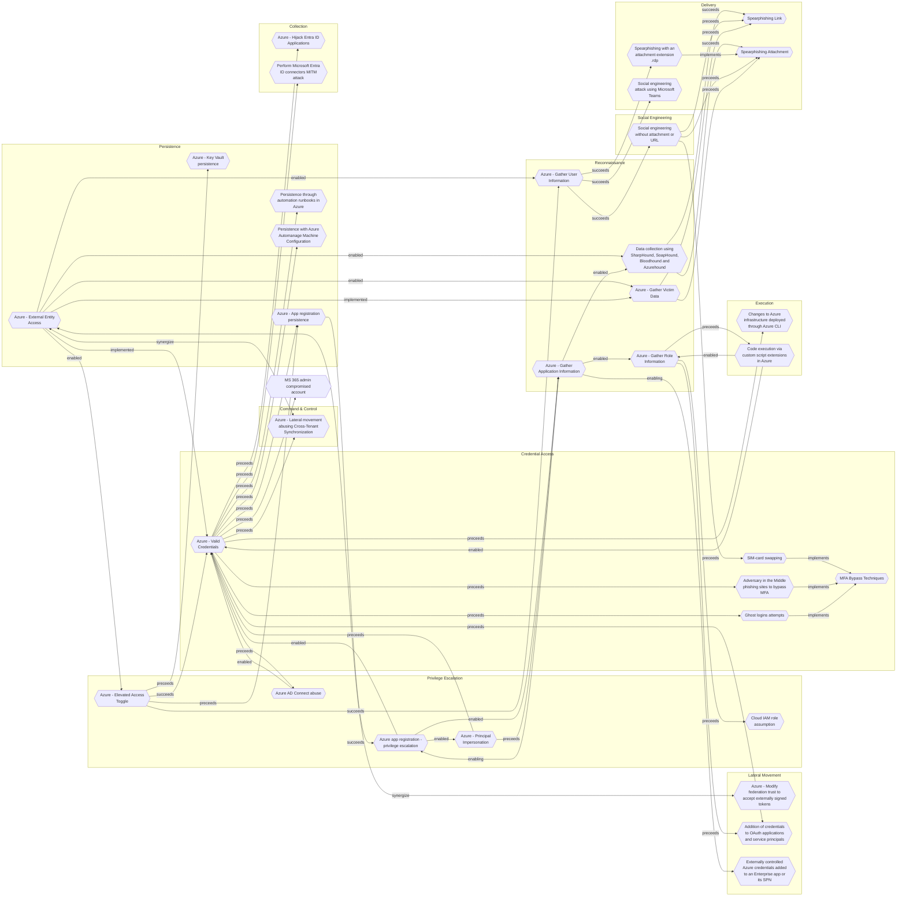

# Azure - Lateral movement abusing Cross-Tenant Synchronization

## Metadata
| Field | Value |
| --- | --- |
| UUID | `2fd1cddb-c66d-4a99-9779-31e32b67495e` |
| Schema | `threat::1.0` |
| Version | `2` |
| Created | `2023-08-07` |
| Modified | `2025-01-01` |
| TLP | clear (`TLP:CLEAR`) |
| Organisation | EC DIGIT CSOC (`56b0a0f0-b0bc-47d9-bb46-02f80ae2065a`) |

## References
### Public
- **1**: [https://www.vectra.ai/blogpost/microsoft-cross-tenant-synchronization](https://www.vectra.ai/blogpost/microsoft-cross-tenant-synchronization)
- **2**: [https://invictus-ir.medium.com/incident-response-in-azure-c3830e7783af](https://invictus-ir.medium.com/incident-response-in-azure-c3830e7783af)

## Description
When configuring CTS, an Azure source tenant will be synchronized with a target tenant, 
where users from the source can automatically be synchronized to the target tenant. 
When synchronizing users, the user is only pushed from the source and not pulled 
from the target, making this a one-sided synchronization.

However, if improperly configured, attackers who have already compromised a tenant and gained
elevated privileges may exploit this feature, to move laterally to other connected tenants.

Attackers must look for tenants with 'Outbound Sync' enabled, which allows syncing
to other tenants. Next step is to locate the app used for CTS syncing and modify
its configuration to add the compromised user into its sync scope,
gaining access to the other tenant's network.

This allows the threat actor to achieve lateral movement without requiring new user credentials.

## Criticality
**High** - A High priority incident is likely to result in a demonstrable impact to public health or safety, national security, economic security, foreign relations, civil liberties, or public confidence.

## Terrain
Attackers must have compromised a tenant and gained elevated privileges

## Surface
> **Azure**
> Microsoft Azure cloud platform

> **Azure::Security::Entra ID**
> Microsoft Entra ID in Azure (cloud identity)

> **Azure::Compute::Kubernetes Service**
> Azure Kubernetes Service (AKS)

> **AWS::Storage**
> AWS storage services

> **AWS::Compute::EC2**
> Amazon Elastic Compute Cloud (virtual servers)

## Threat Assessment
| Dimension | Assessment | Description |
| --- | --- | --- |
| Severity | Significant incident | A cyber attack which has a serious impact on a large organisation or on wider / local government, or which poses a considerable risk to central government or (inter)national essential services. |
| Impact | Business disruption Lose Capabilities Data Breach Reputational Damages | Business disruption Vector execution will remove key functions to the organization, which will not be easily circumvented. Most day-to-day is heavily impaired, but processes can reorganize at a loss. Non-public information has been accessed from the outside, and successfully extracted. Damages to the organization public view may be achieved by using directly the access gained, or indirectly with data gathered. |
| Leverage | Elevation of privilege Infrastructure Compromise Modify configuration | Capacity to augment leverage over the target system by upgrading the compromised access rights The compromised target is likely to be used to further expand the sphere of influence of the attacker and allow more potent vectors to be executed. Modify configuration or services |
| Viability | Environment dependent | Depends |
| Kill Chain | Command & Control | Techniques that allow attackers to communicate with controlled systems within a target network. |

## ATT&CK Techniques
| Technique | Name | Description |
| --- | --- | --- |
| `T1021.007` | [Remote Services: Cloud Services](https://attack.mitre.org/techniques/T1021/007) | Adversaries may log into accessible cloud services within a compromised environment using [Valid Accounts](https://attack.mitre.org/techniques/T1078) that are synchronized with or federated to on-premises user identities. The adversary may then perform management actions or access cloud-hosted resources as the logged-on user.   Many enterprises federate centrally managed user identities to cloud services, allowing users to login with their domain credentials in order to access the cloud control plane. Similarly, adversaries may connect to available cloud services through the web console or through the cloud command line interface (CLI) (e.g., [Cloud API](https://attack.mitre.org/techniques/T1059/009)), using commands such as <code>Connect-AZAccount</code> for Azure PowerShell, <code>Connect-MgGraph</code> for Microsoft Graph PowerShell, and <code>gcloud auth login</code> for the Google Cloud CLI.  In some cases, adversaries may be able to authenticate to these services via [Application Access Token](https://attack.mitre.org/techniques/T1550/001) instead of a username and password. |

## Chaining

