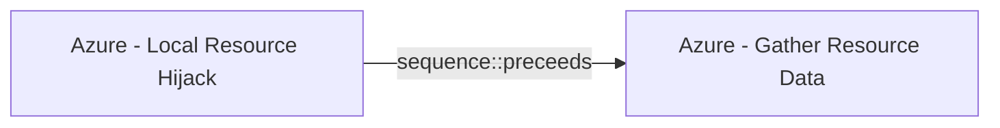

# Azure - Local Resource Hijack

## Metadata

- **UUID**: `85c8e0dd-b012-402d-bb09-5d354c16ebb9`
- **Schema**: `threat::1.0`
- **Version**: `2`
- **Created**: `2025-08-26`
- **Modified**: `2025-09-04`
- **TLP**: clear (`TLP:CLEAR`)
- **Organisation**: EC DIGIT CSOC (`56b0a0f0-b0bc-47d9-bb46-02f80ae2065a`)

## References
### Public
- **1**: [https://orca.security/resources/blog/azure-machine-learning-privilege-escalation/](https://orca.security/resources/blog/azure-machine-learning-privilege-escalation/)
- **2**: [https://microsoft.github.io/Azure-Threat-Research-Matrix/PrivilegeEscalation/AZT403/AZT403-1/](https://microsoft.github.io/Azure-Threat-Research-Matrix/PrivilegeEscalation/AZT403/AZT403-1/)
- **3**: [https://www.netspi.com/blog/technical-blog/cloud-penetration-testing/attacking-azure-cloud-shell/](https://www.netspi.com/blog/technical-blog/cloud-penetration-testing/attacking-azure-cloud-shell/)

## Description
The following threat vector involves attackers tampering with local files or resources—such 
as profile scripts or pipeline artifacts—to escalate privileges and gain unauthorized 
access to cloud resources.

## Example Attack Scenario

An adversary, with write access to a storage account linked to Azure Machine Learning 
(AML) or Azure CloudShell, modifies a startup or invoker script (e.g., `.bashrc` 
or pipeline component scripts) stored in blob storage. For AML, the attacker replaces 
a component invoker script with malicious code that executes during the next scheduled 
pipeline job. The code then exploits the AML compute’s managed identity—potentially 
inheriting elevated permissions from the pipeline owner—to extract secrets from 
Azure Key Vault, reassign roles, or access broader Azure resources. In CloudShell, 
the `.bashrc` file inside the `.IMG` profile is altered to run commands that covertly 
add an attacker account to privileged roles across the subscription.

## Attack Goals and Impact

- **Privilege escalation**: The attacker aims to execute code or commands under 
a more privileged identity, going from low user/storage access to Contributor, Owner, 
or admin roles in Azure. This may involve extracting secrets from Key Vaults, accessing 
sensitive data, or reassigning role memberships.
- **Persistence and lateral movement**: By hijacking profile/startup scripts or 
pipeline artifacts, the attacker ensures continued access, potentially moving laterally 
to other cloud services or even on-premises networks—all without triggering immediate alarms.
- **Resource abuse**: Attackers may run unauthorized workloads, such as cryptominers, 
or deploy malware, impacting resource costs and security posture.

## Attack Flow and Methodology

1. **Script modification**:
  - AML case: The attacker modifies or uploads a malicious invoker script to the 
  pipeline component directory in the Storage Account. If necessary, the YAML config 
  is altered to ensure execution of the script.
  - CloudShell case: The attacker alters the `.bashrc` (or PowerShell profile) 
  file inside the profile `.IMG` so that, on shell launch, privileged escalation 
  or backdoor commands are executed.
2. **Execution and privilege escalation**:
  - On the next job/pipeline run (AML) or CloudShell launch, the modified script 
  executes with the context of the managed/system identity—often inheriting the 
  permissions of the pipeline owner or compute administrator.
  - Malicious code retrieves secrets, changes role assignments, or accesses broader 
  Azure resources; for CloudShell, commands may add attacker accounts to privileged 
  Azure roles automatically.
3. **Persistence and impact**:
  - The attacker may persist access by continuously modifying invocation scripts 
  or startup files, or by creating new high-privilege accounts/role assignments.
  - Broader impact includes data exfiltration, resource hijacking, or stealthy 
  malware deployment.

## Criticality
**High** - A High priority incident is likely to result in a demonstrable impact to public health or safety, national security, economic security, foreign relations, civil liberties, or public confidence.

## Terrain
> **Adversaries obtain write permissions on a target storage account (e.g., AML storage, 
CloudShell profile storage) through misconfiguration, compromised credentials, or 
access inheritance.

Domains: Public Cloud
Targets: Cloud Storage Accounts, Cloud Portal, Identity Services, Virtual Machines, IaaS
Platforms: Azure, Azure AD**

## Threat Assessment
| Dimension | Assessment | Description |
| --- | --- | --- |
| Severity | Significant incident | A cyber attack which has a serious impact on a large organisation or on wider / local government, or which poses a considerable risk to central government or (inter)national essential services. |
| Impact | Data Breach; IP Loss | - |
| Leverage | Tampering; Elevation of privilege; Information Disclosure | - |
| Viability | Likely | Probable (probably) - 55-80% |
| Kill Chain | Privilege Escalation | The result of techniques that provide an attacker with higher permissions on a system or network. |

## Actors
| Actor | ID | Source | Description |
| --- | --- | --- | --- |
| APT29 | `misp::b2056ff0-00b9-482e-b11c-c771daa5f28a` | ('misp',) | A 2015 report by F-Secure describe APT29 as: 'The Dukes are a well-resourced, highly dedicated and organized cyberespionage group that we believe has been working for the Russian Federation since at least 2008 to collect intelligence in support of foreign and security policy decision-making. The Dukes show unusual confidence in their ability to continue successfully compromising their targets, as well as in their ability to operate with impunity. The Dukes primarily target Western governments and related organizations, such as government ministries and agencies, political think tanks, and governmental subcontractors. Their targets have also included the governments of members of the Commonwealth of Independent States;Asian, African, and Middle Eastern governments;organizations associated with Chechen extremism;and Russian speakers engaged in the illicit trade of controlled substances and drugs. The Dukes are known to employ a vast arsenal of malware toolsets, which we identify as MiniDuke, CosmicDuke, OnionDuke, CozyDuke, CloudDuke, SeaDuke, HammerDuke, PinchDuke, and GeminiDuke. In recent years, the Dukes have engaged in apparently biannual large - scale spear - phishing campaigns against hundreds or even thousands of recipients associated with governmental institutions and affiliated organizations. These campaigns utilize a smash - and - grab approach involving a fast but noisy breakin followed by the rapid collection and exfiltration of as much data as possible.If the compromised target is discovered to be of value, the Dukes will quickly switch the toolset used and move to using stealthier tactics focused on persistent compromise and long - term intelligence gathering. This threat actor targets government ministries and agencies in the West, Central Asia, East Africa, and the Middle East; Chechen extremist groups; Russian organized crime; and think tanks. It is suspected to be behind the 2015 compromise of unclassified networks at the White House, Department of State, Pentagon, and the Joint Chiefs of Staff. The threat actor includes all of the Dukes tool sets, including MiniDuke, CosmicDuke, OnionDuke, CozyDuke, SeaDuke, CloudDuke (aka MiniDionis), and HammerDuke (aka Hammertoss). ' |

## ATT&CK Techniques
| Technique | Name | Description |
| --- | --- | --- |
| `T1496` | [Resource Hijacking](https://attack.mitre.org/techniques/T1496) | Adversaries may leverage the resources of co-opted systems to complete resource-intensive tasks, which may impact system and/or hosted service availability.   Resource hijacking may take a number of different forms. For example, adversaries may:  * Leverage compute resources in order to mine cryptocurrency * Sell network bandwidth to proxy networks * Generate SMS traffic for profit * Abuse cloud-based messaging services to send large quantities of spam messages  In some cases, adversaries may leverage multiple types of Resource Hijacking at once.(Citation: Sysdig Cryptojacking Proxyjacking 2023) |
| `T1098.001` | [Account Manipulation: Additional Cloud Credentials](https://attack.mitre.org/techniques/T1098/001) | Adversaries may add adversary-controlled credentials to a cloud account to maintain persistent access to victim accounts and instances within the environment.  For example, adversaries may add credentials for Service Principals and Applications in addition to existing legitimate credentials in Azure / Entra ID.(Citation: Microsoft SolarWinds Customer Guidance)(Citation: Blue Cloud of Death)(Citation: Blue Cloud of Death Video) These credentials include both x509 keys and passwords.(Citation: Microsoft SolarWinds Customer Guidance) With sufficient permissions, there are a variety of ways to add credentials including the Azure Portal, Azure command line interface, and Azure or Az PowerShell modules.(Citation: Demystifying Azure AD Service Principals)  In infrastructure-as-a-service (IaaS) environments, after gaining access through [Cloud Accounts](https://attack.mitre.org/techniques/T1078/004), adversaries may generate or import their own SSH keys using either the <code>CreateKeyPair</code> or <code>ImportKeyPair</code> API in AWS or the <code>gcloud compute os-login ssh-keys add</code> command in GCP.(Citation: GCP SSH Key Add) This allows persistent access to instances within the cloud environment without further usage of the compromised cloud accounts.(Citation: Expel IO Evil in AWS)(Citation: Expel Behind the Scenes)  Adversaries may also use the <code>CreateAccessKey</code> API in AWS or the <code>gcloud iam service-accounts keys create</code> command in GCP to add access keys to an account. Alternatively, they may use the <code>CreateLoginProfile</code> API in AWS to add a password that can be used to log into the AWS Management Console for [Cloud Service Dashboard](https://attack.mitre.org/techniques/T1538).(Citation: Permiso Scattered Spider 2023)(Citation: Lacework AI Resource Hijacking 2024) If the target account has different permissions from the requesting account, the adversary may also be able to escalate their privileges in the environment (i.e. [Cloud Accounts](https://attack.mitre.org/techniques/T1078/004)).(Citation: Rhino Security Labs AWS Privilege Escalation)(Citation: Sysdig ScarletEel 2.0) For example, in Entra ID environments, an adversary with the Application Administrator role can add a new set of credentials to their application's service principal. In doing so the adversary would be able to access the service principal’s roles and permissions, which may be different from those of the Application Administrator.(Citation: SpecterOps Azure Privilege Escalation)   In AWS environments, adversaries with the appropriate permissions may also use the `sts:GetFederationToken` API call to create a temporary set of credentials to [Forge Web Credentials](https://attack.mitre.org/techniques/T1606) tied to the permissions of the original user account. These temporary credentials may remain valid for the duration of their lifetime even if the original account’s API credentials are deactivated. (Citation: Crowdstrike AWS User Federation Persistence)  In Entra ID environments with the app password feature enabled, adversaries may be able to add an app password to a user account.(Citation: Mandiant APT42 Operations 2024) As app passwords are intended to be used with legacy devices that do not support multi-factor authentication (MFA), adding an app password can allow an adversary to bypass MFA requirements. Additionally, app passwords may remain valid even if the user’s primary password is reset.(Citation: Microsoft Entra ID App Passwords) |
| `T1078.004` | [Valid Accounts: Cloud Accounts](https://attack.mitre.org/techniques/T1078/004) | Valid accounts in cloud environments may allow adversaries to perform actions to achieve Initial Access, Persistence, Privilege Escalation, or Defense Evasion. Cloud accounts are those created and configured by an organization for use by users, remote support, services, or for administration of resources within a cloud service provider or SaaS application. Cloud Accounts can exist solely in the cloud; alternatively, they may be hybrid-joined between on-premises systems and the cloud through syncing or federation with other identity sources such as Windows Active Directory.(Citation: AWS Identity Federation)(Citation: Google Federating GC)(Citation: Microsoft Deploying AD Federation)  Service or user accounts may be targeted by adversaries through [Brute Force](https://attack.mitre.org/techniques/T1110), [Phishing](https://attack.mitre.org/techniques/T1566), or various other means to gain access to the environment. Federated or synced accounts may be a pathway for the adversary to affect both on-premises systems and cloud environments - for example, by leveraging shared credentials to log onto [Remote Services](https://attack.mitre.org/techniques/T1021). High privileged cloud accounts, whether federated, synced, or cloud-only, may also allow pivoting to on-premises environments by leveraging SaaS-based [Software Deployment Tools](https://attack.mitre.org/techniques/T1072) to run commands on hybrid-joined devices.  An adversary may create long lasting [Additional Cloud Credentials](https://attack.mitre.org/techniques/T1098/001) on a compromised cloud account to maintain persistence in the environment. Such credentials may also be used to bypass security controls such as multi-factor authentication.   Cloud accounts may also be able to assume [Temporary Elevated Cloud Access](https://attack.mitre.org/techniques/T1548/005) or other privileges through various means within the environment. Misconfigurations in role assignments or role assumption policies may allow an adversary to use these mechanisms to leverage permissions outside the intended scope of the account. Such over privileged accounts may be used to harvest sensitive data from online storage accounts and databases through [Cloud API](https://attack.mitre.org/techniques/T1059/009) or other methods. For example, in Azure environments, adversaries may target Azure Managed Identities, which allow associated Azure resources to request access tokens. By compromising a resource with an attached Managed Identity, such as an Azure VM, adversaries may be able to [Steal Application Access Token](https://attack.mitre.org/techniques/T1528)s to move laterally across the cloud environment.(Citation: SpecterOps Managed Identity 2022) |

## Chaining

### Chaining details
#### preceeds -> Azure - Gather Resource Data (`sequence::preceeds`)
The attacker obtains credentials (via phishing, password spray, leaked keys)
granting at least Reader access to the target Azure tenant.

- **Target UUID**: `b1593e0b-1b3b-462d-9ab6-21d1c136469d`
