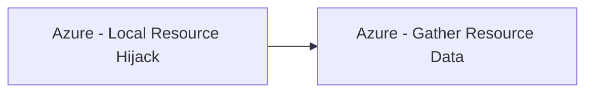

# Azure - Local Resource Hijack

## Metadata

- **UUID**: `85c8e0dd-b012-402d-bb09-5d354c16ebb9`
- **Schema**: `threat::1.0`
- **TLP**: clear

## Description
The following threat vector involves attackers tampering with local files or resources—such 
as profile scripts or pipeline artifacts—to escalate privileges and gain unauthorized 
access to cloud resources.

## Example Attack Scenario

An adversary, with write access to a storage account linked to Azure Machine Learning 
(AML) or Azure CloudShell, modifies a startup or invoker script (e.g., `.bashrc` 
or pipeline component scripts) stored in blob storage. For AML, the attacker replaces 
a component invoker script with malicious code that executes during the next scheduled 
pipeline job. The code then exploits the AML compute’s managed identity—potentially 
inheriting elevated permissions from the pipeline owner—to extract secrets from 
Azure Key Vault, reassign roles, or access broader Azure resources. In CloudShell, 
the `.bashrc` file inside the `.IMG` profile is altered to run commands that covertly 
add an attacker account to privileged roles across the subscription.

## Attack Goals and Impact

- **Privilege escalation**: The attacker aims to execute code or commands under 
a more privileged identity, going from low user/storage access to Contributor, Owner, 
or admin roles in Azure. This may involve extracting secrets from Key Vaults, accessing 
sensitive data, or reassigning role memberships.
- **Persistence and lateral movement**: By hijacking profile/startup scripts or 
pipeline artifacts, the attacker ensures continued access, potentially moving laterally 
to other cloud services or even on-premises networks—all without triggering immediate alarms.
- **Resource abuse**: Attackers may run unauthorized workloads, such as cryptominers, 
or deploy malware, impacting resource costs and security posture.

## Attack Flow and Methodology

1. **Script modification**:
  - AML case: The attacker modifies or uploads a malicious invoker script to the 
  pipeline component directory in the Storage Account. If necessary, the YAML config 
  is altered to ensure execution of the script.
  - CloudShell case: The attacker alters the `.bashrc` (or PowerShell profile) 
  file inside the profile `.IMG` so that, on shell launch, privileged escalation 
  or backdoor commands are executed.
2. **Execution and privilege escalation**:
  - On the next job/pipeline run (AML) or CloudShell launch, the modified script 
  executes with the context of the managed/system identity—often inheriting the 
  permissions of the pipeline owner or compute administrator.
  - Malicious code retrieves secrets, changes role assignments, or accesses broader 
  Azure resources; for CloudShell, commands may add attacker accounts to privileged 
  Azure roles automatically.
3. **Persistence and impact**:
  - The attacker may persist access by continuously modifying invocation scripts 
  or startup files, or by creating new high-privilege accounts/role assignments.
  - Broader impact includes data exfiltration, resource hijacking, or stealthy 
  malware deployment.

## Techniques
- T1496
- T1098.001
- T1078.004

## Chaining

