# Azure - Managed Device Scripting

## Metadata

- **UUID**: `4d9cc646-debc-477b-93cb-4ea74c47c02c`
- **Schema**: `threat::1.0`
- **TLP**: clear

## Description
The following threat vector involves adversaries abusing device management capabilities 
to execute code on devices through services like Intune and Entra ID (AzureAD).

## Example Attack Scenario

An attacker who gains administrative access to AzureAD or Intune can deploy PowerShell 
or Python scripts to managed devices. For example, a compromised AzureAD account 
with device management rights could push a malicious PowerShell script to employee 
laptops using Intune, which then installs ransomware or exfiltrates sensitive data 
without user interaction.

## Attack Goals and Impact

The primary goal is to achieve **remote code execution** across a fleet of managed 
devices. Attackers may aim to:
- Steal credentials or sensitive files
- Install persistence mechanisms for future access
- Deploy ransomware, spyware, or other malware
This can lead to widespread compromise, significant data breaches, and business 
disruption, particularly because device scripting can touch many endpoints simultaneously.

## Attack Flow and Methodology

1. Use administrative capabilities (such as `microsoft.directory/devices/basic/update`) 
to push scripts to selected managed devices.
2. The scripts execute with system-level privileges if the targeting configuration 
is misused, allowing the attacker to harvest data, pivot to other internal resources, 
or further entrench their presence.
3. Attackers may cover tracks by modifying or deleting audit logs accessible through IntuneAuditLogs.

## Techniques
- T1059
- T1021
- T1078

## Chaining

```mermaid
flowchart LR
4d9cc646_debc_477b_93cb_4ea74c47c02c["Azure - Managed Device Scripting"]
140907eb_c9fb_4330_9d71_656422388b2b["Azure - Gather Role Information"]
b1593e0b_1b3b_462d_9ab6_21d1c136469d["Azure - Gather Resource Data"]
2743bf18_3b86_4721_bf3e_153dcda0b149["Azure - Valid Credentials"]
61ddc240_e5a6_4ca8_ae77_6b471b498913["Code execution via custom script extensions in Azure"]
23f6a192_a25d_48b8_a235_7bb55e483682["Persistence with Azure Automanage Machine Configuration"]
4d9cc646_debc_477b_93cb_4ea74c47c02c --> 140907eb_c9fb_4330_9d71_656422388b2b
140907eb_c9fb_4330_9d71_656422388b2b --> b1593e0b_1b3b_462d_9ab6_21d1c136469d
b1593e0b_1b3b_462d_9ab6_21d1c136469d --> 2743bf18_3b86_4721_bf3e_153dcda0b149
2743bf18_3b86_4721_bf3e_153dcda0b149 --> 61ddc240_e5a6_4ca8_ae77_6b471b498913
61ddc240_e5a6_4ca8_ae77_6b471b498913 --> 23f6a192_a25d_48b8_a235_7bb55e483682
```

