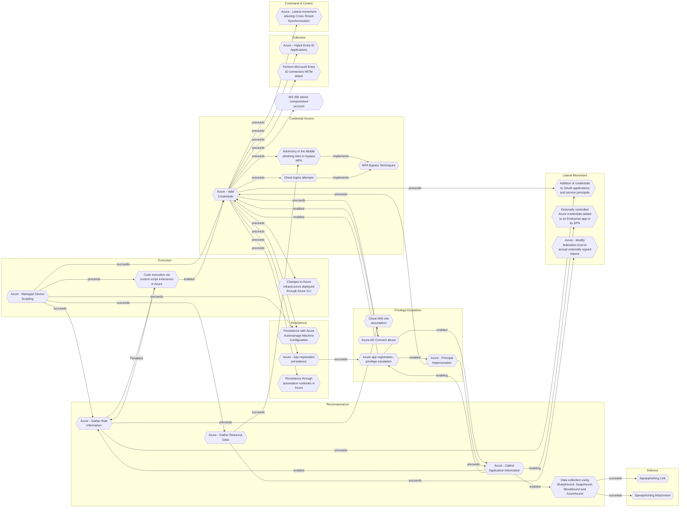

# Azure - Managed Device Scripting

## Metadata
| Field | Value |
| --- | --- |
| UUID | `4d9cc646-debc-477b-93cb-4ea74c47c02c` |
| Schema | `threat::1.0` |
| Version | `2` |
| Created | `2025-09-01` |
| Modified | `2025-09-04` |
| TLP | clear (`TLP:CLEAR`) |
| Organisation | EC DIGIT CSOC (`56b0a0f0-b0bc-47d9-bb46-02f80ae2065a`) |

## References
### Public
- **1**: [https://techcommunity.microsoft.com/t5/security-compliance-and-identity/introducing-the-azure-threat-research-matrix/ba-p/3584976](https://techcommunity.microsoft.com/t5/security-compliance-and-identity/introducing-the-azure-threat-research-matrix/ba-p/3584976)
- **2**: [https://microsoft.github.io/Azure-Threat-Research-Matrix/Execution/AZT303/AZT303/](https://microsoft.github.io/Azure-Threat-Research-Matrix/Execution/AZT303/AZT303/)

## Description
The following threat vector involves adversaries abusing device management capabilities 
to execute code on devices through services like Intune and Entra ID (AzureAD).

## Example Attack Scenario

An attacker who gains administrative access to AzureAD or Intune can deploy PowerShell 
or Python scripts to managed devices. For example, a compromised AzureAD account 
with device management rights could push a malicious PowerShell script to employee 
laptops using Intune, which then installs ransomware or exfiltrates sensitive data 
without user interaction.

## Attack Goals and Impact

The primary goal is to achieve **remote code execution** across a fleet of managed 
devices. Attackers may aim to:
- Steal credentials or sensitive files
- Install persistence mechanisms for future access
- Deploy ransomware, spyware, or other malware
This can lead to widespread compromise, significant data breaches, and business 
disruption, particularly because device scripting can touch many endpoints simultaneously.

## Attack Flow and Methodology

1. Use administrative capabilities (such as `microsoft.directory/devices/basic/update`) 
to push scripts to selected managed devices.
2. The scripts execute with system-level privileges if the targeting configuration 
is misused, allowing the attacker to harvest data, pivot to other internal resources, 
or further entrench their presence.
3. Attackers may cover tracks by modifying or deleting audit logs accessible through IntuneAuditLogs.

## Criticality
**High** - A High priority incident is likely to result in a demonstrable impact to public health or safety, national security, economic security, foreign relations, civil liberties, or public confidence.

## Terrain
Adversaries obtain elevated access within AzureAD or Intune; often
via credential theft, privilege escalation, or social engineering.

## Surface
> **Azure::Security::Entra ID**
> Microsoft Entra ID in Azure (cloud identity)

> **Windows**
> Microsoft Windows operating systems (all versions)

> **Windows::Desktop**
> Microsoft Windows desktop editions

> **Mobile**
> Mobile operating systems (Android, iOS)

> **Azure**
> Microsoft Azure cloud platform

## Threat Assessment
| Dimension | Assessment | Description |
| --- | --- | --- |
| Severity | Significant incident | A cyber attack which has a serious impact on a large organisation or on wider / local government, or which poses a considerable risk to central government or (inter)national essential services. |
| Impact | Data Breach Reputational Damages Identity Theft | Non-public information has been accessed from the outside, and successfully extracted. Damages to the organization public view may be achieved by using directly the access gained, or indirectly with data gathered. Acquisition of sufficient information and privileges to profess as a given individual, for the purpose of abusing and deceiving human trust relationships. |
| Leverage | Elevation of privilege Information Disclosure | Capacity to augment leverage over the target system by upgrading the compromised access rights Threat action intending to read a file that one was not granted access to, or to read data in transit. |
| Viability | Likely | Probable (probably) - 55-80% |
| Kill Chain | Execution | Techniques that result in execution of attacker-controlled code on a local or remote system. |

## Actors
| Actor | ID | Source | Description |
| --- | --- | --- | --- |
| [[Enterprise] Akira](https://attack.mitre.org/groups/G1024) | `att&ck::G1024` | ('att&ck',) | [Akira](https://attack.mitre.org/groups/G1024) is a ransomware variant and ransomware deployment entity active since at least March 2023.(Citation: Arctic Wolf Akira 2023) [Akira](https://attack.mitre.org/groups/G1024) uses compromised credentials to access single-factor external access mechanisms such as VPNs for initial access, then various publicly-available tools and techniques for lateral movement.(Citation: Arctic Wolf Akira 2023)(Citation: Secureworks GOLD SAHARA) [Akira](https://attack.mitre.org/groups/G1024) operations are associated with "double extortion" ransomware activity, where data is exfiltrated from victim environments prior to encryption, with threats to publish files if a ransom is not paid. Technical analysis of [Akira](https://attack.mitre.org/software/S1129) ransomware indicates variants capable of targeting Windows or VMWare ESXi hypervisors and multiple overlaps with [Conti](https://attack.mitre.org/software/S0575) ransomware.(Citation: BushidoToken Akira 2023)(Citation: CISA Akira Ransomware APR 2024)(Citation: Cisco Akira Ransomware OCT 2024) |
| APT19 | `misp::066d25c1-71bd-4bd4-8ca7-edbba00063f4` | ('misp',) | Adversary group targeting financial, technology, non-profit organisations. |
| APT28 | `misp::5b4ee3ea-eee3-4c8e-8323-85ae32658754` | ('misp',) | The Sofacy Group (also known as APT28, Pawn Storm, Fancy Bear and Sednit) is a cyber espionage group believed to have ties to the Russian government. Likely operating since 2007, the group is known to target government, military, and security organizations. It has been characterized as an advanced persistent threat. |
| APT29 | `misp::b2056ff0-00b9-482e-b11c-c771daa5f28a` | ('misp',) | A 2015 report by F-Secure describe APT29 as: 'The Dukes are a well-resourced, highly dedicated and organized cyberespionage group that we believe has been working for the Russian Federation since at least 2008 to collect intelligence in support of foreign and security policy decision-making. The Dukes show unusual confidence in their ability to continue successfully compromising their targets, as well as in their ability to operate with impunity. The Dukes primarily target Western governments and related organizations, such as government ministries and agencies, political think tanks, and governmental subcontractors. Their targets have also included the governments of members of the Commonwealth of Independent States;Asian, African, and Middle Eastern governments;organizations associated with Chechen extremism;and Russian speakers engaged in the illicit trade of controlled substances and drugs. The Dukes are known to employ a vast arsenal of malware toolsets, which we identify as MiniDuke, CosmicDuke, OnionDuke, CozyDuke, CloudDuke, SeaDuke, HammerDuke, PinchDuke, and GeminiDuke. In recent years, the Dukes have engaged in apparently biannual large - scale spear - phishing campaigns against hundreds or even thousands of recipients associated with governmental institutions and affiliated organizations. These campaigns utilize a smash - and - grab approach involving a fast but noisy breakin followed by the rapid collection and exfiltration of as much data as possible.If the compromised target is discovered to be of value, the Dukes will quickly switch the toolset used and move to using stealthier tactics focused on persistent compromise and long - term intelligence gathering. This threat actor targets government ministries and agencies in the West, Central Asia, East Africa, and the Middle East; Chechen extremist groups; Russian organized crime; and think tanks. It is suspected to be behind the 2015 compromise of unclassified networks at the White House, Department of State, Pentagon, and the Joint Chiefs of Staff. The threat actor includes all of the Dukes tool sets, including MiniDuke, CosmicDuke, OnionDuke, CozyDuke, SeaDuke, CloudDuke (aka MiniDionis), and HammerDuke (aka Hammertoss). ' |
| [[Enterprise] APT3](https://attack.mitre.org/groups/G0022) | `att&ck::G0022` | ('att&ck',) | [APT3](https://attack.mitre.org/groups/G0022) is a China-based threat group that researchers have attributed to China's Ministry of State Security.(Citation: FireEye Clandestine Wolf)(Citation: Recorded Future APT3 May 2017) This group is responsible for the campaigns known as Operation Clandestine Fox, Operation Clandestine Wolf, and Operation Double Tap.(Citation: FireEye Clandestine Wolf)(Citation: FireEye Operation Double Tap) As of June 2015, the group appears to have shifted from targeting primarily US victims to primarily political organizations in Hong Kong.(Citation: Symantec Buckeye) |
| APT32 | `misp::aa29ae56-e54b-47a2-ad16-d3ab0242d5d7` | ('misp',) | Cyber espionage actors, now designated by FireEye as APT32 (OceanLotus Group), are carrying out intrusions into private sector companies across multiple industries and have also targeted foreign governments, dissidents, and journalists. FireEye assesses that APT32 leverages a unique suite of fully-featured malware, in conjunction with commercially-available tools, to conduct targeted operations that are aligned with Vietnamese state interests. |
| APT37 | `misp::50cd027f-df14-40b2-aa22-bf5de5061163` | ('misp',) | APT37 has likely been active since at least 2012 and focuses on targeting the public and private sectors primarily in South Korea. In 2017, APT37 expanded its targeting beyond the Korean peninsula to include Japan, Vietnam and the Middle East, and to a wider range of industry verticals, including chemicals, electronics, manufacturing, aerospace, automotive and healthcare entities |
| [[Enterprise] Dragonfly](https://attack.mitre.org/groups/G0035) | `att&ck::G0035` | ('att&ck',) | [Dragonfly](https://attack.mitre.org/groups/G0035) is a cyber espionage group that has been attributed to Russia's Federal Security Service (FSB) Center 16.(Citation: DOJ Russia Targeting Critical Infrastructure March 2022)(Citation: UK GOV FSB Factsheet April 2022) Active since at least 2010, [Dragonfly](https://attack.mitre.org/groups/G0035) has targeted defense and aviation companies, government entities, companies related to industrial control systems, and critical infrastructure sectors worldwide through supply chain, spearphishing, and drive-by compromise attacks.(Citation: Symantec Dragonfly)(Citation: Secureworks IRON LIBERTY July 2019)(Citation: Symantec Dragonfly Sept 2017)(Citation: Fortune Dragonfly 2.0 Sept 2017)(Citation: Gigamon Berserk Bear October 2021)(Citation: CISA AA20-296A Berserk Bear December 2020)(Citation: Symantec Dragonfly 2.0 October 2017) |
| [[Enterprise] RedCurl](https://attack.mitre.org/groups/G1039) | `att&ck::G1039` | ('att&ck',) | [RedCurl](https://attack.mitre.org/groups/G1039) is a threat actor active since 2018 notable for corporate espionage targeting a variety of locations, including Ukraine, Canada and the United Kingdom, and a variety of industries, including but not limited to travel agencies, insurance companies, and banks.(Citation: group-ib_redcurl1) [RedCurl](https://attack.mitre.org/groups/G1039) is allegedly a Russian-speaking threat actor.(Citation: group-ib_redcurl1)(Citation: group-ib_redcurl2) The group’s operations typically start with spearphishing emails to gain initial access, then the group executes discovery and collection commands and scripts to find corporate data. The group concludes operations by exfiltrating files to the C2 servers. |
| Rocke | `misp::53583c40-935e-11e9-b4fc-d7e217a306d2` | ('misp',) | This threat actor initially came to our attention in April 2018, leveraging both Western and Chinese Git repositories to deliver malware to honeypot systems vulnerable to an Apache Struts vulnerability. In late July, we became aware that the same actor was engaged in another similar campaign. Through our investigation into this new campaign, we were able to uncover more details about the actor. |
| Tonto Team | `misp::0ab7c8de-fc23-4793-99aa-7ee336199e26` | ('misp',) | Tonto Team is a Chinese-speaking APT group that has been active since at least 2013. They primarily target military, diplomatic, and infrastructure organizations in Asia and Eastern Europe. The group has been observed using various malware, including the Bisonal RAT and ShadowPad. They employ spear-phishing emails with malicious attachments as their preferred method of distribution. |
| APT31 | `misp::6bf7e6b6-5917-45a6-9567-f0baba79768c` | ('misp',) | FireEye characterizes APT31 as an actor specialized on intellectual property theft, focusing on data and projects that make a particular organization competetive in its field. Based on available data (April 2016), FireEye assesses that APT31 conducts network operations at the behest of the Chinese Government. Also according to Crowdstrike, this adversary is suspected of continuing to target upstream providers (e.g., law firms and managed service providers) to support additional intrusions against high-profile assets. In 2018, CrowdStrike observed this adversary using spear-phishing, URL “web bugs” and scheduled tasks to automate credential harvesting. |

## ATT&CK Techniques
| Technique | Name | Description |
| --- | --- | --- |
| `T1059` | [Command and Scripting Interpreter](https://attack.mitre.org/techniques/T1059) | Adversaries may abuse command and script interpreters to execute commands, scripts, or binaries. These interfaces and languages provide ways of interacting with computer systems and are a common feature across many different platforms. Most systems come with some built-in command-line interface and scripting capabilities, for example, macOS and Linux distributions include some flavor of [Unix Shell](https://attack.mitre.org/techniques/T1059/004) while Windows installations include the [Windows Command Shell](https://attack.mitre.org/techniques/T1059/003) and [PowerShell](https://attack.mitre.org/techniques/T1059/001).  There are also cross-platform interpreters such as [Python](https://attack.mitre.org/techniques/T1059/006), as well as those commonly associated with client applications such as [JavaScript](https://attack.mitre.org/techniques/T1059/007) and [Visual Basic](https://attack.mitre.org/techniques/T1059/005).  Adversaries may abuse these technologies in various ways as a means of executing arbitrary commands. Commands and scripts can be embedded in [Initial Access](https://attack.mitre.org/tactics/TA0001) payloads delivered to victims as lure documents or as secondary payloads downloaded from an existing C2. Adversaries may also execute commands through interactive terminals/shells, as well as utilize various [Remote Services](https://attack.mitre.org/techniques/T1021) in order to achieve remote Execution.(Citation: Powershell Remote Commands)(Citation: Cisco IOS Software Integrity Assurance - Command History)(Citation: Remote Shell Execution in Python) |
| `T1021` | [Remote Services](https://attack.mitre.org/techniques/T1021) | Adversaries may use [Valid Accounts](https://attack.mitre.org/techniques/T1078) to log into a service that accepts remote connections, such as telnet, SSH, and VNC. The adversary may then perform actions as the logged-on user.  In an enterprise environment, servers and workstations can be organized into domains. Domains provide centralized identity management, allowing users to login using one set of credentials across the entire network. If an adversary is able to obtain a set of valid domain credentials, they could login to many different machines using remote access protocols such as secure shell (SSH) or remote desktop protocol (RDP).(Citation: SSH Secure Shell)(Citation: TechNet Remote Desktop Services) They could also login to accessible SaaS or IaaS services, such as those that federate their identities to the domain, or management platforms for internal virtualization environments such as VMware vCenter.   Legitimate applications (such as [Software Deployment Tools](https://attack.mitre.org/techniques/T1072) and other administrative programs) may utilize [Remote Services](https://attack.mitre.org/techniques/T1021) to access remote hosts. For example, Apple Remote Desktop (ARD) on macOS is native software used for remote management. ARD leverages a blend of protocols, including [VNC](https://attack.mitre.org/techniques/T1021/005) to send the screen and control buffers and [SSH](https://attack.mitre.org/techniques/T1021/004) for secure file transfer.(Citation: Remote Management MDM macOS)(Citation: Kickstart Apple Remote Desktop commands)(Citation: Apple Remote Desktop Admin Guide 3.3) Adversaries can abuse applications such as ARD to gain remote code execution and perform lateral movement. In versions of macOS prior to 10.14, an adversary can escalate an SSH session to an ARD session which enables an adversary to accept TCC (Transparency, Consent, and Control) prompts without user interaction and gain access to data.(Citation: FireEye 2019 Apple Remote Desktop)(Citation: Lockboxx ARD 2019)(Citation: Kickstart Apple Remote Desktop commands) |
| `T1078` | [Valid Accounts](https://attack.mitre.org/techniques/T1078) | Adversaries may obtain and abuse credentials of existing accounts as a means of gaining Initial Access, Persistence, Privilege Escalation, or Defense Evasion. Compromised credentials may be used to bypass access controls placed on various resources on systems within the network and may even be used for persistent access to remote systems and externally available services, such as VPNs, Outlook Web Access, network devices, and remote desktop.(Citation: volexity_0day_sophos_FW) Compromised credentials may also grant an adversary increased privilege to specific systems or access to restricted areas of the network. Adversaries may choose not to use malware or tools in conjunction with the legitimate access those credentials provide to make it harder to detect their presence.  In some cases, adversaries may abuse inactive accounts: for example, those belonging to individuals who are no longer part of an organization. Using these accounts may allow the adversary to evade detection, as the original account user will not be present to identify any anomalous activity taking place on their account.(Citation: CISA MFA PrintNightmare)  The overlap of permissions for local, domain, and cloud accounts across a network of systems is of concern because the adversary may be able to pivot across accounts and systems to reach a high level of access (i.e., domain or enterprise administrator) to bypass access controls set within the enterprise.(Citation: TechNet Credential Theft) |

## Chaining

### Chaining details
#### succeeds -> [Azure - Gather Role Information](azure-gather-role-information.md) (`140907eb-c9fb-4330-9d71-656422388b2b`) (`sequence::succeeds`)
Adversaries need to identify privileged accounts and misconfigured role 
assignments that can be exploited for privilege escalation.

- **Target UUID**: `140907eb-c9fb-4330-9d71-656422388b2b`
#### succeeds -> [Azure - Gather Resource Data](azure-gather-resource-data.md) (`b1593e0b-1b3b-462d-9ab6-21d1c136469d`) (`sequence::succeeds`)
The attacker obtains credentials (via phishing, password spray, leaked keys)
granting at least Reader access to the target Azure tenant.

- **Target UUID**: `b1593e0b-1b3b-462d-9ab6-21d1c136469d`
#### succeeds -> [Azure - Valid Credentials](azure-valid-credentials.md) (`2743bf18-3b86-4721-bf3e-153dcda0b149`) (`sequence::succeeds`)
Adversaries obtain the username and password of an AzureAD user either through
phishing, password spraying, brute-force attacks, or credentials leaked online.

- **Target UUID**: `2743bf18-3b86-4721-bf3e-153dcda0b149`
#### preceeds -> [Code execution via custom script extensions in Azure](code-execution-via-custom-script-extensions-in-azure.md) (`61ddc240-e5a6-4ca8-ae77-6b471b498913`) (`sequence::preceeds`)
Adversaries must have an Azure role that grants the ability to write or deploy 
custom script extensions on virtual machines.

- **Target UUID**: `61ddc240-e5a6-4ca8-ae77-6b471b498913`
#### preceeds -> [Persistence with Azure Automanage Machine Configuration](persistence-with-azure-automanage-machine-configuration.md) (`23f6a192-a25d-48b8-a235-7bb55e483682`) (`sequence::preceeds`)
The adversary needs the owner access role on the targeted Azure subscription to apply
the Azure Policy and grant permissions for the system-managed identities.

- **Target UUID**: `23f6a192-a25d-48b8-a235-7bb55e483682`
