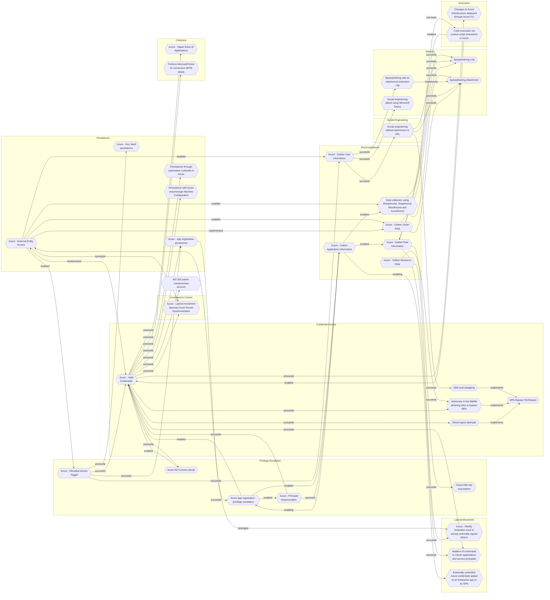

# Azure - Modify federation trust to accept externally signed tokens

## Metadata
| Field | Value |
| --- | --- |
| UUID | `9bb31c65-8abd-48fc-afe3-8aca76109737` |
| Schema | `threat::1.0` |
| Version | `4` |
| Created | `2022-03-06` |
| Modified | `2025-01-01` |
| TLP | clear (`TLP:CLEAR`) |
| Organisation | EC DIGIT CSOC (`56b0a0f0-b0bc-47d9-bb46-02f80ae2065a`) |

## References
### Public
- **1**: [https://www.microsoft.com/security/blog/2020/12/28/using-microsoft-365-defender-to-coordinate-protection-against-solorigate/](https://www.microsoft.com/security/blog/2020/12/28/using-microsoft-365-defender-to-coordinate-protection-against-solorigate/)

## Description
Once they acquired sufficient priviledges,attackers add their own certificate as 
a trusted entity in the domain either by adding a new federation trust to 
an existing tenant or modifying the properties of an existing federation 
trust. As a result, any SAML token they create and sign will be valid for 
the identity of their choosing. This attack may be performed as an alternative
to the Golden SAML attack to gain persistent access without having to sign 
the SAML response at each access request, while needing the same amount of control 
over the ADFS server.

## Criticality
**Emergency** - An Emergency priority incident poses an imminent threat to the provision of wide-scale critical infrastructure services, national government stability, or human lives.

## Terrain
Attackers need to have gained administrative Azure Active Directory
(Azure AD) privileges using compromised credentials

## Surface
> **Azure::Security::Entra ID**
> Microsoft Entra ID in Azure (cloud identity)

> **Active Directory::Federation Services**
> Active Directory Federation Services (AD FS)

> **AWS::Security::IAM**
> AWS Identity and Access Management

> **Entra ID**
> Microsoft Entra ID (formerly Azure Active Directory)

> **SAML**
> Security Assertion Markup Language federation protocol

## Threat Assessment
| Dimension | Assessment | Description |
| --- | --- | --- |
| Severity | National cyber emergency | A cyber attack which causes sustained disruption of (inter)national essential services or affects (inter)national national security, leading to severe economic or social consequences or to loss of life. |
| Impact | Data Breach | Non-public information has been accessed from the outside, and successfully extracted. |
| Leverage | Elevation of privilege Spoofing | Capacity to augment leverage over the target system by upgrading the compromised access rights Threat action aimed at accessing and use of another user’s credentials, such as username and password. |
| Viability | Almost certain | Nearly certain - 95-99% |
| Kill Chain | Lateral Movement | Techniques that enable an adversary to horizontally access and control other remote systems. |

## Actors
| Actor | ID | Source | Description |
| --- | --- | --- | --- |
| [[Enterprise] APT29](https://attack.mitre.org/groups/G0016) | `att&ck::G0016` | ('att&ck',) | [APT29](https://attack.mitre.org/groups/G0016) is threat group that has been attributed to Russia's Foreign Intelligence Service (SVR).(Citation: White House Imposing Costs RU Gov April 2021)(Citation: UK Gov Malign RIS Activity April 2021) They have operated since at least 2008, often targeting government networks in Europe and NATO member countries, research institutes, and think tanks. [APT29](https://attack.mitre.org/groups/G0016) reportedly compromised the Democratic National Committee starting in the summer of 2015.(Citation: F-Secure The Dukes)(Citation: GRIZZLY STEPPE JAR)(Citation: Crowdstrike DNC June 2016)(Citation: UK Gov UK Exposes Russia SolarWinds April 2021)  In April 2021, the US and UK governments attributed the [SolarWinds Compromise](https://attack.mitre.org/campaigns/C0024) to the SVR; public statements included citations to [APT29](https://attack.mitre.org/groups/G0016), Cozy Bear, and The Dukes.(Citation: NSA Joint Advisory SVR SolarWinds April 2021)(Citation: UK NSCS Russia SolarWinds April 2021) Industry reporting also referred to the actors involved in this campaign as UNC2452, NOBELIUM, StellarParticle, Dark Halo, and SolarStorm.(Citation: FireEye SUNBURST Backdoor December 2020)(Citation: MSTIC NOBELIUM Mar 2021)(Citation: CrowdStrike SUNSPOT Implant January 2021)(Citation: Volexity SolarWinds)(Citation: Cybersecurity Advisory SVR TTP May 2021)(Citation: Unit 42 SolarStorm December 2020) |
| UNC2452 | `misp::2ee5ed7a-c4d0-40be-a837-20817474a15b` | ('misp',) | Reporting regarding activity related to the SolarWinds supply chain injection has grown quickly since initial disclosure on 13 December 2020. A significant amount of press reporting has focused on the identification of the actor(s) involved, victim organizations, possible campaign timeline, and potential impact. The US Government and cyber community have also provided detailed information on how the campaign was likely conducted and some of the malware used.  MITRE’s ATT&CK team — with the assistance of contributors — has been mapping techniques used by the actor group, referred to as UNC2452/Dark Halo by FireEye and Volexity respectively, as well as SUNBURST and TEARDROP malware. |

## ATT&CK Techniques
| Technique | Name | Description |
| --- | --- | --- |
| `T1484.002` | [Domain or Tenant Policy Modification: Trust Modification](https://attack.mitre.org/techniques/T1484/002) | Adversaries may add new domain trusts, modify the properties of existing domain trusts, or otherwise change the configuration of trust relationships between domains and tenants to evade defenses and/or elevate privileges.Trust details, such as whether or not user identities are federated, allow authentication and authorization properties to apply between domains or tenants for the purpose of accessing shared resources.(Citation: Microsoft - Azure AD Federation) These trust objects may include accounts, credentials, and other authentication material applied to servers, tokens, and domains.  Manipulating these trusts may allow an adversary to escalate privileges and/or evade defenses by modifying settings to add objects which they control. For example, in Microsoft Active Directory (AD) environments, this may be used to forge [SAML Tokens](https://attack.mitre.org/techniques/T1606/002) without the need to compromise the signing certificate to forge new credentials. Instead, an adversary can manipulate domain trusts to add their own signing certificate. An adversary may also convert an AD domain to a federated domain using Active Directory Federation Services (AD FS), which may enable malicious trust modifications such as altering the claim issuance rules to log in any valid set of credentials as a specified user.(Citation: AADInternals zure AD Federated Domain)   An adversary may also add a new federated identity provider to an identity tenant such as Okta or AWS IAM Identity Center, which may enable the adversary to authenticate as any user of the tenant.(Citation: Okta Cross-Tenant Impersonation 2023) This may enable the threat actor to gain broad access into a variety of cloud-based services that leverage the identity tenant. For example, in AWS environments, an adversary that creates a new identity provider for an AWS Organization will be able to federate into all of the AWS Organization member accounts without creating identities for each of the member accounts.(Citation: AWS RE:Inforce Threat Detection 2024) |

## Chaining

