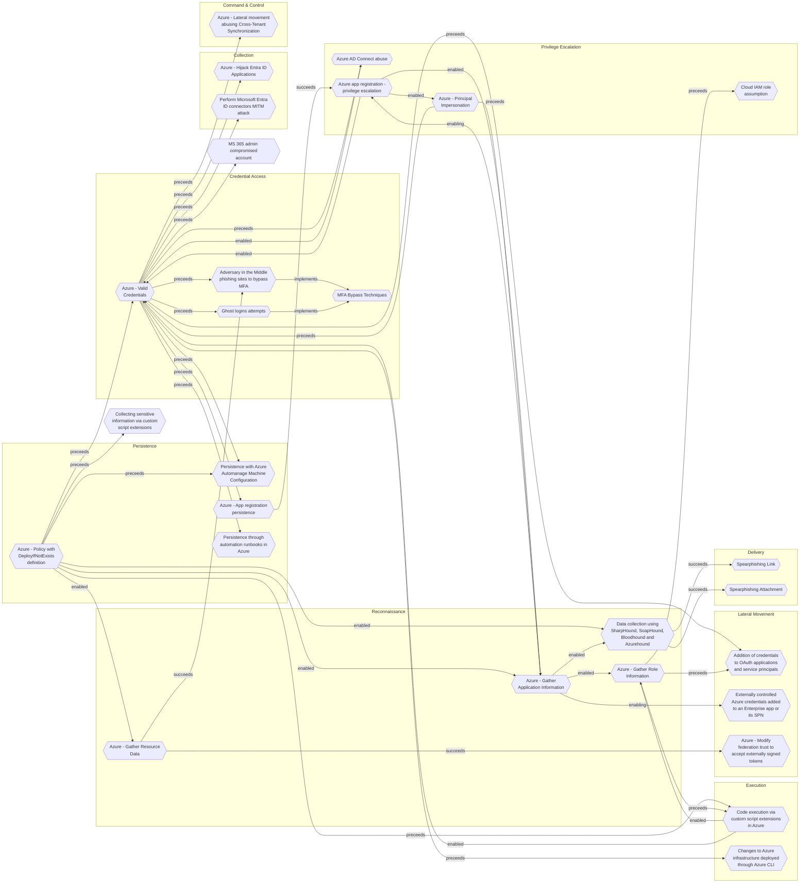

# Azure - Policy with DeployIfNotExists definition

## Metadata
| Field | Value |
| --- | --- |
| UUID | `37f24c48-4a38-4682-aa76-5845ed2d6890` |
| Schema | `threat::1.0` |
| Version | `1` |
| Created | `2025-09-29` |
| Modified | `2025-09-29` |
| TLP | clear (`TLP:CLEAR`) |
| Organisation | EC DIGIT CSOC (`56b0a0f0-b0bc-47d9-bb46-02f80ae2065a`) |

## References
### Public
- **1**: [https://cloudbrothers.info/azure-persistence-azure-policy-guest-configuration/](https://cloudbrothers.info/azure-persistence-azure-policy-guest-configuration/)
- **2**: [https://securitylabs.datadoghq.com/articles/azure-policy-privilege-escalation/](https://securitylabs.datadoghq.com/articles/azure-policy-privilege-escalation/)
- **3**: [https://microsoft.github.io/Azure-Threat-Research-Matrix/Persistence/Persistence/](https://microsoft.github.io/Azure-Threat-Research-Matrix/Persistence/Persistence/)

## Description
The following threat vector, let attackers maintain long-term access or
facilitate further exploitation. 

### Example Attack Scenario

An attacker with sufficient permissions in an Azure tenant creates or modifies 
an Azure Policy using the `DeployIfNotExists` policy definition. This policy is
engineered to deploy a malicious resource (e.g., a virtual machine extension,
a role assignment, or a script backdoor) whenever certain conditions are met, 
such as new VMs being provisioned. The attacker also triggers remediation so
the malicious payload is retroactively deployed to existing resources in scope.  

For example, the attacker could use Azure Policy to automatically grant their
account or service principal administrative permissions on every new or existing
VM, or silently disable logging and monitoring across sensitive assets to evade
detection.

### Attack Goals and Impact

The objective is to enable persistent access or privilege escalation by leveraging 
Azure's orchestration and policy automation features. Typical goals include:
- Establishing backdoors in affected resources (VMs, service principals, databases) 
for repeated covert access.
- Modifying logging, auditing, or security configurations to avoid detection (for 
instance, disabling Azure Activity Logs for specific assets).
- Automatically re-applying attacker-controlled changes whenever the legitimate 
administrator attempts remediation or, through continuous policy enforcement, on 
every new resource.
- Assigning additional permissions, modifying access control lists, or deploying 
malware through policy-triggered tasks.
The impact is broad, enabling attackers to maintain long-term access with minimal 
operational footprint, bypass typical monitoring controls, manipulate resources 
at scale, and orchestrate further attack stages (such as lateral movement or
privilege escalation).

### Attack Flow and Methodology

The typical attacker workflow follows these steps:

- **Policy Creation/Modification**: A new policy is created, or an existing one 
is modified, with a "DeployIfNotExists" or similarly reactive definition. The definition 
specifies a payload—such as deploying a VM extension, custom script, role assignment, 
or other resource manipulation—that achieves the persistence goal.
- **Scope Assignment**: The attacker assigns the malicious policy to targeted scopes 
(resource groups, subscriptions, or management groups) to maximize coverage and effect.
- **Remediation Triggering**: Remediation is kicked off so policy enforcement is 
applied to existing resources—retrospectively deploying the backdoor.
- **Continuous Enforcement**: As policy is automatically enforced, every future 
resource creation or update within scope will bear the attacker's payload—ensuring 
persistence and stealth.
- **Evading Detection**: The attacker may also configure policies to weaken monitoring, 
disable security logging, or only target specific assets to avoid suspicion and discovery.

## Criticality
**High** - A High priority incident is likely to result in a demonstrable impact to public health or safety, national security, economic security, foreign relations, civil liberties, or public confidence.

## Terrain
Adversaries identifies existing policy and permissions landscape,
acquiring sufficient privileges over Azure Policy management and
remediation.

## Surface
> **Azure**
> Microsoft Azure cloud platform

> **Azure::Security::Entra ID**
> Microsoft Entra ID in Azure (cloud identity)

> **AWS::Storage**
> AWS storage services

> **Orchestration::Kubernetes**
> Kubernetes container orchestration platform

> **Azure::Compute::Virtual Machines**
> Azure Virtual Machines

> **Serverless**
> Cloud-agnostic serverless compute (when not provider-specific)

## Threat Assessment
| Dimension | Assessment | Description |
| --- | --- | --- |
| Severity | Significant incident | A cyber attack which has a serious impact on a large organisation or on wider / local government, or which poses a considerable risk to central government or (inter)national essential services. |
| Impact | Data Breach IP Loss Reputational Damages Identity Theft | Non-public information has been accessed from the outside, and successfully extracted. Particular, key data, information and blueprint conducive to the organization capability to gain and retain a commercial or geopolitical advantage has been accessed, and their content potentially used by competitors or other adversaries. Damages to the organization public view may be achieved by using directly the access gained, or indirectly with data gathered. Acquisition of sufficient information and privileges to profess as a given individual, for the purpose of abusing and deceiving human trust relationships. |
| Leverage | Spoofing Tampering Repudiation Information Disclosure Elevation of privilege Modify configuration | Threat action aimed at accessing and use of another user’s credentials, such as username and password. Threat action intending to maliciously change or modify persistent data, such as records in a database, and the alteration of data in transit between two computers over an open network, such as the Internet. Threat action aimed at performing prohibited operations in a system that lacks the ability to trace the operations. Threat action intending to read a file that one was not granted access to, or to read data in transit. Capacity to augment leverage over the target system by upgrading the compromised access rights Modify configuration or services |
| Viability | Very Likely | Highly probable - 80-95% |
| Kill Chain | Persistence | Any access, action or change to a system that gives an attacker persistent presence on the system. |

## ATT&CK Techniques
| Technique | Name | Description |
| --- | --- | --- |
| `T1098` | [Account Manipulation](https://attack.mitre.org/techniques/T1098) | Adversaries may manipulate accounts to maintain and/or elevate access to victim systems. Account manipulation may consist of any action that preserves or modifies adversary access to a compromised account, such as modifying credentials or permission groups.(Citation: FireEye SMOKEDHAM June 2021) These actions could also include account activity designed to subvert security policies, such as performing iterative password updates to bypass password duration policies and preserve the life of compromised credentials.   In order to create or manipulate accounts, the adversary must already have sufficient permissions on systems or the domain. However, account manipulation may also lead to privilege escalation where modifications grant access to additional roles, permissions, or higher-privileged [Valid Accounts](https://attack.mitre.org/techniques/T1078). |
| `T1078.004` | [Valid Accounts: Cloud Accounts](https://attack.mitre.org/techniques/T1078/004) | Valid accounts in cloud environments may allow adversaries to perform actions to achieve Initial Access, Persistence, Privilege Escalation, or Defense Evasion. Cloud accounts are those created and configured by an organization for use by users, remote support, services, or for administration of resources within a cloud service provider or SaaS application. Cloud Accounts can exist solely in the cloud; alternatively, they may be hybrid-joined between on-premises systems and the cloud through syncing or federation with other identity sources such as Windows Active Directory.(Citation: AWS Identity Federation)(Citation: Google Federating GC)(Citation: Microsoft Deploying AD Federation)  Service or user accounts may be targeted by adversaries through [Brute Force](https://attack.mitre.org/techniques/T1110), [Phishing](https://attack.mitre.org/techniques/T1566), or various other means to gain access to the environment. Federated or synced accounts may be a pathway for the adversary to affect both on-premises systems and cloud environments - for example, by leveraging shared credentials to log onto [Remote Services](https://attack.mitre.org/techniques/T1021). High privileged cloud accounts, whether federated, synced, or cloud-only, may also allow pivoting to on-premises environments by leveraging SaaS-based [Software Deployment Tools](https://attack.mitre.org/techniques/T1072) to run commands on hybrid-joined devices.  An adversary may create long lasting [Additional Cloud Credentials](https://attack.mitre.org/techniques/T1098/001) on a compromised cloud account to maintain persistence in the environment. Such credentials may also be used to bypass security controls such as multi-factor authentication.   Cloud accounts may also be able to assume [Temporary Elevated Cloud Access](https://attack.mitre.org/techniques/T1548/005) or other privileges through various means within the environment. Misconfigurations in role assignments or role assumption policies may allow an adversary to use these mechanisms to leverage permissions outside the intended scope of the account. Such over privileged accounts may be used to harvest sensitive data from online storage accounts and databases through [Cloud API](https://attack.mitre.org/techniques/T1059/009) or other methods. For example, in Azure environments, adversaries may target Azure Managed Identities, which allow associated Azure resources to request access tokens. By compromising a resource with an attached Managed Identity, such as an Azure VM, adversaries may be able to [Steal Application Access Token](https://attack.mitre.org/techniques/T1528)s to move laterally across the cloud environment.(Citation: SpecterOps Managed Identity 2022) |
| `T1578` | [Modify Cloud Compute Infrastructure](https://attack.mitre.org/techniques/T1578) | An adversary may attempt to modify a cloud account's compute service infrastructure to evade defenses. A modification to the compute service infrastructure can include the creation, deletion, or modification of one or more components such as compute instances, virtual machines, and snapshots.  Permissions gained from the modification of infrastructure components may bypass restrictions that prevent access to existing infrastructure. Modifying infrastructure components may also allow an adversary to evade detection and remove evidence of their presence.(Citation: Mandiant M-Trends 2020) |

## Chaining

### Chaining details
#### preceeds -> [Azure - Valid Credentials](azure-valid-credentials.md) (`2743bf18-3b86-4721-bf3e-153dcda0b149`) (`sequence::preceeds`)
Adversaries obtain the username and password of an AzureAD user either through phishing, 
password spraying, brute-force attacks, or credentials leaked online.

- **Target UUID**: `2743bf18-3b86-4721-bf3e-153dcda0b149`
#### enabled -> [Azure - Gather Application Information](azure-gather-application-information.md) (`fe6827f2-efb4-43b3-9ca3-b7d417111b32`) (`support::enabled`)
Adversaries obtain minimal access (often as a standard user or via an external account) 
in the target Azure AD tenant, then utilizes API endpoints and tools, such as Azure CLI, 
PowerShell modules (e.g., MSOnline, Microsoft.Graph), or custom scripts, to list 
all registered applications.

- **Target UUID**: `fe6827f2-efb4-43b3-9ca3-b7d417111b32`
#### preceeds -> [Code execution via custom script extensions in Azure](code-execution-via-custom-script-extensions-in-azure.md) (`61ddc240-e5a6-4ca8-ae77-6b471b498913`) (`sequence::preceeds`)
Adversaries must have an Azure role that grants the ability to write or deploy 
custom script extensions on virtual machines.

- **Target UUID**: `61ddc240-e5a6-4ca8-ae77-6b471b498913`
#### preceeds -> [Persistence with Azure Automanage Machine Configuration](persistence-with-azure-automanage-machine-configuration.md) (`23f6a192-a25d-48b8-a235-7bb55e483682`) (`sequence::preceeds`)
The adversary needs the owner access role on the targeted Azure subscription to apply
the Azure Policy and grant permissions for the system-managed identities.

- **Target UUID**: `23f6a192-a25d-48b8-a235-7bb55e483682`
#### preceeds -> [Collecting sensitive information via custom script extensions](collecting-sensitive-information-via-custom-script-extensions.md) (`b954303c-0ad0-4dc0-b5ca-492c3de9cd53`) (`sequence::preceeds`)
Attackers need to gain access to an Azure account with the Virtual Machine Contributor 
role (or equivalent) can use custom script extensions to execute arbitrary code 
as SYSTEM or root on VMs.

- **Target UUID**: `b954303c-0ad0-4dc0-b5ca-492c3de9cd53`
#### enabled -> [Azure - Gather Resource Data](azure-gather-resource-data.md) (`b1593e0b-1b3b-462d-9ab6-21d1c136469d`) (`support::enabled`)
The attacker obtains credentials (via phishing, password spray, leaked keys) granting 
at least Reader access to the target Azure tenant.

- **Target UUID**: `b1593e0b-1b3b-462d-9ab6-21d1c136469d`
#### enabled -> [Data collection using SharpHound, SoapHound, Bloodhound and Azurehound](data-collection-using-sharphound-soaphound-bloodhound-and-azurehound.md) (`53063205-4404-4e6d-a2f5-d566c6085d96`) (`support::enabled`)
Attackers need to establish an initial presence within the target environment, in 
order to gather sufficient permissions to execute the data collection tools.

- **Target UUID**: `53063205-4404-4e6d-a2f5-d566c6085d96`
