# Azure - Policy with DeployIfNotExists definition

## Metadata

- **UUID**: `37f24c48-4a38-4682-aa76-5845ed2d6890`
- **Schema**: `threat::1.0`
- **TLP**: clear

## Description
The following threat vector, let attackers maintain long-term access or
facilitate further exploitation. 

### Example Attack Scenario

An attacker with sufficient permissions in an Azure tenant creates or modifies 
an Azure Policy using the `DeployIfNotExists` policy definition. This policy is
engineered to deploy a malicious resource (e.g., a virtual machine extension,
a role assignment, or a script backdoor) whenever certain conditions are met, 
such as new VMs being provisioned. The attacker also triggers remediation so
the malicious payload is retroactively deployed to existing resources in scope.  

For example, the attacker could use Azure Policy to automatically grant their
account or service principal administrative permissions on every new or existing
VM, or silently disable logging and monitoring across sensitive assets to evade
detection.

### Attack Goals and Impact

The objective is to enable persistent access or privilege escalation by leveraging 
Azure's orchestration and policy automation features. Typical goals include:
- Establishing backdoors in affected resources (VMs, service principals, databases) 
for repeated covert access.
- Modifying logging, auditing, or security configurations to avoid detection (for 
instance, disabling Azure Activity Logs for specific assets).
- Automatically re-applying attacker-controlled changes whenever the legitimate 
administrator attempts remediation or, through continuous policy enforcement, on 
every new resource.
- Assigning additional permissions, modifying access control lists, or deploying 
malware through policy-triggered tasks.
The impact is broad, enabling attackers to maintain long-term access with minimal 
operational footprint, bypass typical monitoring controls, manipulate resources 
at scale, and orchestrate further attack stages (such as lateral movement or
privilege escalation).

### Attack Flow and Methodology

The typical attacker workflow follows these steps:

- **Policy Creation/Modification**: A new policy is created, or an existing one 
is modified, with a "DeployIfNotExists" or similarly reactive definition. The definition 
specifies a payload—such as deploying a VM extension, custom script, role assignment, 
or other resource manipulation—that achieves the persistence goal.
- **Scope Assignment**: The attacker assigns the malicious policy to targeted scopes 
(resource groups, subscriptions, or management groups) to maximize coverage and effect.
- **Remediation Triggering**: Remediation is kicked off so policy enforcement is 
applied to existing resources—retrospectively deploying the backdoor.
- **Continuous Enforcement**: As policy is automatically enforced, every future 
resource creation or update within scope will bear the attacker's payload—ensuring 
persistence and stealth.
- **Evading Detection**: The attacker may also configure policies to weaken monitoring, 
disable security logging, or only target specific assets to avoid suspicion and discovery.

## Techniques
- T1098
- T1078.004
- T1578

## Chaining

```mermaid
flowchart LR
37f24c48_4a38_4682_aa76_5845ed2d6890["Azure - Policy with DeployIfNotExists definition"]
2743bf18_3b86_4721_bf3e_153dcda0b149["Azure - Valid Credentials"]
fe6827f2_efb4_43b3_9ca3_b7d417111b32["Azure - Gather Application Information"]
61ddc240_e5a6_4ca8_ae77_6b471b498913["Code execution via custom script extensions in Azure"]
23f6a192_a25d_48b8_a235_7bb55e483682["Persistence with Azure Automanage Machine Configuration"]
b954303c_0ad0_4dc0_b5ca_492c3de9cd53["Collecting sensitive information via custom script extensions"]
b1593e0b_1b3b_462d_9ab6_21d1c136469d["Azure - Gather Resource Data"]
53063205_4404_4e6d_a2f5_d566c6085d96["Data collection using SharpHound, SoapHound, Bloodhound and Azurehound"]
37f24c48_4a38_4682_aa76_5845ed2d6890 --> 2743bf18_3b86_4721_bf3e_153dcda0b149
2743bf18_3b86_4721_bf3e_153dcda0b149 --> fe6827f2_efb4_43b3_9ca3_b7d417111b32
fe6827f2_efb4_43b3_9ca3_b7d417111b32 --> 61ddc240_e5a6_4ca8_ae77_6b471b498913
61ddc240_e5a6_4ca8_ae77_6b471b498913 --> 23f6a192_a25d_48b8_a235_7bb55e483682
23f6a192_a25d_48b8_a235_7bb55e483682 --> b954303c_0ad0_4dc0_b5ca_492c3de9cd53
b954303c_0ad0_4dc0_b5ca_492c3de9cd53 --> b1593e0b_1b3b_462d_9ab6_21d1c136469d
b1593e0b_1b3b_462d_9ab6_21d1c136469d --> 53063205_4404_4e6d_a2f5_d566c6085d96
```

