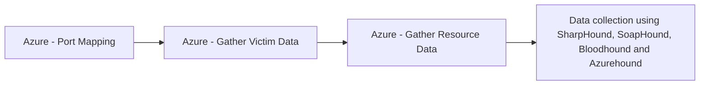

# Azure - Port Mapping

## Metadata

- **UUID**: `394dde97-4a8c-4b6a-8f8b-c6bf18a7a87f`
- **Schema**: `threat::1.0`
- **TLP**: clear

## Description
Port mapping in Azure refers to the process of exposing internal ports of virtual 
machines (VMs), containers, or services to external networks, often through Azure 
Load Balancers, Network Security Groups (NSGs), or NAT rules. This allows external 
users or services to access resources inside a private Azure network by mapping 
public ports to private ones.

### How Port Mapping Can Be a Threat Vector

Port mapping, if misconfigured or left unsecured, can introduce several security risks:

- **Exposure of Internal Services:** Mapping internal ports to public endpoints 
can expose services (e.g., RDP, SSH, HTTP) to the internet, making them targets 
for scanning, brute-force attacks, and exploitation of vulnerabilities.
- **Reconnaissance by Attackers:** Attackers can enumerate open ports by analyzing 
NSG rules or scanning Azure IP ranges, identifying which services are accessible 
and potentially vulnerable.
- **Misconfigured NSGs:** If NSGs are not properly configured, they may inadvertently 
allow unrestricted access to sensitive ports, increasing the attack surface.
- **Bypassing Security Controls:** Using non-standard port mappings 
(e.g., mapping RDP 3389 to a random high port) may provide slight obscurity but 
does not prevent targeted attacks, especially if attackers scan all ports.
- **Container and VM Risks:** Improper port mapping in Azure container services 
or VMs can lead to exposure of management interfaces or application endpoints, increasing 
the risk of unauthorized access or lateral movement within the environment.

### Common Attack Scenarios

- **Brute Force Attacks:** Exposed RDP (3389) or SSH (22) ports are frequent targets 
for automated brute-force attempts.
- **Service Exploitation:** Attackers may exploit known vulnerabilities on exposed 
ports, especially if services are outdated or unpatched.
- **Information Gathering:** Attackers use port mapping information to build a profile 
of the environment, identifying potential entry points for further attacks.

## Techniques
- T1190
- T1078
- T1110

## Chaining

