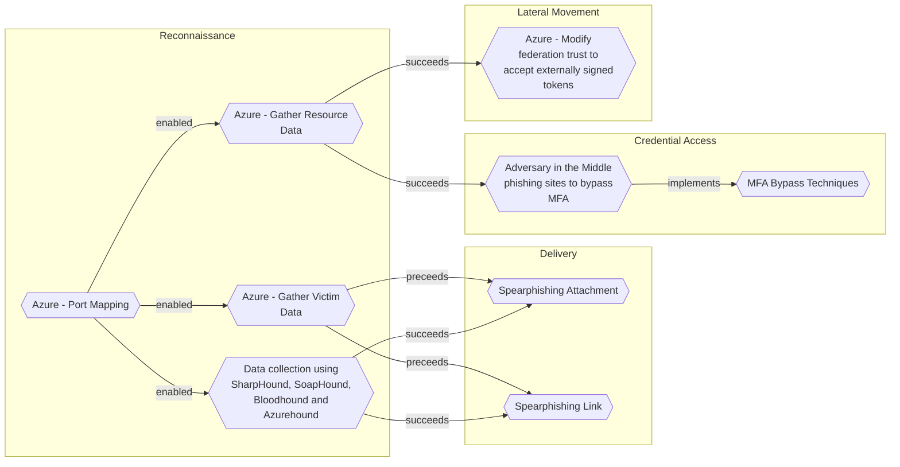

# Azure - Port Mapping

## Metadata
| Field | Value |
| --- | --- |
| UUID | `394dde97-4a8c-4b6a-8f8b-c6bf18a7a87f` |
| Schema | `threat::1.0` |
| Version | `3` |
| Created | `2025-07-10` |
| Modified | `2025-09-08` |
| TLP | clear (`TLP:CLEAR`) |
| Organisation | EC DIGIT CSOC (`56b0a0f0-b0bc-47d9-bb46-02f80ae2065a`) |

## References
### Public
- **1**: [https://techcommunity.microsoft.com/discussions/azure/port-mapping-on-new-azure-portal/63181](https://techcommunity.microsoft.com/discussions/azure/port-mapping-on-new-azure-portal/63181)
- **2**: [https://microsoft.github.io/Azure-Threat-Research-Matrix/Reconnaissance/AZT101/AZT101/](https://microsoft.github.io/Azure-Threat-Research-Matrix/Reconnaissance/AZT101/AZT101/)
- **3**: [https://security.packt.com/identify-vulnerabilities-in-azure/](https://security.packt.com/identify-vulnerabilities-in-azure/)

## Description
Port mapping in Azure refers to the process of exposing internal ports of virtual 
machines (VMs), containers, or services to external networks, often through Azure 
Load Balancers, Network Security Groups (NSGs), or NAT rules. This allows external 
users or services to access resources inside a private Azure network by mapping 
public ports to private ones.

### How Port Mapping Can Be a Threat Vector

Port mapping, if misconfigured or left unsecured, can introduce several security risks:

- **Exposure of Internal Services:** Mapping internal ports to public endpoints 
can expose services (e.g., RDP, SSH, HTTP) to the internet, making them targets 
for scanning, brute-force attacks, and exploitation of vulnerabilities.
- **Reconnaissance by Attackers:** Attackers can enumerate open ports by analyzing 
NSG rules or scanning Azure IP ranges, identifying which services are accessible 
and potentially vulnerable.
- **Misconfigured NSGs:** If NSGs are not properly configured, they may inadvertently 
allow unrestricted access to sensitive ports, increasing the attack surface.
- **Bypassing Security Controls:** Using non-standard port mappings 
(e.g., mapping RDP 3389 to a random high port) may provide slight obscurity but 
does not prevent targeted attacks, especially if attackers scan all ports.
- **Container and VM Risks:** Improper port mapping in Azure container services 
or VMs can lead to exposure of management interfaces or application endpoints, increasing 
the risk of unauthorized access or lateral movement within the environment.

### Common Attack Scenarios

- **Brute Force Attacks:** Exposed RDP (3389) or SSH (22) ports are frequent targets 
for automated brute-force attempts.
- **Service Exploitation:** Attackers may exploit known vulnerabilities on exposed 
ports, especially if services are outdated or unpatched.
- **Information Gathering:** Attackers use port mapping information to build a profile 
of the environment, identifying potential entry points for further attacks.

## Criticality
**High** - A High priority incident is likely to result in a demonstrable impact to public health or safety, national security, economic security, foreign relations, civil liberties, or public confidence.

## Terrain
Adversaries need an exposed service or port that is accessible from outside the Azure 
environment—typically via a public IP and a mapped port (such as SSH, RDP, or web services).

## Surface
> **Azure**
> Microsoft Azure cloud platform

> **Azure::Security::Entra ID**
> Microsoft Entra ID in Azure (cloud identity)

> **Azure::Compute::Virtual Machines**
> Azure Virtual Machines

> **Web Servers**
> HTTP servers and reverse proxies

> **Switches**
> Network switches

## Threat Assessment
| Dimension | Assessment | Description |
| --- | --- | --- |
| Severity | Significant incident | A cyber attack which has a serious impact on a large organisation or on wider / local government, or which poses a considerable risk to central government or (inter)national essential services. |
| Impact | Data Breach IP Loss Reputational Damages Identity Theft Monetary Loss Business disruption | Non-public information has been accessed from the outside, and successfully extracted. Particular, key data, information and blueprint conducive to the organization capability to gain and retain a commercial or geopolitical advantage has been accessed, and their content potentially used by competitors or other adversaries. Damages to the organization public view may be achieved by using directly the access gained, or indirectly with data gathered. Acquisition of sufficient information and privileges to profess as a given individual, for the purpose of abusing and deceiving human trust relationships. The vector will directly conduct to loss of value directly impacting the bottom line. Business disruption |
| Leverage | Spoofing Tampering Repudiation Infrastructure Compromise Information Disclosure Elevation of privilege | Threat action aimed at accessing and use of another user’s credentials, such as username and password. Threat action intending to maliciously change or modify persistent data, such as records in a database, and the alteration of data in transit between two computers over an open network, such as the Internet. Threat action aimed at performing prohibited operations in a system that lacks the ability to trace the operations. The compromised target is likely to be used to further expand the sphere of influence of the attacker and allow more potent vectors to be executed. Threat action intending to read a file that one was not granted access to, or to read data in transit. Capacity to augment leverage over the target system by upgrading the compromised access rights |
| Viability | Likely | Probable (probably) - 55-80% |
| Kill Chain | Reconnaissance | Researching, identifying and selecting targets using active or passive reconnaissance. |

## ATT&CK Techniques
| Technique | Name | Description |
| --- | --- | --- |
| `T1190` | [Exploit Public-Facing Application](https://attack.mitre.org/techniques/T1190) | Adversaries may attempt to exploit a weakness in an Internet-facing host or system to initially access a network. The weakness in the system can be a software bug, a temporary glitch, or a misconfiguration.  Exploited applications are often websites/web servers, but can also include databases (like SQL), standard services (like SMB or SSH), network device administration and management protocols (like SNMP and Smart Install), and any other system with Internet-accessible open sockets.(Citation: NVD CVE-2016-6662)(Citation: CIS Multiple SMB Vulnerabilities)(Citation: US-CERT TA18-106A Network Infrastructure Devices 2018)(Citation: Cisco Blog Legacy Device Attacks)(Citation: NVD CVE-2014-7169) On ESXi infrastructure, adversaries may exploit exposed OpenSLP services; they may alternatively exploit exposed VMware vCenter servers.(Citation: Recorded Future ESXiArgs Ransomware 2023)(Citation: Ars Technica VMWare Code Execution Vulnerability 2021) Depending on the flaw being exploited, this may also involve [Exploitation for Defense Evasion](https://attack.mitre.org/techniques/T1211) or [Exploitation for Client Execution](https://attack.mitre.org/techniques/T1203).  If an application is hosted on cloud-based infrastructure and/or is containerized, then exploiting it may lead to compromise of the underlying instance or container. This can allow an adversary a path to access the cloud or container APIs (e.g., via the [Cloud Instance Metadata API](https://attack.mitre.org/techniques/T1552/005)), exploit container host access via [Escape to Host](https://attack.mitre.org/techniques/T1611), or take advantage of weak identity and access management policies.  Adversaries may also exploit edge network infrastructure and related appliances, specifically targeting devices that do not support robust host-based defenses.(Citation: Mandiant Fortinet Zero Day)(Citation: Wired Russia Cyberwar)  For websites and databases, the OWASP top 10 and CWE top 25 highlight the most common web-based vulnerabilities.(Citation: OWASP Top 10)(Citation: CWE top 25) |
| `T1078` | [Valid Accounts](https://attack.mitre.org/techniques/T1078) | Adversaries may obtain and abuse credentials of existing accounts as a means of gaining Initial Access, Persistence, Privilege Escalation, or Defense Evasion. Compromised credentials may be used to bypass access controls placed on various resources on systems within the network and may even be used for persistent access to remote systems and externally available services, such as VPNs, Outlook Web Access, network devices, and remote desktop.(Citation: volexity_0day_sophos_FW) Compromised credentials may also grant an adversary increased privilege to specific systems or access to restricted areas of the network. Adversaries may choose not to use malware or tools in conjunction with the legitimate access those credentials provide to make it harder to detect their presence.  In some cases, adversaries may abuse inactive accounts: for example, those belonging to individuals who are no longer part of an organization. Using these accounts may allow the adversary to evade detection, as the original account user will not be present to identify any anomalous activity taking place on their account.(Citation: CISA MFA PrintNightmare)  The overlap of permissions for local, domain, and cloud accounts across a network of systems is of concern because the adversary may be able to pivot across accounts and systems to reach a high level of access (i.e., domain or enterprise administrator) to bypass access controls set within the enterprise.(Citation: TechNet Credential Theft) |
| `T1110` | [Brute Force](https://attack.mitre.org/techniques/T1110) | Adversaries may use brute force techniques to gain access to accounts when passwords are unknown or when password hashes are obtained.(Citation: TrendMicro Pawn Storm Dec 2020) Without knowledge of the password for an account or set of accounts, an adversary may systematically guess the password using a repetitive or iterative mechanism.(Citation: Dragos Crashoverride 2018) Brute forcing passwords can take place via interaction with a service that will check the validity of those credentials or offline against previously acquired credential data, such as password hashes.  Brute forcing credentials may take place at various points during a breach. For example, adversaries may attempt to brute force access to [Valid Accounts](https://attack.mitre.org/techniques/T1078) within a victim environment leveraging knowledge gathered from other post-compromise behaviors such as [OS Credential Dumping](https://attack.mitre.org/techniques/T1003), [Account Discovery](https://attack.mitre.org/techniques/T1087), or [Password Policy Discovery](https://attack.mitre.org/techniques/T1201). Adversaries may also combine brute forcing activity with behaviors such as [External Remote Services](https://attack.mitre.org/techniques/T1133) as part of Initial Access. |

## Chaining

### Chaining details
#### enabled -> [Azure - Gather Victim Data](azure-gather-victim-data.md) (`4e7eae8e-6615-41f2-bfe1-21a04f7a6088`) (`support::enabled`)
An adversary successfully compromises a user's Azure Active Directory account credentials 
or session token through phishing, credential theft, or token theft.

- **Target UUID**: `4e7eae8e-6615-41f2-bfe1-21a04f7a6088`
#### enabled -> [Azure - Gather Resource Data](azure-gather-resource-data.md) (`b1593e0b-1b3b-462d-9ab6-21d1c136469d`) (`support::enabled`)
The attacker obtains credentials (via phishing, password spray, leaked keys) granting 
at least Reader access to the target Azure tenant.

- **Target UUID**: `b1593e0b-1b3b-462d-9ab6-21d1c136469d`
#### enabled -> [Data collection using SharpHound, SoapHound, Bloodhound and Azurehound](data-collection-using-sharphound-soaphound-bloodhound-and-azurehound.md) (`53063205-4404-4e6d-a2f5-d566c6085d96`) (`support::enabled`)
Attackers need to establish an initial presence within the target environment, in 
order to gather sufficient permissions to execute the data collection tools.

- **Target UUID**: `53063205-4404-4e6d-a2f5-d566c6085d96`
