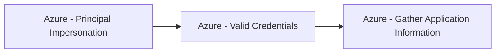

# Azure - Principal Impersonation

## Metadata

- **UUID**: `bb2501d5-99c7-44a6-ac5a-9510102d6611`
- **Schema**: `threat::1.0`
- **TLP**: clear

## Description
This threat vector in Azure environments is a critical form of privilege escalation, 
where attackers abuse service principals or managed identities to elevate access 
within cloud resources. 

## Example Attack Scenario

A common scenario involves an attacker gaining access to a compromised Azure DevOps 
pipeline, often through stolen credentials or tokens. From there, the attacker exfiltrates 
Service Principal credentials (which act as privileged identities for applications), 
and leverages those credentials to authenticate to the Azure environment. With control 
over a service principal assigned privileged roles (such as Cloud Application Administrator 
or those with Application.ReadWrite.All permissions), the attacker can perform high-impact 
actions, such as adding new federated domains, registering malicious applications, 
or even forging authentication tokens to impersonate any user—potentially those 
with Global Administrator rights.

## Attack Goals and Impact

The primary goals of **Principal Impersonation** attacks include:
- Gaining **persistent, high-level access** to cloud resources and administrative controls.
- Bypassing access controls, enabling attackers to assume **any privileged or sensitive 
identity** within the Azure Active Directory tenant.
- **Exfiltration of data** from storage accounts or databases, creation of new virtual 
machines for malicious purposes, and the registration of attacker-controlled applications 
for ongoing access.
- Achieving **domain-wide impact** by forging authentication tokens or manipulating 
directory federation, ultimately resulting in complete tenant takeover or escalation 
to Global Administrator.

## Attack Flow and Methodology

The flow typically unfolds in these stages:

1. **Credential Theft/Manipulation**: Attacker exfiltrates, creates, or adds credentials 
(secret keys, certificates) to a service principal or managed identity.
2. **Impersonation**: Using the compromised identity, the attacker authenticates 
as the service principal and leverages assigned privileged roles or permissions 
to perform sensitive operations (e.g., managing federated domains, creating backdoor 
accounts, modifying authentication policies).
3. **Privilege Escalation**: Attacker forges tokens or utilizes elevated permissions 
to impersonate higher-privilege users or global administrators, potentially by exploiting 
federated SSO or Azure AD application registration features.
4. **Persistence and Impact**: Additional malicious applications are registered, 
new backdoor credentials are planted, and attacker actions may persist until discovered 
and remediated.

## Techniques
- T1098.001
- T1078.004
- T1548

## Chaining

