# Azure - Principal Impersonation

## Metadata
| Field | Value |
| --- | --- |
| UUID | `bb2501d5-99c7-44a6-ac5a-9510102d6611` |
| Schema | `threat::1.0` |
| Version | `2` |
| Created | `2025-08-25` |
| Modified | `2025-09-04` |
| TLP | clear (`TLP:CLEAR`) |
| Organisation | EC DIGIT CSOC (`56b0a0f0-b0bc-47d9-bb46-02f80ae2065a`) |

## References
### Public
- **1**: [https://securitylabs.datadoghq.com/articles/i-spy-escalating-to-entra-id-global-admin/](https://securitylabs.datadoghq.com/articles/i-spy-escalating-to-entra-id-global-admin/)
- **2**: [https://pushsecurity.com/blog/identity-attacks-in-the-wild/](https://pushsecurity.com/blog/identity-attacks-in-the-wild/)
- **3**: [https://labs.withsecure.com/publications/performing-and-preventing-attacks-on-azure-cloud-environments-through-azure-devops](https://labs.withsecure.com/publications/performing-and-preventing-attacks-on-azure-cloud-environments-through-azure-devops)

## Description
This threat vector in Azure environments is a critical form of privilege escalation, 
where attackers abuse service principals or managed identities to elevate access 
within cloud resources. 

## Example Attack Scenario

A common scenario involves an attacker gaining access to a compromised Azure DevOps 
pipeline, often through stolen credentials or tokens. From there, the attacker exfiltrates 
Service Principal credentials (which act as privileged identities for applications), 
and leverages those credentials to authenticate to the Azure environment. With control 
over a service principal assigned privileged roles (such as Cloud Application Administrator 
or those with Application.ReadWrite.All permissions), the attacker can perform high-impact 
actions, such as adding new federated domains, registering malicious applications, 
or even forging authentication tokens to impersonate any user—potentially those 
with Global Administrator rights.

## Attack Goals and Impact

The primary goals of **Principal Impersonation** attacks include:
- Gaining **persistent, high-level access** to cloud resources and administrative controls.
- Bypassing access controls, enabling attackers to assume **any privileged or sensitive 
identity** within the Azure Active Directory tenant.
- **Exfiltration of data** from storage accounts or databases, creation of new virtual 
machines for malicious purposes, and the registration of attacker-controlled applications 
for ongoing access.
- Achieving **domain-wide impact** by forging authentication tokens or manipulating 
directory federation, ultimately resulting in complete tenant takeover or escalation 
to Global Administrator.

## Attack Flow and Methodology

The flow typically unfolds in these stages:

1. **Credential Theft/Manipulation**: Attacker exfiltrates, creates, or adds credentials 
(secret keys, certificates) to a service principal or managed identity.
2. **Impersonation**: Using the compromised identity, the attacker authenticates 
as the service principal and leverages assigned privileged roles or permissions 
to perform sensitive operations (e.g., managing federated domains, creating backdoor 
accounts, modifying authentication policies).
3. **Privilege Escalation**: Attacker forges tokens or utilizes elevated permissions 
to impersonate higher-privilege users or global administrators, potentially by exploiting 
federated SSO or Azure AD application registration features.
4. **Persistence and Impact**: Additional malicious applications are registered, 
new backdoor credentials are planted, and attacker actions may persist until discovered 
and remediated.

## Criticality
**High** - A High priority incident is likely to result in a demonstrable impact to public health or safety, national security, economic security, foreign relations, civil liberties, or public confidence.

## Terrain
Adversaries gains access via phishing, credential stuffing, or exploiting misconfigurations 
allowing access to an account with application management permissions or to a pipeline 
that exposes service principal credentials.

## Surface
> **Azure**
> Microsoft Azure cloud platform

> **Azure::Security::Entra ID**
> Microsoft Entra ID in Azure (cloud identity)

> **AWS::Storage**
> AWS storage services

> **Entra ID**
> Microsoft Entra ID (formerly Azure Active Directory)

> **Azure::Compute::Virtual Machines**
> Azure Virtual Machines

> **AWS::Compute::EC2**
> Amazon Elastic Compute Cloud (virtual servers)

## Threat Assessment
| Dimension | Assessment | Description |
| --- | --- | --- |
| Severity | Significant incident | A cyber attack which has a serious impact on a large organisation or on wider / local government, or which poses a considerable risk to central government or (inter)national essential services. |
| Impact | Data Breach IP Loss | Non-public information has been accessed from the outside, and successfully extracted. Particular, key data, information and blueprint conducive to the organization capability to gain and retain a commercial or geopolitical advantage has been accessed, and their content potentially used by competitors or other adversaries. |
| Leverage | Spoofing Tampering Elevation of privilege Information Disclosure | Threat action aimed at accessing and use of another user’s credentials, such as username and password. Threat action intending to maliciously change or modify persistent data, such as records in a database, and the alteration of data in transit between two computers over an open network, such as the Internet. Capacity to augment leverage over the target system by upgrading the compromised access rights Threat action intending to read a file that one was not granted access to, or to read data in transit. |
| Viability | Likely | Probable (probably) - 55-80% |
| Kill Chain | Privilege Escalation | The result of techniques that provide an attacker with higher permissions on a system or network. |

## Actors
| Actor | ID | Source | Description |
| --- | --- | --- | --- |
| APT29 | `misp::b2056ff0-00b9-482e-b11c-c771daa5f28a` | ('misp',) | A 2015 report by F-Secure describe APT29 as: 'The Dukes are a well-resourced, highly dedicated and organized cyberespionage group that we believe has been working for the Russian Federation since at least 2008 to collect intelligence in support of foreign and security policy decision-making. The Dukes show unusual confidence in their ability to continue successfully compromising their targets, as well as in their ability to operate with impunity. The Dukes primarily target Western governments and related organizations, such as government ministries and agencies, political think tanks, and governmental subcontractors. Their targets have also included the governments of members of the Commonwealth of Independent States;Asian, African, and Middle Eastern governments;organizations associated with Chechen extremism;and Russian speakers engaged in the illicit trade of controlled substances and drugs. The Dukes are known to employ a vast arsenal of malware toolsets, which we identify as MiniDuke, CosmicDuke, OnionDuke, CozyDuke, CloudDuke, SeaDuke, HammerDuke, PinchDuke, and GeminiDuke. In recent years, the Dukes have engaged in apparently biannual large - scale spear - phishing campaigns against hundreds or even thousands of recipients associated with governmental institutions and affiliated organizations. These campaigns utilize a smash - and - grab approach involving a fast but noisy breakin followed by the rapid collection and exfiltration of as much data as possible.If the compromised target is discovered to be of value, the Dukes will quickly switch the toolset used and move to using stealthier tactics focused on persistent compromise and long - term intelligence gathering. This threat actor targets government ministries and agencies in the West, Central Asia, East Africa, and the Middle East; Chechen extremist groups; Russian organized crime; and think tanks. It is suspected to be behind the 2015 compromise of unclassified networks at the White House, Department of State, Pentagon, and the Joint Chiefs of Staff. The threat actor includes all of the Dukes tool sets, including MiniDuke, CosmicDuke, OnionDuke, CozyDuke, SeaDuke, CloudDuke (aka MiniDionis), and HammerDuke (aka Hammertoss). ' |

## ATT&CK Techniques
| Technique | Name | Description |
| --- | --- | --- |
| `T1098.001` | [Account Manipulation: Additional Cloud Credentials](https://attack.mitre.org/techniques/T1098/001) | Adversaries may add adversary-controlled credentials to a cloud account to maintain persistent access to victim accounts and instances within the environment.  For example, adversaries may add credentials for Service Principals and Applications in addition to existing legitimate credentials in Azure / Entra ID.(Citation: Microsoft SolarWinds Customer Guidance)(Citation: Blue Cloud of Death)(Citation: Blue Cloud of Death Video) These credentials include both x509 keys and passwords.(Citation: Microsoft SolarWinds Customer Guidance) With sufficient permissions, there are a variety of ways to add credentials including the Azure Portal, Azure command line interface, and Azure or Az PowerShell modules.(Citation: Demystifying Azure AD Service Principals)  In infrastructure-as-a-service (IaaS) environments, after gaining access through [Cloud Accounts](https://attack.mitre.org/techniques/T1078/004), adversaries may generate or import their own SSH keys using either the <code>CreateKeyPair</code> or <code>ImportKeyPair</code> API in AWS or the <code>gcloud compute os-login ssh-keys add</code> command in GCP.(Citation: GCP SSH Key Add) This allows persistent access to instances within the cloud environment without further usage of the compromised cloud accounts.(Citation: Expel IO Evil in AWS)(Citation: Expel Behind the Scenes)  Adversaries may also use the <code>CreateAccessKey</code> API in AWS or the <code>gcloud iam service-accounts keys create</code> command in GCP to add access keys to an account. Alternatively, they may use the <code>CreateLoginProfile</code> API in AWS to add a password that can be used to log into the AWS Management Console for [Cloud Service Dashboard](https://attack.mitre.org/techniques/T1538).(Citation: Permiso Scattered Spider 2023)(Citation: Lacework AI Resource Hijacking 2024) If the target account has different permissions from the requesting account, the adversary may also be able to escalate their privileges in the environment (i.e. [Cloud Accounts](https://attack.mitre.org/techniques/T1078/004)).(Citation: Rhino Security Labs AWS Privilege Escalation)(Citation: Sysdig ScarletEel 2.0) For example, in Entra ID environments, an adversary with the Application Administrator role can add a new set of credentials to their application's service principal. In doing so the adversary would be able to access the service principal’s roles and permissions, which may be different from those of the Application Administrator.(Citation: SpecterOps Azure Privilege Escalation)   In AWS environments, adversaries with the appropriate permissions may also use the `sts:GetFederationToken` API call to create a temporary set of credentials to [Forge Web Credentials](https://attack.mitre.org/techniques/T1606) tied to the permissions of the original user account. These temporary credentials may remain valid for the duration of their lifetime even if the original account’s API credentials are deactivated. (Citation: Crowdstrike AWS User Federation Persistence)  In Entra ID environments with the app password feature enabled, adversaries may be able to add an app password to a user account.(Citation: Mandiant APT42 Operations 2024) As app passwords are intended to be used with legacy devices that do not support multi-factor authentication (MFA), adding an app password can allow an adversary to bypass MFA requirements. Additionally, app passwords may remain valid even if the user’s primary password is reset.(Citation: Microsoft Entra ID App Passwords) |
| `T1078.004` | [Valid Accounts: Cloud Accounts](https://attack.mitre.org/techniques/T1078/004) | Valid accounts in cloud environments may allow adversaries to perform actions to achieve Initial Access, Persistence, Privilege Escalation, or Defense Evasion. Cloud accounts are those created and configured by an organization for use by users, remote support, services, or for administration of resources within a cloud service provider or SaaS application. Cloud Accounts can exist solely in the cloud; alternatively, they may be hybrid-joined between on-premises systems and the cloud through syncing or federation with other identity sources such as Windows Active Directory.(Citation: AWS Identity Federation)(Citation: Google Federating GC)(Citation: Microsoft Deploying AD Federation)  Service or user accounts may be targeted by adversaries through [Brute Force](https://attack.mitre.org/techniques/T1110), [Phishing](https://attack.mitre.org/techniques/T1566), or various other means to gain access to the environment. Federated or synced accounts may be a pathway for the adversary to affect both on-premises systems and cloud environments - for example, by leveraging shared credentials to log onto [Remote Services](https://attack.mitre.org/techniques/T1021). High privileged cloud accounts, whether federated, synced, or cloud-only, may also allow pivoting to on-premises environments by leveraging SaaS-based [Software Deployment Tools](https://attack.mitre.org/techniques/T1072) to run commands on hybrid-joined devices.  An adversary may create long lasting [Additional Cloud Credentials](https://attack.mitre.org/techniques/T1098/001) on a compromised cloud account to maintain persistence in the environment. Such credentials may also be used to bypass security controls such as multi-factor authentication.   Cloud accounts may also be able to assume [Temporary Elevated Cloud Access](https://attack.mitre.org/techniques/T1548/005) or other privileges through various means within the environment. Misconfigurations in role assignments or role assumption policies may allow an adversary to use these mechanisms to leverage permissions outside the intended scope of the account. Such over privileged accounts may be used to harvest sensitive data from online storage accounts and databases through [Cloud API](https://attack.mitre.org/techniques/T1059/009) or other methods. For example, in Azure environments, adversaries may target Azure Managed Identities, which allow associated Azure resources to request access tokens. By compromising a resource with an attached Managed Identity, such as an Azure VM, adversaries may be able to [Steal Application Access Token](https://attack.mitre.org/techniques/T1528)s to move laterally across the cloud environment.(Citation: SpecterOps Managed Identity 2022) |
| `T1548` | [Abuse Elevation Control Mechanism](https://attack.mitre.org/techniques/T1548) | Adversaries may circumvent mechanisms designed to control elevate privileges to gain higher-level permissions. Most modern systems contain native elevation control mechanisms that are intended to limit privileges that a user can perform on a machine. Authorization has to be granted to specific users in order to perform tasks that can be considered of higher risk.(Citation: TechNet How UAC Works)(Citation: sudo man page 2018) An adversary can perform several methods to take advantage of built-in control mechanisms in order to escalate privileges on a system.(Citation: OSX Keydnap malware)(Citation: Fortinet Fareit) |

## Chaining

```mermaid
flowchart LR
subgraph "Privilege Escalation"
bb2501d5_99c7_44a6_ac5a_9510102d6611{{"Azure - Principal<br>Impersonation"}}
c7e260d8_d391_41eb_be1a_7f276c99b383{{"Azure app registration -<br>privilege escalation"}}
c698fc79_3ed6_44a7_a9d7_bc447600e4c3{{"Azure AD Connect abuse"}}
f1dc4341_eb45_4d07_8075_b1a6b227cc76{{"Cloud IAM role<br>assumption"}}
end
subgraph "Credential Access"
2743bf18_3b86_4721_bf3e_153dcda0b149{{"Azure - Valid<br>Credentials"}}
c4edae81_5790_4b9c_88b7_d11d6985b1a4{{"Azure - Service<br>Principal Secret Reveal"}}
b6543cff_2e86_4fe6_afb7_6d3595188190{{"Azure - Steal Service<br>Principal Certificate"}}
66aafb61_9a46_4287_8b40_4785b42b77a3{{"Adversary in the Middle<br>phishing sites to bypass<br>MFA"}}
6e988fa7_69c9_4aef_897c_a34fa5066dac{{"Ghost logins attempts"}}
4a807ac4_f764_41b1_ae6f_94239041d349{{"MFA Bypass Techniques"}}
6a7a493a_511a_4c9d_aa9c_4427c832a322{{"SIM-card swapping"}}
end
subgraph "Reconnaissance"
fe6827f2_efb4_43b3_9ca3_b7d417111b32{{"Azure - Gather<br>Application Information"}}
2900d389_3098_49d3_8166_5b2612d03576{{"Azure - Gather User<br>Information"}}
53063205_4404_4e6d_a2f5_d566c6085d96{{"Data collection using<br>SharpHound, SoapHound,<br>Bloodhound and<br>Azurehound"}}
4e7eae8e_6615_41f2_bfe1_21a04f7a6088{{"Azure - Gather Victim<br>Data"}}
140907eb_c9fb_4330_9d71_656422388b2b{{"Azure - Gather Role<br>Information"}}
b1593e0b_1b3b_462d_9ab6_21d1c136469d{{"Azure - Gather Resource<br>Data"}}
end
subgraph "Execution"
490a5d5d_5880_45bd_a05d_176878e0ae24{{"Azure DevOps pipelines"}}
61ddc240_e5a6_4ca8_ae77_6b471b498913{{"Code execution via<br>custom script extensions<br>in Azure"}}
60c5b065_7d06_4697_850f_c2f80765f10b{{"Changes to Azure<br>infrastructure deployed<br>through Azure CLI"}}
end
subgraph "Persistence"
5d43ef75_4637_4a75_b1ed_6716052cff0e{{"Azure - App registration<br>persistence"}}
23f6a192_a25d_48b8_a235_7bb55e483682{{"Persistence with Azure<br>Automanage Machine<br>Configuration"}}
50c7e353_ac1c_48a7_8c98_2515b45f31f4{{"Persistence through<br>automation runbooks in<br>Azure"}}
end
subgraph "Lateral Movement"
a8c7b250_a2d4_4a0d_82f8_23dc99c77d7b{{"Addition of credentials<br>to OAuth applications<br>and service principals"}}
ca2751c7_8641_4fb0_a90b_30c5987015dc{{"Externally controlled<br>Azure credentials added<br>to an Enterprise app or<br>its SPN"}}
9bb31c65_8abd_48fc_afe3_8aca76109737{{"Azure - Modify<br>federation trust to<br>accept externally signed<br>tokens"}}
end
subgraph "Collection"
78d5e363_14db_40c0_a1c4_4ba02a3e60d4{{"Azure - Hijack Entra ID<br>Applications"}}
f18be76e_f2b3_410a_80c5_d67e7b8e7b03{{"Perform Microsoft Entra<br>ID connectors MITM<br>attack"}}
end
subgraph "Command & Control"
2fd1cddb_c66d_4a99_9779_31e32b67495e{{"Azure - Lateral movement<br>abusing Cross-Tenant<br>Synchronization"}}
end
subgraph "Delivery"
1a68b5eb_0112_424d_a21f_88dda0b6b8df{{"Spearphishing Link"}}
dd5d942c_bac4_4000_b9a6_ca4fef6cfb84{{"Spearphishing Attachment"}}
58b98d75_fc63_4662_8908_a2a7f4200902{{"Spearphishing with an<br>attachment extension<br>.rdp"}}
06c60af1_5fa8_493c_bf9b_6b2e215819f1{{"Social engineering<br>attack using Microsoft<br>Teams"}}
end
subgraph "Social Engineering"
0cdaee96_8595_4f3f_ba07_758b8be9d359{{"Social engineering<br>without attachment or<br>URL"}}
end
20bd3620_b13b_4895_b291_b1a26bd9aef3{{"MS 365 admin compromised<br>account"}}
c7e260d8_d391_41eb_be1a_7f276c99b383 -->|enabled| bb2501d5_99c7_44a6_ac5a_9510102d6611
c7e260d8_d391_41eb_be1a_7f276c99b383 -->|enabled| 2743bf18_3b86_4721_bf3e_153dcda0b149
c7e260d8_d391_41eb_be1a_7f276c99b383 -->|enabled| fe6827f2_efb4_43b3_9ca3_b7d417111b32
490a5d5d_5880_45bd_a05d_176878e0ae24 -->|enabled| bb2501d5_99c7_44a6_ac5a_9510102d6611
490a5d5d_5880_45bd_a05d_176878e0ae24 -->|enabled| 2743bf18_3b86_4721_bf3e_153dcda0b149
490a5d5d_5880_45bd_a05d_176878e0ae24 -->|enabled| 2900d389_3098_49d3_8166_5b2612d03576
c4edae81_5790_4b9c_88b7_d11d6985b1a4 -->|enabled| bb2501d5_99c7_44a6_ac5a_9510102d6611
c4edae81_5790_4b9c_88b7_d11d6985b1a4 -->|enabled| 53063205_4404_4e6d_a2f5_d566c6085d96
c4edae81_5790_4b9c_88b7_d11d6985b1a4 -->|enabled| 4e7eae8e_6615_41f2_bfe1_21a04f7a6088
c4edae81_5790_4b9c_88b7_d11d6985b1a4 -->|enabled| fe6827f2_efb4_43b3_9ca3_b7d417111b32
c4edae81_5790_4b9c_88b7_d11d6985b1a4 -->|enabling| 5d43ef75_4637_4a75_b1ed_6716052cff0e
c4edae81_5790_4b9c_88b7_d11d6985b1a4 -->|enabling| c7e260d8_d391_41eb_be1a_7f276c99b383
c4edae81_5790_4b9c_88b7_d11d6985b1a4 -->|implemented| 2743bf18_3b86_4721_bf3e_153dcda0b149
b6543cff_2e86_4fe6_afb7_6d3595188190 -->|enabled| bb2501d5_99c7_44a6_ac5a_9510102d6611
b6543cff_2e86_4fe6_afb7_6d3595188190 -->|enabled| 53063205_4404_4e6d_a2f5_d566c6085d96
b6543cff_2e86_4fe6_afb7_6d3595188190 -->|enabled| a8c7b250_a2d4_4a0d_82f8_23dc99c77d7b
b6543cff_2e86_4fe6_afb7_6d3595188190 -->|succeeds| 140907eb_c9fb_4330_9d71_656422388b2b
b6543cff_2e86_4fe6_afb7_6d3595188190 -->|succeeds| b1593e0b_1b3b_462d_9ab6_21d1c136469d
b6543cff_2e86_4fe6_afb7_6d3595188190 -->|succeeds| 2743bf18_3b86_4721_bf3e_153dcda0b149
b6543cff_2e86_4fe6_afb7_6d3595188190 -->|preceeds| 61ddc240_e5a6_4ca8_ae77_6b471b498913
b6543cff_2e86_4fe6_afb7_6d3595188190 -->|preceeds| 23f6a192_a25d_48b8_a235_7bb55e483682
2743bf18_3b86_4721_bf3e_153dcda0b149 -->|preceeds| a8c7b250_a2d4_4a0d_82f8_23dc99c77d7b
2743bf18_3b86_4721_bf3e_153dcda0b149 -->|preceeds| 66aafb61_9a46_4287_8b40_4785b42b77a3
2743bf18_3b86_4721_bf3e_153dcda0b149 -->|preceeds| c698fc79_3ed6_44a7_a9d7_bc447600e4c3
2743bf18_3b86_4721_bf3e_153dcda0b149 -->|preceeds| 5d43ef75_4637_4a75_b1ed_6716052cff0e
2743bf18_3b86_4721_bf3e_153dcda0b149 -->|preceeds| 60c5b065_7d06_4697_850f_c2f80765f10b
2743bf18_3b86_4721_bf3e_153dcda0b149 -->|preceeds| 6e988fa7_69c9_4aef_897c_a34fa5066dac
2743bf18_3b86_4721_bf3e_153dcda0b149 -->|preceeds| 78d5e363_14db_40c0_a1c4_4ba02a3e60d4
2743bf18_3b86_4721_bf3e_153dcda0b149 -->|preceeds| 2fd1cddb_c66d_4a99_9779_31e32b67495e
2743bf18_3b86_4721_bf3e_153dcda0b149 -->|preceeds| 20bd3620_b13b_4895_b291_b1a26bd9aef3
2743bf18_3b86_4721_bf3e_153dcda0b149 -->|preceeds| f18be76e_f2b3_410a_80c5_d67e7b8e7b03
2743bf18_3b86_4721_bf3e_153dcda0b149 -->|preceeds| 50c7e353_ac1c_48a7_8c98_2515b45f31f4
2743bf18_3b86_4721_bf3e_153dcda0b149 -->|preceeds| 23f6a192_a25d_48b8_a235_7bb55e483682
66aafb61_9a46_4287_8b40_4785b42b77a3 -->|implements| 4a807ac4_f764_41b1_ae6f_94239041d349
c698fc79_3ed6_44a7_a9d7_bc447600e4c3 -->|enabled| 2743bf18_3b86_4721_bf3e_153dcda0b149
5d43ef75_4637_4a75_b1ed_6716052cff0e -->|succeeds| c7e260d8_d391_41eb_be1a_7f276c99b383
fe6827f2_efb4_43b3_9ca3_b7d417111b32 -->|enabled| 140907eb_c9fb_4330_9d71_656422388b2b
fe6827f2_efb4_43b3_9ca3_b7d417111b32 -->|enabled| 53063205_4404_4e6d_a2f5_d566c6085d96
fe6827f2_efb4_43b3_9ca3_b7d417111b32 -->|enabling| ca2751c7_8641_4fb0_a90b_30c5987015dc
fe6827f2_efb4_43b3_9ca3_b7d417111b32 -->|enabling| c7e260d8_d391_41eb_be1a_7f276c99b383
140907eb_c9fb_4330_9d71_656422388b2b -->|preceeds| a8c7b250_a2d4_4a0d_82f8_23dc99c77d7b
140907eb_c9fb_4330_9d71_656422388b2b -->|preceeds| 61ddc240_e5a6_4ca8_ae77_6b471b498913
140907eb_c9fb_4330_9d71_656422388b2b -->|preceeds| f1dc4341_eb45_4d07_8075_b1a6b227cc76
61ddc240_e5a6_4ca8_ae77_6b471b498913 -->|enabled| 140907eb_c9fb_4330_9d71_656422388b2b
61ddc240_e5a6_4ca8_ae77_6b471b498913 -->|enabled| 2743bf18_3b86_4721_bf3e_153dcda0b149
6e988fa7_69c9_4aef_897c_a34fa5066dac -->|implements| 4a807ac4_f764_41b1_ae6f_94239041d349
53063205_4404_4e6d_a2f5_d566c6085d96 -->|succeeds| 1a68b5eb_0112_424d_a21f_88dda0b6b8df
53063205_4404_4e6d_a2f5_d566c6085d96 -->|succeeds| dd5d942c_bac4_4000_b9a6_ca4fef6cfb84
2900d389_3098_49d3_8166_5b2612d03576 -->|succeeds| 58b98d75_fc63_4662_8908_a2a7f4200902
2900d389_3098_49d3_8166_5b2612d03576 -->|succeeds| 0cdaee96_8595_4f3f_ba07_758b8be9d359
2900d389_3098_49d3_8166_5b2612d03576 -->|succeeds| 06c60af1_5fa8_493c_bf9b_6b2e215819f1
58b98d75_fc63_4662_8908_a2a7f4200902 -->|implements| dd5d942c_bac4_4000_b9a6_ca4fef6cfb84
0cdaee96_8595_4f3f_ba07_758b8be9d359 -->|preceeds| 1a68b5eb_0112_424d_a21f_88dda0b6b8df
0cdaee96_8595_4f3f_ba07_758b8be9d359 -->|preceeds| dd5d942c_bac4_4000_b9a6_ca4fef6cfb84
0cdaee96_8595_4f3f_ba07_758b8be9d359 -->|preceeds| 6a7a493a_511a_4c9d_aa9c_4427c832a322
6a7a493a_511a_4c9d_aa9c_4427c832a322 -->|implements| 4a807ac4_f764_41b1_ae6f_94239041d349
4e7eae8e_6615_41f2_bfe1_21a04f7a6088 -->|preceeds| dd5d942c_bac4_4000_b9a6_ca4fef6cfb84
4e7eae8e_6615_41f2_bfe1_21a04f7a6088 -->|preceeds| 1a68b5eb_0112_424d_a21f_88dda0b6b8df
b1593e0b_1b3b_462d_9ab6_21d1c136469d -->|succeeds| 66aafb61_9a46_4287_8b40_4785b42b77a3
b1593e0b_1b3b_462d_9ab6_21d1c136469d -->|succeeds| 9bb31c65_8abd_48fc_afe3_8aca76109737
bb2501d5_99c7_44a6_ac5a_9510102d6611 -->|preceeds| 2743bf18_3b86_4721_bf3e_153dcda0b149
bb2501d5_99c7_44a6_ac5a_9510102d6611 -->|preceeds| fe6827f2_efb4_43b3_9ca3_b7d417111b32
```

### Chaining details
#### preceeds -> [Azure - Valid Credentials](azure-valid-credentials.md) (`2743bf18-3b86-4721-bf3e-153dcda0b149`) (`sequence::preceeds`)
Adversaries obtain the username and password of an AzureAD user either through phishing, 
password spraying, brute-force attacks, or credentials leaked online.

- **Target UUID**: `2743bf18-3b86-4721-bf3e-153dcda0b149`
#### preceeds -> [Azure - Gather Application Information](azure-gather-application-information.md) (`fe6827f2-efb4-43b3-9ca3-b7d417111b32`) (`sequence::preceeds`)
Adversaries obtain minimal access (often as a standard user or via an external account) 
in the target Azure AD tenant, then utilizes API endpoints and tools, such as Azure CLI, 
PowerShell modules (e.g., MSOnline, Microsoft.Graph), or custom scripts, to list 
all registered applications.

- **Target UUID**: `fe6827f2-efb4-43b3-9ca3-b7d417111b32`
