# Azure - Privileged Identity Management Role

## Metadata

- **UUID**: `fa381d6e-92cd-4c96-a340-24df7b21e2b7`
- **Schema**: `threat::1.0`
- **TLP**: clear

## Description
The threat vector describes the risk that an adversary may escalate privileges by 
abusing Privileged Identity Management (PIM) assignments or role activation features 
within Azure Active Directory. PIM is designed to provide just-in-time and approval-based 
access to highly privileged roles (e.g., Global Administrator, Owner), instead of 
permanent assignment. However, if misconfigured or insufficiently monitored, PIM 
itself can become an avenue for privilege escalation attacks.

### Example Attack Scenario

An attacker gains access to a regular Azure AD user account that is configured as 
eligible for privileged role activation (such as Global Administrator) through PIM. 
The attacker then activates the privileged role via Azure AD PIM, immediately acquiring 
elevated permissions. This could be done by interacting with Azure Graph API endpoints 
to trigger role eligibility schedules and activations, such as:

- `GET https://graph.microsoft.com/beta/roleManagement/directory/roleEligibilitySchedules/{id}`
- `GET https://management.azure.com/{scope}/providers/Microsoft.Authorization/roleEligibilityScheduleRequests/{roleEligibilityScheduleRequestName}?api-version=2020-10-01`

The attacker uses the newly gained privileges to:
- Add themselves or an accomplice as a permanent or eligible member for other privileged roles.
- Carry out further attacks with escalated access.[1]

### Attack Goals and Impact

The main goals of abusing a PIM role assignment include:
- **Persistence:** Staying undetected with elevated privileges for longer periods.
- **Privilege Escalation:** Obtaining admin-level access across Azure AD and resources.
- **Manipulation and Control:** Modifying security controls, configurations, or resource 
access to facilitate lateral movement, data theft, or additional attacks.[3][1]
- **Data Breach and Resource Manipulation:** Exfiltration of sensitive data or disruption 
of critical services.

The impact can include unauthorized administrative actions, permanent backdoors 
via modified role assignments, data breaches, and complete compromise of the Azure environment.[4][3][1]

### Attack Flow and Methodology

1. **Reconnaissance:** Identify eligible users or accounts for PIM role activation 
in Azure AD or resources.
2. **Initial Access:** Gain credentials for a user account eligible for PIM role activation.
3. **Activation:** Use Azure AD PIM to activate the privileged role temporarily 
or request permanent assignment, triggering privileges using documented APIs and management endpoints.
4. **Escalation and Manipulation:** Once privileges are obtained:
    - Add or change eligible members in PIM.
    - Modify resource permissions (via `RoleManagement.ReadWrite.Directory`).
    - Abuse elevated access, e.g., create, delete, or alter resources and audit logs.
5. **Persistence:** Maintain administrative access by adding themselves as eligible 
members or scheduling future eligibility.
6. **Detection Evasion:** Exploit gaps in logging or monitoring or tamper with audit 
logs if possible.

## Techniques
- T1078
- T1548
- T1543
- T1098

## Chaining

```mermaid
flowchart LR
fa381d6e_92cd_4c96_a340_24df7b21e2b7["Azure - Privileged Identity Management Role"]
140907eb_c9fb_4330_9d71_656422388b2b["Azure - Gather Role Information"]
b1593e0b_1b3b_462d_9ab6_21d1c136469d["Azure - Gather Resource Data"]
f1dc4341_eb45_4d07_8075_b1a6b227cc76["Cloud IAM role assumption"]
670504aa_cfb8_4d1f_a5ad_16193822085f["Scheduled task creation using Azure CloudShell"]
fa381d6e_92cd_4c96_a340_24df7b21e2b7 --> 140907eb_c9fb_4330_9d71_656422388b2b
140907eb_c9fb_4330_9d71_656422388b2b --> b1593e0b_1b3b_462d_9ab6_21d1c136469d
b1593e0b_1b3b_462d_9ab6_21d1c136469d --> f1dc4341_eb45_4d07_8075_b1a6b227cc76
f1dc4341_eb45_4d07_8075_b1a6b227cc76 --> 670504aa_cfb8_4d1f_a5ad_16193822085f
```

