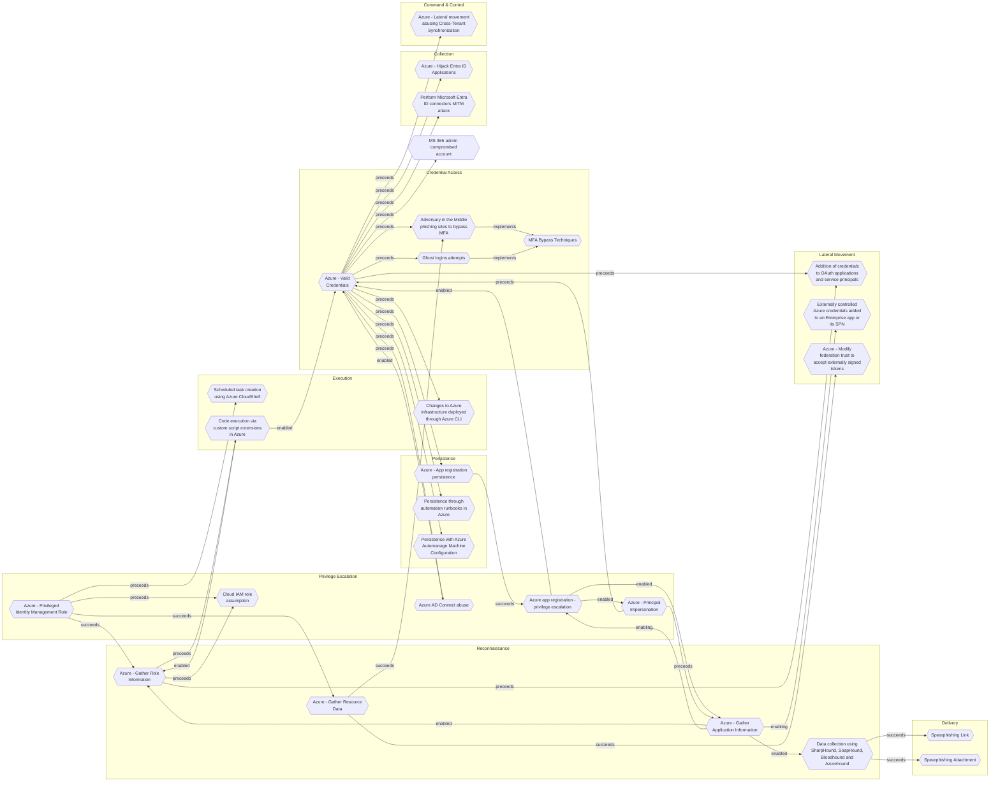

# Azure - Privileged Identity Management Role

## Metadata
| Field | Value |
| --- | --- |
| UUID | `fa381d6e-92cd-4c96-a340-24df7b21e2b7` |
| Schema | `threat::1.0` |
| Version | `3` |
| Created | `2025-08-20` |
| Modified | `2025-09-08` |
| TLP | clear (`TLP:CLEAR`) |
| Organisation | EC DIGIT CSOC (`56b0a0f0-b0bc-47d9-bb46-02f80ae2065a`) |

## References
### Public
- **1**: [https://microsoft.github.io/Azure-Threat-Research-Matrix/PrivilegeEscalation/AZT401/AZT401/](https://microsoft.github.io/Azure-Threat-Research-Matrix/PrivilegeEscalation/AZT401/AZT401/)
- **2**: [https://www.elastic.co/guide/en/security/current/azure-privilege-identity-management-role-modified.html](https://www.elastic.co/guide/en/security/current/azure-privilege-identity-management-role-modified.html)
- **3**: [https://research.splunk.com/cloud/952e80d0-e343-439b-83f4-808c3e6fbf2e/](https://research.splunk.com/cloud/952e80d0-e343-439b-83f4-808c3e6fbf2e/)

## Description
The threat vector describes the risk that an adversary may escalate privileges by 
abusing Privileged Identity Management (PIM) assignments or role activation features 
within Azure Active Directory. PIM is designed to provide just-in-time and approval-based 
access to highly privileged roles (e.g., Global Administrator, Owner), instead of 
permanent assignment. However, if misconfigured or insufficiently monitored, PIM 
itself can become an avenue for privilege escalation attacks.

### Example Attack Scenario

An attacker gains access to a regular Azure AD user account that is configured as 
eligible for privileged role activation (such as Global Administrator) through PIM. 
The attacker then activates the privileged role via Azure AD PIM, immediately acquiring 
elevated permissions. This could be done by interacting with Azure Graph API endpoints 
to trigger role eligibility schedules and activations, such as:

- `GET https://graph.microsoft.com/beta/roleManagement/directory/roleEligibilitySchedules/{id}`
- `GET https://management.azure.com/{scope}/providers/Microsoft.Authorization/roleEligibilityScheduleRequests/{roleEligibilityScheduleRequestName}?api-version=2020-10-01`

The attacker uses the newly gained privileges to:
- Add themselves or an accomplice as a permanent or eligible member for other privileged roles.
- Carry out further attacks with escalated access.[1]

### Attack Goals and Impact

The main goals of abusing a PIM role assignment include:
- **Persistence:** Staying undetected with elevated privileges for longer periods.
- **Privilege Escalation:** Obtaining admin-level access across Azure AD and resources.
- **Manipulation and Control:** Modifying security controls, configurations, or resource 
access to facilitate lateral movement, data theft, or additional attacks.[3][1]
- **Data Breach and Resource Manipulation:** Exfiltration of sensitive data or disruption 
of critical services.

The impact can include unauthorized administrative actions, permanent backdoors 
via modified role assignments, data breaches, and complete compromise of the Azure environment.[4][3][1]

### Attack Flow and Methodology

1. **Reconnaissance:** Identify eligible users or accounts for PIM role activation 
in Azure AD or resources.
2. **Initial Access:** Gain credentials for a user account eligible for PIM role activation.
3. **Activation:** Use Azure AD PIM to activate the privileged role temporarily 
or request permanent assignment, triggering privileges using documented APIs and management endpoints.
4. **Escalation and Manipulation:** Once privileges are obtained:
    - Add or change eligible members in PIM.
    - Modify resource permissions (via `RoleManagement.ReadWrite.Directory`).
    - Abuse elevated access, e.g., create, delete, or alter resources and audit logs.
5. **Persistence:** Maintain administrative access by adding themselves as eligible 
members or scheduling future eligibility.
6. **Detection Evasion:** Exploit gaps in logging or monitoring or tamper with audit 
logs if possible.

## Criticality
**High** - A High priority incident is likely to result in a demonstrable impact to public health or safety, national security, economic security, foreign relations, civil liberties, or public confidence.

## Terrain
Adversaries exploit Azure Privileged Identity Management (PIM) roles by compromising 
accounts eligible for privileged activation or by abusing misconfigured PIM policies.

## Surface
> **Azure**
> Microsoft Azure cloud platform

> **Azure::Security::Entra ID**
> Microsoft Entra ID in Azure (cloud identity)

> **Entra ID**
> Microsoft Entra ID (formerly Azure Active Directory)

> **Application Layer::HTTP**
> Hypertext Transfer Protocol

> **Azure::Compute::Virtual Machines**
> Azure Virtual Machines

> **AWS::Compute::EC2**
> Amazon Elastic Compute Cloud (virtual servers)

## Threat Assessment
| Dimension | Assessment | Description |
| --- | --- | --- |
| Severity | Significant incident | A cyber attack which has a serious impact on a large organisation or on wider / local government, or which poses a considerable risk to central government or (inter)national essential services. |
| Impact | Data Breach IP Loss | Non-public information has been accessed from the outside, and successfully extracted. Particular, key data, information and blueprint conducive to the organization capability to gain and retain a commercial or geopolitical advantage has been accessed, and their content potentially used by competitors or other adversaries. |
| Leverage | Spoofing Tampering Elevation of privilege Information Disclosure Modify configuration Modify privileges | Threat action aimed at accessing and use of another user’s credentials, such as username and password. Threat action intending to maliciously change or modify persistent data, such as records in a database, and the alteration of data in transit between two computers over an open network, such as the Internet. Capacity to augment leverage over the target system by upgrading the compromised access rights Threat action intending to read a file that one was not granted access to, or to read data in transit. Modify configuration or services Modify privileges or permissions |
| Viability | Likely | Probable (probably) - 55-80% |
| Kill Chain | Privilege Escalation | The result of techniques that provide an attacker with higher permissions on a system or network. |

## Actors
| Actor | ID | Source | Description |
| --- | --- | --- | --- |
| [[Enterprise] Scattered Spider](https://attack.mitre.org/groups/G1015) | `att&ck::G1015` | ('att&ck',) | [Scattered Spider](https://attack.mitre.org/groups/G1015) is a native English-speaking cybercriminal group that has been active since at least 2022.(Citation: CrowdStrike Scattered Spider Profile)(Citation: MSTIC Octo Tempest Operations October 2023) The group initially targeted customer relationship management and business-process outsourcing (BPO) firms as well as telecommunications and technology companies. Beginning in 2023, [Scattered Spider](https://attack.mitre.org/groups/G1015) expanded its operations to compromise victims in the gaming, hospitality, retail, MSP, manufacturing, and financial sectors.(Citation: MSTIC Octo Tempest Operations October 2023) During campaigns, [Scattered Spider](https://attack.mitre.org/groups/G1015) has leveraged targeted social-engineering techniques, attempted to bypass popular endpoint security tools, and more recently, deployed ransomware for financial gain.(Citation: CISA Scattered Spider Advisory November 2023)(Citation: CrowdStrike Scattered Spider BYOVD January 2023)(Citation: CrowdStrike Scattered Spider Profile)(Citation: MSTIC Octo Tempest Operations October 2023)(Citation: Crowdstrike TELCO BPO Campaign December 2022) |
| LAPSUS | `misp::d9e5be22-1a04-4956-af6c-37af02330980` | ('misp',) | An actor group conducting large-scale social engineering and extortion campaign against multiple organizations with some seeing evidence of destructive elements. |
| APT29 | `misp::b2056ff0-00b9-482e-b11c-c771daa5f28a` | ('misp',) | A 2015 report by F-Secure describe APT29 as: 'The Dukes are a well-resourced, highly dedicated and organized cyberespionage group that we believe has been working for the Russian Federation since at least 2008 to collect intelligence in support of foreign and security policy decision-making. The Dukes show unusual confidence in their ability to continue successfully compromising their targets, as well as in their ability to operate with impunity. The Dukes primarily target Western governments and related organizations, such as government ministries and agencies, political think tanks, and governmental subcontractors. Their targets have also included the governments of members of the Commonwealth of Independent States;Asian, African, and Middle Eastern governments;organizations associated with Chechen extremism;and Russian speakers engaged in the illicit trade of controlled substances and drugs. The Dukes are known to employ a vast arsenal of malware toolsets, which we identify as MiniDuke, CosmicDuke, OnionDuke, CozyDuke, CloudDuke, SeaDuke, HammerDuke, PinchDuke, and GeminiDuke. In recent years, the Dukes have engaged in apparently biannual large - scale spear - phishing campaigns against hundreds or even thousands of recipients associated with governmental institutions and affiliated organizations. These campaigns utilize a smash - and - grab approach involving a fast but noisy breakin followed by the rapid collection and exfiltration of as much data as possible.If the compromised target is discovered to be of value, the Dukes will quickly switch the toolset used and move to using stealthier tactics focused on persistent compromise and long - term intelligence gathering. This threat actor targets government ministries and agencies in the West, Central Asia, East Africa, and the Middle East; Chechen extremist groups; Russian organized crime; and think tanks. It is suspected to be behind the 2015 compromise of unclassified networks at the White House, Department of State, Pentagon, and the Joint Chiefs of Staff. The threat actor includes all of the Dukes tool sets, including MiniDuke, CosmicDuke, OnionDuke, CozyDuke, SeaDuke, CloudDuke (aka MiniDionis), and HammerDuke (aka Hammertoss). ' |

## ATT&CK Techniques
| Technique | Name | Description |
| --- | --- | --- |
| `T1078` | [Valid Accounts](https://attack.mitre.org/techniques/T1078) | Adversaries may obtain and abuse credentials of existing accounts as a means of gaining Initial Access, Persistence, Privilege Escalation, or Defense Evasion. Compromised credentials may be used to bypass access controls placed on various resources on systems within the network and may even be used for persistent access to remote systems and externally available services, such as VPNs, Outlook Web Access, network devices, and remote desktop.(Citation: volexity_0day_sophos_FW) Compromised credentials may also grant an adversary increased privilege to specific systems or access to restricted areas of the network. Adversaries may choose not to use malware or tools in conjunction with the legitimate access those credentials provide to make it harder to detect their presence.  In some cases, adversaries may abuse inactive accounts: for example, those belonging to individuals who are no longer part of an organization. Using these accounts may allow the adversary to evade detection, as the original account user will not be present to identify any anomalous activity taking place on their account.(Citation: CISA MFA PrintNightmare)  The overlap of permissions for local, domain, and cloud accounts across a network of systems is of concern because the adversary may be able to pivot across accounts and systems to reach a high level of access (i.e., domain or enterprise administrator) to bypass access controls set within the enterprise.(Citation: TechNet Credential Theft) |
| `T1548` | [Abuse Elevation Control Mechanism](https://attack.mitre.org/techniques/T1548) | Adversaries may circumvent mechanisms designed to control elevate privileges to gain higher-level permissions. Most modern systems contain native elevation control mechanisms that are intended to limit privileges that a user can perform on a machine. Authorization has to be granted to specific users in order to perform tasks that can be considered of higher risk.(Citation: TechNet How UAC Works)(Citation: sudo man page 2018) An adversary can perform several methods to take advantage of built-in control mechanisms in order to escalate privileges on a system.(Citation: OSX Keydnap malware)(Citation: Fortinet Fareit) |
| `T1543` | [Create or Modify System Process](https://attack.mitre.org/techniques/T1543) | Adversaries may create or modify system-level processes to repeatedly execute malicious payloads as part of persistence. When operating systems boot up, they can start processes that perform background system functions. On Windows and Linux, these system processes are referred to as services.(Citation: TechNet Services) On macOS, launchd processes known as [Launch Daemon](https://attack.mitre.org/techniques/T1543/004) and [Launch Agent](https://attack.mitre.org/techniques/T1543/001) are run to finish system initialization and load user specific parameters.(Citation: AppleDocs Launch Agent Daemons)   Adversaries may install new services, daemons, or agents that can be configured to execute at startup or a repeatable interval in order to establish persistence. Similarly, adversaries may modify existing services, daemons, or agents to achieve the same effect.    Services, daemons, or agents may be created with administrator privileges but executed under root/SYSTEM privileges. Adversaries may leverage this functionality to create or modify system processes in order to escalate privileges.(Citation: OSX Malware Detection) |
| `T1098` | [Account Manipulation](https://attack.mitre.org/techniques/T1098) | Adversaries may manipulate accounts to maintain and/or elevate access to victim systems. Account manipulation may consist of any action that preserves or modifies adversary access to a compromised account, such as modifying credentials or permission groups.(Citation: FireEye SMOKEDHAM June 2021) These actions could also include account activity designed to subvert security policies, such as performing iterative password updates to bypass password duration policies and preserve the life of compromised credentials.   In order to create or manipulate accounts, the adversary must already have sufficient permissions on systems or the domain. However, account manipulation may also lead to privilege escalation where modifications grant access to additional roles, permissions, or higher-privileged [Valid Accounts](https://attack.mitre.org/techniques/T1078). |

## Chaining

### Chaining details
#### succeeds -> [Azure - Gather Role Information](azure-gather-role-information.md) (`140907eb-c9fb-4330-9d71-656422388b2b`) (`sequence::succeeds`)
Adversaries need to identify privileged accounts and misconfigured role
assignments that can be exploited for privilege escalation.

- **Target UUID**: `140907eb-c9fb-4330-9d71-656422388b2b`
#### succeeds -> [Azure - Gather Resource Data](azure-gather-resource-data.md) (`b1593e0b-1b3b-462d-9ab6-21d1c136469d`) (`sequence::succeeds`)
An adversary may obtain information and data within a resource.

- **Target UUID**: `b1593e0b-1b3b-462d-9ab6-21d1c136469d`
#### preceeds -> [Cloud IAM role assumption](cloud-iam-role-assumption.md) (`f1dc4341-eb45-4d07-8075-b1a6b227cc76`) (`sequence::preceeds`)
Adversaries will have already compromised some cloud credentials.

- **Target UUID**: `f1dc4341-eb45-4d07-8075-b1a6b227cc76`
#### preceeds -> [Scheduled task creation using Azure CloudShell](scheduled-task-creation-using-azure-cloudshell.md) (`670504aa-cfb8-4d1f-a5ad-16193822085f`) (`sequence::preceeds`)
A threat actor has gained control over privileges to create scheduled tasks 
on a deployed resource using Azure CloudShell either via a browser or the
Azure portal.

- **Target UUID**: `670504aa-cfb8-4d1f-a5ad-16193822085f`
