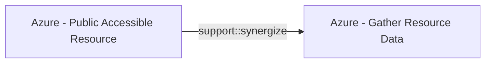

# Azure - Public Accessible Resource

## Metadata

- **UUID**: `9b41d6cf-de4d-44d1-97cc-f3671f4ee5ab`
- **Schema**: `threat::1.0`
- **Version**: `2`
- **Created**: `2025-07-31`
- **Modified**: `2025-09-04`
- **TLP**: clear (`TLP:CLEAR`)
- **Organisation**: EC DIGIT CSOC (`56b0a0f0-b0bc-47d9-bb46-02f80ae2065a`)

## References
### Public
- **1**: [https://misp-galaxy.org/atrm/](https://misp-galaxy.org/atrm/)
- **2**: [https://www.bdosecurity.de/en-gb/insights/security-column/cloud-hacking-the-azure-cyber-kill-chain-part-1](https://www.bdosecurity.de/en-gb/insights/security-column/cloud-hacking-the-azure-cyber-kill-chain-part-1)
- **3**: [https://learn.microsoft.com/en-us/azure/data-explorer/security-network-restrict-public-access](https://learn.microsoft.com/en-us/azure/data-explorer/security-network-restrict-public-access)

## Description
In Azure, this technique highlights the risk where certain resources—commonly **Network Interfaces** 
and **Virtual Machines**—have public IP addresses or open ports, making them directly 
reachable from the internet. Unlike other reconnaissance techniques, this isn’t 
just about discovering resource metadata but about identifying resources configured 
(intentionally or not) for public access.

#### How Attackers Use This Vector

- **Discovery Phase:** Attackers or researchers employ automated tools and scan 
internet-facing IP space, hunting for live Azure VMs, network interfaces, and endpoints 
whose public exposure can be confirmed.
- **Enumeration Approaches:** 
  - **Subdomain/Service Pattern Scanning:** Many Azure services use predictable 
  domain structures (e.g., `*.azurewebsites.net`, `*.blob.core.windows.net`). 
  Attackers enumerate these to find exposed resources.
  - **Open Ports Scans:** Tools scan IPs for open RDP, SSH, web, or management ports.
- **Public APIs and Metadata:** Some Azure resource information is available through 
public APIs or unauthenticated metadata services, providing further opportunities 
for adversaries to discover exposed resources.
- **Real-World Tools:** Well-known tools include MicroBurst, AADInternals, and custom 
scripts for mass scanning.
  
#### Specific Azure Resources at Risk

- **Network Interfaces:** Networking components that, if tied to public IPs, may 
expose internal workloads.
- **Virtual Machines:** Especially those configured with public IPs and ports like 
RDP (3389) or SSH (22) open.
- **App Services and Blob Storage:** Though not explicitly listed in AZT103, these 
are also frequent targets for enumeration due to default public endpoints.
- **Databases/Clusters:** Services like Azure Data Explorer or managed databases 
may be misconfigured to allow public ingress.

#### Security Implications

- **Increased Attack Surface:** Exposing resources multiplies the number of direct 
entry points for adversaries.
- **Brute-Force and Vulnerability Exploitation:** Resources with public connectivity 
are subject to constant automated attacks and vulnerability scans.
- **Potential Lateral Movement:** Compromising one public resource can serve as 
a foothold to move deeper into the Azure environment.

## Criticality
**High** - A High priority incident is likely to result in a demonstrable impact to public health or safety, national security, economic security, foreign relations, civil liberties, or public confidence.

## Terrain
> **Adversary must have access to internet-facing IP space to scan for live Azure VMs 
and network interfaces.

Domains: Public Cloud, Private Cloud
Targets: Virtual Machines, Network Equipment, Public-Facing Servers, Cloud Storage Accounts
Platforms: Azure**

## Threat Assessment
| Dimension | Assessment | Description |
| --- | --- | --- |
| Severity | Significant incident | A cyber attack which has a serious impact on a large organisation or on wider / local government, or which poses a considerable risk to central government or (inter)national essential services. |
| Impact | Data Breach; IP Loss; Reputational Damages; Monetary Loss; Business disruption | - |
| Leverage | Spoofing; Tampering; Information Disclosure; Denial of Service; Elevation of privilege | - |
| Viability | Likely | Probable (probably) - 55-80% |
| Kill Chain | Reconnaissance | Researching, identifying and selecting targets using active or passive reconnaissance. |

## ATT&CK Techniques
| Technique | Name | Description |
| --- | --- | --- |
| `T1580` | [Cloud Infrastructure Discovery](https://attack.mitre.org/techniques/T1580) | An adversary may attempt to discover infrastructure and resources that are available within an infrastructure-as-a-service (IaaS) environment. This includes compute service resources such as instances, virtual machines, and snapshots as well as resources of other services including the storage and database services.  Cloud providers offer methods such as APIs and commands issued through CLIs to serve information about infrastructure. For example, AWS provides a <code>DescribeInstances</code> API within the Amazon EC2 API that can return information about one or more instances within an account, the <code>ListBuckets</code> API that returns a list of all buckets owned by the authenticated sender of the request, the <code>HeadBucket</code> API to determine a bucket’s existence along with access permissions of the request sender, or the <code>GetPublicAccessBlock</code> API to retrieve access block configuration for a bucket.(Citation: Amazon Describe Instance)(Citation: Amazon Describe Instances API)(Citation: AWS Get Public Access Block)(Citation: AWS Head Bucket) Similarly, GCP's Cloud SDK CLI provides the <code>gcloud compute instances list</code> command to list all Google Compute Engine instances in a project (Citation: Google Compute Instances), and Azure's CLI command <code>az vm list</code> lists details of virtual machines.(Citation: Microsoft AZ CLI) In addition to API commands, adversaries can utilize open source tools to discover cloud storage infrastructure through [Wordlist Scanning](https://attack.mitre.org/techniques/T1595/003).(Citation: Malwarebytes OSINT Leaky Buckets - Hioureas)  An adversary may enumerate resources using a compromised user's access keys to determine which are available to that user.(Citation: Expel IO Evil in AWS) The discovery of these available resources may help adversaries determine their next steps in the Cloud environment, such as establishing Persistence.(Citation: Mandiant M-Trends 2020)An adversary may also use this information to change the configuration to make the bucket publicly accessible, allowing data to be accessed without authentication. Adversaries have also may use infrastructure discovery APIs such as <code>DescribeDBInstances</code> to determine size, owner, permissions, and network ACLs of database resources. (Citation: AWS Describe DB Instances) Adversaries can use this information to determine the potential value of databases and discover the requirements to access them. Unlike in [Cloud Service Discovery](https://attack.mitre.org/techniques/T1526), this technique focuses on the discovery of components of the provided services rather than the services themselves. |
| `T1046` | [Network Service Discovery](https://attack.mitre.org/techniques/T1046) | Adversaries may attempt to get a listing of services running on remote hosts and local network infrastructure devices, including those that may be vulnerable to remote software exploitation. Common methods to acquire this information include port, vulnerability, and/or wordlist scans using tools that are brought onto a system.(Citation: CISA AR21-126A FIVEHANDS May 2021)     Within cloud environments, adversaries may attempt to discover services running on other cloud hosts. Additionally, if the cloud environment is connected to a on-premises environment, adversaries may be able to identify services running on non-cloud systems as well.  Within macOS environments, adversaries may use the native Bonjour application to discover services running on other macOS hosts within a network. The Bonjour mDNSResponder daemon automatically registers and advertises a host’s registered services on the network. For example, adversaries can use a mDNS query (such as <code>dns-sd -B _ssh._tcp .</code>) to find other systems broadcasting the ssh service.(Citation: apple doco bonjour description)(Citation: macOS APT Activity Bradley) |
| `T1133` | [External Remote Services](https://attack.mitre.org/techniques/T1133) | Adversaries may leverage external-facing remote services to initially access and/or persist within a network. Remote services such as VPNs, Citrix, and other access mechanisms allow users to connect to internal enterprise network resources from external locations. There are often remote service gateways that manage connections and credential authentication for these services. Services such as [Windows Remote Management](https://attack.mitre.org/techniques/T1021/006) and [VNC](https://attack.mitre.org/techniques/T1021/005) can also be used externally.(Citation: MacOS VNC software for Remote Desktop)  Access to [Valid Accounts](https://attack.mitre.org/techniques/T1078) to use the service is often a requirement, which could be obtained through credential pharming or by obtaining the credentials from users after compromising the enterprise network.(Citation: Volexity Virtual Private Keylogging) Access to remote services may be used as a redundant or persistent access mechanism during an operation.  Access may also be gained through an exposed service that doesn’t require authentication. In containerized environments, this may include an exposed Docker API, Kubernetes API server, kubelet, or web application such as the Kubernetes dashboard.(Citation: Trend Micro Exposed Docker Server)(Citation: Unit 42 Hildegard Malware) |

## Chaining

### Chaining details
#### synergize -> Azure - Gather Resource Data (`support::synergize`)
The attacker obtains credentials (via phishing, password spray, leaked keys) granting 
at least Reader access to the target Azure tenant.

- **Target UUID**: `b1593e0b-1b3b-462d-9ab6-21d1c136469d`
