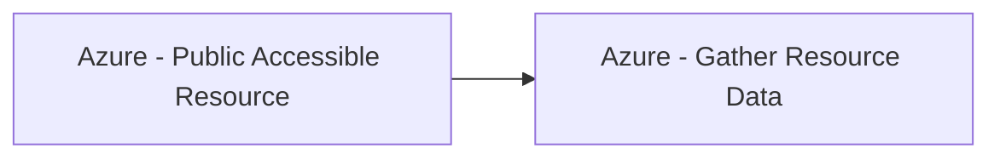

# Azure - Public Accessible Resource

## Metadata

- **UUID**: `9b41d6cf-de4d-44d1-97cc-f3671f4ee5ab`
- **Schema**: `threat::1.0`
- **TLP**: clear

## Description
In Azure, this technique highlights the risk where certain resources—commonly **Network Interfaces** 
and **Virtual Machines**—have public IP addresses or open ports, making them directly 
reachable from the internet. Unlike other reconnaissance techniques, this isn’t 
just about discovering resource metadata but about identifying resources configured 
(intentionally or not) for public access.

#### How Attackers Use This Vector

- **Discovery Phase:** Attackers or researchers employ automated tools and scan 
internet-facing IP space, hunting for live Azure VMs, network interfaces, and endpoints 
whose public exposure can be confirmed.
- **Enumeration Approaches:** 
  - **Subdomain/Service Pattern Scanning:** Many Azure services use predictable 
  domain structures (e.g., `*.azurewebsites.net`, `*.blob.core.windows.net`). 
  Attackers enumerate these to find exposed resources.
  - **Open Ports Scans:** Tools scan IPs for open RDP, SSH, web, or management ports.
- **Public APIs and Metadata:** Some Azure resource information is available through 
public APIs or unauthenticated metadata services, providing further opportunities 
for adversaries to discover exposed resources.
- **Real-World Tools:** Well-known tools include MicroBurst, AADInternals, and custom 
scripts for mass scanning.
  
#### Specific Azure Resources at Risk

- **Network Interfaces:** Networking components that, if tied to public IPs, may 
expose internal workloads.
- **Virtual Machines:** Especially those configured with public IPs and ports like 
RDP (3389) or SSH (22) open.
- **App Services and Blob Storage:** Though not explicitly listed in AZT103, these 
are also frequent targets for enumeration due to default public endpoints.
- **Databases/Clusters:** Services like Azure Data Explorer or managed databases 
may be misconfigured to allow public ingress.

#### Security Implications

- **Increased Attack Surface:** Exposing resources multiplies the number of direct 
entry points for adversaries.
- **Brute-Force and Vulnerability Exploitation:** Resources with public connectivity 
are subject to constant automated attacks and vulnerability scans.
- **Potential Lateral Movement:** Compromising one public resource can serve as 
a foothold to move deeper into the Azure environment.

## Techniques
- T1580
- T1046
- T1133

## Chaining

