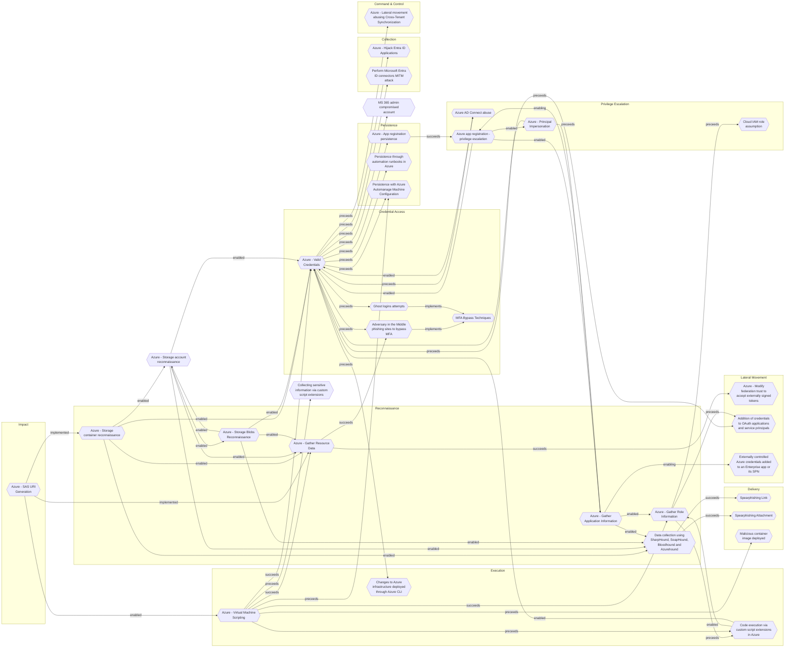

# Azure - SAS URI Generation

## Metadata
| Field | Value |
| --- | --- |
| UUID | `9edfeee4-63ee-49cc-ab7f-43a7e602ab58` |
| Schema | `threat::1.0` |
| Version | `1` |
| Created | `2025-09-11` |
| Modified | `2025-09-11` |
| TLP | clear (`TLP:CLEAR`) |
| Organisation | EC DIGIT CSOC (`56b0a0f0-b0bc-47d9-bb46-02f80ae2065a`) |

## References
### Public
- **1**: [https://microsoft.github.io/Azure-Threat-Research-Matrix/Impact/AZT701/AZT701/](https://microsoft.github.io/Azure-Threat-Research-Matrix/Impact/AZT701/AZT701/)
- **2**: [https://www.cyngular.com/resource-center/pathways-of-privilege-navigating-secure-access-with-microsoft-azure-sas-uris/](https://www.cyngular.com/resource-center/pathways-of-privilege-navigating-secure-access-with-microsoft-azure-sas-uris/)
- **3**: [https://www.paloaltonetworks.com/blog/cloud-security/sas-token-abuse-mitigation/](https://www.paloaltonetworks.com/blog/cloud-security/sas-token-abuse-mitigation/)

## Description
The following threat vector enables attackers to exfiltrate or manipulate data by 
generating Shared Access Signature (SAS) URIs for Azure resources such as virtual 
machine disks or storage containers, often without authentication or sufficient oversight.

## Example Attack Scenario

An adversary with sufficient Azure permissions compromises a resource (like a VM 
or storage account) and generates an SAS URI for the VM disk or storage container. 
The attacker then uses the generated SAS URI to download or exfiltrate sensitive 
data, such as disk images containing credentials or proprietary information. For 
example, a well-publicized incident involved researchers leaking terabytes of confidential 
data after distributing SAS-protected links with overly broad permissions.

## Attack Goals and Impact

- The key **attack goal** is **data exfiltration** or unauthorized access to sensitive 
data without detection or need for ongoing authentication.
- Attackers can download full VM disks, access entire storage containers, manipulate 
data, or even inject and delete files if permission scopes are broad.
- **Impact** includes extensive data breaches, loss of intellectual property, ransom 
demands, or irreparable harm due to deletion or manipulation of business-critical resources.
- SAS URIs are particularly dangerous because, once generated, they can't be easily 
revoked, and their permissions/duration may be overprovisioned by design or accident.

## Attack Flow and Methodology

1. **Privilege Acquisition**: Attacker gains access to an Azure resource or user 
account with permissions to generate SAS URIs.
2. **SAS Generation**: Using privileged actions (such as 'Microsoft.Compute/disks/beginGetAccess/action' 
for VM disks or 'Microsoft.Storage/storageAccounts/listAccountSas/action' for Storage Accounts), 
the attacker generates a SAS URI for the target resource.
3. **Data Access or Exfiltration**: The attacker uses the SAS URI to access, download, 
modify, or delete data directly, often bypassing logging or security controls if 
not properly monitored.
4. **Persistence and Stealth**: Since SAS URIs can have long or indefinite validity 
periods and are rarely tracked, the attacker maintains ongoing access until the 
token expires or underlying keys are rotated.
5. **Cleanup or Covering Tracks**: In advanced scenarios, the attacker removes evidence 
of token generation and exfiltration or uses the access to establish further persistence 
within the environment.

## Criticality
**High** - A High priority incident is likely to result in a demonstrable impact to public health or safety, national security, economic security, foreign relations, civil liberties, or public confidence.

## Terrain
Adversaries must gain access to an Azure account or service principal with the required 
permissions (for example, via stolen credentials or overly-permissive roles) to 
generate or obtain SAS tokens for targeted storage resources.

## Surface
> **Azure**
> Microsoft Azure cloud platform

> **Azure::Security::Entra ID**
> Microsoft Entra ID in Azure (cloud identity)

> **AWS::Storage**
> AWS storage services

> **Azure::Compute::Virtual Machines**
> Azure Virtual Machines

> **Orchestration::Kubernetes**
> Kubernetes container orchestration platform

> **Serverless**
> Cloud-agnostic serverless compute (when not provider-specific)

## Threat Assessment
| Dimension | Assessment | Description |
| --- | --- | --- |
| Severity | Significant incident | A cyber attack which has a serious impact on a large organisation or on wider / local government, or which poses a considerable risk to central government or (inter)national essential services. |
| Impact | Data Breach IP Loss Reputational Damages Monetary Loss | Non-public information has been accessed from the outside, and successfully extracted. Particular, key data, information and blueprint conducive to the organization capability to gain and retain a commercial or geopolitical advantage has been accessed, and their content potentially used by competitors or other adversaries. Damages to the organization public view may be achieved by using directly the access gained, or indirectly with data gathered. The vector will directly conduct to loss of value directly impacting the bottom line. |
| Leverage | Information Disclosure Elevation of privilege | Threat action intending to read a file that one was not granted access to, or to read data in transit. Capacity to augment leverage over the target system by upgrading the compromised access rights |
| Viability | Likely | Probable (probably) - 55-80% |
| Kill Chain | Impact | Techniques aimed at manipulating, interrupting or destroying the target system or data. |

## ATT&CK Techniques
| Technique | Name | Description |
| --- | --- | --- |
| `T1537` | [Transfer Data to Cloud Account](https://attack.mitre.org/techniques/T1537) | Adversaries may exfiltrate data by transferring the data, including through sharing/syncing and creating backups of cloud environments, to another cloud account they control on the same service.  A defender who is monitoring for large transfers to outside the cloud environment through normal file transfers or over command and control channels may not be watching for data transfers to another account within the same cloud provider. Such transfers may utilize existing cloud provider APIs and the internal address space of the cloud provider to blend into normal traffic or avoid data transfers over external network interfaces.(Citation: TLDRSec AWS Attacks)  Adversaries may also use cloud-native mechanisms to share victim data with adversary-controlled cloud accounts, such as creating anonymous file sharing links or, in Azure, a shared access signature (SAS) URI.(Citation: Microsoft Azure Storage Shared Access Signature)  Incidents have been observed where adversaries have created backups of cloud instances and transferred them to separate accounts.(Citation: DOJ GRU Indictment Jul 2018) |
| `T1078.004` | [Valid Accounts: Cloud Accounts](https://attack.mitre.org/techniques/T1078/004) | Valid accounts in cloud environments may allow adversaries to perform actions to achieve Initial Access, Persistence, Privilege Escalation, or Defense Evasion. Cloud accounts are those created and configured by an organization for use by users, remote support, services, or for administration of resources within a cloud service provider or SaaS application. Cloud Accounts can exist solely in the cloud; alternatively, they may be hybrid-joined between on-premises systems and the cloud through syncing or federation with other identity sources such as Windows Active Directory.(Citation: AWS Identity Federation)(Citation: Google Federating GC)(Citation: Microsoft Deploying AD Federation)  Service or user accounts may be targeted by adversaries through [Brute Force](https://attack.mitre.org/techniques/T1110), [Phishing](https://attack.mitre.org/techniques/T1566), or various other means to gain access to the environment. Federated or synced accounts may be a pathway for the adversary to affect both on-premises systems and cloud environments - for example, by leveraging shared credentials to log onto [Remote Services](https://attack.mitre.org/techniques/T1021). High privileged cloud accounts, whether federated, synced, or cloud-only, may also allow pivoting to on-premises environments by leveraging SaaS-based [Software Deployment Tools](https://attack.mitre.org/techniques/T1072) to run commands on hybrid-joined devices.  An adversary may create long lasting [Additional Cloud Credentials](https://attack.mitre.org/techniques/T1098/001) on a compromised cloud account to maintain persistence in the environment. Such credentials may also be used to bypass security controls such as multi-factor authentication.   Cloud accounts may also be able to assume [Temporary Elevated Cloud Access](https://attack.mitre.org/techniques/T1548/005) or other privileges through various means within the environment. Misconfigurations in role assignments or role assumption policies may allow an adversary to use these mechanisms to leverage permissions outside the intended scope of the account. Such over privileged accounts may be used to harvest sensitive data from online storage accounts and databases through [Cloud API](https://attack.mitre.org/techniques/T1059/009) or other methods. For example, in Azure environments, adversaries may target Azure Managed Identities, which allow associated Azure resources to request access tokens. By compromising a resource with an attached Managed Identity, such as an Azure VM, adversaries may be able to [Steal Application Access Token](https://attack.mitre.org/techniques/T1528)s to move laterally across the cloud environment.(Citation: SpecterOps Managed Identity 2022) |
| `T1098.001` | [Account Manipulation: Additional Cloud Credentials](https://attack.mitre.org/techniques/T1098/001) | Adversaries may add adversary-controlled credentials to a cloud account to maintain persistent access to victim accounts and instances within the environment.  For example, adversaries may add credentials for Service Principals and Applications in addition to existing legitimate credentials in Azure / Entra ID.(Citation: Microsoft SolarWinds Customer Guidance)(Citation: Blue Cloud of Death)(Citation: Blue Cloud of Death Video) These credentials include both x509 keys and passwords.(Citation: Microsoft SolarWinds Customer Guidance) With sufficient permissions, there are a variety of ways to add credentials including the Azure Portal, Azure command line interface, and Azure or Az PowerShell modules.(Citation: Demystifying Azure AD Service Principals)  In infrastructure-as-a-service (IaaS) environments, after gaining access through [Cloud Accounts](https://attack.mitre.org/techniques/T1078/004), adversaries may generate or import their own SSH keys using either the <code>CreateKeyPair</code> or <code>ImportKeyPair</code> API in AWS or the <code>gcloud compute os-login ssh-keys add</code> command in GCP.(Citation: GCP SSH Key Add) This allows persistent access to instances within the cloud environment without further usage of the compromised cloud accounts.(Citation: Expel IO Evil in AWS)(Citation: Expel Behind the Scenes)  Adversaries may also use the <code>CreateAccessKey</code> API in AWS or the <code>gcloud iam service-accounts keys create</code> command in GCP to add access keys to an account. Alternatively, they may use the <code>CreateLoginProfile</code> API in AWS to add a password that can be used to log into the AWS Management Console for [Cloud Service Dashboard](https://attack.mitre.org/techniques/T1538).(Citation: Permiso Scattered Spider 2023)(Citation: Lacework AI Resource Hijacking 2024) If the target account has different permissions from the requesting account, the adversary may also be able to escalate their privileges in the environment (i.e. [Cloud Accounts](https://attack.mitre.org/techniques/T1078/004)).(Citation: Rhino Security Labs AWS Privilege Escalation)(Citation: Sysdig ScarletEel 2.0) For example, in Entra ID environments, an adversary with the Application Administrator role can add a new set of credentials to their application's service principal. In doing so the adversary would be able to access the service principal’s roles and permissions, which may be different from those of the Application Administrator.(Citation: SpecterOps Azure Privilege Escalation)   In AWS environments, adversaries with the appropriate permissions may also use the `sts:GetFederationToken` API call to create a temporary set of credentials to [Forge Web Credentials](https://attack.mitre.org/techniques/T1606) tied to the permissions of the original user account. These temporary credentials may remain valid for the duration of their lifetime even if the original account’s API credentials are deactivated. (Citation: Crowdstrike AWS User Federation Persistence)  In Entra ID environments with the app password feature enabled, adversaries may be able to add an app password to a user account.(Citation: Mandiant APT42 Operations 2024) As app passwords are intended to be used with legacy devices that do not support multi-factor authentication (MFA), adding an app password can allow an adversary to bypass MFA requirements. Additionally, app passwords may remain valid even if the user’s primary password is reset.(Citation: Microsoft Entra ID App Passwords) |

## Chaining

### Chaining details
#### implemented -> [Azure - Gather Resource Data](azure-gather-resource-data.md) (`b1593e0b-1b3b-462d-9ab6-21d1c136469d`) (`atomicity::implemented`)
The attacker obtains credentials (via phishing, password spray, leaked keys)
granting at least Reader access to the target Azure tenant.

- **Target UUID**: `b1593e0b-1b3b-462d-9ab6-21d1c136469d`
#### implemented -> [Azure - Storage container reconnaissance](azure-storage-container-reconnaissance.md) (`2d7ed070-e5c5-4796-b150-ea1d02ed1785`) (`atomicity::implemented`)
Adversaries need to enumerate and discover publicly accessible or misconfigured 
Azure storage containers by scanning for storage account names and container names, 
often using automated tools or scripts, to identify open containers that may expose 
sensitive data.

- **Target UUID**: `2d7ed070-e5c5-4796-b150-ea1d02ed1785`
#### implemented -> [Azure - Storage container reconnaissance](azure-storage-container-reconnaissance.md) (`2d7ed070-e5c5-4796-b150-ea1d02ed1785`) (`atomicity::implemented`)
Adversaries need to enumerate and discover publicly accessible or misconfigured 
Azure storage containers by scanning for storage account names and container names, 
often using automated tools or scripts, to identify open containers that may expose 
sensitive data.

- **Target UUID**: `2d7ed070-e5c5-4796-b150-ea1d02ed1785`
#### enabled -> [Azure - Virtual Machine Scripting](azure-virtual-machine-scripting.md) (`3435c5fd-1069-40ee-ae79-54c672ce454d`) (`support::enabled`)
Through compromised account credentials or misused RBAC permissions, adversaries 
obtains sufficient access to invoke scripting features (RunCommand, extensions).

- **Target UUID**: `3435c5fd-1069-40ee-ae79-54c672ce454d`
