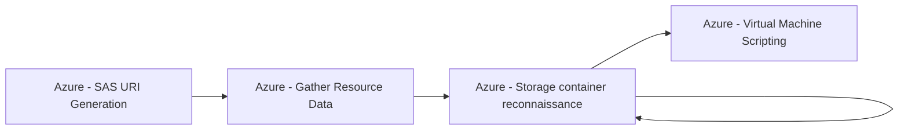

# Azure - SAS URI Generation

## Metadata

- **UUID**: `9edfeee4-63ee-49cc-ab7f-43a7e602ab58`
- **Schema**: `threat::1.0`
- **TLP**: clear

## Description
The following threat vector enables attackers to exfiltrate or manipulate data by 
generating Shared Access Signature (SAS) URIs for Azure resources such as virtual 
machine disks or storage containers, often without authentication or sufficient oversight.

## Example Attack Scenario

An adversary with sufficient Azure permissions compromises a resource (like a VM 
or storage account) and generates an SAS URI for the VM disk or storage container. 
The attacker then uses the generated SAS URI to download or exfiltrate sensitive 
data, such as disk images containing credentials or proprietary information. For 
example, a well-publicized incident involved researchers leaking terabytes of confidential 
data after distributing SAS-protected links with overly broad permissions.

## Attack Goals and Impact

- The key **attack goal** is **data exfiltration** or unauthorized access to sensitive 
data without detection or need for ongoing authentication.
- Attackers can download full VM disks, access entire storage containers, manipulate 
data, or even inject and delete files if permission scopes are broad.
- **Impact** includes extensive data breaches, loss of intellectual property, ransom 
demands, or irreparable harm due to deletion or manipulation of business-critical resources.
- SAS URIs are particularly dangerous because, once generated, they can't be easily 
revoked, and their permissions/duration may be overprovisioned by design or accident.

## Attack Flow and Methodology

1. **Privilege Acquisition**: Attacker gains access to an Azure resource or user 
account with permissions to generate SAS URIs.
2. **SAS Generation**: Using privileged actions (such as 'Microsoft.Compute/disks/beginGetAccess/action' 
for VM disks or 'Microsoft.Storage/storageAccounts/listAccountSas/action' for Storage Accounts), 
the attacker generates a SAS URI for the target resource.
3. **Data Access or Exfiltration**: The attacker uses the SAS URI to access, download, 
modify, or delete data directly, often bypassing logging or security controls if 
not properly monitored.
4. **Persistence and Stealth**: Since SAS URIs can have long or indefinite validity 
periods and are rarely tracked, the attacker maintains ongoing access until the 
token expires or underlying keys are rotated.
5. **Cleanup or Covering Tracks**: In advanced scenarios, the attacker removes evidence 
of token generation and exfiltration or uses the access to establish further persistence 
within the environment.

## Techniques
- T1537
- T1078.004
- T1098.001

## Chaining

