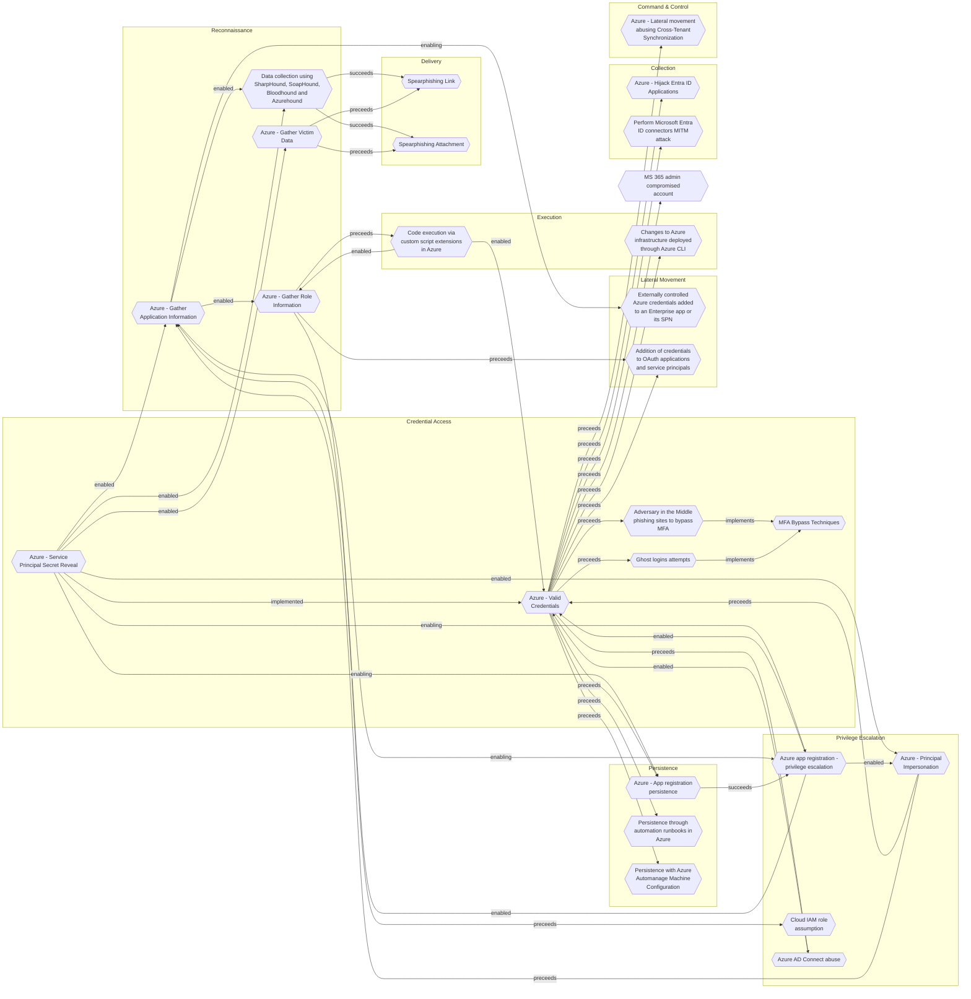

# Azure - Service Principal Secret Reveal

## Metadata
| Field | Value |
| --- | --- |
| UUID | `c4edae81-5790-4b9c-88b7-d11d6985b1a4` |
| Schema | `threat::1.0` |
| Version | `1` |
| Created | `2025-09-18` |
| Modified | `2025-09-19` |
| TLP | clear (`TLP:CLEAR`) |
| Organisation | EC DIGIT CSOC (`56b0a0f0-b0bc-47d9-bb46-02f80ae2065a`) |

## References
### Public
- **1**: [https://microsoft.github.io/Azure-Threat-Research-Matrix/CredentialAccess/CredentialAccess/](https://microsoft.github.io/Azure-Threat-Research-Matrix/CredentialAccess/CredentialAccess/)
- **2**: [https://microsoft.github.io/Azure-Threat-Research-Matrix/CredentialAccess/AZT603/AZT603-1/](https://microsoft.github.io/Azure-Threat-Research-Matrix/CredentialAccess/AZT603/AZT603-1/)
- **3**: [https://misp-galaxy.org/atrm/](https://misp-galaxy.org/atrm/)

## Description
The following threat vector involves an adversary revealing a service principal's 
secret (a credential) in plain text, which can then be used for unauthorized access 
and further attacks.

### Example Attack Scenario

An adversary targets an Azure Function App that uses a service principal for authentication. 
The attacker exploits the Function App by manipulating its application logic to 
reveal the service principal's secret in plain text. This secret, which acts like 
a password, provides direct authentication access as the service principal identity, 
enabling the attacker to escalate privileges or move laterally within the Azure environment.

### Attack Goals and Impact

The primary goal of the "Service Principal Secret Reveal" attack is to gain unauthorized 
access to service principal credentials. With these credentials, the attacker can:

- Authenticate as the service principal identity.
- Access resources and perform actions permitted to the service principal.
- Potentially escalate privileges by abusing the service principal's permission scope.
- Maintain persistence in the environment by leveraging the stolen secret.
- Move laterally across Azure resources to further compromise the target environment.

### Attack Flow and Methodology

1. **Identify Target Service Principal**: The attacker discovers that the Function 
App uses a service principal for authentication.
2. **Manipulate Function App Logic**: The attacker modifies the Function App's code 
or configuration to extract and reveal the service principal's secret in plain text.
3. **Secret Disclosure**: The service principal secret is exposed and accessible 
to the attacker.
4. **Credential Use**: The attacker uses the secret to authenticate as the service 
principal identity.
5. **Privilege Escalation and Lateral Movement**: Using the service principal's 
permissions, the attacker can escalate privileges and move laterally across Azure resources.
6. **Persistence and Further Exploitation**: The attacker may maintain persistent 
access, harvest additional credentials, or exfiltrate sensitive data.

## Criticality
**High** - A High priority incident is likely to result in a demonstrable impact to public health or safety, national security, economic security, foreign relations, civil liberties, or public confidence.

## Terrain
Adversaries must gain access to the Azure environment or function app through phishing, 
compromised credentials, misconfigurations, or vulnerability exploitation.

## Surface
> **Azure**
> Microsoft Azure cloud platform

> **Azure::Security::Entra ID**
> Microsoft Entra ID in Azure (cloud identity)

> **AWS::Storage**
> AWS storage services

> **Entra ID**
> Microsoft Entra ID (formerly Azure Active Directory)

> **Application Layer::HTTP**
> Hypertext Transfer Protocol

> **Serverless**
> Cloud-agnostic serverless compute (when not provider-specific)

## Threat Assessment
| Dimension | Assessment | Description |
| --- | --- | --- |
| Severity | Significant incident | A cyber attack which has a serious impact on a large organisation or on wider / local government, or which poses a considerable risk to central government or (inter)national essential services. |
| Impact | Data Breach IP Loss Reputational Damages Identity Theft | Non-public information has been accessed from the outside, and successfully extracted. Particular, key data, information and blueprint conducive to the organization capability to gain and retain a commercial or geopolitical advantage has been accessed, and their content potentially used by competitors or other adversaries. Damages to the organization public view may be achieved by using directly the access gained, or indirectly with data gathered. Acquisition of sufficient information and privileges to profess as a given individual, for the purpose of abusing and deceiving human trust relationships. |
| Leverage | Spoofing Tampering Elevation of privilege Information Disclosure | Threat action aimed at accessing and use of another user’s credentials, such as username and password. Threat action intending to maliciously change or modify persistent data, such as records in a database, and the alteration of data in transit between two computers over an open network, such as the Internet. Capacity to augment leverage over the target system by upgrading the compromised access rights Threat action intending to read a file that one was not granted access to, or to read data in transit. |
| Viability | Likely | Probable (probably) - 55-80% |
| Kill Chain | Credential Access | Techniques resulting in the access of, or control over, system, service or domain credentials. |

## ATT&CK Techniques
| Technique | Name | Description |
| --- | --- | --- |
| `T1098.001` | [Account Manipulation: Additional Cloud Credentials](https://attack.mitre.org/techniques/T1098/001) | Adversaries may add adversary-controlled credentials to a cloud account to maintain persistent access to victim accounts and instances within the environment.  For example, adversaries may add credentials for Service Principals and Applications in addition to existing legitimate credentials in Azure / Entra ID.(Citation: Microsoft SolarWinds Customer Guidance)(Citation: Blue Cloud of Death)(Citation: Blue Cloud of Death Video) These credentials include both x509 keys and passwords.(Citation: Microsoft SolarWinds Customer Guidance) With sufficient permissions, there are a variety of ways to add credentials including the Azure Portal, Azure command line interface, and Azure or Az PowerShell modules.(Citation: Demystifying Azure AD Service Principals)  In infrastructure-as-a-service (IaaS) environments, after gaining access through [Cloud Accounts](https://attack.mitre.org/techniques/T1078/004), adversaries may generate or import their own SSH keys using either the <code>CreateKeyPair</code> or <code>ImportKeyPair</code> API in AWS or the <code>gcloud compute os-login ssh-keys add</code> command in GCP.(Citation: GCP SSH Key Add) This allows persistent access to instances within the cloud environment without further usage of the compromised cloud accounts.(Citation: Expel IO Evil in AWS)(Citation: Expel Behind the Scenes)  Adversaries may also use the <code>CreateAccessKey</code> API in AWS or the <code>gcloud iam service-accounts keys create</code> command in GCP to add access keys to an account. Alternatively, they may use the <code>CreateLoginProfile</code> API in AWS to add a password that can be used to log into the AWS Management Console for [Cloud Service Dashboard](https://attack.mitre.org/techniques/T1538).(Citation: Permiso Scattered Spider 2023)(Citation: Lacework AI Resource Hijacking 2024) If the target account has different permissions from the requesting account, the adversary may also be able to escalate their privileges in the environment (i.e. [Cloud Accounts](https://attack.mitre.org/techniques/T1078/004)).(Citation: Rhino Security Labs AWS Privilege Escalation)(Citation: Sysdig ScarletEel 2.0) For example, in Entra ID environments, an adversary with the Application Administrator role can add a new set of credentials to their application's service principal. In doing so the adversary would be able to access the service principal’s roles and permissions, which may be different from those of the Application Administrator.(Citation: SpecterOps Azure Privilege Escalation)   In AWS environments, adversaries with the appropriate permissions may also use the `sts:GetFederationToken` API call to create a temporary set of credentials to [Forge Web Credentials](https://attack.mitre.org/techniques/T1606) tied to the permissions of the original user account. These temporary credentials may remain valid for the duration of their lifetime even if the original account’s API credentials are deactivated. (Citation: Crowdstrike AWS User Federation Persistence)  In Entra ID environments with the app password feature enabled, adversaries may be able to add an app password to a user account.(Citation: Mandiant APT42 Operations 2024) As app passwords are intended to be used with legacy devices that do not support multi-factor authentication (MFA), adding an app password can allow an adversary to bypass MFA requirements. Additionally, app passwords may remain valid even if the user’s primary password is reset.(Citation: Microsoft Entra ID App Passwords) |
| `T1078.004` | [Valid Accounts: Cloud Accounts](https://attack.mitre.org/techniques/T1078/004) | Valid accounts in cloud environments may allow adversaries to perform actions to achieve Initial Access, Persistence, Privilege Escalation, or Defense Evasion. Cloud accounts are those created and configured by an organization for use by users, remote support, services, or for administration of resources within a cloud service provider or SaaS application. Cloud Accounts can exist solely in the cloud; alternatively, they may be hybrid-joined between on-premises systems and the cloud through syncing or federation with other identity sources such as Windows Active Directory.(Citation: AWS Identity Federation)(Citation: Google Federating GC)(Citation: Microsoft Deploying AD Federation)  Service or user accounts may be targeted by adversaries through [Brute Force](https://attack.mitre.org/techniques/T1110), [Phishing](https://attack.mitre.org/techniques/T1566), or various other means to gain access to the environment. Federated or synced accounts may be a pathway for the adversary to affect both on-premises systems and cloud environments - for example, by leveraging shared credentials to log onto [Remote Services](https://attack.mitre.org/techniques/T1021). High privileged cloud accounts, whether federated, synced, or cloud-only, may also allow pivoting to on-premises environments by leveraging SaaS-based [Software Deployment Tools](https://attack.mitre.org/techniques/T1072) to run commands on hybrid-joined devices.  An adversary may create long lasting [Additional Cloud Credentials](https://attack.mitre.org/techniques/T1098/001) on a compromised cloud account to maintain persistence in the environment. Such credentials may also be used to bypass security controls such as multi-factor authentication.   Cloud accounts may also be able to assume [Temporary Elevated Cloud Access](https://attack.mitre.org/techniques/T1548/005) or other privileges through various means within the environment. Misconfigurations in role assignments or role assumption policies may allow an adversary to use these mechanisms to leverage permissions outside the intended scope of the account. Such over privileged accounts may be used to harvest sensitive data from online storage accounts and databases through [Cloud API](https://attack.mitre.org/techniques/T1059/009) or other methods. For example, in Azure environments, adversaries may target Azure Managed Identities, which allow associated Azure resources to request access tokens. By compromising a resource with an attached Managed Identity, such as an Azure VM, adversaries may be able to [Steal Application Access Token](https://attack.mitre.org/techniques/T1528)s to move laterally across the cloud environment.(Citation: SpecterOps Managed Identity 2022) |
| `T1526` | [Cloud Service Discovery](https://attack.mitre.org/techniques/T1526) | An adversary may attempt to enumerate the cloud services running on a system after gaining access. These methods can differ from platform-as-a-service (PaaS), to infrastructure-as-a-service (IaaS), or software-as-a-service (SaaS). Many services exist throughout the various cloud providers and can include Continuous Integration and Continuous Delivery (CI/CD), Lambda Functions, Entra ID, etc. They may also include security services, such as AWS GuardDuty and Microsoft Defender for Cloud, and logging services, such as AWS CloudTrail and Google Cloud Audit Logs.  Adversaries may attempt to discover information about the services enabled throughout the environment. Azure tools and APIs, such as the Microsoft Graph API and Azure Resource Manager API, can enumerate resources and services, including applications, management groups, resources and policy definitions, and their relationships that are accessible by an identity.(Citation: Azure - Resource Manager API)(Citation: Azure AD Graph API)  For example, Stormspotter is an open source tool for enumerating and constructing a graph for Azure resources and services, and Pacu is an open source AWS exploitation framework that supports several methods for discovering cloud services.(Citation: Azure - Stormspotter)(Citation: GitHub Pacu)  Adversaries may use the information gained to shape follow-on behaviors, such as targeting data or credentials from enumerated services or evading identified defenses through [Disable or Modify Tools](https://attack.mitre.org/techniques/T1562/001) or [Disable or Modify Cloud Logs](https://attack.mitre.org/techniques/T1562/008). |

## Chaining

### Chaining details
#### enabled -> [Data collection using SharpHound, SoapHound, Bloodhound and Azurehound](data-collection-using-sharphound-soaphound-bloodhound-and-azurehound.md) (`53063205-4404-4e6d-a2f5-d566c6085d96`) (`support::enabled`)
Attackers need to establish an initial presence within the target environment, in 
order to gather sufficient permissions to execute the data collection tools.

- **Target UUID**: `53063205-4404-4e6d-a2f5-d566c6085d96`
#### enabling -> [Azure - App registration persistence](azure-app-registration-persistence.md) (`5d43ef75-4637-4a75-b1ed-6716052cff0e`) (`support::enabling`)
Adversaries need access to an identity (user account or service principal) with 
sufficient permissions to create, modify, or assign roles to app registrations or 
service principals.

- **Target UUID**: `5d43ef75-4637-4a75-b1ed-6716052cff0e`
#### enabled -> [Azure - Gather Victim Data](azure-gather-victim-data.md) (`4e7eae8e-6615-41f2-bfe1-21a04f7a6088`) (`support::enabled`)
An adversary successfully compromises a user's Azure Active Directory account credentials 
or session token through phishing, credential theft, or token theft.

- **Target UUID**: `4e7eae8e-6615-41f2-bfe1-21a04f7a6088`
#### enabled -> [Azure - Gather Application Information](azure-gather-application-information.md) (`fe6827f2-efb4-43b3-9ca3-b7d417111b32`) (`support::enabled`)
Adversaries obtain minimal access (often as a standard user or via an external account) 
in the target Azure AD tenant, then utilizes API endpoints and tools, such as Azure CLI, 
PowerShell modules (e.g., MSOnline, Microsoft.Graph), or custom scripts, to list 
all registered applications.

- **Target UUID**: `fe6827f2-efb4-43b3-9ca3-b7d417111b32`
#### enabled -> [Azure - Principal Impersonation](azure-principal-impersonation.md) (`bb2501d5-99c7-44a6-ac5a-9510102d6611`) (`support::enabled`)
Adversaries gains access via phishing, credential stuffing, or exploiting misconfigurations 
allowing access to an account with application management permissions or to a pipeline 
that exposes service principal credentials.

- **Target UUID**: `bb2501d5-99c7-44a6-ac5a-9510102d6611`
#### enabling -> [Azure app registration - privilege escalation](azure-app-registration-privilege-escalation.md) (`c7e260d8-d391-41eb-be1a-7f276c99b383`) (`support::enabling`)
Adversaries need access to an identity (user account or service principal) with 
sufficient permissions to create, modify, or assign roles to app registrations or 
service principals.

- **Target UUID**: `c7e260d8-d391-41eb-be1a-7f276c99b383`
#### implemented -> [Azure - Valid Credentials](azure-valid-credentials.md) (`2743bf18-3b86-4721-bf3e-153dcda0b149`) (`atomicity::implemented`)
Adversaries obtain the username and password of an AzureAD user either through phishing, 
password spraying, brute-force attacks, or credentials leaked online.

- **Target UUID**: `2743bf18-3b86-4721-bf3e-153dcda0b149`
