# Azure - Service Principal Secret Reveal

## Metadata

- **UUID**: `c4edae81-5790-4b9c-88b7-d11d6985b1a4`
- **Schema**: `threat::1.0`
- **TLP**: clear

## Description
The following threat vector involves an adversary revealing a service principal's 
secret (a credential) in plain text, which can then be used for unauthorized access 
and further attacks.

### Example Attack Scenario

An adversary targets an Azure Function App that uses a service principal for authentication. 
The attacker exploits the Function App by manipulating its application logic to 
reveal the service principal's secret in plain text. This secret, which acts like 
a password, provides direct authentication access as the service principal identity, 
enabling the attacker to escalate privileges or move laterally within the Azure environment.

### Attack Goals and Impact

The primary goal of the "Service Principal Secret Reveal" attack is to gain unauthorized 
access to service principal credentials. With these credentials, the attacker can:

- Authenticate as the service principal identity.
- Access resources and perform actions permitted to the service principal.
- Potentially escalate privileges by abusing the service principal's permission scope.
- Maintain persistence in the environment by leveraging the stolen secret.
- Move laterally across Azure resources to further compromise the target environment.

### Attack Flow and Methodology

1. **Identify Target Service Principal**: The attacker discovers that the Function 
App uses a service principal for authentication.
2. **Manipulate Function App Logic**: The attacker modifies the Function App's code 
or configuration to extract and reveal the service principal's secret in plain text.
3. **Secret Disclosure**: The service principal secret is exposed and accessible 
to the attacker.
4. **Credential Use**: The attacker uses the secret to authenticate as the service 
principal identity.
5. **Privilege Escalation and Lateral Movement**: Using the service principal's 
permissions, the attacker can escalate privileges and move laterally across Azure resources.
6. **Persistence and Further Exploitation**: The attacker may maintain persistent 
access, harvest additional credentials, or exfiltrate sensitive data.

## Techniques
- T1098.001
- T1078.004
- T1526

## Chaining

```mermaid
flowchart LR
c4edae81_5790_4b9c_88b7_d11d6985b1a4["Azure - Service Principal Secret Reveal"]
53063205_4404_4e6d_a2f5_d566c6085d96["Data collection using SharpHound, SoapHound, Bloodhound and Azurehound"]
5d43ef75_4637_4a75_b1ed_6716052cff0e["Azure - App registration persistence"]
4e7eae8e_6615_41f2_bfe1_21a04f7a6088["Azure - Gather Victim Data"]
fe6827f2_efb4_43b3_9ca3_b7d417111b32["Azure - Gather Application Information"]
bb2501d5_99c7_44a6_ac5a_9510102d6611["Azure - Principal Impersonation"]
c7e260d8_d391_41eb_be1a_7f276c99b383["Azure app registration - privilege escalation"]
2743bf18_3b86_4721_bf3e_153dcda0b149["Azure - Valid Credentials"]
c4edae81_5790_4b9c_88b7_d11d6985b1a4 --> 53063205_4404_4e6d_a2f5_d566c6085d96
53063205_4404_4e6d_a2f5_d566c6085d96 --> 5d43ef75_4637_4a75_b1ed_6716052cff0e
5d43ef75_4637_4a75_b1ed_6716052cff0e --> 4e7eae8e_6615_41f2_bfe1_21a04f7a6088
4e7eae8e_6615_41f2_bfe1_21a04f7a6088 --> fe6827f2_efb4_43b3_9ca3_b7d417111b32
fe6827f2_efb4_43b3_9ca3_b7d417111b32 --> bb2501d5_99c7_44a6_ac5a_9510102d6611
bb2501d5_99c7_44a6_ac5a_9510102d6611 --> c7e260d8_d391_41eb_be1a_7f276c99b383
c7e260d8_d391_41eb_be1a_7f276c99b383 --> 2743bf18_3b86_4721_bf3e_153dcda0b149
```

