# Azure - Soft-Delete Recovery

## Metadata

- **UUID**: `4805a7a1-807c-4869-aefe-3047823f64b5`
- **Schema**: `threat::1.0`
- **TLP**: clear

## Description
The following threat vector deals with adversaries exploiting the soft-delete state 
of resources to restore sensitive or critical data that was intended for deletion. 
Below is a detailed analysis including an example scenario, attack goals and impact, 
and attack flow.

### Example Attack Scenario

An attacker obtains administrative access to an Azure subscription, targets a critical 
asset—for example, a Key Vault, Storage Account, or a backed-up Virtual Machine—and 
deletes it from the environment. Because Azure’s soft delete is enabled (default 
for many services), the deleted resource enters a "soft-deleted" state rather than 
being permanently erased. The adversary, maintaining access, then restores the asset 
from its soft-deleted state at a later time, thus retrieving encryption keys, sensitive 
secrets, storage blobs, or entire VM backup images. This could be leveraged for 
further compromise, data exfiltration, or extortion, such as during a ransomware 
attack where the goal is to restore and leak or manipulate sensitive data.

### Attack Goals and Impact

- The primary goal is to **retrieve or reinstate sensitive data or backup artifacts** 
which were meant to be irretrievably deleted, thus bypassing standard data sanitization 
or incident response clean-up.
- Attackers may also restore resources to maintain persistence, retrieve secrets, 
or conduct business disruption by manipulating the retention window of these soft-deleted resources.
- The impact includes:
  - **Regaining access to critical secrets or data thought to be purged** (e.g., 
  access keys in a Key Vault, confidential files in a Storage Account, or disk images 
  from VM backups).
  - **Circumventing incident remediation efforts** (e.g., after a ransomware event 
  when defenders try to remove access, attackers reverse the cleanup).
  - **Using restored data for secondary attacks**, such as extortion by leaking 
  previously "deleted" data, or using recovered credentials to move laterally within 
  or outside the environment.

### Attack Flow and Methodology

- **Resource Deletion**: The attacker deletes valuable resources (such as Key Vaults, 
Storage Accounts, or VM Backups).
- **Soft Delete Retention**: Azure's soft-delete feature retains these resources 
for a specified period (typically 14 days by default, extendable up to 180 days).
- **Resource Recovery**: Using recovered or maintained admin access, the attacker 
issues recovery actions, restoring the soft-deleted objects back to an active state, 
and proceeds to exfiltrate or abuse the recovered data.
- **Post-Exploitation**: Data is accessed, secrets are used for persistence or lateral 
movement, or assets are further manipulated or exposed depending on the attacker’s 
objectives.

## Techniques
- T1530
- T1490
- T1485

## Chaining

```mermaid
flowchart LR
4805a7a1_807c_4869_aefe_3047823f64b5["Azure - Soft-Delete Recovery"]
53063205_4404_4e6d_a2f5_d566c6085d96["Data collection using SharpHound, SoapHound, Bloodhound and Azurehound"]
b1593e0b_1b3b_462d_9ab6_21d1c136469d["Azure - Gather Resource Data"]
4e7eae8e_6615_41f2_bfe1_21a04f7a6088["Azure - Gather Victim Data"]
81338b90_f80c_40cc_8a57_ba97cdf86948["Azure - Key Vault reconnaissance"]
41f57a57_1ed6_407e_bb70_a0f6ab52af10["Azure - Storage Blobs Reconnaissance"]
2d7ed070_e5c5_4796_b150_ea1d02ed1785["Azure - Storage container reconnaissance"]
2743bf18_3b86_4721_bf3e_153dcda0b149["Azure - Valid Credentials"]
2c6058fb_21db_47fe_99bc_a07cb70c53e4["Azure - Backup Delete"]
37381f28_ad9f_40c3_80f8_d8a82d6ce9a3["Resource Secret Reveal in Azure"]
4805a7a1_807c_4869_aefe_3047823f64b5 --> 53063205_4404_4e6d_a2f5_d566c6085d96
53063205_4404_4e6d_a2f5_d566c6085d96 --> b1593e0b_1b3b_462d_9ab6_21d1c136469d
b1593e0b_1b3b_462d_9ab6_21d1c136469d --> 4e7eae8e_6615_41f2_bfe1_21a04f7a6088
4e7eae8e_6615_41f2_bfe1_21a04f7a6088 --> 81338b90_f80c_40cc_8a57_ba97cdf86948
81338b90_f80c_40cc_8a57_ba97cdf86948 --> 41f57a57_1ed6_407e_bb70_a0f6ab52af10
41f57a57_1ed6_407e_bb70_a0f6ab52af10 --> 2d7ed070_e5c5_4796_b150_ea1d02ed1785
2d7ed070_e5c5_4796_b150_ea1d02ed1785 --> 2743bf18_3b86_4721_bf3e_153dcda0b149
2743bf18_3b86_4721_bf3e_153dcda0b149 --> 2c6058fb_21db_47fe_99bc_a07cb70c53e4
2c6058fb_21db_47fe_99bc_a07cb70c53e4 --> 37381f28_ad9f_40c3_80f8_d8a82d6ce9a3
```

