# Azure - Soft-Delete Recovery

## Metadata

- **UUID**: `4805a7a1-807c-4869-aefe-3047823f64b5`
- **Schema**: `threat::1.0`
- **Version**: `1`
- **Created**: `2025-09-18`
- **Modified**: `2025-09-19`
- **TLP**: clear (`TLP:CLEAR`)
- **Organisation**: EC DIGIT CSOC (`56b0a0f0-b0bc-47d9-bb46-02f80ae2065a`)

## References
### Public
- **1**: [https://microsoft.github.io/Azure-Threat-Research-Matrix/Impact/AZT704/AZT704/](https://microsoft.github.io/Azure-Threat-Research-Matrix/Impact/AZT704/AZT704/)
- **2**: [https://www.microsoft.com/en-us/security/blog/2025/08/27/storm-0501s-evolving-techniques-lead-to-cloud-based-ransomware/](https://www.microsoft.com/en-us/security/blog/2025/08/27/storm-0501s-evolving-techniques-lead-to-cloud-based-ransomware/)

## Description
The following threat vector deals with adversaries exploiting the soft-delete state 
of resources to restore sensitive or critical data that was intended for deletion. 
Below is a detailed analysis including an example scenario, attack goals and impact, 
and attack flow.

### Example Attack Scenario

An attacker obtains administrative access to an Azure subscription, targets a critical 
asset—for example, a Key Vault, Storage Account, or a backed-up Virtual Machine—and 
deletes it from the environment. Because Azure’s soft delete is enabled (default 
for many services), the deleted resource enters a "soft-deleted" state rather than 
being permanently erased. The adversary, maintaining access, then restores the asset 
from its soft-deleted state at a later time, thus retrieving encryption keys, sensitive 
secrets, storage blobs, or entire VM backup images. This could be leveraged for 
further compromise, data exfiltration, or extortion, such as during a ransomware 
attack where the goal is to restore and leak or manipulate sensitive data.

### Attack Goals and Impact

- The primary goal is to **retrieve or reinstate sensitive data or backup artifacts** 
which were meant to be irretrievably deleted, thus bypassing standard data sanitization 
or incident response clean-up.
- Attackers may also restore resources to maintain persistence, retrieve secrets, 
or conduct business disruption by manipulating the retention window of these soft-deleted resources.
- The impact includes:
  - **Regaining access to critical secrets or data thought to be purged** (e.g., 
  access keys in a Key Vault, confidential files in a Storage Account, or disk images 
  from VM backups).
  - **Circumventing incident remediation efforts** (e.g., after a ransomware event 
  when defenders try to remove access, attackers reverse the cleanup).
  - **Using restored data for secondary attacks**, such as extortion by leaking 
  previously "deleted" data, or using recovered credentials to move laterally within 
  or outside the environment.

### Attack Flow and Methodology

- **Resource Deletion**: The attacker deletes valuable resources (such as Key Vaults, 
Storage Accounts, or VM Backups).
- **Soft Delete Retention**: Azure's soft-delete feature retains these resources 
for a specified period (typically 14 days by default, extendable up to 180 days).
- **Resource Recovery**: Using recovered or maintained admin access, the attacker 
issues recovery actions, restoring the soft-deleted objects back to an active state, 
and proceeds to exfiltrate or abuse the recovered data.
- **Post-Exploitation**: Data is accessed, secrets are used for persistence or lateral 
movement, or assets are further manipulated or exposed depending on the attacker’s 
objectives.

## Criticality
**High** - A High priority incident is likely to result in a demonstrable impact to public health or safety, national security, economic security, foreign relations, civil liberties, or public confidence.

## Terrain
> **The adversaries must obtain sufficient privileges
on the Azure tenant to interact with resources 
in a soft-deleted state.

Domains: Public Cloud
Targets: Key Store, Cloud Storage Accounts, Virtual Machines, Serverless, Identity Services
Platforms: Azure, Azure AD**

## Threat Assessment
| Dimension | Assessment | Description |
| --- | --- | --- |
| Severity | Significant incident | A cyber attack which has a serious impact on a large organisation or on wider / local government, or which poses a considerable risk to central government or (inter)national essential services. |
| Impact | Data Breach; IP Loss; Reputational Damages; Identity Theft | - |
| Leverage | Information Disclosure; Elevation of privilege; Modify configuration; Modify data | - |
| Viability | Likely | Probable (probably) - 55-80% |
| Kill Chain | Impact | Techniques aimed at manipulating, interrupting or destroying the target system or data. |

## ATT&CK Techniques
| Technique | Name | Description |
| --- | --- | --- |
| `T1530` | [Data from Cloud Storage](https://attack.mitre.org/techniques/T1530) | Adversaries may access data from cloud storage.  Many IaaS providers offer solutions for online data object storage such as Amazon S3, Azure Storage, and Google Cloud Storage. Similarly, SaaS enterprise platforms such as Office 365 and Google Workspace provide cloud-based document storage to users through services such as OneDrive and Google Drive, while SaaS application providers such as Slack, Confluence, Salesforce, and Dropbox may provide cloud storage solutions as a peripheral or primary use case of their platform.   In some cases, as with IaaS-based cloud storage, there exists no overarching application (such as SQL or Elasticsearch) with which to interact with the stored objects: instead, data from these solutions is retrieved directly though the [Cloud API](https://attack.mitre.org/techniques/T1059/009). In SaaS applications, adversaries may be able to collect this data directly from APIs or backend cloud storage objects, rather than through their front-end application or interface (i.e., [Data from Information Repositories](https://attack.mitre.org/techniques/T1213)).   Adversaries may collect sensitive data from these cloud storage solutions. Providers typically offer security guides to help end users configure systems, though misconfigurations are a common problem.(Citation: Amazon S3 Security, 2019)(Citation: Microsoft Azure Storage Security, 2019)(Citation: Google Cloud Storage Best Practices, 2019) There have been numerous incidents where cloud storage has been improperly secured, typically by unintentionally allowing public access to unauthenticated users, overly-broad access by all users, or even access for any anonymous person outside the control of the Identity Access Management system without even needing basic user permissions.  This open access may expose various types of sensitive data, such as credit cards, personally identifiable information, or medical records.(Citation: Trend Micro S3 Exposed PII, 2017)(Citation: Wired Magecart S3 Buckets, 2019)(Citation: HIPAA Journal S3 Breach, 2017)(Citation: Rclone-mega-extortion_05_2021)  Adversaries may also obtain then abuse leaked credentials from source repositories, logs, or other means as a way to gain access to cloud storage objects. |
| `T1490` | [Inhibit System Recovery](https://attack.mitre.org/techniques/T1490) | Adversaries may delete or remove built-in data and turn off services designed to aid in the recovery of a corrupted system to prevent recovery.(Citation: Talos Olympic Destroyer 2018)(Citation: FireEye WannaCry 2017) This may deny access to available backups and recovery options.  Operating systems may contain features that can help fix corrupted systems, such as a backup catalog, volume shadow copies, and automatic repair features. Adversaries may disable or delete system recovery features to augment the effects of [Data Destruction](https://attack.mitre.org/techniques/T1485) and [Data Encrypted for Impact](https://attack.mitre.org/techniques/T1486).(Citation: Talos Olympic Destroyer 2018)(Citation: FireEye WannaCry 2017) Furthermore, adversaries may disable recovery notifications, then corrupt backups.(Citation: disable_notif_synology_ransom)  A number of native Windows utilities have been used by adversaries to disable or delete system recovery features:  * <code>vssadmin.exe</code> can be used to delete all volume shadow copies on a system - <code>vssadmin.exe delete shadows /all /quiet</code> * [Windows Management Instrumentation](https://attack.mitre.org/techniques/T1047) can be used to delete volume shadow copies - <code>wmic shadowcopy delete</code> * <code>wbadmin.exe</code> can be used to delete the Windows Backup Catalog - <code>wbadmin.exe delete catalog -quiet</code> * <code>bcdedit.exe</code> can be used to disable automatic Windows recovery features by modifying boot configuration data - <code>bcdedit.exe /set {default} bootstatuspolicy ignoreallfailures & bcdedit /set {default} recoveryenabled no</code> * <code>REAgentC.exe</code> can be used to disable Windows Recovery Environment (WinRE) repair/recovery options of an infected system * <code>diskshadow.exe</code> can be used to delete all volume shadow copies on a system - <code>diskshadow delete shadows all</code> (Citation: Diskshadow) (Citation: Crytox Ransomware)  On network devices, adversaries may leverage [Disk Wipe](https://attack.mitre.org/techniques/T1561) to delete backup firmware images and reformat the file system, then [System Shutdown/Reboot](https://attack.mitre.org/techniques/T1529) to reload the device. Together this activity may leave network devices completely inoperable and inhibit recovery operations.  On ESXi servers, adversaries may delete or encrypt snapshots of virtual machines to support [Data Encrypted for Impact](https://attack.mitre.org/techniques/T1486), preventing them from being leveraged as backups (e.g., via ` vim-cmd vmsvc/snapshot.removeall`).(Citation: Cybereason)  Adversaries may also delete “online” backups that are connected to their network – whether via network storage media or through folders that sync to cloud services.(Citation: ZDNet Ransomware Backups 2020) In cloud environments, adversaries may disable versioning and backup policies and delete snapshots, database backups, machine images, and prior versions of objects designed to be used in disaster recovery scenarios.(Citation: Dark Reading Code Spaces Cyber Attack)(Citation: Rhino Security Labs AWS S3 Ransomware) |
| `T1485` | [Data Destruction](https://attack.mitre.org/techniques/T1485) | Adversaries may destroy data and files on specific systems or in large numbers on a network to interrupt availability to systems, services, and network resources. Data destruction is likely to render stored data irrecoverable by forensic techniques through overwriting files or data on local and remote drives.(Citation: Symantec Shamoon 2012)(Citation: FireEye Shamoon Nov 2016)(Citation: Palo Alto Shamoon Nov 2016)(Citation: Kaspersky StoneDrill 2017)(Citation: Unit 42 Shamoon3 2018)(Citation: Talos Olympic Destroyer 2018) Common operating system file deletion commands such as <code>del</code> and <code>rm</code> often only remove pointers to files without wiping the contents of the files themselves, making the files recoverable by proper forensic methodology. This behavior is distinct from [Disk Content Wipe](https://attack.mitre.org/techniques/T1561/001) and [Disk Structure Wipe](https://attack.mitre.org/techniques/T1561/002) because individual files are destroyed rather than sections of a storage disk or the disk's logical structure.  Adversaries may attempt to overwrite files and directories with randomly generated data to make it irrecoverable.(Citation: Kaspersky StoneDrill 2017)(Citation: Unit 42 Shamoon3 2018) In some cases politically oriented image files have been used to overwrite data.(Citation: FireEye Shamoon Nov 2016)(Citation: Palo Alto Shamoon Nov 2016)(Citation: Kaspersky StoneDrill 2017)  To maximize impact on the target organization in operations where network-wide availability interruption is the goal, malware designed for destroying data may have worm-like features to propagate across a network by leveraging additional techniques like [Valid Accounts](https://attack.mitre.org/techniques/T1078), [OS Credential Dumping](https://attack.mitre.org/techniques/T1003), and [SMB/Windows Admin Shares](https://attack.mitre.org/techniques/T1021/002).(Citation: Symantec Shamoon 2012)(Citation: FireEye Shamoon Nov 2016)(Citation: Palo Alto Shamoon Nov 2016)(Citation: Kaspersky StoneDrill 2017)(Citation: Talos Olympic Destroyer 2018).  In cloud environments, adversaries may leverage access to delete cloud storage objects, machine images, database instances, and other infrastructure crucial to operations to damage an organization or their customers.(Citation: Data Destruction - Threat Post)(Citation: DOJ  - Cisco Insider) Similarly, they may delete virtual machines from on-prem virtualized environments. |

## Chaining

```mermaid
flowchart LR
4805a7a1_807c_4869_aefe_3047823f64b5["Azure - Soft-Delete Recovery"]
53063205_4404_4e6d_a2f5_d566c6085d96["Data collection using SharpHound, SoapHound, Bloodhound and Azurehound"]
b1593e0b_1b3b_462d_9ab6_21d1c136469d["Azure - Gather Resource Data"]
4e7eae8e_6615_41f2_bfe1_21a04f7a6088["Azure - Gather Victim Data"]
81338b90_f80c_40cc_8a57_ba97cdf86948["Azure - Key Vault reconnaissance"]
41f57a57_1ed6_407e_bb70_a0f6ab52af10["Azure - Storage Blobs Reconnaissance"]
2d7ed070_e5c5_4796_b150_ea1d02ed1785["Azure - Storage container reconnaissance"]
2743bf18_3b86_4721_bf3e_153dcda0b149["Azure - Valid Credentials"]
2c6058fb_21db_47fe_99bc_a07cb70c53e4["Azure - Backup Delete"]
37381f28_ad9f_40c3_80f8_d8a82d6ce9a3["Resource Secret Reveal in Azure"]
4805a7a1_807c_4869_aefe_3047823f64b5 -->|support::enabled| 53063205_4404_4e6d_a2f5_d566c6085d96
53063205_4404_4e6d_a2f5_d566c6085d96 -->|support::enabled| b1593e0b_1b3b_462d_9ab6_21d1c136469d
b1593e0b_1b3b_462d_9ab6_21d1c136469d -->|support::enabled| 4e7eae8e_6615_41f2_bfe1_21a04f7a6088
4e7eae8e_6615_41f2_bfe1_21a04f7a6088 -->|support::enabled| 81338b90_f80c_40cc_8a57_ba97cdf86948
81338b90_f80c_40cc_8a57_ba97cdf86948 -->|support::enabled| 41f57a57_1ed6_407e_bb70_a0f6ab52af10
41f57a57_1ed6_407e_bb70_a0f6ab52af10 -->|support::enabled| 2d7ed070_e5c5_4796_b150_ea1d02ed1785
2d7ed070_e5c5_4796_b150_ea1d02ed1785 -->|atomicity::implemented| 2743bf18_3b86_4721_bf3e_153dcda0b149
2743bf18_3b86_4721_bf3e_153dcda0b149 -->|support::synergize| 2c6058fb_21db_47fe_99bc_a07cb70c53e4
2c6058fb_21db_47fe_99bc_a07cb70c53e4 -->|support::enabling| 37381f28_ad9f_40c3_80f8_d8a82d6ce9a3
```

### Chaining details
#### enabled -> Data collection using SharpHound, SoapHound, Bloodhound and Azurehound (`support::enabled`)
Attackers need to establish an initial presence within the target environment, in 
order to gather sufficient permissions to execute the data collection tools.

- **Target UUID**: `53063205-4404-4e6d-a2f5-d566c6085d96`
#### enabled -> Azure - Gather Resource Data (`support::enabled`)
The attacker obtains credentials (via phishing, password spray, leaked keys) granting 
at least Reader access to the target Azure tenant.

- **Target UUID**: `b1593e0b-1b3b-462d-9ab6-21d1c136469d`
#### enabled -> Azure - Gather Victim Data (`support::enabled`)
An adversary successfully compromises a user's Azure Active Directory account credentials 
or session token through phishing, credential theft, or token theft.

- **Target UUID**: `4e7eae8e-6615-41f2-bfe1-21a04f7a6088`
#### enabled -> Azure - Key Vault reconnaissance (`support::enabled`)
Adversaries must first compromise user accounts, service principals, or managed 
identities that already possess some level of Azure access.

- **Target UUID**: `81338b90-f80c-40cc-8a57-ba97cdf86948`
#### enabled -> Azure - Storage Blobs Reconnaissance (`support::enabled`)
Adversaries must have knowledge about the strucuture of Azure Blob Storage and naming
conventions, and basic enumeration tools or scripts to carry out reconnaissance-especially
when misconfigurations or public access are present.

- **Target UUID**: `41f57a57-1ed6-407e-bb70-a0f6ab52af10`
#### enabled -> Azure - Storage container reconnaissance (`support::enabled`)
Adversaries need to enumerate and discover publicly accessible or misconfigured 
Azure storage containers by scanning for storage account names and container names, 
often using automated tools or scripts, to identify open containers that may expose 
sensitive data.

- **Target UUID**: `2d7ed070-e5c5-4796-b150-ea1d02ed1785`
#### implemented -> Azure - Valid Credentials (`atomicity::implemented`)
Adversaries obtain the username and password of an AzureAD user either through phishing, 
password spraying, brute-force attacks, or credentials leaked online.

- **Target UUID**: `2743bf18-3b86-4721-bf3e-153dcda0b149`
#### synergize -> Azure - Backup Delete (`support::synergize`)
Adversaries gain privileged access to an Azure environment, often through phishing, 
credential theft, or exploitation of misconfigurations, to compromise a global administrator 
or backup operator account.

- **Target UUID**: `2c6058fb-21db-47fe-99bc-a07cb70c53e4`
#### enabling -> Resource Secret Reveal in Azure (`support::enabling`)
Adversaries obtains sufficient privileges (via phishing, misconfigurations, lateral movement,
or exploitation of weak access controls).

- **Target UUID**: `37381f28-ad9f-40c3-80f8-d8a82d6ce9a3`
