# Azure - Steal Service Principal Certificate

## Metadata

- **UUID**: `b6543cff-2e86-4fe6-afb7-6d3595188190`
- **Schema**: `threat::1.0`
- **TLP**: clear

## Description
The following threat vector involves adversaries targeting certificates used by 
Azure service principals (especially in Automation Accounts using `RunAs` accounts) 
to gain unauthorized access. 

### Example Attack Scenario

An attacker gains access to an Azure Automation Account that uses a RunAs account 
for automation workflows. By editing or creating a new Runbook in the compromised 
Automation Account, the adversary modifies the runbook to extract and display the 
private certificate associated with the Service Principal. Once the runbook is executed, 
the certificate is exposed, often as plain text in output logs or variables. The 
attacker then downloads or copies this certificate file for later use.

### Attack Goals and Impact

The attacker’s main goal is to obtain a valid authentication method for the targeted 
service principal by stealing its certificate. With the certificate and its private 
key, the attacker can:
- Authenticate as the service principal to Azure AD and access resources the principal 
is authorized to access.
- Perform privilege escalation or lateral movement by leveraging the service principal's 
permissions, possibly affecting critical resources or sensitive operations.
- Maintain persistence and evade detection since service principal authentication 
is a common and legitimate operational pattern in cloud automation.

### Attack Flow and Methodology

1. Attacker identifies runbooks and determines which ones use `RunAs` authentication.
2. Adversary writes or edits a runbook to programmatically extract the `RunAs` certificate 
from its local storage or configuration.
3. Attacker executes the runbook, which outputs or transmits the certificate (sometimes 
via logging or storage).
4. The adversary captures and exfiltrates the certificate and private key material, 
either through Azure portal log downloads, storage account access, or interactive 
session output.
5. With the certificate, the attacker can authenticate to Azure as the service principal, 
perform malicious operations, and potentially move laterally or escalate privileges, 
depending on the permissions assigned to the compromised principal.

## Techniques
- T1649
- T1098.001
- T1078.004

## Chaining

```mermaid
flowchart LR
b6543cff_2e86_4fe6_afb7_6d3595188190["Azure - Steal Service Principal Certificate"]
140907eb_c9fb_4330_9d71_656422388b2b["Azure - Gather Role Information"]
b1593e0b_1b3b_462d_9ab6_21d1c136469d["Azure - Gather Resource Data"]
2743bf18_3b86_4721_bf3e_153dcda0b149["Azure - Valid Credentials"]
61ddc240_e5a6_4ca8_ae77_6b471b498913["Code execution via custom script extensions in Azure"]
23f6a192_a25d_48b8_a235_7bb55e483682["Persistence with Azure Automanage Machine Configuration"]
bb2501d5_99c7_44a6_ac5a_9510102d6611["Azure - Principal Impersonation"]
53063205_4404_4e6d_a2f5_d566c6085d96["Data collection using SharpHound, SoapHound, Bloodhound and Azurehound"]
a8c7b250_a2d4_4a0d_82f8_23dc99c77d7b["Addition of credentials to OAuth applications and service principals"]
b6543cff_2e86_4fe6_afb7_6d3595188190 --> 140907eb_c9fb_4330_9d71_656422388b2b
140907eb_c9fb_4330_9d71_656422388b2b --> b1593e0b_1b3b_462d_9ab6_21d1c136469d
b1593e0b_1b3b_462d_9ab6_21d1c136469d --> 2743bf18_3b86_4721_bf3e_153dcda0b149
2743bf18_3b86_4721_bf3e_153dcda0b149 --> 61ddc240_e5a6_4ca8_ae77_6b471b498913
61ddc240_e5a6_4ca8_ae77_6b471b498913 --> 23f6a192_a25d_48b8_a235_7bb55e483682
23f6a192_a25d_48b8_a235_7bb55e483682 --> bb2501d5_99c7_44a6_ac5a_9510102d6611
bb2501d5_99c7_44a6_ac5a_9510102d6611 --> 53063205_4404_4e6d_a2f5_d566c6085d96
53063205_4404_4e6d_a2f5_d566c6085d96 --> a8c7b250_a2d4_4a0d_82f8_23dc99c77d7b
```

