# Azure - Steal Service Principal Certificate

## Metadata

- **UUID**: `b6543cff-2e86-4fe6-afb7-6d3595188190`
- **Schema**: `threat::1.0`
- **Version**: `1`
- **Created**: `2025-09-25`
- **Modified**: `2025-09-26`
- **TLP**: clear (`TLP:CLEAR`)
- **Organisation**: EC DIGIT CSOC (`56b0a0f0-b0bc-47d9-bb46-02f80ae2065a`)

## References
### Public
- **1**: [https://microsoft.github.io/Azure-Threat-Research-Matrix/CredentialAccess/AZT602/AZT602-1/](https://microsoft.github.io/Azure-Threat-Research-Matrix/CredentialAccess/AZT602/AZT602-1/)
- **2**: [https://microsoft.github.io/Azure-Threat-Research-Matrix/CredentialAccess/CredentialAccess/](https://microsoft.github.io/Azure-Threat-Research-Matrix/CredentialAccess/CredentialAccess/)
- **3**: [https://www.semperis.com/blog/exploiting-certificate-based-authentication-in-entra-id/](https://www.semperis.com/blog/exploiting-certificate-based-authentication-in-entra-id/)

## Description
The following threat vector involves adversaries targeting certificates used by 
Azure service principals (especially in Automation Accounts using `RunAs` accounts) 
to gain unauthorized access. 

### Example Attack Scenario

An attacker gains access to an Azure Automation Account that uses a RunAs account 
for automation workflows. By editing or creating a new Runbook in the compromised 
Automation Account, the adversary modifies the runbook to extract and display the 
private certificate associated with the Service Principal. Once the runbook is executed, 
the certificate is exposed, often as plain text in output logs or variables. The 
attacker then downloads or copies this certificate file for later use.

### Attack Goals and Impact

The attacker’s main goal is to obtain a valid authentication method for the targeted 
service principal by stealing its certificate. With the certificate and its private 
key, the attacker can:
- Authenticate as the service principal to Azure AD and access resources the principal 
is authorized to access.
- Perform privilege escalation or lateral movement by leveraging the service principal's 
permissions, possibly affecting critical resources or sensitive operations.
- Maintain persistence and evade detection since service principal authentication 
is a common and legitimate operational pattern in cloud automation.

### Attack Flow and Methodology

1. Attacker identifies runbooks and determines which ones use `RunAs` authentication.
2. Adversary writes or edits a runbook to programmatically extract the `RunAs` certificate 
from its local storage or configuration.
3. Attacker executes the runbook, which outputs or transmits the certificate (sometimes 
via logging or storage).
4. The adversary captures and exfiltrates the certificate and private key material, 
either through Azure portal log downloads, storage account access, or interactive 
session output.
5. With the certificate, the attacker can authenticate to Azure as the service principal, 
perform malicious operations, and potentially move laterally or escalate privileges, 
depending on the permissions assigned to the compromised principal.

## Criticality
**High** - A High priority incident is likely to result in a demonstrable impact to public health or safety, national security, economic security, foreign relations, civil liberties, or public confidence.

## Terrain
> **Adversaries must gain initial access (often via compromised credentials
or over-permissive access control) to an Azure Automation Account 
utilizing a `RunAs` (service principal) account.

Domains: Public Cloud
Targets: Identity Services, Cloud Portal, Server Authentication
Platforms: Azure, Azure AD**

## Threat Assessment
| Dimension | Assessment | Description |
| --- | --- | --- |
| Severity | Significant incident | A cyber attack which has a serious impact on a large organisation or on wider / local government, or which poses a considerable risk to central government or (inter)national essential services. |
| Impact | Data Breach; Identity Theft; Reputational Damages | - |
| Leverage | Spoofing; Tampering; Elevation of privilege; Information Disclosure | - |
| Viability | Likely | Probable (probably) - 55-80% |
| Kill Chain | Credential Access | Techniques resulting in the access of, or control over, system, service or domain credentials. |

## Actors
| Actor | ID | Source | Description |
| --- | --- | --- | --- |
| APT29 | `misp::b2056ff0-00b9-482e-b11c-c771daa5f28a` | ('misp',) | A 2015 report by F-Secure describe APT29 as: 'The Dukes are a well-resourced, highly dedicated and organized cyberespionage group that we believe has been working for the Russian Federation since at least 2008 to collect intelligence in support of foreign and security policy decision-making. The Dukes show unusual confidence in their ability to continue successfully compromising their targets, as well as in their ability to operate with impunity. The Dukes primarily target Western governments and related organizations, such as government ministries and agencies, political think tanks, and governmental subcontractors. Their targets have also included the governments of members of the Commonwealth of Independent States;Asian, African, and Middle Eastern governments;organizations associated with Chechen extremism;and Russian speakers engaged in the illicit trade of controlled substances and drugs. The Dukes are known to employ a vast arsenal of malware toolsets, which we identify as MiniDuke, CosmicDuke, OnionDuke, CozyDuke, CloudDuke, SeaDuke, HammerDuke, PinchDuke, and GeminiDuke. In recent years, the Dukes have engaged in apparently biannual large - scale spear - phishing campaigns against hundreds or even thousands of recipients associated with governmental institutions and affiliated organizations. These campaigns utilize a smash - and - grab approach involving a fast but noisy breakin followed by the rapid collection and exfiltration of as much data as possible.If the compromised target is discovered to be of value, the Dukes will quickly switch the toolset used and move to using stealthier tactics focused on persistent compromise and long - term intelligence gathering. This threat actor targets government ministries and agencies in the West, Central Asia, East Africa, and the Middle East; Chechen extremist groups; Russian organized crime; and think tanks. It is suspected to be behind the 2015 compromise of unclassified networks at the White House, Department of State, Pentagon, and the Joint Chiefs of Staff. The threat actor includes all of the Dukes tool sets, including MiniDuke, CosmicDuke, OnionDuke, CozyDuke, SeaDuke, CloudDuke (aka MiniDionis), and HammerDuke (aka Hammertoss). ' |

## ATT&CK Techniques
| Technique | Name | Description |
| --- | --- | --- |
| `T1649` | [Steal or Forge Authentication Certificates](https://attack.mitre.org/techniques/T1649) | Adversaries may steal or forge certificates used for authentication to access remote systems or resources. Digital certificates are often used to sign and encrypt messages and/or files. Certificates are also used as authentication material. For example, Entra ID device certificates and Active Directory Certificate Services (AD CS) certificates bind to an identity and can be used as credentials for domain accounts.(Citation: O365 Blog Azure AD Device IDs)(Citation: Microsoft AD CS Overview)  Authentication certificates can be both stolen and forged. For example, AD CS certificates can be stolen from encrypted storage (in the Registry or files)(Citation: APT29 Deep Look at Credential Roaming), misplaced certificate files (i.e. [Unsecured Credentials](https://attack.mitre.org/techniques/T1552)), or directly from the Windows certificate store via various crypto APIs.(Citation: SpecterOps Certified Pre Owned)(Citation: GitHub CertStealer)(Citation: GitHub GhostPack Certificates) With appropriate enrollment rights, users and/or machines within a domain can also request and/or manually renew certificates from enterprise certificate authorities (CA). This enrollment process defines various settings and permissions associated with the certificate. Of note, the certificate’s extended key usage (EKU) values define signing, encryption, and authentication use cases, while the certificate’s subject alternative name (SAN) values define the certificate owner’s alternate names.(Citation: Medium Certified Pre Owned)  Abusing certificates for authentication credentials may enable other behaviors such as [Lateral Movement](https://attack.mitre.org/tactics/TA0008). Certificate-related misconfigurations may also enable opportunities for [Privilege Escalation](https://attack.mitre.org/tactics/TA0004), by way of allowing users to impersonate or assume privileged accounts or permissions via the identities (SANs) associated with a certificate. These abuses may also enable [Persistence](https://attack.mitre.org/tactics/TA0003) via stealing or forging certificates that can be used as [Valid Accounts](https://attack.mitre.org/techniques/T1078) for the duration of the certificate's validity, despite user password resets. Authentication certificates can also be stolen and forged for machine accounts.  Adversaries who have access to root (or subordinate) CA certificate private keys (or mechanisms protecting/managing these keys) may also establish [Persistence](https://attack.mitre.org/tactics/TA0003) by forging arbitrary authentication certificates for the victim domain (known as “golden” certificates).(Citation: Medium Certified Pre Owned) Adversaries may also target certificates and related services in order to access other forms of credentials, such as [Golden Ticket](https://attack.mitre.org/techniques/T1558/001) ticket-granting tickets (TGT) or NTLM plaintext.(Citation: Medium Certified Pre Owned) |
| `T1098.001` | [Account Manipulation: Additional Cloud Credentials](https://attack.mitre.org/techniques/T1098/001) | Adversaries may add adversary-controlled credentials to a cloud account to maintain persistent access to victim accounts and instances within the environment.  For example, adversaries may add credentials for Service Principals and Applications in addition to existing legitimate credentials in Azure / Entra ID.(Citation: Microsoft SolarWinds Customer Guidance)(Citation: Blue Cloud of Death)(Citation: Blue Cloud of Death Video) These credentials include both x509 keys and passwords.(Citation: Microsoft SolarWinds Customer Guidance) With sufficient permissions, there are a variety of ways to add credentials including the Azure Portal, Azure command line interface, and Azure or Az PowerShell modules.(Citation: Demystifying Azure AD Service Principals)  In infrastructure-as-a-service (IaaS) environments, after gaining access through [Cloud Accounts](https://attack.mitre.org/techniques/T1078/004), adversaries may generate or import their own SSH keys using either the <code>CreateKeyPair</code> or <code>ImportKeyPair</code> API in AWS or the <code>gcloud compute os-login ssh-keys add</code> command in GCP.(Citation: GCP SSH Key Add) This allows persistent access to instances within the cloud environment without further usage of the compromised cloud accounts.(Citation: Expel IO Evil in AWS)(Citation: Expel Behind the Scenes)  Adversaries may also use the <code>CreateAccessKey</code> API in AWS or the <code>gcloud iam service-accounts keys create</code> command in GCP to add access keys to an account. Alternatively, they may use the <code>CreateLoginProfile</code> API in AWS to add a password that can be used to log into the AWS Management Console for [Cloud Service Dashboard](https://attack.mitre.org/techniques/T1538).(Citation: Permiso Scattered Spider 2023)(Citation: Lacework AI Resource Hijacking 2024) If the target account has different permissions from the requesting account, the adversary may also be able to escalate their privileges in the environment (i.e. [Cloud Accounts](https://attack.mitre.org/techniques/T1078/004)).(Citation: Rhino Security Labs AWS Privilege Escalation)(Citation: Sysdig ScarletEel 2.0) For example, in Entra ID environments, an adversary with the Application Administrator role can add a new set of credentials to their application's service principal. In doing so the adversary would be able to access the service principal’s roles and permissions, which may be different from those of the Application Administrator.(Citation: SpecterOps Azure Privilege Escalation)   In AWS environments, adversaries with the appropriate permissions may also use the `sts:GetFederationToken` API call to create a temporary set of credentials to [Forge Web Credentials](https://attack.mitre.org/techniques/T1606) tied to the permissions of the original user account. These temporary credentials may remain valid for the duration of their lifetime even if the original account’s API credentials are deactivated. (Citation: Crowdstrike AWS User Federation Persistence)  In Entra ID environments with the app password feature enabled, adversaries may be able to add an app password to a user account.(Citation: Mandiant APT42 Operations 2024) As app passwords are intended to be used with legacy devices that do not support multi-factor authentication (MFA), adding an app password can allow an adversary to bypass MFA requirements. Additionally, app passwords may remain valid even if the user’s primary password is reset.(Citation: Microsoft Entra ID App Passwords) |
| `T1078.004` | [Valid Accounts: Cloud Accounts](https://attack.mitre.org/techniques/T1078/004) | Valid accounts in cloud environments may allow adversaries to perform actions to achieve Initial Access, Persistence, Privilege Escalation, or Defense Evasion. Cloud accounts are those created and configured by an organization for use by users, remote support, services, or for administration of resources within a cloud service provider or SaaS application. Cloud Accounts can exist solely in the cloud; alternatively, they may be hybrid-joined between on-premises systems and the cloud through syncing or federation with other identity sources such as Windows Active Directory.(Citation: AWS Identity Federation)(Citation: Google Federating GC)(Citation: Microsoft Deploying AD Federation)  Service or user accounts may be targeted by adversaries through [Brute Force](https://attack.mitre.org/techniques/T1110), [Phishing](https://attack.mitre.org/techniques/T1566), or various other means to gain access to the environment. Federated or synced accounts may be a pathway for the adversary to affect both on-premises systems and cloud environments - for example, by leveraging shared credentials to log onto [Remote Services](https://attack.mitre.org/techniques/T1021). High privileged cloud accounts, whether federated, synced, or cloud-only, may also allow pivoting to on-premises environments by leveraging SaaS-based [Software Deployment Tools](https://attack.mitre.org/techniques/T1072) to run commands on hybrid-joined devices.  An adversary may create long lasting [Additional Cloud Credentials](https://attack.mitre.org/techniques/T1098/001) on a compromised cloud account to maintain persistence in the environment. Such credentials may also be used to bypass security controls such as multi-factor authentication.   Cloud accounts may also be able to assume [Temporary Elevated Cloud Access](https://attack.mitre.org/techniques/T1548/005) or other privileges through various means within the environment. Misconfigurations in role assignments or role assumption policies may allow an adversary to use these mechanisms to leverage permissions outside the intended scope of the account. Such over privileged accounts may be used to harvest sensitive data from online storage accounts and databases through [Cloud API](https://attack.mitre.org/techniques/T1059/009) or other methods. For example, in Azure environments, adversaries may target Azure Managed Identities, which allow associated Azure resources to request access tokens. By compromising a resource with an attached Managed Identity, such as an Azure VM, adversaries may be able to [Steal Application Access Token](https://attack.mitre.org/techniques/T1528)s to move laterally across the cloud environment.(Citation: SpecterOps Managed Identity 2022) |

## Chaining

```mermaid
flowchart LR
b6543cff_2e86_4fe6_afb7_6d3595188190["Azure - Steal Service Principal Certificate"]
140907eb_c9fb_4330_9d71_656422388b2b["Azure - Gather Role Information"]
b1593e0b_1b3b_462d_9ab6_21d1c136469d["Azure - Gather Resource Data"]
2743bf18_3b86_4721_bf3e_153dcda0b149["Azure - Valid Credentials"]
61ddc240_e5a6_4ca8_ae77_6b471b498913["Code execution via custom script extensions in Azure"]
23f6a192_a25d_48b8_a235_7bb55e483682["Persistence with Azure Automanage Machine Configuration"]
bb2501d5_99c7_44a6_ac5a_9510102d6611["Azure - Principal Impersonation"]
53063205_4404_4e6d_a2f5_d566c6085d96["Data collection using SharpHound, SoapHound, Bloodhound and Azurehound"]
a8c7b250_a2d4_4a0d_82f8_23dc99c77d7b["Addition of credentials to OAuth applications and service principals"]
b6543cff_2e86_4fe6_afb7_6d3595188190 -->|sequence::succeeds| 140907eb_c9fb_4330_9d71_656422388b2b
140907eb_c9fb_4330_9d71_656422388b2b -->|sequence::succeeds| b1593e0b_1b3b_462d_9ab6_21d1c136469d
b1593e0b_1b3b_462d_9ab6_21d1c136469d -->|sequence::succeeds| 2743bf18_3b86_4721_bf3e_153dcda0b149
2743bf18_3b86_4721_bf3e_153dcda0b149 -->|sequence::preceeds| 61ddc240_e5a6_4ca8_ae77_6b471b498913
61ddc240_e5a6_4ca8_ae77_6b471b498913 -->|sequence::preceeds| 23f6a192_a25d_48b8_a235_7bb55e483682
23f6a192_a25d_48b8_a235_7bb55e483682 -->|support::enabled| bb2501d5_99c7_44a6_ac5a_9510102d6611
bb2501d5_99c7_44a6_ac5a_9510102d6611 -->|support::enabled| 53063205_4404_4e6d_a2f5_d566c6085d96
53063205_4404_4e6d_a2f5_d566c6085d96 -->|support::enabled| a8c7b250_a2d4_4a0d_82f8_23dc99c77d7b
```

### Chaining details
#### succeeds -> Azure - Gather Role Information (`sequence::succeeds`)
Adversaries need to identify privileged accounts and misconfigured role 
assignments that can be exploited for privilege escalation.

- **Target UUID**: `140907eb-c9fb-4330-9d71-656422388b2b`
#### succeeds -> Azure - Gather Resource Data (`sequence::succeeds`)
The attacker obtains credentials (via phishing, password spray, leaked keys)
granting at least Reader access to the target Azure tenant.

- **Target UUID**: `b1593e0b-1b3b-462d-9ab6-21d1c136469d`
#### succeeds -> Azure - Valid Credentials (`sequence::succeeds`)
Adversaries obtain the username and password of an AzureAD user either through
phishing, password spraying, brute-force attacks, or credentials leaked online.

- **Target UUID**: `2743bf18-3b86-4721-bf3e-153dcda0b149`
#### preceeds -> Code execution via custom script extensions in Azure (`sequence::preceeds`)
Adversaries must have an Azure role that grants the ability to write or deploy 
custom script extensions on virtual machines.

- **Target UUID**: `61ddc240-e5a6-4ca8-ae77-6b471b498913`
#### preceeds -> Persistence with Azure Automanage Machine Configuration (`sequence::preceeds`)
The adversary needs the owner access role on the targeted Azure subscription to apply
the Azure Policy and grant permissions for the system-managed identities.

- **Target UUID**: `23f6a192-a25d-48b8-a235-7bb55e483682`
#### enabled -> Azure - Principal Impersonation (`support::enabled`)
Adversaries gains access via phishing, credential stuffing, or exploiting misconfigurations 
allowing access to an account with application management permissions or to a pipeline 
that exposes service principal credentials.

- **Target UUID**: `bb2501d5-99c7-44a6-ac5a-9510102d6611`
#### enabled -> Data collection using SharpHound, SoapHound, Bloodhound and Azurehound (`support::enabled`)
Attackers need to establish an initial presence within the target environment, in 
order to gather sufficient permissions to execute the data collection tools.

- **Target UUID**: `53063205-4404-4e6d-a2f5-d566c6085d96`
#### enabled -> Addition of credentials to OAuth applications and service principals (`support::enabled`)
Adversaries need to have gained a sufficient foothold in the  on-premises
environment before starting to modify Azure  Active Directory.

- **Target UUID**: `a8c7b250-a2d4-4a0d-82f8-23dc99c77d7b`
