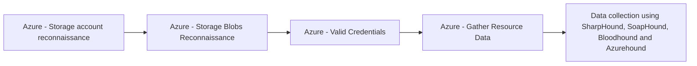

# Azure - Storage account reconnaissance

## Metadata

- **UUID**: `53f4e2f0-7d11-4629-bb26-905993a589db`
- **Schema**: `threat::1.0`
- **TLP**: clear

## Description
Azure storage account reconnaissance refers to the initial phase of cyberattacks 
where adversaries gather information about target storage accounts to identify vulnerabilities 
and plan subsequent attacks. This threat vector is critical as it enables attackers 
to map out potential entry points and weak configurations in cloud storage environments.

### Techniques and Methods  
**Storage account discovery**:  
- Attackers use methods like DNS reconnaissance (e.g., searching `*.blob.core.windows.net` subdomains) 
and brute-forcing account names to identify active Azure storage accounts.  
- Publicly available tools such as **Microburst** and **BlobHunter** automate the 
enumeration of storage accounts and containers.  

**Public container/blob enumeration**:  
- Adversaries exploit misconfigured public access settings (e.g., containers set to "container" or "blob" access levels) 
to list and access sensitive data without authentication.  
- Techniques include analyzing DNS records, web page source code, and cloud metadata 
for storage account URLs.  

### Attack Implications  
Successful reconnaissance can lead to:  
1. **Data exposure**: Identification of publicly accessible containers with sensitive data.  
2. **Lateral movement**: Discovery of storage accounts linked to higher-privileged 
resources (e.g., Azure Functions) for token theft and privilege escalation.  
3. **Malware distribution**: Mapping storage accounts used for hosting malicious 
content via features like static websites.

## Techniques
- T1530
- T1078.004

## Chaining

