# Azure - Storage Account Replication

## Metadata

- **UUID**: `942ed69c-700a-469a-9591-07b87815a909`
- **Schema**: `threat::1.0`
- **TLP**: clear

## Description
The following threat vector enables adversaries to misuse Azure Storage's replication 
features for data exfiltration or to facilitate other attacks with significant business impact.

## Example Attack Scenario

An attacker compromises access to a victim's Azure Storage account, obtaining enough 
permissions to configure **object replication**. The attacker then creates their 
own storage account in a different Azure tenant or region and establishes a replication 
policy from the victim's storage. As a result, sensitive or operational data is 
asynchronously and automatically copied from the victim’s container to the attacker's 
environment—potentially outside tenant or even cross-cloud provider lines—without 
further interaction. The attacker can now access the replicated content at will, 
maintaining persistence and visibility even if their original access to the victim 
account is revoked.

## Attack Goals and Impact

- **Exfiltration**: The primary goal is the **covert exfiltration of data**—potentially 
at massive scale and with minimum detection, because the process leverages legitimate 
replication mechanisms.
- **Persistence and Stealth**: By using cross-region or cross-tenant replication, 
an attacker ensures ongoing access to copied data even after being discovered and 
evicted from the original environment.
- **Evasion and Regulatory Breach**: Since Azure Storage object replication can 
occur across geographical boundaries, this attack can make detection harder and 
may also result in regulatory compliance violations (e.g., unauthorized cross-border 
data transfers).
- **Potential for Secondary Impact**: With replicated data, attackers may enable 
ransomware (encrypting or destroying primary data, but retaining a copy elsewhere), 
enable further attacks by gleaning credentials or configuration details from exfiltrated 
files, or deliver **malware** to victim environments using inbound replication.

## Attack Flow and Methodology

1. The adversary enumerates storage resources, searches for containers of interest, 
and assesses the feasibility of replication configuration.
2. Using their access, the attacker creates an **object replication policy** from 
victim storage to a destination account they control, potentially in a different 
geographic region or Azure tenant.
    - Outbound replication exfiltrates data; inbound can inject payloads.
    - Cross-tenant replication may currently require explicit configuration, and 
    new Azure defaults restrict this, but legacy or misconfigured accounts remain vulnerable.
3. Replication occurs asynchronously, repeatedly syncing new or changed objects. 
The attacker harvests data from their own account, separate from the victim’s monitoring 
and controls, thus bypassing many detection points.
4. Depending on their goal, the attacker may leave replication running for long-term 
persistence or attempt to erase traces from the victim environment.

## Techniques
- T1567.002
- T1078.004
- T1530

## Chaining

```mermaid
flowchart LR
942ed69c_700a_469a_9591_07b87815a909["Azure - Storage Account Replication"]
53f4e2f0_7d11_4629_bb26_905993a589db["Azure - Storage account reconnaissance"]
2743bf18_3b86_4721_bf3e_153dcda0b149["Azure - Valid Credentials"]
41f57a57_1ed6_407e_bb70_a0f6ab52af10["Azure - Storage Blobs Reconnaissance"]
2d7ed070_e5c5_4796_b150_ea1d02ed1785["Azure - Storage container reconnaissance"]
942ed69c_700a_469a_9591_07b87815a909 --> 53f4e2f0_7d11_4629_bb26_905993a589db
53f4e2f0_7d11_4629_bb26_905993a589db --> 2743bf18_3b86_4721_bf3e_153dcda0b149
2743bf18_3b86_4721_bf3e_153dcda0b149 --> 41f57a57_1ed6_407e_bb70_a0f6ab52af10
41f57a57_1ed6_407e_bb70_a0f6ab52af10 --> 2d7ed070_e5c5_4796_b150_ea1d02ed1785
```

