# Azure - Storage Account Replication

## Metadata
| Field | Value |
| --- | --- |
| UUID | `942ed69c-700a-469a-9591-07b87815a909` |
| Schema | `threat::1.0` |
| Version | `1` |
| Created | `2025-09-08` |
| Modified | `2025-09-08` |
| TLP | clear (`TLP:CLEAR`) |
| Organisation | EC DIGIT CSOC (`56b0a0f0-b0bc-47d9-bb46-02f80ae2065a`) |

## References
### Public
- **1**: [https://microsoft.github.io/Azure-Threat-Research-Matrix/Impact/AZT703/AZT703-1/](https://microsoft.github.io/Azure-Threat-Research-Matrix/Impact/AZT703/AZT703-1/)
- **2**: [https://www.microsoft.com/en-us/security/blog/2023/09/07/cloud-storage-security-whats-new-in-the-threat-matrix/](https://www.microsoft.com/en-us/security/blog/2023/09/07/cloud-storage-security-whats-new-in-the-threat-matrix/)
- **3**: [https://learn.microsoft.com/en-us/azure/storage/blobs/object-replication-overview](https://learn.microsoft.com/en-us/azure/storage/blobs/object-replication-overview)
- **4**: [https://www.modepush.com/blog/highway-blobbery-data-theft-using-azure-storage-explorer](https://www.modepush.com/blog/highway-blobbery-data-theft-using-azure-storage-explorer)

## Description
The following threat vector enables adversaries to misuse Azure Storage's replication 
features for data exfiltration or to facilitate other attacks with significant business impact.

## Example Attack Scenario

An attacker compromises access to a victim's Azure Storage account, obtaining enough 
permissions to configure **object replication**. The attacker then creates their 
own storage account in a different Azure tenant or region and establishes a replication 
policy from the victim's storage. As a result, sensitive or operational data is 
asynchronously and automatically copied from the victim’s container to the attacker's 
environment—potentially outside tenant or even cross-cloud provider lines—without 
further interaction. The attacker can now access the replicated content at will, 
maintaining persistence and visibility even if their original access to the victim 
account is revoked.

## Attack Goals and Impact

- **Exfiltration**: The primary goal is the **covert exfiltration of data**—potentially 
at massive scale and with minimum detection, because the process leverages legitimate 
replication mechanisms.
- **Persistence and Stealth**: By using cross-region or cross-tenant replication, 
an attacker ensures ongoing access to copied data even after being discovered and 
evicted from the original environment.
- **Evasion and Regulatory Breach**: Since Azure Storage object replication can 
occur across geographical boundaries, this attack can make detection harder and 
may also result in regulatory compliance violations (e.g., unauthorized cross-border 
data transfers).
- **Potential for Secondary Impact**: With replicated data, attackers may enable 
ransomware (encrypting or destroying primary data, but retaining a copy elsewhere), 
enable further attacks by gleaning credentials or configuration details from exfiltrated 
files, or deliver **malware** to victim environments using inbound replication.

## Attack Flow and Methodology

1. The adversary enumerates storage resources, searches for containers of interest, 
and assesses the feasibility of replication configuration.
2. Using their access, the attacker creates an **object replication policy** from 
victim storage to a destination account they control, potentially in a different 
geographic region or Azure tenant.
    - Outbound replication exfiltrates data; inbound can inject payloads.
    - Cross-tenant replication may currently require explicit configuration, and 
    new Azure defaults restrict this, but legacy or misconfigured accounts remain vulnerable.
3. Replication occurs asynchronously, repeatedly syncing new or changed objects. 
The attacker harvests data from their own account, separate from the victim’s monitoring 
and controls, thus bypassing many detection points.
4. Depending on their goal, the attacker may leave replication running for long-term 
persistence or attempt to erase traces from the victim environment.

## Criticality
**High** - A High priority incident is likely to result in a demonstrable impact to public health or safety, national security, economic security, foreign relations, civil liberties, or public confidence.

## Terrain
Adversaries obtains credentials or elevated permissions (via access keys, Service 
Principal abuse, RBAC misconfigurations, or privilege escalation) to the victim’s 
storage account.

## Surface
> **Azure**
> Microsoft Azure cloud platform

> **Azure::Security::Entra ID**
> Microsoft Entra ID in Azure (cloud identity)

> **AWS::Storage**
> AWS storage services

> **Application Layer::HTTP**
> Hypertext Transfer Protocol

## Threat Assessment
| Dimension | Assessment | Description |
| --- | --- | --- |
| Severity | Significant incident | A cyber attack which has a serious impact on a large organisation or on wider / local government, or which poses a considerable risk to central government or (inter)national essential services. |
| Impact | Data Breach IP Loss Reputational Damages Identity Theft Business disruption | Non-public information has been accessed from the outside, and successfully extracted. Particular, key data, information and blueprint conducive to the organization capability to gain and retain a commercial or geopolitical advantage has been accessed, and their content potentially used by competitors or other adversaries. Damages to the organization public view may be achieved by using directly the access gained, or indirectly with data gathered. Acquisition of sufficient information and privileges to profess as a given individual, for the purpose of abusing and deceiving human trust relationships. Business disruption |
| Leverage | Information Disclosure Elevation of privilege Repudiation Tampering | Threat action intending to read a file that one was not granted access to, or to read data in transit. Capacity to augment leverage over the target system by upgrading the compromised access rights Threat action aimed at performing prohibited operations in a system that lacks the ability to trace the operations. Threat action intending to maliciously change or modify persistent data, such as records in a database, and the alteration of data in transit between two computers over an open network, such as the Internet. |
| Viability | Likely | Probable (probably) - 55-80% |
| Kill Chain | Impact | Techniques aimed at manipulating, interrupting or destroying the target system or data. |

## Actors
| Actor | ID | Source | Description |
| --- | --- | --- | --- |
| Storm-0501 | `misp::f6a60403-4bcc-4fc6-ac07-abb913c1f080` | ('misp',) | Storm-0501 is a financially motivated cybercriminal group that has been active since 2021, initially targeting US school districts with the Sabbath ransomware and later transitioning to a RaaS model deploying various ransomware strains, including Embargo. The group exploits weak credentials and over-privileged accounts to achieve lateral movement from on-premises environments to cloud infrastructures, establishing persistent backdoor access and deploying ransomware. They have utilized techniques such as credential theft, exploiting vulnerabilities in Zoho ManageEngine and Citrix NetScaler, and employing tools like Cobalt Strike and Rclone for lateral movement and data exfiltration. Storm-0501 has specifically targeted sectors such as government, manufacturing, transportation, and law enforcement in the United States. |

## ATT&CK Techniques
| Technique | Name | Description |
| --- | --- | --- |
| `T1567.002` | [Exfiltration Over Web Service: Exfiltration to Cloud Storage](https://attack.mitre.org/techniques/T1567/002) | Adversaries may exfiltrate data to a cloud storage service rather than over their primary command and control channel. Cloud storage services allow for the storage, edit, and retrieval of data from a remote cloud storage server over the Internet.  Examples of cloud storage services include Dropbox and Google Docs. Exfiltration to these cloud storage services can provide a significant amount of cover to the adversary if hosts within the network are already communicating with the service. |
| `T1078.004` | [Valid Accounts: Cloud Accounts](https://attack.mitre.org/techniques/T1078/004) | Valid accounts in cloud environments may allow adversaries to perform actions to achieve Initial Access, Persistence, Privilege Escalation, or Defense Evasion. Cloud accounts are those created and configured by an organization for use by users, remote support, services, or for administration of resources within a cloud service provider or SaaS application. Cloud Accounts can exist solely in the cloud; alternatively, they may be hybrid-joined between on-premises systems and the cloud through syncing or federation with other identity sources such as Windows Active Directory.(Citation: AWS Identity Federation)(Citation: Google Federating GC)(Citation: Microsoft Deploying AD Federation)  Service or user accounts may be targeted by adversaries through [Brute Force](https://attack.mitre.org/techniques/T1110), [Phishing](https://attack.mitre.org/techniques/T1566), or various other means to gain access to the environment. Federated or synced accounts may be a pathway for the adversary to affect both on-premises systems and cloud environments - for example, by leveraging shared credentials to log onto [Remote Services](https://attack.mitre.org/techniques/T1021). High privileged cloud accounts, whether federated, synced, or cloud-only, may also allow pivoting to on-premises environments by leveraging SaaS-based [Software Deployment Tools](https://attack.mitre.org/techniques/T1072) to run commands on hybrid-joined devices.  An adversary may create long lasting [Additional Cloud Credentials](https://attack.mitre.org/techniques/T1098/001) on a compromised cloud account to maintain persistence in the environment. Such credentials may also be used to bypass security controls such as multi-factor authentication.   Cloud accounts may also be able to assume [Temporary Elevated Cloud Access](https://attack.mitre.org/techniques/T1548/005) or other privileges through various means within the environment. Misconfigurations in role assignments or role assumption policies may allow an adversary to use these mechanisms to leverage permissions outside the intended scope of the account. Such over privileged accounts may be used to harvest sensitive data from online storage accounts and databases through [Cloud API](https://attack.mitre.org/techniques/T1059/009) or other methods. For example, in Azure environments, adversaries may target Azure Managed Identities, which allow associated Azure resources to request access tokens. By compromising a resource with an attached Managed Identity, such as an Azure VM, adversaries may be able to [Steal Application Access Token](https://attack.mitre.org/techniques/T1528)s to move laterally across the cloud environment.(Citation: SpecterOps Managed Identity 2022) |
| `T1530` | [Data from Cloud Storage](https://attack.mitre.org/techniques/T1530) | Adversaries may access data from cloud storage.  Many IaaS providers offer solutions for online data object storage such as Amazon S3, Azure Storage, and Google Cloud Storage. Similarly, SaaS enterprise platforms such as Office 365 and Google Workspace provide cloud-based document storage to users through services such as OneDrive and Google Drive, while SaaS application providers such as Slack, Confluence, Salesforce, and Dropbox may provide cloud storage solutions as a peripheral or primary use case of their platform.   In some cases, as with IaaS-based cloud storage, there exists no overarching application (such as SQL or Elasticsearch) with which to interact with the stored objects: instead, data from these solutions is retrieved directly though the [Cloud API](https://attack.mitre.org/techniques/T1059/009). In SaaS applications, adversaries may be able to collect this data directly from APIs or backend cloud storage objects, rather than through their front-end application or interface (i.e., [Data from Information Repositories](https://attack.mitre.org/techniques/T1213)).   Adversaries may collect sensitive data from these cloud storage solutions. Providers typically offer security guides to help end users configure systems, though misconfigurations are a common problem.(Citation: Amazon S3 Security, 2019)(Citation: Microsoft Azure Storage Security, 2019)(Citation: Google Cloud Storage Best Practices, 2019) There have been numerous incidents where cloud storage has been improperly secured, typically by unintentionally allowing public access to unauthenticated users, overly-broad access by all users, or even access for any anonymous person outside the control of the Identity Access Management system without even needing basic user permissions.  This open access may expose various types of sensitive data, such as credit cards, personally identifiable information, or medical records.(Citation: Trend Micro S3 Exposed PII, 2017)(Citation: Wired Magecart S3 Buckets, 2019)(Citation: HIPAA Journal S3 Breach, 2017)(Citation: Rclone-mega-extortion_05_2021)  Adversaries may also obtain then abuse leaked credentials from source repositories, logs, or other means as a way to gain access to cloud storage objects. |

## Chaining

```mermaid
flowchart LR
subgraph "Impact"
942ed69c_700a_469a_9591_07b87815a909{{"Azure - Storage Account<br>Replication"}}
d24fcc84_0e1e_41e1_8d0e_6ee9f8c6a068{{"Azure - File Share<br>Mounting"}}
end
subgraph "Privilege Escalation"
85c8e0dd_b012_402d_bb09_5d354c16ebb9{{"Azure - Local Resource<br>Hijack"}}
c698fc79_3ed6_44a7_a9d7_bc447600e4c3{{"Azure AD Connect abuse"}}
c7e260d8_d391_41eb_be1a_7f276c99b383{{"Azure app registration -<br>privilege escalation"}}
bb2501d5_99c7_44a6_ac5a_9510102d6611{{"Azure - Principal<br>Impersonation"}}
f1dc4341_eb45_4d07_8075_b1a6b227cc76{{"Cloud IAM role<br>assumption"}}
end
subgraph "Reconnaissance"
b1593e0b_1b3b_462d_9ab6_21d1c136469d{{"Azure - Gather Resource<br>Data"}}
41f57a57_1ed6_407e_bb70_a0f6ab52af10{{"Azure - Storage Blobs<br>Reconnaissance"}}
53063205_4404_4e6d_a2f5_d566c6085d96{{"Data collection using<br>SharpHound, SoapHound,<br>Bloodhound and<br>Azurehound"}}
fe6827f2_efb4_43b3_9ca3_b7d417111b32{{"Azure - Gather<br>Application Information"}}
140907eb_c9fb_4330_9d71_656422388b2b{{"Azure - Gather Role<br>Information"}}
2d7ed070_e5c5_4796_b150_ea1d02ed1785{{"Azure - Storage<br>container reconnaissance"}}
end
subgraph "Credential Access"
2743bf18_3b86_4721_bf3e_153dcda0b149{{"Azure - Valid<br>Credentials"}}
518ff777_f10d_4201_9e54_2779c31c512e{{"Consent phishing attack"}}
66aafb61_9a46_4287_8b40_4785b42b77a3{{"Adversary in the Middle<br>phishing sites to bypass<br>MFA"}}
6e988fa7_69c9_4aef_897c_a34fa5066dac{{"Ghost logins attempts"}}
4a807ac4_f764_41b1_ae6f_94239041d349{{"MFA Bypass Techniques"}}
b0d6bf74_b204_4a48_9509_4499ed795771{{"Pass-the-cookie Attack"}}
end
subgraph "Lateral Movement"
a8c7b250_a2d4_4a0d_82f8_23dc99c77d7b{{"Addition of credentials<br>to OAuth applications<br>and service principals"}}
ca2751c7_8641_4fb0_a90b_30c5987015dc{{"Externally controlled<br>Azure credentials added<br>to an Enterprise app or<br>its SPN"}}
9bb31c65_8abd_48fc_afe3_8aca76109737{{"Azure - Modify<br>federation trust to<br>accept externally signed<br>tokens"}}
end
subgraph "Persistence"
5d43ef75_4637_4a75_b1ed_6716052cff0e{{"Azure - App registration<br>persistence"}}
50c7e353_ac1c_48a7_8c98_2515b45f31f4{{"Persistence through<br>automation runbooks in<br>Azure"}}
23f6a192_a25d_48b8_a235_7bb55e483682{{"Persistence with Azure<br>Automanage Machine<br>Configuration"}}
end
subgraph "Execution"
60c5b065_7d06_4697_850f_c2f80765f10b{{"Changes to Azure<br>infrastructure deployed<br>through Azure CLI"}}
61ddc240_e5a6_4ca8_ae77_6b471b498913{{"Code execution via<br>custom script extensions<br>in Azure"}}
end
subgraph "Collection"
78d5e363_14db_40c0_a1c4_4ba02a3e60d4{{"Azure - Hijack Entra ID<br>Applications"}}
f18be76e_f2b3_410a_80c5_d67e7b8e7b03{{"Perform Microsoft Entra<br>ID connectors MITM<br>attack"}}
end
subgraph "Command & Control"
2fd1cddb_c66d_4a99_9779_31e32b67495e{{"Azure - Lateral movement<br>abusing Cross-Tenant<br>Synchronization"}}
end
subgraph "Delivery"
1a68b5eb_0112_424d_a21f_88dda0b6b8df{{"Spearphishing Link"}}
dd5d942c_bac4_4000_b9a6_ca4fef6cfb84{{"Spearphishing Attachment"}}
end
53f4e2f0_7d11_4629_bb26_905993a589db{{"Azure - Storage account<br>reconnaissance"}}
20bd3620_b13b_4895_b291_b1a26bd9aef3{{"MS 365 admin compromised<br>account"}}
d24fcc84_0e1e_41e1_8d0e_6ee9f8c6a068 <-->|synergize| 942ed69c_700a_469a_9591_07b87815a909
d24fcc84_0e1e_41e1_8d0e_6ee9f8c6a068 <-->|synergize| 85c8e0dd_b012_402d_bb09_5d354c16ebb9
d24fcc84_0e1e_41e1_8d0e_6ee9f8c6a068 -->|enabled| 53f4e2f0_7d11_4629_bb26_905993a589db
d24fcc84_0e1e_41e1_8d0e_6ee9f8c6a068 -->|enabled| b1593e0b_1b3b_462d_9ab6_21d1c136469d
d24fcc84_0e1e_41e1_8d0e_6ee9f8c6a068 -->|enabled| 2743bf18_3b86_4721_bf3e_153dcda0b149
d24fcc84_0e1e_41e1_8d0e_6ee9f8c6a068 -->|preceeds| 518ff777_f10d_4201_9e54_2779c31c512e
53f4e2f0_7d11_4629_bb26_905993a589db -->|enabled| 41f57a57_1ed6_407e_bb70_a0f6ab52af10
53f4e2f0_7d11_4629_bb26_905993a589db -->|enabled| 2743bf18_3b86_4721_bf3e_153dcda0b149
53f4e2f0_7d11_4629_bb26_905993a589db -->|enabled| b1593e0b_1b3b_462d_9ab6_21d1c136469d
53f4e2f0_7d11_4629_bb26_905993a589db -->|enabled| 53063205_4404_4e6d_a2f5_d566c6085d96
41f57a57_1ed6_407e_bb70_a0f6ab52af10 -->|enabled| 53f4e2f0_7d11_4629_bb26_905993a589db
41f57a57_1ed6_407e_bb70_a0f6ab52af10 -->|enabled| 2743bf18_3b86_4721_bf3e_153dcda0b149
41f57a57_1ed6_407e_bb70_a0f6ab52af10 -->|enabled| b1593e0b_1b3b_462d_9ab6_21d1c136469d
41f57a57_1ed6_407e_bb70_a0f6ab52af10 -->|enabled| 53063205_4404_4e6d_a2f5_d566c6085d96
2743bf18_3b86_4721_bf3e_153dcda0b149 -->|preceeds| a8c7b250_a2d4_4a0d_82f8_23dc99c77d7b
2743bf18_3b86_4721_bf3e_153dcda0b149 -->|preceeds| 66aafb61_9a46_4287_8b40_4785b42b77a3
2743bf18_3b86_4721_bf3e_153dcda0b149 -->|preceeds| c698fc79_3ed6_44a7_a9d7_bc447600e4c3
2743bf18_3b86_4721_bf3e_153dcda0b149 -->|preceeds| 5d43ef75_4637_4a75_b1ed_6716052cff0e
2743bf18_3b86_4721_bf3e_153dcda0b149 -->|preceeds| 60c5b065_7d06_4697_850f_c2f80765f10b
2743bf18_3b86_4721_bf3e_153dcda0b149 -->|preceeds| 6e988fa7_69c9_4aef_897c_a34fa5066dac
2743bf18_3b86_4721_bf3e_153dcda0b149 -->|preceeds| 78d5e363_14db_40c0_a1c4_4ba02a3e60d4
2743bf18_3b86_4721_bf3e_153dcda0b149 -->|preceeds| 2fd1cddb_c66d_4a99_9779_31e32b67495e
2743bf18_3b86_4721_bf3e_153dcda0b149 -->|preceeds| 20bd3620_b13b_4895_b291_b1a26bd9aef3
2743bf18_3b86_4721_bf3e_153dcda0b149 -->|preceeds| f18be76e_f2b3_410a_80c5_d67e7b8e7b03
2743bf18_3b86_4721_bf3e_153dcda0b149 -->|preceeds| 50c7e353_ac1c_48a7_8c98_2515b45f31f4
2743bf18_3b86_4721_bf3e_153dcda0b149 -->|preceeds| 23f6a192_a25d_48b8_a235_7bb55e483682
66aafb61_9a46_4287_8b40_4785b42b77a3 -->|implements| 4a807ac4_f764_41b1_ae6f_94239041d349
c698fc79_3ed6_44a7_a9d7_bc447600e4c3 -->|enabled| 2743bf18_3b86_4721_bf3e_153dcda0b149
5d43ef75_4637_4a75_b1ed_6716052cff0e -->|succeeds| c7e260d8_d391_41eb_be1a_7f276c99b383
c7e260d8_d391_41eb_be1a_7f276c99b383 -->|enabled| bb2501d5_99c7_44a6_ac5a_9510102d6611
c7e260d8_d391_41eb_be1a_7f276c99b383 -->|enabled| 2743bf18_3b86_4721_bf3e_153dcda0b149
c7e260d8_d391_41eb_be1a_7f276c99b383 -->|enabled| fe6827f2_efb4_43b3_9ca3_b7d417111b32
bb2501d5_99c7_44a6_ac5a_9510102d6611 -->|preceeds| 2743bf18_3b86_4721_bf3e_153dcda0b149
bb2501d5_99c7_44a6_ac5a_9510102d6611 -->|preceeds| fe6827f2_efb4_43b3_9ca3_b7d417111b32
6e988fa7_69c9_4aef_897c_a34fa5066dac -->|implements| 4a807ac4_f764_41b1_ae6f_94239041d349
fe6827f2_efb4_43b3_9ca3_b7d417111b32 -->|enabled| 140907eb_c9fb_4330_9d71_656422388b2b
fe6827f2_efb4_43b3_9ca3_b7d417111b32 -->|enabled| 53063205_4404_4e6d_a2f5_d566c6085d96
fe6827f2_efb4_43b3_9ca3_b7d417111b32 -->|enabling| ca2751c7_8641_4fb0_a90b_30c5987015dc
fe6827f2_efb4_43b3_9ca3_b7d417111b32 -->|enabling| c7e260d8_d391_41eb_be1a_7f276c99b383
140907eb_c9fb_4330_9d71_656422388b2b -->|preceeds| a8c7b250_a2d4_4a0d_82f8_23dc99c77d7b
140907eb_c9fb_4330_9d71_656422388b2b -->|preceeds| 61ddc240_e5a6_4ca8_ae77_6b471b498913
140907eb_c9fb_4330_9d71_656422388b2b -->|preceeds| f1dc4341_eb45_4d07_8075_b1a6b227cc76
61ddc240_e5a6_4ca8_ae77_6b471b498913 -->|enabled| 140907eb_c9fb_4330_9d71_656422388b2b
61ddc240_e5a6_4ca8_ae77_6b471b498913 -->|enabled| 2743bf18_3b86_4721_bf3e_153dcda0b149
53063205_4404_4e6d_a2f5_d566c6085d96 -->|succeeds| 1a68b5eb_0112_424d_a21f_88dda0b6b8df
53063205_4404_4e6d_a2f5_d566c6085d96 -->|succeeds| dd5d942c_bac4_4000_b9a6_ca4fef6cfb84
b1593e0b_1b3b_462d_9ab6_21d1c136469d -->|succeeds| 66aafb61_9a46_4287_8b40_4785b42b77a3
b1593e0b_1b3b_462d_9ab6_21d1c136469d -->|succeeds| 9bb31c65_8abd_48fc_afe3_8aca76109737
85c8e0dd_b012_402d_bb09_5d354c16ebb9 -->|preceeds| b1593e0b_1b3b_462d_9ab6_21d1c136469d
518ff777_f10d_4201_9e54_2779c31c512e -->|succeeds| 1a68b5eb_0112_424d_a21f_88dda0b6b8df
518ff777_f10d_4201_9e54_2779c31c512e -->|implements| b0d6bf74_b204_4a48_9509_4499ed795771
b0d6bf74_b204_4a48_9509_4499ed795771 -->|succeeds| 66aafb61_9a46_4287_8b40_4785b42b77a3
b0d6bf74_b204_4a48_9509_4499ed795771 -->|implements| 4a807ac4_f764_41b1_ae6f_94239041d349
942ed69c_700a_469a_9591_07b87815a909 -->|enabled| 53f4e2f0_7d11_4629_bb26_905993a589db
942ed69c_700a_469a_9591_07b87815a909 -->|enabled| 41f57a57_1ed6_407e_bb70_a0f6ab52af10
942ed69c_700a_469a_9591_07b87815a909 -->|enabled| 2d7ed070_e5c5_4796_b150_ea1d02ed1785
942ed69c_700a_469a_9591_07b87815a909 -->|preceeds| 2743bf18_3b86_4721_bf3e_153dcda0b149
2d7ed070_e5c5_4796_b150_ea1d02ed1785 -->|enabled| 53f4e2f0_7d11_4629_bb26_905993a589db
2d7ed070_e5c5_4796_b150_ea1d02ed1785 -->|enabled| 2743bf18_3b86_4721_bf3e_153dcda0b149
2d7ed070_e5c5_4796_b150_ea1d02ed1785 -->|enabled| b1593e0b_1b3b_462d_9ab6_21d1c136469d
2d7ed070_e5c5_4796_b150_ea1d02ed1785 -->|enabled| 53063205_4404_4e6d_a2f5_d566c6085d96
```

### Chaining details
#### enabled -> [Azure - Storage account reconnaissance](azure-storage-account-reconnaissance.md) (`53f4e2f0-7d11-4629-bb26-905993a589db`) (`support::enabled`)
Adversaries need to scan and discover publicly accessible storage containers by 
guessing or enumerating storage account and container names.

- **Target UUID**: `53f4e2f0-7d11-4629-bb26-905993a589db`
#### preceeds -> [Azure - Valid Credentials](azure-valid-credentials.md) (`2743bf18-3b86-4721-bf3e-153dcda0b149`) (`sequence::preceeds`)
Adversaries obtain the username and password of an AzureAD user either through
phishing, password spraying, brute-force attacks, or credentials leaked online.

- **Target UUID**: `2743bf18-3b86-4721-bf3e-153dcda0b149`
#### enabled -> [Azure - Storage Blobs Reconnaissance](azure-storage-blobs-reconnaissance.md) (`41f57a57-1ed6-407e-bb70-a0f6ab52af10`) (`support::enabled`)
Adversaries must have knowledge about the strucuture of Azure Blob Storage and 
naming conventions, and basic enumeration tools or scripts to carry out 
reconnaissance-especially when misconfigurations or public access are present.

- **Target UUID**: `41f57a57-1ed6-407e-bb70-a0f6ab52af10`
#### enabled -> [Azure - Storage container reconnaissance](azure-storage-container-reconnaissance.md) (`2d7ed070-e5c5-4796-b150-ea1d02ed1785`) (`support::enabled`)
Adversaries need to enumerate and discover publicly accessible or misconfigured 
Azure storage containers by scanning for storage account names and container names, 
often using automated tools or scripts, to identify open containers that may expose 
sensitive data.

- **Target UUID**: `2d7ed070-e5c5-4796-b150-ea1d02ed1785`
