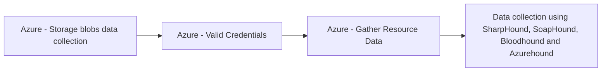

# Azure - Storage blobs data collection

## Metadata

- **UUID**: `c856d1b5-b351-49ad-b8f4-8ab9720ba510`
- **Schema**: `threat::1.0`
- **TLP**: clear

## Description
The threat vector refers to techniques used by attackers to discover, enumerate, 
and exfiltrate data from Azure Blob Storage containers, often due to misconfigurations 
that allow unauthorized or public access to sensitive data. This is commonly known 
as "blob hunting" and is a significant risk for organizations using cloud storage.

## Attack Techniques

### 1. Blob Hunting and Enumeration

- **Blob Hunting**: Attackers attempt to discover Azure storage accounts, containers, 
and blobs by guessing or brute-forcing names, leveraging predictable naming conventions, 
or using automated tools such as MicroBurst and BlobHunter.
- **Enumeration Process**:
  - **Storage Account Discovery**: Attackers identify potential storage account 
  names, often using subdomain enumeration or company naming conventions (e.g., `companyname.blob.core.windows.net`).
  - **Container Enumeration**: Once the account is found, attackers guess or enumerate 
  container names, which are often generic (e.g., "images", "backups").
  - **Blob Listing**: If a container allows anonymous access, attackers can list 
  and access all blobs within it, potentially exposing sensitive files.

### 2. Exploiting Misconfigurations

- **Public Access Settings**:
  - **Private Access**: Only authorized users can access data (most secure).
  - **Blob Access**: Anyone with the blob URL can access the data, but cannot list 
  all blobs.
  - **Container Access**: Anyone can list and access all blobs in the container, 
  if they know the container name.
- Attackers exploit misconfigurations where containers are set to "Blob" or "Container" 
access, allowing unauthorized data collection.

### 3. Automated Tools

- **BlobHunter**: Scans Azure blob storage for publicly accessible blobs and reports 
misconfigured containers.
- **MicroBurst**: Automates enumeration and brute-forcing of storage account and 
container names.
- **Legitimate Tools Misused**: Tools like Azure Storage Explorer and AzCopy can 
be used by attackers for bulk data exfiltration if credentials or access are compromised.

## Techniques
- T1530
- T1119
- T1078

## Chaining

