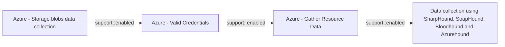

# Azure - Storage blobs data collection

## Metadata

- **UUID**: `c856d1b5-b351-49ad-b8f4-8ab9720ba510`
- **Schema**: `threat::1.0`
- **Version**: `3`
- **Created**: `2025-06-17`
- **Modified**: `2025-09-08`
- **TLP**: clear (`TLP:CLEAR`)
- **Organisation**: EC DIGIT CSOC (`56b0a0f0-b0bc-47d9-bb46-02f80ae2065a`)

## References
### Public
- **1**: [https://techcommunity.microsoft.com/blog/microsoftdefendercloudblog/protect-your-storage-resources-against-blob-hunting/3735238](https://techcommunity.microsoft.com/blog/microsoftdefendercloudblog/protect-your-storage-resources-against-blob-hunting/3735238)
- **2**: [https://www.microsoft.com/en-us/security/blog/2021/04/08/threat-matrix-for-storage/](https://www.microsoft.com/en-us/security/blog/2021/04/08/threat-matrix-for-storage/)
- **3**: [https://wizardcyber.com/azure-blob-storage-navigating-misconfiguration-risks/](https://wizardcyber.com/azure-blob-storage-navigating-misconfiguration-risks/)

## Description
The threat vector refers to techniques used by attackers to discover, enumerate, 
and exfiltrate data from Azure Blob Storage containers, often due to misconfigurations 
that allow unauthorized or public access to sensitive data. This is commonly known 
as "blob hunting" and is a significant risk for organizations using cloud storage.

## Attack Techniques

### 1. Blob Hunting and Enumeration

- **Blob Hunting**: Attackers attempt to discover Azure storage accounts, containers, 
and blobs by guessing or brute-forcing names, leveraging predictable naming conventions, 
or using automated tools such as MicroBurst and BlobHunter.
- **Enumeration Process**:
  - **Storage Account Discovery**: Attackers identify potential storage account 
  names, often using subdomain enumeration or company naming conventions (e.g., `companyname.blob.core.windows.net`).
  - **Container Enumeration**: Once the account is found, attackers guess or enumerate 
  container names, which are often generic (e.g., "images", "backups").
  - **Blob Listing**: If a container allows anonymous access, attackers can list 
  and access all blobs within it, potentially exposing sensitive files.

### 2. Exploiting Misconfigurations

- **Public Access Settings**:
  - **Private Access**: Only authorized users can access data (most secure).
  - **Blob Access**: Anyone with the blob URL can access the data, but cannot list 
  all blobs.
  - **Container Access**: Anyone can list and access all blobs in the container, 
  if they know the container name.
- Attackers exploit misconfigurations where containers are set to "Blob" or "Container" 
access, allowing unauthorized data collection.

### 3. Automated Tools

- **BlobHunter**: Scans Azure blob storage for publicly accessible blobs and reports 
misconfigured containers.
- **MicroBurst**: Automates enumeration and brute-forcing of storage account and 
container names.
- **Legitimate Tools Misused**: Tools like Azure Storage Explorer and AzCopy can 
be used by attackers for bulk data exfiltration if credentials or access are compromised.

## Criticality
**High** - A High priority incident is likely to result in a demonstrable impact to public health or safety, national security, economic security, foreign relations, civil liberties, or public confidence.

## Terrain
> **Adversaries need access to enumeration tools and a misconfigured Azure Blob Storage 
environment with public access enabled.

Domains: Public Cloud, Private Cloud
Targets: Cloud Storage Accounts
Platforms: Blob Storage, Azure**

## Threat Assessment
| Dimension | Assessment | Description |
| --- | --- | --- |
| Severity | Significant incident | A cyber attack which has a serious impact on a large organisation or on wider / local government, or which poses a considerable risk to central government or (inter)national essential services. |
| Impact | Data Breach; IP Loss; Reputational Damages; Monetary Loss | - |
| Leverage | Information Disclosure; Tampering; Infrastructure Compromise | - |
| Viability | Likely | Probable (probably) - 55-80% |
| Kill Chain | Collection | Techniques used to identify and gather data from a target network prior to exfiltration. |

## ATT&CK Techniques
| Technique | Name | Description |
| --- | --- | --- |
| `T1530` | [Data from Cloud Storage](https://attack.mitre.org/techniques/T1530) | Adversaries may access data from cloud storage.  Many IaaS providers offer solutions for online data object storage such as Amazon S3, Azure Storage, and Google Cloud Storage. Similarly, SaaS enterprise platforms such as Office 365 and Google Workspace provide cloud-based document storage to users through services such as OneDrive and Google Drive, while SaaS application providers such as Slack, Confluence, Salesforce, and Dropbox may provide cloud storage solutions as a peripheral or primary use case of their platform.   In some cases, as with IaaS-based cloud storage, there exists no overarching application (such as SQL or Elasticsearch) with which to interact with the stored objects: instead, data from these solutions is retrieved directly though the [Cloud API](https://attack.mitre.org/techniques/T1059/009). In SaaS applications, adversaries may be able to collect this data directly from APIs or backend cloud storage objects, rather than through their front-end application or interface (i.e., [Data from Information Repositories](https://attack.mitre.org/techniques/T1213)).   Adversaries may collect sensitive data from these cloud storage solutions. Providers typically offer security guides to help end users configure systems, though misconfigurations are a common problem.(Citation: Amazon S3 Security, 2019)(Citation: Microsoft Azure Storage Security, 2019)(Citation: Google Cloud Storage Best Practices, 2019) There have been numerous incidents where cloud storage has been improperly secured, typically by unintentionally allowing public access to unauthenticated users, overly-broad access by all users, or even access for any anonymous person outside the control of the Identity Access Management system without even needing basic user permissions.  This open access may expose various types of sensitive data, such as credit cards, personally identifiable information, or medical records.(Citation: Trend Micro S3 Exposed PII, 2017)(Citation: Wired Magecart S3 Buckets, 2019)(Citation: HIPAA Journal S3 Breach, 2017)(Citation: Rclone-mega-extortion_05_2021)  Adversaries may also obtain then abuse leaked credentials from source repositories, logs, or other means as a way to gain access to cloud storage objects. |
| `T1119` | [Automated Collection](https://attack.mitre.org/techniques/T1119) | Once established within a system or network, an adversary may use automated techniques for collecting internal data. Methods for performing this technique could include use of a [Command and Scripting Interpreter](https://attack.mitre.org/techniques/T1059) to search for and copy information fitting set criteria such as file type, location, or name at specific time intervals.   In cloud-based environments, adversaries may also use cloud APIs, data pipelines, command line interfaces, or extract, transform, and load (ETL) services to automatically collect data.(Citation: Mandiant UNC3944 SMS Phishing 2023)   This functionality could also be built into remote access tools.   This technique may incorporate use of other techniques such as [File and Directory Discovery](https://attack.mitre.org/techniques/T1083) and [Lateral Tool Transfer](https://attack.mitre.org/techniques/T1570) to identify and move files, as well as [Cloud Service Dashboard](https://attack.mitre.org/techniques/T1538) and [Cloud Storage Object Discovery](https://attack.mitre.org/techniques/T1619) to identify resources in cloud environments. |
| `T1078` | [Valid Accounts](https://attack.mitre.org/techniques/T1078) | Adversaries may obtain and abuse credentials of existing accounts as a means of gaining Initial Access, Persistence, Privilege Escalation, or Defense Evasion. Compromised credentials may be used to bypass access controls placed on various resources on systems within the network and may even be used for persistent access to remote systems and externally available services, such as VPNs, Outlook Web Access, network devices, and remote desktop.(Citation: volexity_0day_sophos_FW) Compromised credentials may also grant an adversary increased privilege to specific systems or access to restricted areas of the network. Adversaries may choose not to use malware or tools in conjunction with the legitimate access those credentials provide to make it harder to detect their presence.  In some cases, adversaries may abuse inactive accounts: for example, those belonging to individuals who are no longer part of an organization. Using these accounts may allow the adversary to evade detection, as the original account user will not be present to identify any anomalous activity taking place on their account.(Citation: CISA MFA PrintNightmare)  The overlap of permissions for local, domain, and cloud accounts across a network of systems is of concern because the adversary may be able to pivot across accounts and systems to reach a high level of access (i.e., domain or enterprise administrator) to bypass access controls set within the enterprise.(Citation: TechNet Credential Theft) |

## Chaining

### Chaining details
#### enabled -> Azure - Valid Credentials (`support::enabled`)
Adversaries obtain the username and password of an AzureAD user either through
phishing, password spraying, brute-force attacks, or credentials leaked online.

- **Target UUID**: `2743bf18-3b86-4721-bf3e-153dcda0b149`
#### enabled -> Azure - Gather Resource Data (`support::enabled`)
The attacker obtains credentials (via phishing, password spray, leaked keys)
granting at least Reader access to the target Azure tenant.

- **Target UUID**: `b1593e0b-1b3b-462d-9ab6-21d1c136469d`
#### enabled -> Data collection using SharpHound, SoapHound, Bloodhound and Azurehound (`support::enabled`)
Attackers need to establish an initial presence within the target environment, in 
order to gather sufficient permissions to execute the data collection tools.

- **Target UUID**: `53063205-4404-4e6d-a2f5-d566c6085d96`
