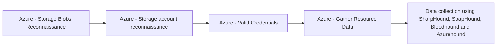

# Azure - Storage Blobs Reconnaissance

## Metadata

- **UUID**: `41f57a57-1ed6-407e-bb70-a0f6ab52af10`
- **Schema**: `threat::1.0`
- **TLP**: clear

## Description
Reconnaissance targeting Azure Storage Blobs involves gathering intelligence to identify
exposed storage accounts, containers, and blobs-often without authentication or detection.
Azure’s predictable URL structure, common naming conventions, and potential for
misconfiguration make it a prime target for such activities.

### Discovery of Storage Accounts

- **DNS and Subdomain Enumeration:**  
Each Azure Storage account is accessible via a unique subdomain
(e.g., `yourstorageaccount.blob.core.windows.net`).   
Attackers use DNS enumeration tools (like `dnscan`) and wordlists to guess or 
discover valid storage account names. They often use company names, abbreviations, 
or product names as starting points.

- **Search Engine Dorking:**  
Publicly accessible blobs and containers may be indexed by search engines. Attackers 
leverage advanced search queries (Google dorking), such as `site:*.blob.core.windows.net`, 
to find open blob storage accounts and even specific file types (e.g., `.csv`, `.xlsx`) 
or keywords like `"password"`.

### Enumeration of Containers and Blobs

- **URL Pattern Guessing:**  
Azure Blob Storage uses predictable URL patterns for containers and blobs. Attackers 
automate requests to likely container names (e.g., `backups`, `images`, `prod`) 
and blob names, increasing the odds of finding exposed data.

- **Automated Scanning Tools:**  
Tools like MicroBurst, goblob, and custom scripts are used to automate the enumeration 
of storage accounts, containers, and blobs. These tools can quickly test thousands 
of possible names, scaling up the reconnaissance process.

- **Custom Wordlists:**  
Attackers may build custom dictionaries based on the target’s business, products, 
or previously leaked information to improve the accuracy of their enumeration efforts.

### Analysis of Exposed Data and Metadata

- **Monitoring Access Patterns:**  
By analyzing metadata (timestamps, blob sizes, file types), attackers can infer 
which blobs or containers are most likely to contain sensitive or valuable information.

- **Chaining Exposures:**  
If attackers find an exposed blob, they may discover references within the files 
themselves (e.g., database connection strings, links to other storage accounts), 
allowing them to recursively enumerate and compromise further resources.

### Tenant and Service Enumeration

- **Azure Tenant Discovery:**  
Attackers can leverage known company domains or public APIs to enumerate Azure tenants 
and services, including blob storage endpoints. Tools like MicroBurst and AADInternals 
automate the discovery of tenant IDs and service endpoints, providing additional 
reconnaissance data.

### Reconnaissance Characteristics

- **Silent and Non-Intrusive:**  
Most reconnaissance activities are passive and do not require authentication, making 
them difficult to detect until exploitation occurs.

- **Scalable and Automated:**  
Attackers can automate the entire process, rapidly scanning large numbers of potential 
storage accounts and containers.

### Real-World Impact

- **Sensitive Data Exposure:**  
Even a single misconfigured blob can expose sensitive data, credentials, or internal 
documentation, which can be leveraged for further attacks.

- **Pivoting and Lateral Movement:**  
Exposed blobs may contain information that allows attackers to pivot to other services 
or escalate their access within the target environment.

## Techniques
- T1530
- T1552
- T1619
- T1567
- T1190

## Chaining

