# Azure - Storage Blobs Reconnaissance

## Metadata
| Field | Value |
| --- | --- |
| UUID | `41f57a57-1ed6-407e-bb70-a0f6ab52af10` |
| Schema | `threat::1.0` |
| Version | `3` |
| Created | `2025-05-07` |
| Modified | `2025-09-08` |
| TLP | clear (`TLP:CLEAR`) |
| Organisation | EC DIGIT CSOC (`56b0a0f0-b0bc-47d9-bb46-02f80ae2065a`) |

## References
### Public
- **1**: [https://learn.microsoft.com/en-us/azure/well-architected/service-guides/azure-blob-storage](https://learn.microsoft.com/en-us/azure/well-architected/service-guides/azure-blob-storage)
- **2**: [https://www.netspi.com/blog/technical-blog/cloud-pentesting/anonymously-enumerating-azure-file-resources/](https://www.netspi.com/blog/technical-blog/cloud-pentesting/anonymously-enumerating-azure-file-resources/)
- **3**: [https://techcommunity.microsoft.com/blog/microsoftdefendercloudblog/protect-your-storage-resources-against-blob-hunting/3735238](https://techcommunity.microsoft.com/blog/microsoftdefendercloudblog/protect-your-storage-resources-against-blob-hunting/3735238)
- **4**: [https://www.inversecos.com/2022/01/how-to-detect-and-compromise-azure.html](https://www.inversecos.com/2022/01/how-to-detect-and-compromise-azure.html)

## Description
Reconnaissance targeting Azure Storage Blobs involves gathering intelligence to identify
exposed storage accounts, containers, and blobs-often without authentication or detection.
Azure’s predictable URL structure, common naming conventions, and potential for
misconfiguration make it a prime target for such activities.

### Discovery of Storage Accounts

- **DNS and Subdomain Enumeration:**  
Each Azure Storage account is accessible via a unique subdomain
(e.g., `yourstorageaccount.blob.core.windows.net`).   
Attackers use DNS enumeration tools (like `dnscan`) and wordlists to guess or 
discover valid storage account names. They often use company names, abbreviations, 
or product names as starting points.

- **Search Engine Dorking:**  
Publicly accessible blobs and containers may be indexed by search engines. Attackers 
leverage advanced search queries (Google dorking), such as `site:*.blob.core.windows.net`, 
to find open blob storage accounts and even specific file types (e.g., `.csv`, `.xlsx`) 
or keywords like `"password"`.

### Enumeration of Containers and Blobs

- **URL Pattern Guessing:**  
Azure Blob Storage uses predictable URL patterns for containers and blobs. Attackers 
automate requests to likely container names (e.g., `backups`, `images`, `prod`) 
and blob names, increasing the odds of finding exposed data.

- **Automated Scanning Tools:**  
Tools like MicroBurst, goblob, and custom scripts are used to automate the enumeration 
of storage accounts, containers, and blobs. These tools can quickly test thousands 
of possible names, scaling up the reconnaissance process.

- **Custom Wordlists:**  
Attackers may build custom dictionaries based on the target’s business, products, 
or previously leaked information to improve the accuracy of their enumeration efforts.

### Analysis of Exposed Data and Metadata

- **Monitoring Access Patterns:**  
By analyzing metadata (timestamps, blob sizes, file types), attackers can infer 
which blobs or containers are most likely to contain sensitive or valuable information.

- **Chaining Exposures:**  
If attackers find an exposed blob, they may discover references within the files 
themselves (e.g., database connection strings, links to other storage accounts), 
allowing them to recursively enumerate and compromise further resources.

### Tenant and Service Enumeration

- **Azure Tenant Discovery:**  
Attackers can leverage known company domains or public APIs to enumerate Azure tenants 
and services, including blob storage endpoints. Tools like MicroBurst and AADInternals 
automate the discovery of tenant IDs and service endpoints, providing additional 
reconnaissance data.

### Reconnaissance Characteristics

- **Silent and Non-Intrusive:**  
Most reconnaissance activities are passive and do not require authentication, making 
them difficult to detect until exploitation occurs.

- **Scalable and Automated:**  
Attackers can automate the entire process, rapidly scanning large numbers of potential 
storage accounts and containers.

### Real-World Impact

- **Sensitive Data Exposure:**  
Even a single misconfigured blob can expose sensitive data, credentials, or internal 
documentation, which can be leveraged for further attacks.

- **Pivoting and Lateral Movement:**  
Exposed blobs may contain information that allows attackers to pivot to other services 
or escalate their access within the target environment.

## Criticality
**High** - A High priority incident is likely to result in a demonstrable impact to public health or safety, national security, economic security, foreign relations, civil liberties, or public confidence.

## Terrain
Adversaries must have knowledge about the strucuture of
Azure Blob Storage and naming conventions, and basic
enumeration tools or scripts to carry out 
reconnaissance-especially when misconfigurations or
public access are present.

## Surface
> **Azure**
> Microsoft Azure cloud platform

> **Azure::Security::Entra ID**
> Microsoft Entra ID in Azure (cloud identity)

> **AWS::Storage**
> AWS storage services

> **Web Servers**
> HTTP servers and reverse proxies

> **Application Layer::HTTP**
> Hypertext Transfer Protocol

> **Container Runtime::Docker**
> Docker Engine container runtime

> **Azure::Compute::Virtual Machines**
> Azure Virtual Machines

## Threat Assessment
| Dimension | Assessment | Description |
| --- | --- | --- |
| Severity | Significant incident | A cyber attack which has a serious impact on a large organisation or on wider / local government, or which poses a considerable risk to central government or (inter)national essential services. |
| Impact | Data Breach IP Loss Reputational Damages Identity Theft Monetary Loss | Non-public information has been accessed from the outside, and successfully extracted. Particular, key data, information and blueprint conducive to the organization capability to gain and retain a commercial or geopolitical advantage has been accessed, and their content potentially used by competitors or other adversaries. Damages to the organization public view may be achieved by using directly the access gained, or indirectly with data gathered. Acquisition of sufficient information and privileges to profess as a given individual, for the purpose of abusing and deceiving human trust relationships. The vector will directly conduct to loss of value directly impacting the bottom line. |
| Leverage | Information Disclosure Infrastructure Compromise Tampering Spoofing | Threat action intending to read a file that one was not granted access to, or to read data in transit. The compromised target is likely to be used to further expand the sphere of influence of the attacker and allow more potent vectors to be executed. Threat action intending to maliciously change or modify persistent data, such as records in a database, and the alteration of data in transit between two computers over an open network, such as the Internet. Threat action aimed at accessing and use of another user’s credentials, such as username and password. |
| Viability | Likely | Probable (probably) - 55-80% |
| Kill Chain | Reconnaissance | Researching, identifying and selecting targets using active or passive reconnaissance. |

## ATT&CK Techniques
| Technique | Name | Description |
| --- | --- | --- |
| `T1530` | [Data from Cloud Storage](https://attack.mitre.org/techniques/T1530) | Adversaries may access data from cloud storage.  Many IaaS providers offer solutions for online data object storage such as Amazon S3, Azure Storage, and Google Cloud Storage. Similarly, SaaS enterprise platforms such as Office 365 and Google Workspace provide cloud-based document storage to users through services such as OneDrive and Google Drive, while SaaS application providers such as Slack, Confluence, Salesforce, and Dropbox may provide cloud storage solutions as a peripheral or primary use case of their platform.   In some cases, as with IaaS-based cloud storage, there exists no overarching application (such as SQL or Elasticsearch) with which to interact with the stored objects: instead, data from these solutions is retrieved directly though the [Cloud API](https://attack.mitre.org/techniques/T1059/009). In SaaS applications, adversaries may be able to collect this data directly from APIs or backend cloud storage objects, rather than through their front-end application or interface (i.e., [Data from Information Repositories](https://attack.mitre.org/techniques/T1213)).   Adversaries may collect sensitive data from these cloud storage solutions. Providers typically offer security guides to help end users configure systems, though misconfigurations are a common problem.(Citation: Amazon S3 Security, 2019)(Citation: Microsoft Azure Storage Security, 2019)(Citation: Google Cloud Storage Best Practices, 2019) There have been numerous incidents where cloud storage has been improperly secured, typically by unintentionally allowing public access to unauthenticated users, overly-broad access by all users, or even access for any anonymous person outside the control of the Identity Access Management system without even needing basic user permissions.  This open access may expose various types of sensitive data, such as credit cards, personally identifiable information, or medical records.(Citation: Trend Micro S3 Exposed PII, 2017)(Citation: Wired Magecart S3 Buckets, 2019)(Citation: HIPAA Journal S3 Breach, 2017)(Citation: Rclone-mega-extortion_05_2021)  Adversaries may also obtain then abuse leaked credentials from source repositories, logs, or other means as a way to gain access to cloud storage objects. |
| `T1552` | [Unsecured Credentials](https://attack.mitre.org/techniques/T1552) | Adversaries may search compromised systems to find and obtain insecurely stored credentials. These credentials can be stored and/or misplaced in many locations on a system, including plaintext files (e.g. [Bash History](https://attack.mitre.org/techniques/T1552/003)), operating system or application-specific repositories (e.g. [Credentials in Registry](https://attack.mitre.org/techniques/T1552/002)),  or other specialized files/artifacts (e.g. [Private Keys](https://attack.mitre.org/techniques/T1552/004)).(Citation: Brining MimiKatz to Unix) |
| `T1619` | [Cloud Storage Object Discovery](https://attack.mitre.org/techniques/T1619) | Adversaries may enumerate objects in cloud storage infrastructure. Adversaries may use this information during automated discovery to shape follow-on behaviors, including requesting all or specific objects from cloud storage.  Similar to [File and Directory Discovery](https://attack.mitre.org/techniques/T1083) on a local host, after identifying available storage services (i.e. [Cloud Infrastructure Discovery](https://attack.mitre.org/techniques/T1580)) adversaries may access the contents/objects stored in cloud infrastructure.  Cloud service providers offer APIs allowing users to enumerate objects stored within cloud storage. Examples include ListObjectsV2 in AWS (Citation: ListObjectsV2) and List Blobs in Azure(Citation: List Blobs) . |
| `T1567` | [Exfiltration Over Web Service](https://attack.mitre.org/techniques/T1567) | Adversaries may use an existing, legitimate external Web service to exfiltrate data rather than their primary command and control channel. Popular Web services acting as an exfiltration mechanism may give a significant amount of cover due to the likelihood that hosts within a network are already communicating with them prior to compromise. Firewall rules may also already exist to permit traffic to these services.  Web service providers also commonly use SSL/TLS encryption, giving adversaries an added level of protection. |
| `T1190` | [Exploit Public-Facing Application](https://attack.mitre.org/techniques/T1190) | Adversaries may attempt to exploit a weakness in an Internet-facing host or system to initially access a network. The weakness in the system can be a software bug, a temporary glitch, or a misconfiguration.  Exploited applications are often websites/web servers, but can also include databases (like SQL), standard services (like SMB or SSH), network device administration and management protocols (like SNMP and Smart Install), and any other system with Internet-accessible open sockets.(Citation: NVD CVE-2016-6662)(Citation: CIS Multiple SMB Vulnerabilities)(Citation: US-CERT TA18-106A Network Infrastructure Devices 2018)(Citation: Cisco Blog Legacy Device Attacks)(Citation: NVD CVE-2014-7169) On ESXi infrastructure, adversaries may exploit exposed OpenSLP services; they may alternatively exploit exposed VMware vCenter servers.(Citation: Recorded Future ESXiArgs Ransomware 2023)(Citation: Ars Technica VMWare Code Execution Vulnerability 2021) Depending on the flaw being exploited, this may also involve [Exploitation for Defense Evasion](https://attack.mitre.org/techniques/T1211) or [Exploitation for Client Execution](https://attack.mitre.org/techniques/T1203).  If an application is hosted on cloud-based infrastructure and/or is containerized, then exploiting it may lead to compromise of the underlying instance or container. This can allow an adversary a path to access the cloud or container APIs (e.g., via the [Cloud Instance Metadata API](https://attack.mitre.org/techniques/T1552/005)), exploit container host access via [Escape to Host](https://attack.mitre.org/techniques/T1611), or take advantage of weak identity and access management policies.  Adversaries may also exploit edge network infrastructure and related appliances, specifically targeting devices that do not support robust host-based defenses.(Citation: Mandiant Fortinet Zero Day)(Citation: Wired Russia Cyberwar)  For websites and databases, the OWASP top 10 and CWE top 25 highlight the most common web-based vulnerabilities.(Citation: OWASP Top 10)(Citation: CWE top 25) |

## Chaining

```mermaid
flowchart LR
subgraph "Reconnaissance"
41f57a57_1ed6_407e_bb70_a0f6ab52af10{{"Azure - Storage Blobs<br>Reconnaissance"}}
53063205_4404_4e6d_a2f5_d566c6085d96{{"Data collection using<br>SharpHound, SoapHound,<br>Bloodhound and<br>Azurehound"}}
b1593e0b_1b3b_462d_9ab6_21d1c136469d{{"Azure - Gather Resource<br>Data"}}
4e7eae8e_6615_41f2_bfe1_21a04f7a6088{{"Azure - Gather Victim<br>Data"}}
81338b90_f80c_40cc_8a57_ba97cdf86948{{"Azure - Key Vault<br>reconnaissance"}}
2d7ed070_e5c5_4796_b150_ea1d02ed1785{{"Azure - Storage<br>container reconnaissance"}}
fe6827f2_efb4_43b3_9ca3_b7d417111b32{{"Azure - Gather<br>Application Information"}}
140907eb_c9fb_4330_9d71_656422388b2b{{"Azure - Gather Role<br>Information"}}
2900d389_3098_49d3_8166_5b2612d03576{{"Azure - Gather User<br>Information"}}
end
subgraph "Impact"
4805a7a1_807c_4869_aefe_3047823f64b5{{"Azure - Soft-Delete<br>Recovery"}}
2c6058fb_21db_47fe_99bc_a07cb70c53e4{{"Azure - Backup Delete"}}
942ed69c_700a_469a_9591_07b87815a909{{"Azure - Storage Account<br>Replication"}}
end
subgraph "Credential Access"
2743bf18_3b86_4721_bf3e_153dcda0b149{{"Azure - Valid<br>Credentials"}}
37381f28_ad9f_40c3_80f8_d8a82d6ce9a3{{"Resource Secret Reveal<br>in Azure"}}
66aafb61_9a46_4287_8b40_4785b42b77a3{{"Adversary in the Middle<br>phishing sites to bypass<br>MFA"}}
4a807ac4_f764_41b1_ae6f_94239041d349{{"MFA Bypass Techniques"}}
6e988fa7_69c9_4aef_897c_a34fa5066dac{{"Ghost logins attempts"}}
6a7a493a_511a_4c9d_aa9c_4427c832a322{{"SIM-card swapping"}}
end
subgraph "Delivery"
1a68b5eb_0112_424d_a21f_88dda0b6b8df{{"Spearphishing Link"}}
dd5d942c_bac4_4000_b9a6_ca4fef6cfb84{{"Spearphishing Attachment"}}
58b98d75_fc63_4662_8908_a2a7f4200902{{"Spearphishing with an<br>attachment extension<br>.rdp"}}
06c60af1_5fa8_493c_bf9b_6b2e215819f1{{"Social engineering<br>attack using Microsoft<br>Teams"}}
end
subgraph "Lateral Movement"
9bb31c65_8abd_48fc_afe3_8aca76109737{{"Azure - Modify<br>federation trust to<br>accept externally signed<br>tokens"}}
a8c7b250_a2d4_4a0d_82f8_23dc99c77d7b{{"Addition of credentials<br>to OAuth applications<br>and service principals"}}
ca2751c7_8641_4fb0_a90b_30c5987015dc{{"Externally controlled<br>Azure credentials added<br>to an Enterprise app or<br>its SPN"}}
end
subgraph "Persistence"
bcf3bb96_ed97_4853_98ab_937c2d214f4e{{"Azure - Key Vault<br>persistence"}}
5d43ef75_4637_4a75_b1ed_6716052cff0e{{"Azure - App registration<br>persistence"}}
50c7e353_ac1c_48a7_8c98_2515b45f31f4{{"Persistence through<br>automation runbooks in<br>Azure"}}
23f6a192_a25d_48b8_a235_7bb55e483682{{"Persistence with Azure<br>Automanage Machine<br>Configuration"}}
end
subgraph "Privilege Escalation"
c698fc79_3ed6_44a7_a9d7_bc447600e4c3{{"Azure AD Connect abuse"}}
c7e260d8_d391_41eb_be1a_7f276c99b383{{"Azure app registration -<br>privilege escalation"}}
bb2501d5_99c7_44a6_ac5a_9510102d6611{{"Azure - Principal<br>Impersonation"}}
f1dc4341_eb45_4d07_8075_b1a6b227cc76{{"Cloud IAM role<br>assumption"}}
10a89280_d42e_446d_9f8d_840b1218f532{{"Azure - Elevated Access<br>Toggle"}}
end
subgraph "Execution"
60c5b065_7d06_4697_850f_c2f80765f10b{{"Changes to Azure<br>infrastructure deployed<br>through Azure CLI"}}
61ddc240_e5a6_4ca8_ae77_6b471b498913{{"Code execution via<br>custom script extensions<br>in Azure"}}
end
subgraph "Collection"
78d5e363_14db_40c0_a1c4_4ba02a3e60d4{{"Azure - Hijack Entra ID<br>Applications"}}
f18be76e_f2b3_410a_80c5_d67e7b8e7b03{{"Perform Microsoft Entra<br>ID connectors MITM<br>attack"}}
end
subgraph "Command & Control"
2fd1cddb_c66d_4a99_9779_31e32b67495e{{"Azure - Lateral movement<br>abusing Cross-Tenant<br>Synchronization"}}
end
subgraph "Social Engineering"
0cdaee96_8595_4f3f_ba07_758b8be9d359{{"Social engineering<br>without attachment or<br>URL"}}
end
53f4e2f0_7d11_4629_bb26_905993a589db{{"Azure - Storage account<br>reconnaissance"}}
20bd3620_b13b_4895_b291_b1a26bd9aef3{{"MS 365 admin compromised<br>account"}}
4805a7a1_807c_4869_aefe_3047823f64b5 -->|enabled| 41f57a57_1ed6_407e_bb70_a0f6ab52af10
4805a7a1_807c_4869_aefe_3047823f64b5 -->|enabled| 53063205_4404_4e6d_a2f5_d566c6085d96
4805a7a1_807c_4869_aefe_3047823f64b5 -->|enabled| b1593e0b_1b3b_462d_9ab6_21d1c136469d
4805a7a1_807c_4869_aefe_3047823f64b5 -->|enabled| 4e7eae8e_6615_41f2_bfe1_21a04f7a6088
4805a7a1_807c_4869_aefe_3047823f64b5 -->|enabled| 81338b90_f80c_40cc_8a57_ba97cdf86948
4805a7a1_807c_4869_aefe_3047823f64b5 -->|enabled| 2d7ed070_e5c5_4796_b150_ea1d02ed1785
4805a7a1_807c_4869_aefe_3047823f64b5 -->|implemented| 2743bf18_3b86_4721_bf3e_153dcda0b149
4805a7a1_807c_4869_aefe_3047823f64b5 <-->|synergize| 2c6058fb_21db_47fe_99bc_a07cb70c53e4
4805a7a1_807c_4869_aefe_3047823f64b5 -->|enabling| 37381f28_ad9f_40c3_80f8_d8a82d6ce9a3
53f4e2f0_7d11_4629_bb26_905993a589db -->|enabled| 41f57a57_1ed6_407e_bb70_a0f6ab52af10
53f4e2f0_7d11_4629_bb26_905993a589db -->|enabled| 2743bf18_3b86_4721_bf3e_153dcda0b149
53f4e2f0_7d11_4629_bb26_905993a589db -->|enabled| b1593e0b_1b3b_462d_9ab6_21d1c136469d
53f4e2f0_7d11_4629_bb26_905993a589db -->|enabled| 53063205_4404_4e6d_a2f5_d566c6085d96
942ed69c_700a_469a_9591_07b87815a909 -->|enabled| 41f57a57_1ed6_407e_bb70_a0f6ab52af10
942ed69c_700a_469a_9591_07b87815a909 -->|enabled| 53f4e2f0_7d11_4629_bb26_905993a589db
942ed69c_700a_469a_9591_07b87815a909 -->|enabled| 2d7ed070_e5c5_4796_b150_ea1d02ed1785
942ed69c_700a_469a_9591_07b87815a909 -->|preceeds| 2743bf18_3b86_4721_bf3e_153dcda0b149
53063205_4404_4e6d_a2f5_d566c6085d96 -->|succeeds| 1a68b5eb_0112_424d_a21f_88dda0b6b8df
53063205_4404_4e6d_a2f5_d566c6085d96 -->|succeeds| dd5d942c_bac4_4000_b9a6_ca4fef6cfb84
b1593e0b_1b3b_462d_9ab6_21d1c136469d -->|succeeds| 66aafb61_9a46_4287_8b40_4785b42b77a3
b1593e0b_1b3b_462d_9ab6_21d1c136469d -->|succeeds| 9bb31c65_8abd_48fc_afe3_8aca76109737
66aafb61_9a46_4287_8b40_4785b42b77a3 -->|implements| 4a807ac4_f764_41b1_ae6f_94239041d349
4e7eae8e_6615_41f2_bfe1_21a04f7a6088 -->|preceeds| dd5d942c_bac4_4000_b9a6_ca4fef6cfb84
4e7eae8e_6615_41f2_bfe1_21a04f7a6088 -->|preceeds| 1a68b5eb_0112_424d_a21f_88dda0b6b8df
81338b90_f80c_40cc_8a57_ba97cdf86948 -->|implements| bcf3bb96_ed97_4853_98ab_937c2d214f4e
81338b90_f80c_40cc_8a57_ba97cdf86948 -->|enabled| 2743bf18_3b86_4721_bf3e_153dcda0b149
81338b90_f80c_40cc_8a57_ba97cdf86948 -->|enabled| b1593e0b_1b3b_462d_9ab6_21d1c136469d
2743bf18_3b86_4721_bf3e_153dcda0b149 -->|preceeds| a8c7b250_a2d4_4a0d_82f8_23dc99c77d7b
2743bf18_3b86_4721_bf3e_153dcda0b149 -->|preceeds| 66aafb61_9a46_4287_8b40_4785b42b77a3
2743bf18_3b86_4721_bf3e_153dcda0b149 -->|preceeds| c698fc79_3ed6_44a7_a9d7_bc447600e4c3
2743bf18_3b86_4721_bf3e_153dcda0b149 -->|preceeds| 5d43ef75_4637_4a75_b1ed_6716052cff0e
2743bf18_3b86_4721_bf3e_153dcda0b149 -->|preceeds| 60c5b065_7d06_4697_850f_c2f80765f10b
2743bf18_3b86_4721_bf3e_153dcda0b149 -->|preceeds| 6e988fa7_69c9_4aef_897c_a34fa5066dac
2743bf18_3b86_4721_bf3e_153dcda0b149 -->|preceeds| 78d5e363_14db_40c0_a1c4_4ba02a3e60d4
2743bf18_3b86_4721_bf3e_153dcda0b149 -->|preceeds| 2fd1cddb_c66d_4a99_9779_31e32b67495e
2743bf18_3b86_4721_bf3e_153dcda0b149 -->|preceeds| 20bd3620_b13b_4895_b291_b1a26bd9aef3
2743bf18_3b86_4721_bf3e_153dcda0b149 -->|preceeds| f18be76e_f2b3_410a_80c5_d67e7b8e7b03
2743bf18_3b86_4721_bf3e_153dcda0b149 -->|preceeds| 50c7e353_ac1c_48a7_8c98_2515b45f31f4
2743bf18_3b86_4721_bf3e_153dcda0b149 -->|preceeds| 23f6a192_a25d_48b8_a235_7bb55e483682
c698fc79_3ed6_44a7_a9d7_bc447600e4c3 -->|enabled| 2743bf18_3b86_4721_bf3e_153dcda0b149
5d43ef75_4637_4a75_b1ed_6716052cff0e -->|succeeds| c7e260d8_d391_41eb_be1a_7f276c99b383
c7e260d8_d391_41eb_be1a_7f276c99b383 -->|enabled| bb2501d5_99c7_44a6_ac5a_9510102d6611
c7e260d8_d391_41eb_be1a_7f276c99b383 -->|enabled| 2743bf18_3b86_4721_bf3e_153dcda0b149
c7e260d8_d391_41eb_be1a_7f276c99b383 -->|enabled| fe6827f2_efb4_43b3_9ca3_b7d417111b32
bb2501d5_99c7_44a6_ac5a_9510102d6611 -->|preceeds| 2743bf18_3b86_4721_bf3e_153dcda0b149
bb2501d5_99c7_44a6_ac5a_9510102d6611 -->|preceeds| fe6827f2_efb4_43b3_9ca3_b7d417111b32
6e988fa7_69c9_4aef_897c_a34fa5066dac -->|implements| 4a807ac4_f764_41b1_ae6f_94239041d349
fe6827f2_efb4_43b3_9ca3_b7d417111b32 -->|enabled| 140907eb_c9fb_4330_9d71_656422388b2b
fe6827f2_efb4_43b3_9ca3_b7d417111b32 -->|enabled| 53063205_4404_4e6d_a2f5_d566c6085d96
fe6827f2_efb4_43b3_9ca3_b7d417111b32 -->|enabling| ca2751c7_8641_4fb0_a90b_30c5987015dc
fe6827f2_efb4_43b3_9ca3_b7d417111b32 -->|enabling| c7e260d8_d391_41eb_be1a_7f276c99b383
140907eb_c9fb_4330_9d71_656422388b2b -->|preceeds| a8c7b250_a2d4_4a0d_82f8_23dc99c77d7b
140907eb_c9fb_4330_9d71_656422388b2b -->|preceeds| 61ddc240_e5a6_4ca8_ae77_6b471b498913
140907eb_c9fb_4330_9d71_656422388b2b -->|preceeds| f1dc4341_eb45_4d07_8075_b1a6b227cc76
61ddc240_e5a6_4ca8_ae77_6b471b498913 -->|enabled| 140907eb_c9fb_4330_9d71_656422388b2b
61ddc240_e5a6_4ca8_ae77_6b471b498913 -->|enabled| 2743bf18_3b86_4721_bf3e_153dcda0b149
2d7ed070_e5c5_4796_b150_ea1d02ed1785 -->|enabled| 53f4e2f0_7d11_4629_bb26_905993a589db
2d7ed070_e5c5_4796_b150_ea1d02ed1785 -->|enabled| 2743bf18_3b86_4721_bf3e_153dcda0b149
2d7ed070_e5c5_4796_b150_ea1d02ed1785 -->|enabled| b1593e0b_1b3b_462d_9ab6_21d1c136469d
2d7ed070_e5c5_4796_b150_ea1d02ed1785 -->|enabled| 53063205_4404_4e6d_a2f5_d566c6085d96
2c6058fb_21db_47fe_99bc_a07cb70c53e4 -->|enabled| b1593e0b_1b3b_462d_9ab6_21d1c136469d
2c6058fb_21db_47fe_99bc_a07cb70c53e4 -->|enabled| 140907eb_c9fb_4330_9d71_656422388b2b
2c6058fb_21db_47fe_99bc_a07cb70c53e4 -->|enabled| 2900d389_3098_49d3_8166_5b2612d03576
2c6058fb_21db_47fe_99bc_a07cb70c53e4 -->|enabled| 10a89280_d42e_446d_9f8d_840b1218f532
2900d389_3098_49d3_8166_5b2612d03576 -->|succeeds| 58b98d75_fc63_4662_8908_a2a7f4200902
2900d389_3098_49d3_8166_5b2612d03576 -->|succeeds| 0cdaee96_8595_4f3f_ba07_758b8be9d359
2900d389_3098_49d3_8166_5b2612d03576 -->|succeeds| 06c60af1_5fa8_493c_bf9b_6b2e215819f1
58b98d75_fc63_4662_8908_a2a7f4200902 -->|implements| dd5d942c_bac4_4000_b9a6_ca4fef6cfb84
0cdaee96_8595_4f3f_ba07_758b8be9d359 -->|preceeds| 1a68b5eb_0112_424d_a21f_88dda0b6b8df
0cdaee96_8595_4f3f_ba07_758b8be9d359 -->|preceeds| dd5d942c_bac4_4000_b9a6_ca4fef6cfb84
0cdaee96_8595_4f3f_ba07_758b8be9d359 -->|preceeds| 6a7a493a_511a_4c9d_aa9c_4427c832a322
6a7a493a_511a_4c9d_aa9c_4427c832a322 -->|implements| 4a807ac4_f764_41b1_ae6f_94239041d349
10a89280_d42e_446d_9f8d_840b1218f532 -->|succeeds| 2900d389_3098_49d3_8166_5b2612d03576
10a89280_d42e_446d_9f8d_840b1218f532 -->|succeeds| 2743bf18_3b86_4721_bf3e_153dcda0b149
10a89280_d42e_446d_9f8d_840b1218f532 -->|preceeds| 5d43ef75_4637_4a75_b1ed_6716052cff0e
10a89280_d42e_446d_9f8d_840b1218f532 -->|preceeds| bcf3bb96_ed97_4853_98ab_937c2d214f4e
37381f28_ad9f_40c3_80f8_d8a82d6ce9a3 -->|implemented| b1593e0b_1b3b_462d_9ab6_21d1c136469d
37381f28_ad9f_40c3_80f8_d8a82d6ce9a3 -->|implemented| 53f4e2f0_7d11_4629_bb26_905993a589db
37381f28_ad9f_40c3_80f8_d8a82d6ce9a3 -->|implemented| 81338b90_f80c_40cc_8a57_ba97cdf86948
37381f28_ad9f_40c3_80f8_d8a82d6ce9a3 -->|enabled| 2743bf18_3b86_4721_bf3e_153dcda0b149
37381f28_ad9f_40c3_80f8_d8a82d6ce9a3 <-->|synergize| bcf3bb96_ed97_4853_98ab_937c2d214f4e
41f57a57_1ed6_407e_bb70_a0f6ab52af10 -->|enabled| 53f4e2f0_7d11_4629_bb26_905993a589db
41f57a57_1ed6_407e_bb70_a0f6ab52af10 -->|enabled| 2743bf18_3b86_4721_bf3e_153dcda0b149
41f57a57_1ed6_407e_bb70_a0f6ab52af10 -->|enabled| b1593e0b_1b3b_462d_9ab6_21d1c136469d
41f57a57_1ed6_407e_bb70_a0f6ab52af10 -->|enabled| 53063205_4404_4e6d_a2f5_d566c6085d96
```

### Chaining details
#### enabled -> [Azure - Storage account reconnaissance](azure-storage-account-reconnaissance.md) (`53f4e2f0-7d11-4629-bb26-905993a589db`) (`support::enabled`)
Adversaries need to scan and discover publicly accessible storage containers by 
guessing or enumerating storage account and container names.

- **Target UUID**: `53f4e2f0-7d11-4629-bb26-905993a589db`
#### enabled -> [Azure - Valid Credentials](azure-valid-credentials.md) (`2743bf18-3b86-4721-bf3e-153dcda0b149`) (`support::enabled`)
Adversaries obtain the username and password of an AzureAD user either through phishing, 
password spraying, brute-force attacks, or credentials leaked online.

- **Target UUID**: `2743bf18-3b86-4721-bf3e-153dcda0b149`
#### enabled -> [Azure - Gather Resource Data](azure-gather-resource-data.md) (`b1593e0b-1b3b-462d-9ab6-21d1c136469d`) (`support::enabled`)
The attacker obtains credentials (via phishing, password spray, leaked keys) granting 
at least Reader access to the target Azure tenant.

- **Target UUID**: `b1593e0b-1b3b-462d-9ab6-21d1c136469d`
#### enabled -> [Data collection using SharpHound, SoapHound, Bloodhound and Azurehound](data-collection-using-sharphound-soaphound-bloodhound-and-azurehound.md) (`53063205-4404-4e6d-a2f5-d566c6085d96`) (`support::enabled`)
Attackers need to establish an initial presence within the target environment, in 
order to gather sufficient permissions to execute the data collection tools.

- **Target UUID**: `53063205-4404-4e6d-a2f5-d566c6085d96`
