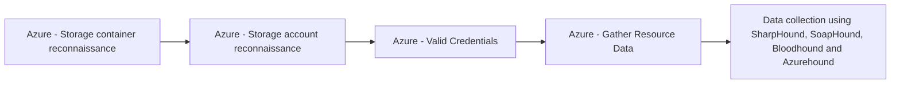

# Azure - Storage container reconnaissance

## Metadata

- **UUID**: `2d7ed070-e5c5-4796-b150-ea1d02ed1785`
- **Schema**: `threat::1.0`
- **TLP**: clear

## Description
Azure storage container reconnaissance is a threat vector involving adversaries 
actively or passively gathering information about Azure Storage accounts and their 
containers to identify potential targets for further exploitation. This reconnaissance 
phase is critical for attackers to map the attack surface, discover misconfigurations, 
and locate storage resources that may be exposed or contain sensitive data.

## Key Techniques Used in Azure Storage Container Reconnaissance

- **Storage Account Discovery**: Attackers enumerate Azure Storage account names 
to find active accounts. Techniques include:
  - Using search engine dorks (e.g., `site:*.blob.core.windows.net`)
  - Brute-force enumeration of account names
  - Leveraging public scanning tools such as Microburst and BlobHunter
  - Crawling for storage endpoints referenced in public websites or code repositories

- **Public Container Discovery**: Once a storage account is identified, attackers 
enumerate container names within that account. They attempt to:
  - List container names by guessing or brute-forcing
  - Use scripts or automated tools to scan for containers with public or misconfigured access

- **DNS/Passive DNS Enumeration**: Attackers query DNS records or use passive DNS 
databases to identify valid Azure Storage account names in the wild. This can reveal 
storage endpoints that may not be directly linked from public sources.

- **Victim-Owned Website Analysis**: Attackers analyze a target’s own websites for 
references or direct links to Azure Storage containers, which can reveal storage 
account URLs and access patterns.

## Tools and Methods

- **Automated Scanning Tools**: Tools like Microburst and BlobHunter automate the 
process of discovering storage accounts and containers by scanning for open or misconfigured 
resources.
- **Scripting and Brute-Force**: Custom scripts may be used to guess container names 
or enumerate access permissions.
- **Search Engine Indexing**: Attackers use indexed URLs from search engines to 
find publicly accessible containers.

## Techniques
- T1530
- T1087.004
- T1046

## Chaining

